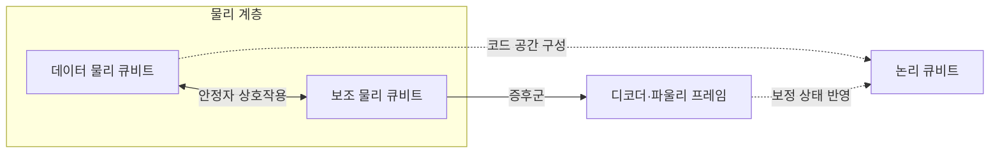
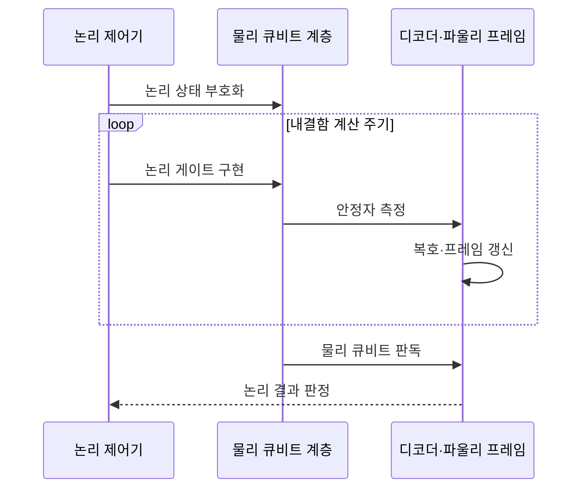

---
sidebar:
  order: 75
  label: "075. 논리 큐비트 vs 물리 큐비트 (Logical vs Physical Qubit)"
  badge:
    text: "기출 · 30%"
    variant: note
title: "논리 큐비트 vs 물리 큐비트 (Logical vs Physical Qubit)"
date: "2026-07-25T00:22:25+09:00"
tags:
  - "notes-hardware"
weight: 75
extra:
  question_no: "075"
  source_status: "기출"
  source_history: "138회"
  priority: 30
  priority_note: "오류 정정·물리 자원 환산"
---

## 미리 알고가기

- **물리 큐비트(Physical Qubit)**: 실제 소자로 구현한 제어 가능 양자 상태
- **논리 큐비트(Logical Qubit)**: 여러 물리 큐비트에 부호화한 보호 계산 단위
- **코드 공간(Code Space)**: 오류 정정 코드의 제약을 만족하며 논리 상태를 표현하는 물리 큐비트 상태 영역
- **패리티(Parity)**: 여러 물리 큐비트 상태의 짝수·홀수 관계로 오류를 드러내는 검사값
- **양자 오류 정정(Quantum Error Correction, QEC)**: QEC는 ‘큐이씨’로 읽고 영문 머리글자를 딴 약어이며, 물리 오류를 검출·보정해 논리 정보를 보호
- **코드 거리(Code Distance)**: 검출되지 않는 논리 연산의 최소 물리 오류 수
- **오류 증후군(Error Syndrome)**: 안정자 측정값으로 얻는 오류 위치·시간 단서
- **안정자 측정(Stabilizer Measurement)**: 논리 정보를 직접 읽지 않고 패리티를 측정
- **데이터 큐비트(Data Qubit)**: 논리 상태를 코드 공간에 분산 저장
- **보조 큐비트(Ancilla Qubit)**: 데이터 큐비트와 상호작용해 안정자 값을 획득
- **디코더(Decoder)**: 증후군 이력에서 가능한 오류 경로를 추정
- **파울리 프레임(Pauli Frame)**: 물리 보정 대신 논리 보정 상태를 추적
- **내결함 양자 컴퓨팅(Fault-Tolerant Quantum Computing, FTQC)**: FTQC는 ‘에프티큐씨’로 읽고 영문 머리글자를 딴 약어이며, 일부 물리 오류가 논리 오류로 확산되지 않게 연산을 구성
- **오류 임계값(Error Threshold)**: 거리 증가가 논리 오류를 줄이는 물리 오류 경계
- **물리 오류율(Physical Error Rate)**: 물리 게이트·측정·유휴 상태의 실패 비율
- **논리 오류율(Logical Error Rate)**: 오류 정정 뒤 논리 연산·주기의 실패 비율
- **표면 코드(Surface Code)**: 2차원 국소 안정자를 반복 측정하는 코드

## Ⅰ. 개요

- **정의/개념**: 여러 물리 큐비트의 코드 공간에 부호화한 계산 단위
- **배경/필요성**: 물리 오류가 누적되어 장시간 계산 보호가 필요함

### 쉽게 이해하기 (학습용)

- 물리 큐비트가 벽돌이라면 논리 큐비트는 검사 장치까지 갖춘 방과 같다.

## Ⅱ. 특징

- 안정자 증후군을 측정해 논리 상태 노출을 막는다.
- 임계값 아래에서는 거리 증가가 논리 오류율을 낮춘다.
- 코드·거리가 공간·시간·복호 자원량을 결정한다.

### 쉽게 이해하기 (학습용)

- 벽돌 품질이 기준을 넘을 때 방을 크게 지을수록 튼튼해지지만 벽돌과 검사 시간도 늘어난다.

## Ⅲ. 아키텍처 및 구성요소

| 설계 요소 | 설명 |
|:---|:---|
| 데이터 물리 큐비트 | 논리 상태를 코드 공간에 분산 저장 |
| 보조 물리 큐비트 | 데이터와 상호작용해 안정자 값 측정 |
| 논리 큐비트 | 부호화·보정된 상태를 계산 단위로 제공 |
| 디코더·파울리 프레임 | 오류 경로 추정·논리 보정 상태 추적 |

> 요약: 물리 계층의 증후군을 복호해 논리 상태 보호

### 쉽게 이해하기 (학습용)

- 여러 벽돌에 방의 상태를 나누고 검사 결과로 금이 간 곳을 추정한다.

## Ⅳ. 원리 및 절차 흐름도

| 절차 | 설명 |
|:---|:---|
| 논리 상태 부호화 | 상태를 데이터 물리 큐비트의 코드 공간에 분산 |
| 논리 게이트 구현 | 오류 전파를 제한하는 물리 연산으로 논리 게이트 실행 |
| 안정자 측정 | 보조 큐비트 상호작용·판독으로 증후군 획득 |
| 복호·프레임 갱신 | 오류 경로 추정·논리 보정 상태 기록 |
| 물리 큐비트 판독 | 데이터 물리 큐비트의 최종 측정값 획득 |
| 논리 결과 판정 | 최종 측정값·증후군·프레임으로 논리값 결정 |

> 요약: 증후군을 반복 해석해 논리 상태 보호

### 쉽게 이해하기 (학습용)

- 검사표로 금이 간 경로를 계속 추적하며 방을 쓰고 마지막 검사로 결과를 정한다.

## Ⅴ. 종류 및 비교

| 판단 기준 | 논리 큐비트 | 물리 큐비트 |
|:---|:---|:---|
| 핵심 특징 | 오류 정정으로 보호된 계산 단위 | 직접 제어하는 하드웨어 단위 |
| 적용 기준 | 장시간 내결함 계산 | 단시간 물리 회로 실행 |
| 주요 위험 | 큰 공간·시간·복호 자원 | 게이트·판독 오류 누적 |

> 요약: 논리는 보호 회로 폭, 물리는 구현 규모

### 쉽게 이해하기 (학습용)

- 논리 큐비트는 완성된 방 수이고 물리 큐비트는 투입한 벽돌 수다.

## Ⅵ. 실무 사례

1. 표면 코드 실험: 코드 거리별 논리 오류율 비교
2. 자원 추정기: 논리 회로를 물리 큐비트·실행 시간으로 환산

### 쉽게 이해하기 (학습용)

- 격자를 넓혀 오류가 더 줄어드는지 확인한다.
- 설계도의 방 수를 벽돌 수와 공사 기간으로 환산한다.

## Ⅶ. 결론

- 목표 논리 오류율에 맞춰 코드 거리·물리 자원 선택

### 쉽게 이해하기 (학습용)

- 목표 안전도에 맞춰 방의 크기와 벽돌 수를 정한다.
