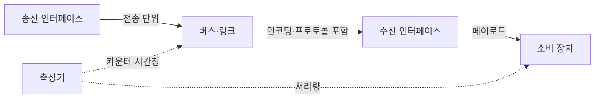
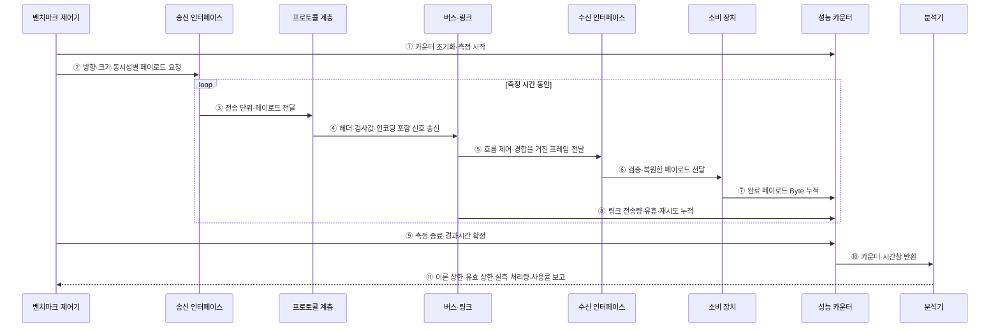

---
sidebar:
  order: 76
  label: "076. 버스 대역폭과 전송률 계산"
  badge:
    text: "미출 · 50%"
    variant: note
title: "버스 대역폭과 전송률 계산 (Bus Bandwidth)"
date: "2026-07-28T13:11:20+09:00"
tags:
  - "notes-hardware"
weight: 76
extra:
  question_no: "076"
  source_status: "미출"
  source_history: ""
  priority: 50
  priority_note: "단위·방향별 상한과 실측 비교"
---

## 미리 알고가기

- **버스 대역폭(Bus Bandwidth)**: 단위 시간에 전송할 수 있는 데이터 양의 이론적 상한
- **전송률(Transfer Rate)**: 초당 수행하는 전송 횟수
- **페이로드(Payload)**: 수신자가 실제 사용하는 데이터
- **실측 처리량(Measured Throughput)**: 측정 시간 동안 전달된 페이로드를 시간으로 나눈 값
- **메가 전송/초(Megatransfers per Second, MT/s)**: 초당 백만 번의 전송을 나타내는 단위
- **기가 전송/초(Gigatransfers per Second, GT/s)**: 초당 십억 번의 전송을 나타내는 단위
- **이중 데이터 전송률(Double Data Rate, DDR)**: 클록 상승·하강 에지 모두에서 데이터를 전송하는 방식
- **인코딩 효율(Encoding Efficiency)**: 전체 전송 비트 중 유효 데이터 비트 비율
- **프로토콜 효율(Protocol Efficiency)**: 전체 프레임 중 페이로드 비율
- **링크 사용률(Link Utilization)**: 유효 이론 대역폭 중 실측 처리량이 차지하는 비율
- **병목(Bottleneck)**: 종단 경로에서 처리량을 가장 낮게 제한하는 자원

## Ⅰ. 개요

- 정의/개념: 버스 폭·전송률·레인 수·효율로 **이론 대역폭과 유효 처리량** 산정
- 기존 한계: 표기 속도만 비교하면 인코딩·프로토콜 오버헤드와 공유 경합을 반영하지 못함

### 쉽게 이해하기 (학습용)

- 도로 폭과 차량 속도로 최대 운송량을 구한 뒤 빈자리와 정체를 빼야 실제 운송량이 된다.

## Ⅱ. 특징

- 병렬 버스 대역폭은 `버스 폭 × 전송률 ÷ 8`로 Byte/s 계산
- 직렬 링크는 `레인당 비트율 × 레인 수 × 인코딩 효율 ÷ 8`로 계산
- 유효 대역폭에 프로토콜 효율·사용률을 적용해 실측값과 비교

### 쉽게 이해하기 (학습용)

- 비트와 바이트, 단방향과 양방향, 이론값과 실측값을 섞지 않는 것이 핵심이다.

## Ⅲ. 아키텍처 및 구성요소

병렬 버스와 직렬 링크의 단방향 이론 대역폭은 다음과 같이 계산한다.

$$
B_{\mathrm{parallel}} = \frac{w \times r}{8},\qquad
B_{\mathrm{serial}} = \frac{b \times n \times \eta_{\mathrm{enc}}}{8}
$$

유효 페이로드 상한과 실측 링크 사용률은 다음과 같다.

$$
B_{\mathrm{payload,max}} = B_{\mathrm{link}}\eta_{\mathrm{proto}},\qquad
T_{\mathrm{measured}} = \frac{D_{\mathrm{payload}}}{\Delta t},\qquad
U = \frac{T_{\mathrm{measured}}}{B_{\mathrm{payload,max}}}
$$

- \(w\): bit/transfer 단위 버스 폭, \(r\): transfer/s, \(b\): bit/s 단위 레인당 비트율, \(n\): 레인 수
- \(\eta_{\mathrm{enc}}\): 인코딩 효율, \(\eta_{\mathrm{proto}}\): 프레임 전체 중 페이로드 비율, \(D_{\mathrm{payload}}\): 측정 시간 \(\Delta t\) 동안 전달한 페이로드 Byte 수
- 모든 값은 같은 단방향과 동일한 십진·이진 단위 기준을 사용한다고 가정한다. 공유 경합·흐름 제어·유휴 시간은 \(T_{\mathrm{measured}}\)에 반영되며, 전이중 합산값은 별도로 표시한다.

### 도표안 A. 버스 전송·측정 정적 구조

| 설계 요소 | 입력·상태 | 역할 |
|:---|:---|:---|
| 송신 인터페이스 | 페이로드·전송 단위 | 데이터를 버스 형식으로 변환 |
| 버스·링크 | 폭·비트율·레인·방향 | 이론 전송 상한 결정 |
| 프로토콜 계층 | 헤더·검사·흐름 제어 | 신뢰성 제공과 오버헤드 발생 |
| 수신 인터페이스 | 수신 프레임 | 페이로드 복원 |
| 측정기 | 바이트 카운터·측정 시간 | 실측 처리량과 사용률 산출 |

> 요약: 물리 상한에서 인코딩·프로토콜·경합 비용을 차감

### 쉽게 이해하기 (학습용)

- 선로가 옮긴 전체 양과 응용이 받은 실제 짐의 양을 따로 잰다.

### 도표안 B. 페이로드 전송·실측 처리량 산정 시퀀스

#### 동작 원리

1. **측정 시작**: 벤치마크가 기존 카운터를 초기화하고 단조 증가 시계로 측정 시작 시각을 기록한다.
2. **워크로드 설정**: 전송 방향, 페이로드 크기, 큐 깊이와 동시성을 고정해 송신 요청을 만든다.
3. **전송 단위 생성**: 송신 인터페이스가 페이로드를 장치·버스가 처리하는 전송 단위로 넘긴다.
4. **프로토콜 부호화**: 프로토콜 계층이 헤더·검사값과 물리 인코딩을 포함한 신호를 링크에 보낸다.
5. **링크 전달**: 버스·링크가 공유 경합, 흐름 제어와 재시도 조건을 포함해 수신 측으로 전달한다.
6. **페이로드 복원**: 수신 인터페이스가 프레임을 검증하고 실제 소비 장치가 사용할 페이로드만 복원한다.
7. **유효 데이터 집계**: 소비 장치가 정상 완료된 페이로드 Byte 수를 카운터에 누적한다.
8. **선로 상태 집계**: 링크 계층이 전체 전송량, 유휴 시간, 재시도와 오류를 별도 카운터에 기록한다.
9. **측정 종료**: 정한 시간이나 전송량에 도달하면 종료 시각을 기록해 실제 경과시간을 확정한다.
10. **원자료 반환**: 성능 카운터가 페이로드·선로 통계와 동일한 측정 시간창을 분석기에 제공한다.
11. **지표 보고**: 분석기가 단위와 방향을 통일해 이론 대역폭, 인코딩·프로토콜 반영 상한, 실측 처리량과 사용률을 보고한다.

### 쉽게 이해하기 (학습용)

- 선로에 실린 전체 짐과 도착해 실제 사용한 짐을 같은 시간 동안 따로 세어 손실 구간을 찾는다.

## Ⅳ. 종류 및 비교

| 판단 기준 | 이론 대역폭 | 실측 처리량 |
|:---|:---|:---|
| 산정 근거 | 폭·전송률·레인·인코딩 | 전달 페이로드·측정 시간 |
| 활용 | 링크·채널 용량 설계 | 워크로드 병목·사용률 평가 |
| 주요 위험 | 공유·프로토콜 비용 누락 | 측정 조건·캐시 효과 왜곡 |

> 요약: 이론값은 상한, 실측값은 조건을 포함한 결과

### 쉽게 이해하기 (학습용)

- 설계할 때는 최대 용량을, 검증할 때는 실제 전달량을 본다.

## Ⅴ. 실무 고려사항 및 대응 방안

| 운영 위험 | 대응 | 기대 효과 |
|:---|:---|:---|
| bit/s와 Byte/s 또는 십진·이진 접두사 혼용 | 단위·환산식·반올림 기준 명시 | 계산 오류 방지 |
| 전이중 합산값을 단방향 성능으로 오인 | 송신·수신·양방향 지표 분리 | 요구량 대비 정확한 판단 |
| 짧은 측정으로 버스트 성능 과대평가 | 정상·최악 부하의 충분한 측정 시간과 백분위 기록 | 지속 처리량 검증 |
| 공유 링크 경합과 작은 패킷 오버헤드 누락 | 워크로드별 패킷 크기·동시성·경합 재현 | 실제 병목 식별 |

### 쉽게 이해하기 (학습용)

- 같은 숫자라도 단위와 측정 방향이 다르면 성능 비교가 틀어진다.

### 적용 사례

- 가속기 메모리 복사에서 링크 유효 대역폭, 호스트·가속기 메모리 대역폭과 종단 실측 처리량을 같은 방향·단위로 비교해 병목을 찾는다.

### 쉽게 이해하기 (학습용)

- 연결선과 메모리 중 실제로 더 느린 구간을 측정해 찾는다.

## Ⅵ. 결론

- 정확한 용량·병목 판단을 위해 **단위·방향·인코딩·프로토콜 효율·공유 경합·측정 조건**을 통일하고, 이론 상한과 지속 실측 처리량을 함께 평가한다.

### 쉽게 이해하기 (학습용)

- 같은 기준으로 최대치와 실제치를 비교해야 성능을 제대로 설명할 수 있다.
