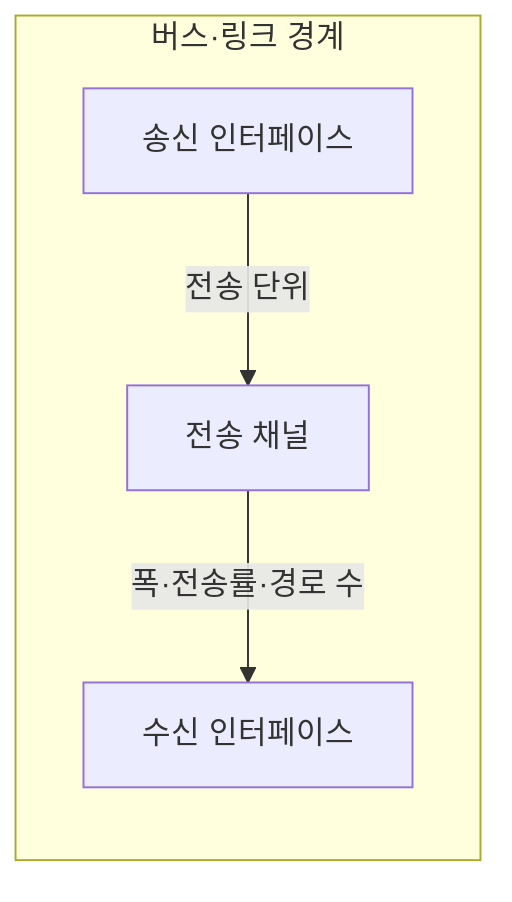

---
sidebar:
  order: 76
  label: "076. 버스 대역폭·전송률 계산 (Bus Bandwidth)"
  badge:
    text: "미출제 · 50%"
    variant: note
title: "버스 대역폭·전송률 계산 (Bus Bandwidth)"
date: "2026-07-25T00:22:25+09:00"
tags:
  - "notes-hardware"
weight: 76
extra:
  question_no: "076"
  source_status: "미출제"
  source_history: ""
  priority: 50
  priority_note: "단위·방향별 상한과 실측 비교로 병목 판정"
---

## 미리 알고가기

- **버스 대역폭(Bus Bandwidth)**: 한 방향 버스가 단위 시간에 전송할 수 있는 데이터의 이론적 상한
- **페이로드(Payload)**: 프로토콜 제어 정보를 제외하고 수신자가 실제로 사용할 데이터
- **실측 전송률(Measured Throughput)**: 측정 시간 동안 수신한 페이로드 바이트를 시간으로 나눈 실제 처리량
- **초당 메가 전송(Megatransfers per Second, MT/s)**: 버스가 초당 수행하는 백만 단위의 전송 횟수를 나타내는 단위
- **초당 기가 전송(Gigatransfers per Second, GT/s)**: 고속 직렬 링크가 초당 수행하는 십억 단위의 전송 횟수를 나타내는 단위
- **초당 바이트(Bytes per Second, Byte/s)**: 이론·실측 데이터 전송률을 초당 바이트 수로 나타내는 단위
- **곱셈·나눗셈 기호($\times$·$\div$)**: $\times$·$\div$는 ‘곱하기·나누기’로 읽고 수량의 곱과 비율을 나타내는 표준 산술 기호로, 전송당 비트·초당 전송·경로 수를 곱하고 8로 나눠 바이트 단위 대역폭을 계산
- **백분율 기호($\%$)**: $\%$는 ‘퍼센트’로 읽고 전체를 100으로 본 비율의 표준 표기로, 실측 전송률을 유효 이론 대역폭으로 나눈 링크 사용률을 나타냄
- **이중 데이터 전송률(Double Data Rate, DDR)**: 클록의 상승·하강 에지에서 모두 데이터를 전송하여 클록당 전송 횟수를 두 배로 높이는 방식
- **인코딩 효율(Encoding Efficiency)**: 전송 비트 중 데이터 비트가 차지하는 비율
- **프로토콜 효율(Protocol Efficiency)**: 전체 전송량 중 헤더·검사값을 제외한 페이로드의 비율
- **링크 사용률(Link Utilization)**: 유효 이론 대역폭 중 실측 전송률이 사용한 비율
- **백플레인(Backplane)**: 여러 보드나 드라이브를 공통 상위 링크에 연결하는 내부 회로기판·접속 구조
- **워크로드(Workload)**: 시스템이 처리하는 요청·데이터·연산의 실제 작업 구성

## Ⅰ. 개요

- 정의/개념: 전송당 데이터 비트·초당 전송·경로 수로 대역폭 산정
- **배경/필요성**: 표기 전송률과 실효량이 달라 유효 처리량 산정이 필요함

### 쉽게 이해하기 (학습용)

- 도로 표지판의 최대 통행량과 실제 통과량은 서로 다른 숫자다.

## Ⅱ. 특징

- 종단 간 전송률은 가장 좁은 공유 구간에 제한된다.
- 동시 양방향 링크는 방향별 상한을 따로 산정한다.
- MT/s는 DDR의 양 에지 전송 횟수를 반영한다.

### 쉽게 이해하기 (학습용)

- 차선이 많아도 합류 구간이 좁으면 전체 통과량은 그 구간에 묶이고 양방향은 따로 센다.

## Ⅲ. 아키텍처 및 구성요소

| 설계 요소 | 설명 |
|:---|:---|
| 송신 인터페이스 | 페이로드를 프로토콜 전송 단위로 변환 |
| 전송 채널 | 폭·전송률·경로 수로 링크 상한 결정 |
| 수신 인터페이스 | 전송 단위에서 페이로드 복원 |

> 요약: 송신 인터페이스가 만든 전송 단위를 채널이 운반함

### 쉽게 이해하기 (학습용)

- 출발지에서 짐을 전송 규격에 맞춰 싣고 정해진 폭·속도의 통로로 목적지까지 옮긴다.

## Ⅳ. 원리 및 절차 흐름도

| 산정 항목 | 계산 |
|:---|:---|
| 원시 대역폭(Byte/s) | 전송당 비트 × 초당 전송 × 경로 수 ÷ 8 |
| 유효 이론 대역폭 | 원시 대역폭 × 인코딩·프로토콜 효율 |
| 실측 전송률(Byte/s) | 수신 페이로드 바이트 ÷ 측정 시간 |
| 링크 사용률(%) | 실측 전송률 ÷ 유효 이론 대역폭 × 100 |

> 요약: 동일 방향·단위에서 유효 상한과 실측 비교

### 쉽게 이해하기 (학습용)

- 차선 수와 초당 통과 횟수로 한계값을 구하고 실제 통과량과 비교한다.

## Ⅴ. 종류 및 비교

| 판단 기준 | 이론 대역폭 | 실측 전송률 |
|:---|:---|:---|
| 핵심 특징 | 링크 조건으로 전송 상한 산정 | 페이로드와 시간으로 실제량 측정 |
| 적용 기준 | 링크·채널 용량 설계 | 워크로드 병목·사용률 판정 |
| 주요 위험 | 공유 병목 누락 시 과대평가 | 측정 조건·단위 혼합 시 오판 |

> 요약: 이론 상한 대비 실측 전송률로 사용률·병목 판정

### 쉽게 이해하기 (학습용)

- 도로를 설계할 때는 최대 용량을 보고 정체를 찾을 때는 실제 통과량을 본다.

## Ⅵ. 실무 사례

1. 그래픽처리장치 서버의 링크 상한·메모리 복사 실측 비교

### 쉽게 이해하기 (학습용)

- 그래픽처리장치가 메모리를 옮기는 속도를 링크 한계와 비교해 병목을 찾는다.

## Ⅶ. 결론

- 동일 단위·방향의 상한 대비 실측 사용률로 병목 판정

### 쉽게 이해하기 (학습용)

- 왕복 합계와 단방향 값을 섞지 말고 같은 기준의 최대량과 실제량을 비교한다.
