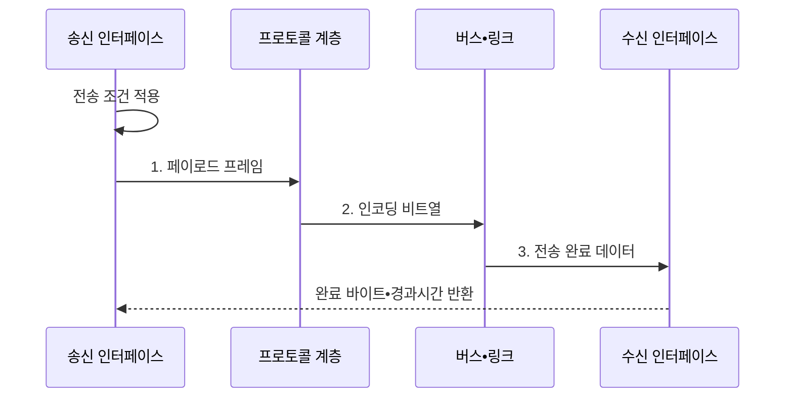

---
sidebar:
  order: 76
  label: "076. 버스 대역폭과 전송률 계산"
  badge:
    text: "미출 • 50%"
    variant: note
title: "버스 대역폭과 전송률 계산 (Bus Bandwidth)"
date: "2026-08-05T00:00:00+09:00"
tags:
  - "notes-hardware"
weight: 76
extra:
  question_no: "076"
  source_status: "미출"
  source_history: ""
  priority: 50
  priority_note: "단위•방향별 상한과 실측 비교"
---

## Ⅰ. 개요

<details><summary>핵심 용어</summary>

- **버스 대역폭(Bus Bandwidth)**: 버스나 링크가 단위 시간에 전송할 수 있는 데이터 양의 이론적 상한이다.
- **전송률(Transfer Rate)**: 버스나 링크가 초당 수행하는 데이터 전송 횟수이다.
- **실측 처리량(Measured Throughput)**: 측정 시간 동안 수신자가 실제로 전달받은 페이로드 양을 시간으로 나눈 값이다.

</details>

- 정의/개념: 버스 폭•전송률•효율로 **대역폭 상한** 과 **처리량** 을 산정하는 방법
- 배경/필요성: 링크 규격값만으로는 오버헤드•경합의 **실제 병목 판단 불가**

#### 한줄 요약

- 도로 폭과 차량 속도로 최대 운송량을 구한 뒤 빈자리와 정체를 빼야 실제 운송량이 된다.

## Ⅱ. 특징

<details><summary>핵심 용어</summary>

- **병렬 버스(Parallel Bus)**: 여러 신호선에서 여러 비트를 동시에 전송하는 연결 방식이다.
- **직렬 링크(Serial Link)**: 한 레인에서 비트를 순서대로 보내고 여러 레인으로 총비트율을 높이는 연결 방식이다.
- **프로토콜 효율(Protocol Efficiency)**: 프레임 전체 전송량 가운데 수신자가 사용하는 페이로드가 차지하는 비율이다.
- **링크 사용률(Link Utilization)**: 프로토콜 효율을 반영한 최대 페이로드 대역폭 가운데 실측 처리량이 차지하는 비율이다.
- **MT/s(Mega Transfers per Second)**: 초당 백만 번의 데이터 전송을 나타내는 단위이다.
- **GT/s(Giga Transfers per Second)**: 초당 십억 번의 데이터 전송을 나타내는 단위이다.
- **DDR(Double Data Rate)**: 한 클록의 상승•하강 에지에서 각각 데이터를 전송하는 방식이다.

</details>


> 요약: **프로토콜 효율** 은 페이로드 상한, **링크 사용률** 은 실측 전달량 반영

- **병렬 버스** 는 폭•전송률, **직렬 링크** 는 비트율•레인으로 상한 산정
- **MT/s•GT/s** 는 초당 전송 횟수, **DDR** 은 클록당 두 번 전송
- **프로토콜 효율•링크 사용률** 을 반영해 실측 처리량 도출

#### 한줄 요약

- 여덟 차로 도로라도 신호와 빈차 때문에 화물이 덜 나르듯, 버스 폭•전송률에 효율과 사용률을 반영해야 실제 전달량이 보인다.

## Ⅲ. 구조 및 구성요소

<details><summary>핵심 용어</summary>

- **송신 인터페이스(Transmit Interface)**: 입력 데이터를 버스 폭과 프로토콜 형식에 맞는 전송 단위로 변환하는 구성이다.
- **프로토콜 계층(Protocol Layer)**: 주소와 제어 및 오류 검출 정보를 페이로드에 부가하는 계층이다.
- **수신 인터페이스(Receive Interface)**: 링크 비트열에서 프레임을 해석하고 유효 페이로드를 복원하는 구성이다.
- **측정기(Meter)**: 완료 페이로드와 경과시간으로 처리량 및 사용률을 산출하는 구성이다.

</details>

```text
[송신 인터페이스] ----- [프로토콜 계층] ----- [버스•링크] ----- [수신 인터페이스] ----- [측정기]
```

선의 의미: 선은 버스 형식, 프로토콜 프레임, 물리 링크와 완료 페이로드 계량이 결합되는 인접 구성요소의 정적 인터페이스 관계를 뜻한다.

| 구성요소 | 책임 |
|:---|:---|
| 송신 인터페이스 | **버스 형식 변환** |
| 버스•링크 | **이론 전송 상한 결정** |
| 프로토콜 계층 | **프로토콜 오버헤드** 부가 |
| 수신 인터페이스 | **페이로드 복원** |
| 측정기 | **처리량•사용률 산출** |

#### 한줄 요약

- 송신소가 포장한 짐을 선로가 옮기고 수신소가 풀며, 계량기가 실제 도착한 페이로드를 재는 구조다.

## Ⅳ. 흐름도

<details><summary>핵심 용어</summary>

- **인코딩 효율(Encoding Efficiency)**: 물리 링크의 전체 전송 비트 가운데 원래 데이터 비트가 차지하는 비율이다.
- **페이로드(Payload)**: 프로토콜 헤더와 오류 제어 정보를 제외하고 수신 응용이 실제로 사용하는 데이터이다.
- **경합(Contention)**: 여러 송신 주체가 같은 버스나 링크 자원을 동시에 요청하여 대기하는 현상이다.
- **흐름 제어(Flow Control)**: 수신 버퍼와 처리 능력에 맞춰 송신 속도 또는 대기량을 조절하는 메커니즘이다.

</details>



**단방향 이론 대역폭 산식**

$$
B_{\mathrm{parallel}} = \frac{w \times r}{8},\qquad
B_{\mathrm{serial}} = \frac{b \times n \times \eta_{\mathrm{enc}}}{8}
$$

**유효 페이로드 상한•실측 사용률 산식**

$$
B_{\mathrm{payload,max}} = B_{\mathrm{link}}\eta_{\mathrm{proto}},\qquad
T_{\mathrm{measured}} = \frac{D_{\mathrm{payload}}}{\Delta t},\qquad
U = \frac{T_{\mathrm{measured}}}{B_{\mathrm{payload,max}}}
$$

> 요약: **프로토콜 효율** 을 반영한 이론값과 **실측 처리량** 비교

**동작 원리**

1. **페이로드 프레임**: 전송 데이터에 프로토콜 오버헤드 부가
2. **인코딩 비트열**: 유효 비트율에 맞춘 링크 신호 생성
3. **전송 완료 데이터**: 경합•흐름 제어를 거친 완료 바이트 누적

#### 한줄 요약

- 선로에 실린 전체 짐과 도착해 실제 사용한 짐을 같은 시간 동안 따로 세어 손실 구간을 찾는다.

## Ⅴ. 종류 및 비교

<details><summary>핵심 용어</summary>

- **이론 대역폭(Theoretical Bandwidth)**: 버스 폭과 전송률 또는 링크 비트율•레인•인코딩으로 계산한 최대 용량이다.
- **측정 조건(Measurement Condition)**: 메시지 크기와 동시성, 방향, 시간 및 큐 깊이처럼 처리량 결과에 영향을 주는 설정이다.

</details>

| 대역폭 지표 | 산정 방법 | 해석 용도 |
|:---|:---|:---|
| **이론 대역폭** | 버스 폭•전송률•레인•인코딩으로 상한 계산 | 링크 **용량 설계** 기준 |
| **실측 처리량** | 일정 시간에 완료된 페이로드 양을 측정 | 오버헤드•경합을 포함한 **병목 검증** |

실측값을 비교할 때는 메시지 크기•동시성•전송 방향•측정 시간 등의 **측정 조건** 을 동일하게 유지해야 한다.

#### 한줄 요약

- 설계할 때는 최대 용량을, 검증할 때는 실제 전달량을 본다.

## Ⅵ. 실무 고려사항 및 대책

<details><summary>핵심 용어</summary>

- **비트(Bit)**: 이진 한 자리를 나타내는 데이터 단위이다.
- **바이트(Byte)**: 8비트를 묶은 데이터 단위이다.
- **방향별 지표(Directional Metric)**: 송신과 수신 또는 단방향과 양방향 전송량을 분리하여 기록한 성능 값이다.
- **버스트(Burst)**: 짧은 시간에 전송 요청이나 데이터가 집중되는 순간 부하이다.
- **큐 깊이(Queue Depth)**: 한 시점에 대기하거나 처리 중인 전송 요청의 수이다.

</details>

| 문제 | 대책 | 효과 |
|:---|:---|:---|
| bit•Byte 혼용으로 대역폭 환산 오류 | **단위•환산식** 통일 | **계산 오류** 방지 |
| 송수신 합산값을 단방향 용량으로 오인 | **방향별 지표** 분리 | **용량 판정** 정확도 향상 |
| 짧은 측정 구간에서 버스트가 평균 왜곡 | **지속 시간•백분위** 기록 | **버스트 과대평가** 방지 |
| 공유 버스 경합을 재현하지 않아 처리량 과대평가 | **메시지 크기•동시성** 재현 | **실제 병목** 식별 |
| 큐 깊이 부족으로 링크 포화 전 요청 고갈 | **큐 깊이** 단계별 증가 | **최대 처리량** 확인 |

#### 한줄 요약

- 여러 수도관에 물을 흘려 압력•시간•유량을 따로 재듯, 단위와 방향을 맞춘 뒤 부하를 높여 실제 병목을 찾는다.

## Ⅶ. 결론

<details><summary>핵심 용어</summary>

- **프로토콜 병목(Protocol Bottleneck)**: 헤더 처리와 작은 전송 단위 또는 동기화가 링크 용량 활용을 제한하는 현상이다.
- **경합 병목(Contention Bottleneck)**: 여러 주체의 동시 요청 때문에 버스 대기 시간이 늘어 처리량이 제한되는 현상이다.
- **용량 증설(Capacity Expansion)**: 링크 폭이나 레인 수 및 속도를 높여 이론 대역폭을 늘리는 조치이다.

</details>

- **링크 사용률** 이 낮으면 증설보다 프로토콜•경합 병목부터 개선

#### 한줄 요약

- 고속도로가 비어 있으면 차로를 늘리기보다 신호와 합류 정체를 먼저 풀듯, 낮은 사용률에서는 프로토콜•경합부터 개선한다.
