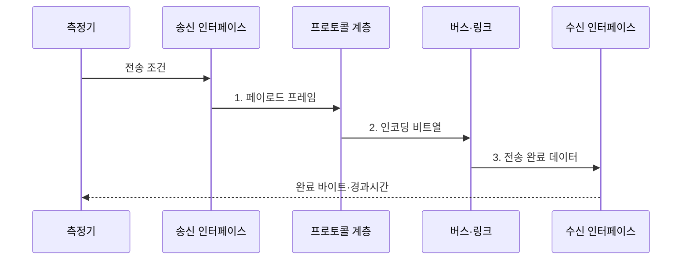

---
sidebar:
  order: 76
  label: "076. 버스 대역폭과 전송률 계산"
  badge:
    text: "미출 · 50%"
    variant: note
title: "버스 대역폭과 전송률 계산 (Bus Bandwidth)"
date: "2026-07-31T10:12:06+09:00"
tags:
  - "notes-hardware"
weight: 76
extra:
  question_no: "076"
  source_status: "미출"
  source_history: ""
  priority: 50
  priority_note: "단위·방향별 상한과 실측 비교"
---

## 미리 알고가기

- **버스 대역폭(Bus Bandwidth)**: 단위 시간에 전송할 수 있는 데이터 양의 이론적 상한
- **전송률(Transfer Rate)**: 초당 수행하는 전송 횟수
- **비트·바이트(Bit·Byte)**: 비트는 이진 한 자리이고 바이트는 8비트를 묶은 데이터 단위
- **병렬 버스·직렬 링크(Parallel Bus·Serial Link)**: 병렬 버스는 여러 비트를 나란히 보내고 직렬 링크는 한 레인에서 비트를 순차 전송
- **전송 매개변수($w,r,b,n$)**: $w$는 버스 폭, $r$은 초당 전송 수, $b$는 레인당 비트율, $n$은 레인 수
- **페이로드(Payload)**: 수신자가 실제 사용하는 데이터
- **실측 처리량(Measured Throughput)**: 측정 시간 동안 전달된 페이로드를 시간으로 나눈 값
- **메가 전송/초(Megatransfers per Second, MT/s)**: 초당 백만 번의 전송을 나타내는 단위
- **기가 전송/초(Gigatransfers per Second, GT/s)**: 초당 십억 번의 전송을 나타내는 단위
- **이중 데이터 전송률(Double Data Rate, DDR)**: 클록 상승·하강 에지 모두에서 데이터를 전송하는 방식
- **인코딩 효율(Encoding Efficiency)**: 전체 전송 비트 중 유효 데이터 비트 비율
- **프로토콜 효율(Protocol Efficiency)**: 전체 프레임 중 페이로드 비율
- **링크 사용률(Link Utilization)**: 유효 이론 대역폭 중 실측 처리량이 차지하는 비율
- **효율 기호 에타($\eta$)**: 에타로 읽고 효율을 나타내는 관례적 기호이며, 아래첨자 enc는 인코딩 효율, proto는 프로토콜 효율을 구분
- **대역폭 기호($B$)**: Bandwidth의 첫 글자로 대역폭을 나타내며, 아래첨자는 병렬·직렬·링크·페이로드 상한을 구분
- **측정 기호($D_{\mathrm{payload}},T_{\mathrm{measured}},U$)**: 각각 전달 페이로드 양, 실측 처리량, 링크 사용률을 나타내는 기호
- **시간 간격 델타($\Delta t$)**: 델타로 읽고 변화량을 나타내는 기호이며, 측정 시작과 종료 사이의 경과시간을 의미
- **병목(Bottleneck)**: 종단 경로에서 처리량을 가장 낮게 제한하는 자원
- **큐 깊이(Queue Depth)**: 동시에 대기하거나 처리 중인 전송 요청 수
- **단조 증가 시계(Monotonic Clock)**: 시스템 시간 변경과 무관하게 앞으로만 증가하는 경과시간 측정 시계
- **흐름 제어(Flow Control)**: 수신 처리 능력에 맞춰 송신 속도나 대기량을 조절하는 메커니즘
- **버스트(Burst)**: 짧은 시간에 집중되는 순간 전송
- **백분위(Percentile)**: 측정값을 작은 순서로 놓았을 때 특정 비율이 그 이하인 경계값

> **키워드:** 버스 대역폭과 전송률 계산 (Bus Bandwidth)

## Ⅰ. 개요

- 정의/개념: 버스 폭·전송률·효율로 **대역폭 상한**과 **처리량**을 산정하는 방법
- 배경/필요성: 링크 규격값만으로는 오버헤드·경합의 **실제 병목 판단 불가**

### 쉽게 이해하기 (학습용)

- 도로 폭과 차량 속도로 최대 운송량을 구한 뒤 빈자리와 정체를 빼야 실제 운송량이 된다.

## Ⅱ. 특징

> 요약: **프로토콜 효율**은 페이로드 상한, **링크 사용률**은 실측 전달량 반영

- **병렬 버스**는 폭·전송률, **직렬 링크**는 비트율·레인으로 상한 산정
- **MT/s·GT/s**는 초당 전송 횟수, **DDR**은 클록당 두 번 전송
- **프로토콜 효율·링크 사용률**을 반영해 실측 처리량 도출

### 쉽게 이해하기 (학습용)

- 여덟 차로 도로라도 신호와 빈차 때문에 화물이 덜 나르듯, 버스 폭·전송률에 효율과 사용률을 반영해야 실제 전달량이 보인다.

## Ⅲ. 구조 및 구성요소

| 구성요소 | 책임 |
|:---|:---|
| 송신 인터페이스 | **버스 형식 변환** |
| 버스·링크 | **이론 전송 상한 결정** |
| 프로토콜 계층 | **프로토콜 오버헤드** 부가 |
| 수신 인터페이스 | **페이로드 복원** |
| 측정기 | **처리량·사용률 산출** |

### 쉽게 이해하기 (학습용)

- 송신소가 포장한 짐을 선로가 옮기고 수신소가 풀며, 계량기가 실제 도착한 페이로드를 재는 구조다.

## Ⅳ. 흐름도

**단방향 이론 대역폭 산식**

$$
B_{\mathrm{parallel}} = \frac{w \times r}{8},\qquad
B_{\mathrm{serial}} = \frac{b \times n \times \eta_{\mathrm{enc}}}{8}
$$

**유효 페이로드 상한·실측 사용률 산식**

$$
B_{\mathrm{payload,max}} = B_{\mathrm{link}}\eta_{\mathrm{proto}},\qquad
T_{\mathrm{measured}} = \frac{D_{\mathrm{payload}}}{\Delta t},\qquad
U = \frac{T_{\mathrm{measured}}}{B_{\mathrm{payload,max}}}
$$

> 요약: **프로토콜 효율**을 반영한 이론값과 **실측 처리량** 비교

**동작 원리**

1. **페이로드 프레임**: 전송 데이터에 프로토콜 오버헤드 부가
2. **인코딩 비트열**: 유효 비트율에 맞춘 링크 신호 생성
3. **전송 완료 데이터**: 경합·흐름 제어를 거친 완료 바이트 누적

### 쉽게 이해하기 (학습용)

- 선로에 실린 전체 짐과 도착해 실제 사용한 짐을 같은 시간 동안 따로 세어 손실 구간을 찾는다.

## Ⅴ. 종류 및 비교

| 대역폭 산정값 | 이론 대역폭 | 실측 처리량 |
|:---|:---|:---|
| 적용 기준 | 링크 **용량 설계** | 병목·**사용률 평가** |
| 핵심 특징 | **폭·전송률 기반 상한** | **페이로드·시간 기반 결과** |
| 한계 | **프로토콜·경합** 누락 | **측정 조건**에 따라 변동 |

### 쉽게 이해하기 (학습용)

- 설계할 때는 최대 용량을, 검증할 때는 실제 전달량을 본다.

## Ⅵ. 실무 고려사항 및 대책

| 고려사항 | 대책 | 효과 |
|:---|:---|:---|
| bit·Byte 혼용으로 대역폭 환산 오류 | **단위·환산식** 통일 | **계산 오류** 방지 |
| 송수신 합산값을 단방향 용량으로 오인 | **방향별 지표** 분리 | **용량 판정** 정확도 향상 |
| 짧은 측정 구간에서 버스트가 평균 왜곡 | **지속 시간·백분위** 기록 | **버스트 과대평가** 방지 |
| 공유 버스 경합을 재현하지 않아 처리량 과대평가 | **메시지 크기·동시성** 재현 | **실제 병목** 식별 |
| 큐 깊이 부족으로 링크 포화 전 요청 고갈 | **큐 깊이** 단계별 증가 | **최대 처리량** 확인 |

### 쉽게 이해하기 (학습용)

- 여러 수도관에 물을 흘려 압력·시간·유량을 따로 재듯, 단위와 방향을 맞춘 뒤 부하를 높여 실제 병목을 찾는다.

## Ⅶ. 결론

- **링크 사용률**이 낮으면 증설보다 프로토콜·경합 병목부터 개선

### 쉽게 이해하기 (학습용)

- 고속도로가 비어 있으면 차로를 늘리기보다 신호와 합류 정체를 먼저 풀듯, 낮은 사용률에서는 프로토콜·경합부터 개선한다.
