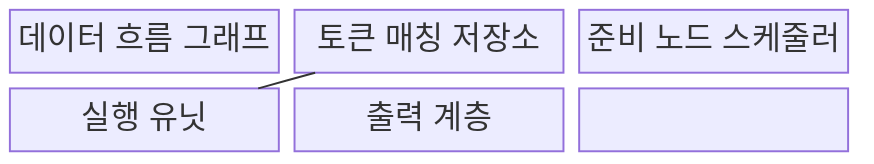
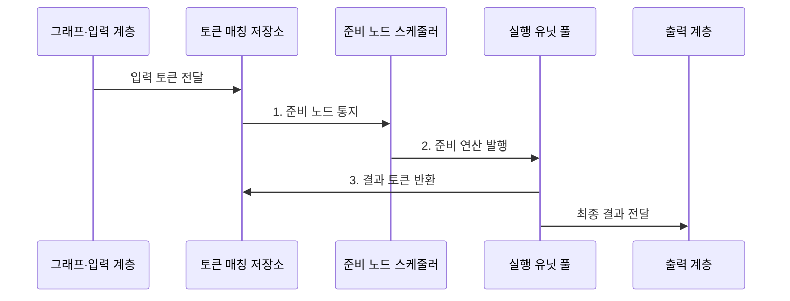

---
sidebar:
  order: 77
  label: "077. 데이터 흐름 컴퓨터"
  badge:
    text: "미출 · 50%"
    variant: note
title: "데이터 흐름 컴퓨터 (Dataflow Computer)"
date: "2026-07-30T18:42:46+09:00"
tags:
  - "notes-hardware"
weight: 77
extra:
  question_no: "077"
  source_status: "미출"
  source_history: ""
  priority: 50
  priority_note: "준비 연산 병렬성과 토큰 비용"
---

## 미리 알고가기

- **데이터 흐름 컴퓨터(Dataflow Computer)**: 필요한 피연산자가 준비된 연산부터 실행하는 컴퓨터 구조
- **제어 흐름 컴퓨터(Control-flow Computer)**: 프로그램 카운터와 분기 결과로 다음 명령을 정하는 구조
- **데이터 흐름 그래프(Dataflow Graph)**: 연산을 노드, 값의 의존 관계를 방향 간선으로 나타낸 표현
- **토큰(Token)**: 연산값과 실행 문맥을 함께 전달하는 단위
- **태그(Tag)**: 목적 노드·입력 위치·실행 인스턴스를 구분하는 식별자
- **발화(Firing)**: 모든 입력 토큰이 모인 노드를 실행하는 동작
- **토큰 매칭(Token Matching)**: 같은 연산 인스턴스에 속한 입력 토큰을 결합하는 처리
- **실행 유닛(Execution Unit)**: 발화된 산술·논리 연산을 수행하고 결과 토큰을 만드는 장치
- **제어 의존성(Control Dependency)**: 분기 결과에 따라 후속 연산 실행 여부가 정해지는 관계
- **동적 데이터 흐름(Dynamic Dataflow)**: 태그로 반복·재귀의 여러 실행 인스턴스를 구별하는 방식
- **백프레셔(Backpressure)**: 후단의 처리 여유가 부족할 때 상류 전송을 늦추는 흐름 제어
- **연산 입도(Computation Granularity)**: 한 번의 스케줄링으로 묶어 실행하는 작업 크기
- **타일(Tile)**: 큰 데이터나 연산을 지역 처리할 수 있게 나눈 작은 블록
- **텐서(Tensor)**: 여러 차원의 수치 배열

## Ⅰ. 개요

- 정의/개념: 입력 토큰이 모인 노드를 **즉시 실행하는 구조**
- 배경/필요성: 프로그램 카운터 기반 순차 발행은 **준비 연산 병렬성 활용 제약**

### 쉽게 이해하기 (학습용)

- 주문 순서가 아니라 재료가 모두 모인 요리부터 만든다.

## Ⅱ. 특징

- **의존성 없는 노드**: 자연스럽게 동시 실행
- **발화·토큰 매칭**: 피연산자가 준비된 노드 실행
- **동적 데이터 흐름·태그**: 반복과 실행 문맥 구분
- **매칭·이동 비용**: 확장성과 실행 효율 제한

### 쉽게 이해하기 (학습용)

- 병렬성은 쉽게 드러나지만 재료표를 분류하고 옮기는 비용이 든다.

## Ⅲ. 구조 및 구성요소

| 구성요소 | 책임 |
|:---|:---|
| 데이터 흐름 그래프 | **연산·의존성 정의** |
| 토큰 매칭 저장소 | **피연산자 결합** |
| 준비 노드 스케줄러 | **실행 가능 연산 발행** |
| 실행 유닛 | **결과 토큰 생성** |
| 출력 계층 | **최종 결과 정렬** |

### 쉽게 이해하기 (학습용)

- 입력값이 모두 모인 연산을 골라 실행하고 결과를 다시 전달한다.

## Ⅳ. 흐름도

**동작 원리**

- **1. 준비 노드 통지**: 같은 인스턴스의 모든 피연산자 충족 판정
- **2. 준비 연산 발행**: 실행 가능한 노드를 유휴 실행 유닛에 배정
- **3. 결과 토큰 반환**: 결과에 후속 목적지 태그를 붙여 의존 노드 활성화

### 쉽게 이해하기 (학습용)

- 서로 상관없는 두 계산은 재료가 모이는 즉시 동시에 실행하고, 두 결과가 모두 모여야 합치는 계산을 시작한다.

## Ⅴ. 종류 및 비교

| 구분 | 데이터 흐름 구조 | 제어 흐름 구조 |
|:---|:---|:---|
| 적용 기준 | 데이터 병렬 그래프 | 순차 제어 중심 코드 |
| 핵심 특징 | **입력 토큰으로 실행** | **명령 순서로 실행** |
| 한계 | 매칭·통신·태그 비용 | 제어·메모리 의존 병목 |

### 쉽게 이해하기 (학습용)

- 하나는 재료가 모이면 시작하고 다른 하나는 번호표 순서대로 시작한다.

## Ⅵ. 실무 고려사항 및 대책

| 고려사항 | 대책 | 효과 |
|:---|:---|:---|
| 토큰 저장소 초과 | 수명·백프레셔 관리 | **메모리 폭증 방지** |
| 매칭 비용 증가 | 굵은 입도·배치 발행 | **제어 부담 축소** |
| 원거리 토큰 이동 | 지역성 기반 배치 | **통신 지연 감소** |
| 부작용 순서 혼선 | 효과 토큰·추적 적용 | **정확성 확보** |

### 쉽게 이해하기 (학습용)

- 필요한 값이 가까이 있는 계산부터 가속기 작업대에 보낸다.

## Ⅶ. 결론

- 의존성이 낮고 **토큰 비용**이 작으면 데이터 흐름, 순차 제어는 제어 흐름 선택

### 쉽게 이해하기 (학습용)

- 동시에 할 계산이 충분하고 토큰 관리가 가벼울 때 효과적이다.
