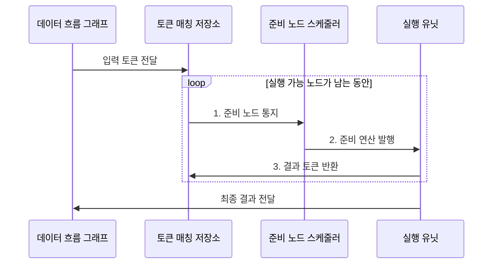

---
sidebar:
  order: 77
  label: "077. 데이터 흐름 컴퓨터"
  badge:
    text: "미출 • 50%"
    variant: note
title: "데이터 흐름 컴퓨터 (Dataflow Computer)"
date: "2026-08-05T00:00:00+09:00"
tags:
  - "notes-hardware"
weight: 77
extra:
  question_no: "077"
  source_status: "미출"
  source_history: ""
  priority: 50
  priority_note: "준비 연산 병렬성과 토큰 비용"
---

## Ⅰ. 개요

<details><summary>핵심 용어</summary>

- **데이터 흐름 컴퓨터(Dataflow Computer)**: 필요한 피연산자가 모두 준비된 연산부터 즉시 실행하는 컴퓨터 구조이다.
- **토큰(Token)**: 연산값과 목적지 및 실행 문맥을 함께 전달하는 데이터 흐름의 기본 단위이다.
- **발화(Firing)**: 한 노드의 모든 필수 입력 토큰이 모였을 때 해당 연산을 실행하는 동작이다.

</details>

- 정의/개념: 입력 토큰이 모인 노드를 **즉시 실행하는 구조**
- 배경/필요성: 프로그램 카운터 기반 순차 발행은 **준비 연산 병렬성 활용 제약**

#### 한줄 요약

- 주문 순서가 아니라 재료가 모두 모인 요리부터 만든다.

## Ⅱ. 특징

<details><summary>핵심 용어</summary>

- **데이터 흐름 그래프(Dataflow Graph)**: 연산을 노드로, 값의 의존 관계를 방향 간선으로 나타낸 표현이다.
- **태그(Tag)**: 토큰의 목적 노드와 입력 위치 및 반복•재귀 실행 인스턴스를 구분하는 식별자이다.
- **토큰 매칭(Token Matching)**: 같은 연산 인스턴스에 속한 입력 토큰들을 찾아 하나의 발화 조건으로 결합하는 처리이다.

</details>

- 입력 토큰이 모인 **발화 노드** 를 실행해 독립 연산 병렬화
- **태그** 로 반복•재귀의 실행 인스턴스 구분
- **토큰 매칭•이동 비용** 이 확장성과 실행 효율 제한

#### 한줄 요약

- 병렬성은 쉽게 드러나지만 재료표를 분류하고 옮기는 비용이 든다.

## Ⅲ. 구조 및 구성요소

<details><summary>핵심 용어</summary>

- **토큰 매칭 저장소(Token-matching Store)**: 도착한 피연산자를 태그별로 보관하고 완성된 입력 집합을 찾는 저장소이다.
- **준비 노드 스케줄러(Ready-node Scheduler)**: 발화 가능한 연산을 선택하여 유휴 실행 유닛에 배정하는 구성이다.
- **실행 유닛(Execution Unit)**: 발행된 산술•논리 연산을 수행하고 후속 노드용 결과 토큰을 생성하는 장치이다.
- **출력 계층(Output Layer)**: 비순서로 끝난 결과를 프로그램이 요구하는 최종 형태와 순서로 정리하는 구성이다.

</details>

```text
[데이터 흐름 그래프] ----- [토큰 매칭 저장소] ----- [준비 노드 스케줄러]
                                  |                         |
                                  +----- [실행 유닛] --------+
                                              |
                                         [출력 계층]
```

선의 의미: 위 선은 그래프•토큰 저장소•스케줄러의 정적 실행 의존성이고, 아래 연결은 실행 유닛이 저장소와 스케줄러에 함께 결합되며 출력 계층을 공유하는 구성 관계를 뜻한다.

| 구성요소 | 책임 |
|:---|:---|
| 데이터 흐름 그래프 | **연산•의존성 정의** |
| 토큰 매칭 저장소 | **피연산자 결합** |
| 준비 노드 스케줄러 | **실행 가능 연산 발행** |
| 실행 유닛 | **결과 토큰 생성** |
| 출력 계층 | **최종 결과 정렬** |

#### 한줄 요약

- 주문판인 데이터 흐름 그래프와 재료함인 토큰 저장소 사이에 스케줄러•실행 유닛이 놓여, 준비된 연산만 작업대로 보낸다.

## Ⅳ. 흐름도

<details><summary>핵심 용어</summary>

- **준비 노드(Ready Node)**: 같은 인스턴스의 필수 피연산자가 모두 도착하여 즉시 실행할 수 있는 연산 노드이다.
- **연산 발행(Operation Issue)**: 준비된 노드를 특정 실행 유닛에 배정하고 실행을 시작시키는 동작이다.
- **결과 토큰(Result Token)**: 연산 결과에 목적지 태그를 붙여 후속 의존 노드로 전달하는 토큰이다.

</details>



**동작 원리**

1. **준비 노드 통지**: 같은 인스턴스의 모든 피연산자 충족 판정
2. **준비 연산 발행**: 실행 가능한 노드를 유휴 실행 유닛에 배정
3. **결과 토큰 반환**: 목적지 태그를 붙여 후속 의존 노드 활성화

#### 한줄 요약

- 서로 상관없는 두 계산은 재료가 모이는 즉시 동시에 실행하고, 두 결과가 모두 모여야 합치는 계산을 시작한다.

## Ⅴ. 종류 및 비교

<details><summary>핵심 용어</summary>

- **제어 흐름 컴퓨터(Control-flow Computer)**: 프로그램 카운터와 분기 결과에 따라 다음 실행 명령을 정하는 구조이다.
- **데이터 병렬 그래프(Data-parallel Graph)**: 독립 데이터에 같은 또는 서로 의존하지 않는 연산을 동시에 적용할 수 있는 그래프이다.
- **제어 의존성(Control Dependency)**: 분기 결과에 따라 후속 연산의 실행 여부와 순서가 정해지는 관계이다.

</details>

| 실행 구조 | 데이터 흐름 구조 | 제어 흐름 구조 |
|:---|:---|:---|
| 적용 기준 | **데이터 병렬 그래프** | **순차 제어 코드** |
| 핵심 특징 | **입력 토큰으로 실행** | **명령 순서로 실행** |
| 한계 | **매칭•통신•태그 비용** | **제어 의존성•메모리 병목** |

#### 한줄 요약

- 하나는 재료가 모이면 시작하고 다른 하나는 번호표 순서대로 시작한다.

## Ⅵ. 실무 고려사항 및 대책

<details><summary>핵심 용어</summary>

- **백프레셔(Backpressure)**: 후단의 처리나 저장 여유가 부족할 때 상류 토큰 생성을 늦추는 흐름 제어이다.
- **연산 입도(Computation Granularity)**: 한 번의 스케줄링과 발행으로 묶어 실행하는 작업의 크기이다.
- **지역성 기반 배치(Locality-aware Placement)**: 의존 토큰을 자주 교환하는 노드들을 가까운 실행 유닛에 배치하는 기법이다.
- **효과 토큰(Effect Token)**: 메모리 쓰기와 입출력처럼 부작용이 있는 연산의 실행 순서를 보존하는 토큰이다.

</details>

| 문제 | 대책 | 효과 |
|:---|:---|:---|
| 후단 정체로 미소비 토큰이 저장소 용량 초과 | **토큰 수명•백프레셔** 관리 | **메모리 사용량** 상한 유지 |
| 세밀한 연산 입도로 토큰 매칭 횟수 증가 | **연산 입도 확대•배치 발행** | **스케줄링 부담** 감소 |
| 원거리 실행 유닛 사이 토큰 이동 지연 | **지역성 기반 노드 배치** | **통신 지연** 감소 |
| 부작용 연산의 실행 순서가 달라 결과 불일치 | **효과 토큰•실행 추적** | **부작용 순서** 보장 |

#### 한줄 요약

- 재료함이 넘치면 주문을 늦추고 가까운 작업대에 큰 묶음으로 보내듯, 토큰 수명•입도•배치를 조절해 저장•통신 부담을 줄인다.

## Ⅶ. 결론

<details><summary>핵심 용어</summary>

- **의존성(Dependency)**: 한 연산이 실행되기 전에 다른 연산 결과를 입력으로 기다려야 하는 관계이다.
- **토큰 비용(Token Overhead)**: 토큰의 생성과 태그 매칭, 저장 및 이동에 소비되는 시간과 자원이다.
- **순차 제어(Sequential Control)**: 프로그램의 명령 순서와 분기가 실행 흐름을 주로 결정하는 작업 특성이다.

</details>

- 의존성이 낮고 **토큰 비용** 이 작으면 데이터 흐름, **순차 제어** 가 크면 제어 흐름 선택

#### 한줄 요약

- 독립 주문이 많고 재료표 관리가 가벼우면 데이터 흐름 작업대를, 순서표가 중요하면 제어 흐름 작업대를 고른다.
