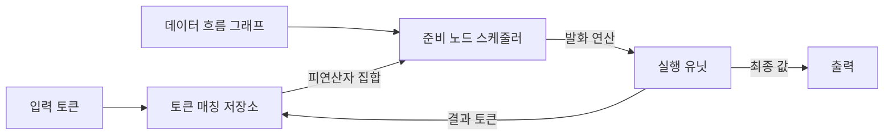
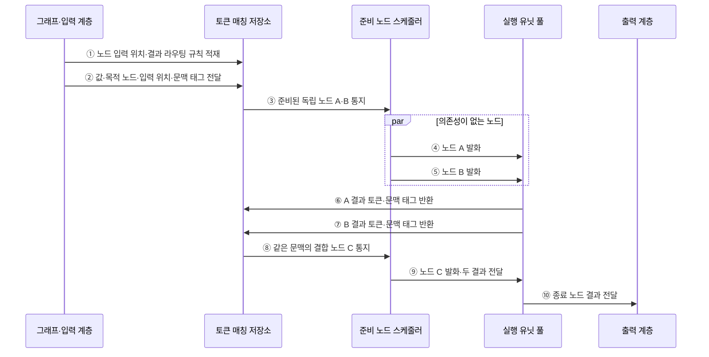

---
sidebar:
  order: 77
  label: "077. 데이터 흐름 컴퓨터"
  badge:
    text: "미출 · 50%"
    variant: note
title: "데이터 흐름 컴퓨터 (Dataflow Computer)"
date: "2026-07-28T13:11:20+09:00"
tags:
  - "notes-hardware"
weight: 77
extra:
  question_no: "077"
  source_status: "미출"
  source_history: ""
  priority: 50
  priority_note: "준비 연산 병렬성과 토큰 비용"
---

## 미리 알고가기

- **데이터 흐름 컴퓨터(Dataflow Computer)**: 필요한 피연산자가 준비된 연산부터 실행하는 컴퓨터 구조
- **제어 흐름 컴퓨터(Control-flow Computer)**: 프로그램 카운터와 분기 결과로 다음 명령을 정하는 구조
- **데이터 흐름 그래프(Dataflow Graph)**: 연산을 노드, 값의 의존 관계를 방향 간선으로 나타낸 표현
- **토큰(Token)**: 연산값과 실행 문맥을 함께 전달하는 단위
- **태그(Tag)**: 목적 노드·입력 위치·실행 인스턴스를 구분하는 식별자
- **발화(Firing)**: 모든 입력 토큰이 모인 노드를 실행하는 동작
- **토큰 매칭(Token Matching)**: 같은 연산 인스턴스에 속한 입력 토큰을 결합하는 처리
- **실행 유닛(Execution Unit)**: 발화된 산술·논리 연산을 수행하고 결과 토큰을 만드는 장치
- **제어 의존성(Control Dependency)**: 분기 결과에 따라 후속 연산 실행 여부가 정해지는 관계
- **동적 데이터 흐름(Dynamic Dataflow)**: 태그로 반복·재귀의 여러 실행 인스턴스를 구별하는 방식
- **백프레셔(Backpressure)**: 후단의 처리 여유가 부족할 때 상류 전송을 늦추는 흐름 제어
- **연산 입도(Computation Granularity)**: 한 번의 스케줄링으로 묶어 실행하는 작업 크기
- **타일(Tile)**: 큰 데이터나 연산을 지역 처리할 수 있게 나눈 작은 블록
- **텐서(Tensor)**: 여러 차원의 수치 배열

## Ⅰ. 개요

- 정의/개념: 피연산자 토큰이 모두 도착한 노드를 **준비 순서대로 발화**하는 병렬 구조
- 기존 한계: 프로그램 카운터 중심 순차 발행은 독립 연산이 준비돼도 제어 순서에 묶일 수 있음

### 쉽게 이해하기 (학습용)

- 주문 순서가 아니라 재료가 모두 모인 요리부터 만든다.

## Ⅱ. 특징

- 데이터 의존성이 없는 노드는 자연스럽게 동시 실행
- 태그·토큰으로 반복과 여러 실행 문맥 구분
- 토큰 매칭·저장·이동 비용이 확장성과 효율 제한

### 쉽게 이해하기 (학습용)

- 병렬성은 쉽게 드러나지만 재료표를 분류하고 옮기는 비용이 든다.

## Ⅲ. 아키텍처

**도표안 A — 구조도**

**도표안 B — sequenceDiagram**

| 설계 요소 | 입력·상태 | 역할 |
|:---|:---|:---|
| 데이터 흐름 그래프 | 연산·의존 간선 | 연산과 토큰 목적지 정의 |
| 토큰 매칭 저장소 | 값·태그·입력 위치 | 같은 노드의 피연산자 결합 |
| 준비 노드 스케줄러 | 완성된 피연산자 집합 | 실행 가능한 연산 선택·발행 |
| 실행 유닛 | 연산 코드·피연산자 | 계산 후 결과 토큰 생성 |
| 출력 계층 | 종료 노드 결과 | 실행 결과 정렬·외부 전달 |

> 요약: 토큰 매칭이 준비된 노드를 발화하고 결과를 다시 전파한다.

**동작 원리**

1. **그래프 적재**: 노드 입력 위치와 결과 목적지 규칙을 저장한다.
2. **토큰 수신**: 값·목적 노드·입력 위치·문맥 태그를 받는다.
3. **준비 통지**: 피연산자가 모두 모인 독립 노드 A·B를 알린다.
4. **A 발화**: A의 연산과 피연산자를 가용 실행 유닛에 보낸다.
5. **B 병렬 발화**: 의존성이 없는 B를 동시에 보낸다.
6. **A 결과 전파**: A 결과에 목적지와 문맥 태그를 붙여 돌려보낸다.
7. **B 결과 전파**: B 결과도 같은 방식으로 돌려보낸다.
8. **결합 준비**: 같은 문맥의 A·B 결과가 모이면 C를 준비한다.
9. **결합 발화**: C와 두 피연산자를 실행 유닛에 보낸다.
10. **결과 전달**: 종료 노드 결과를 외부 순서와 형식에 맞춰 내보낸다.

### 쉽게 이해하기 (학습용)

- 서로 상관없는 두 계산은 재료가 모이는 즉시 동시에 실행하고, 두 결과가 모두 모여야 합치는 계산을 시작한다.

## Ⅳ. 종류 및 비교

| 판단 기준 | 데이터 흐름 구조 | 제어 흐름 구조 |
|:---|:---|:---|
| 실행 결정 | 입력 토큰 충족 | 프로그램 카운터·분기 |
| 강점 | 의존성 기반 병렬성 노출 | 단순한 순서·상태 관리 |
| 한계 | 매칭·통신·태그 비용 | 제어·메모리 의존 병목 |

> 요약: 데이터 흐름은 값의 준비 상태, 제어 흐름은 명령 순서로 실행을 정한다.

### 쉽게 이해하기 (학습용)

- 하나는 재료가 모이면 시작하고 다른 하나는 번호표 순서대로 시작한다.

## Ⅴ. 실무 고려사항 및 대책

| 운영 위험 | 대응 | 기대 효과 |
|:---|:---|:---|
| 태그·토큰 저장소 용량 초과 | 실행 문맥 제한과 토큰 수명·백프레셔 관리 | 교착·메모리 폭증 방지 |
| 매칭·스케줄링 비용이 연산 이득 상쇄 | 굵은 연산 단위와 지역 매칭·배치 발행 | 제어 오버헤드 축소 |
| 원거리 토큰 이동으로 네트워크 병목 | 생산자·소비자 배치와 지역성 기반 라우팅 | 통신 지연·전력 감소 |
| 부작용·입출력 순서가 비결정적 | 효과 토큰·순서 제약과 재현 가능한 추적 | 정확성·디버깅 가능성 확보 |

### 적용 사례

- 신경망 가속기는 연산 그래프의 입력 타일이 준비된 연산부터 실행 유닛에 배치하고 생산자·소비자를 가깝게 두어 중간 텐서 이동을 줄인다.

### 쉽게 이해하기 (학습용)

- 필요한 값이 가까이 있는 계산부터 가속기 작업대에 보낸다.

## Ⅵ. 결론

- 데이터 의존 병렬성을 활용하기 위해 **준비 노드 수·연산 입도·토큰 매칭 비용·통신 지역성·부작용 순서**를 검토하고, 병렬 이득이 런타임 비용을 넘는 워크로드에 적용한다.

### 쉽게 이해하기 (학습용)

- 동시에 할 계산이 충분하고 토큰 관리가 가벼울 때 효과적이다.
