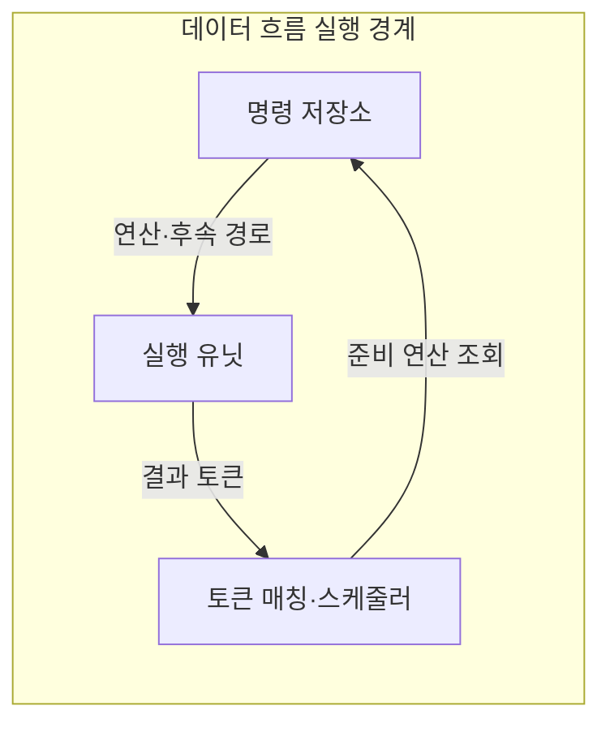
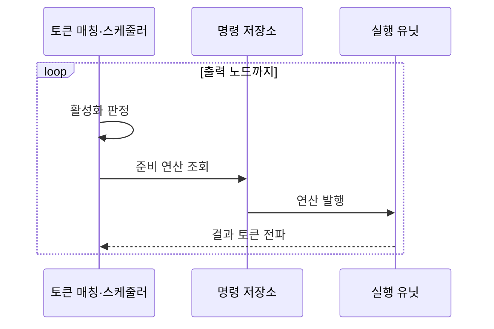

---
sidebar:
  order: 77
  label: "077. 데이터 흐름 컴퓨터 (Dataflow Computer)"
  badge:
    text: "미출제 · 50%"
    variant: note
title: "데이터 흐름 컴퓨터 (Dataflow Computer)"
date: "2026-07-25T00:22:25+09:00"
tags:
  - "notes-hardware"
weight: 77
extra:
  question_no: "077"
  source_status: "미출제"
  source_history: ""
  priority: 50
  priority_note: "준비 연산 병렬성과 토큰 비용으로 구조 선택"
---

## 미리 알고가기

- **데이터 흐름 컴퓨터(Dataflow Computer)**: 필요한 피연산자가 모두 도착한 연산부터 실행하는 병렬 컴퓨터 구조
- **피연산자(Operand)**: 명령이 계산에 사용하는 입력값
- **프로그램 카운터(Program Counter)**: 다음 명령 주소를 가리키는 레지스터
- **제어 흐름 컴퓨터(Control-flow Computer)**: 프로그램 카운터와 분기 결과가 다음 실행 명령을 정하는 구조
- **데이터 흐름 그래프(Dataflow Graph)**: 연산을 노드, 값의 의존 관계를 방향 간선으로 나타낸 프로그램 표현
- **토큰(Token)**: 연산값과 태그를 함께 전달하는 실행 단위
- **태그(Tag)**: 목적 노드·입력 위치·실행 인스턴스 식별자
- **활성화(Firing)**: 모든 입력 토큰이 모인 노드를 실행하는 동작
- **실행 유닛(Execution Unit)**: 발행된 산술·논리 연산을 수행하고 결과 토큰을 만드는 하드웨어
- **제어 의존(Control Dependency)**: 앞선 분기 결과에 따라 뒤 명령의 실행 여부가 정해지는 관계
- **스트림 연산자(Stream Operator)**: 연속 입력 이벤트를 조건에 따라 결합·변환해 다음 결과를 내는 처리 단위

## Ⅰ. 개요

- **정의/개념**: 피연산자 토큰이 모인 노드부터 활성화하는 병렬 구조
- **배경/필요성**: 순차 명령 실행은 병렬성을 제한해 준비 연산 발행이 필요함

### 쉽게 이해하기 (학습용)

- 주문 순서와 관계없이 재료가 모두 모인 요리부터 조리한다.

## Ⅱ. 특징

- 독립 노드는 비순차로 동시 실행돼 지연을 줄인다.
- 태그 매칭·토큰 이동 비용이 확장 이득을 제한한다.

### 쉽게 이해하기 (학습용)

- 재료가 모두 모인 요리는 동시에 만들 수 있지만 재료표 관리가 복잡하면 이득이 줄어든다.

## Ⅲ. 아키텍처 및 구성요소

| 설계 요소 | 설명 |
|:---|:---|
| 명령 저장소 | 연산과 후속 토큰 경로 보관 |
| 토큰 매칭·스케줄러 | 태그별 피연산자를 모아 준비 연산 조회 |
| 실행 유닛 | 준비 연산을 수행해 결과 토큰 생성 |

> 요약: 준비 연산 발행·결과 토큰 재순환

### 쉽게 이해하기 (학습용)

- 조리법 창고와 재료 담당자가 준비된 요리를 조리사에게 보내고 완성 재료를 다시 돌려준다.

## Ⅳ. 원리 및 절차 흐름도

| 절차 | 설명 |
|:---|:---|
| 활성화 판정 | 태그별 피연산자 충족 여부 판정 |
| 준비 연산 조회 | 활성 노드의 연산·후속 경로 조회 |
| 연산 발행 | 연산·피연산자를 실행 유닛에 전달 |
| 결과 토큰 전파 | 결과와 태그를 후속 노드 입력에 전달 |

> 요약: 입력 충족 노드 실행·후속 토큰 전파

### 쉽게 이해하기 (학습용)

- 재료가 모두 모인 요리를 조리하고 완성품을 다음 요리의 재료로 넘긴다.

## Ⅴ. 종류 및 비교

| 판단 기준 | 데이터 흐름 컴퓨터 | 제어 흐름 컴퓨터 |
|:---|:---|:---|
| 핵심 특징 | 토큰 충족 노드를 병렬 활성화 | 명령 주소·분기로 실행 순서 결정 |
| 적용 기준 | 준비 노드가 많고 토큰 비용이 작을 때 | 분기·공유 상태 중심일 때 |
| 주요 위험 | 태그 매칭·토큰 이동 비용 | 제어 의존에 따른 직렬 병목 |

> 요약: 데이터 흐름은 토큰, 제어 흐름은 명령 주소로 실행 결정

### 쉽게 이해하기 (학습용)

- 데이터 흐름은 재료가 모인 요리부터 만들고 제어 흐름은 주문표 순서대로 만든다.

## Ⅵ. 실무 사례

1. 신경망 가속기는 의존 그래프의 준비 연산만 실행 유닛에 발행
2. 스트림 분석기는 입력 이벤트가 모인 연산자를 활성화

### 쉽게 이해하기 (학습용)

- 신경망 계산에서 필요한 값이 다 모인 연산만 계산 장치에 보낸다.
- 실시간 이벤트가 다 모인 처리 단계만 깨워 다음 결과를 만든다.

## Ⅶ. 결론

- 준비 노드 병렬 이득이 토큰 비용보다 클 때 데이터 흐름 선택

### 쉽게 이해하기 (학습용)

- 동시에 할 요리가 많고 재료표 관리가 덜 번거로울 때 이 주방 방식을 선택한다.
