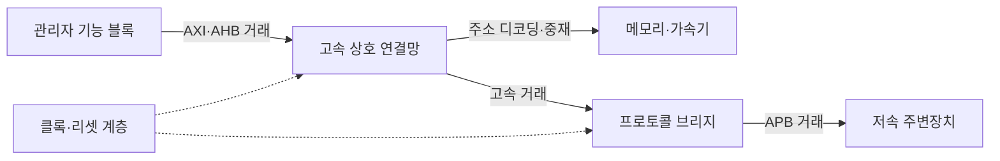

---
sidebar:
  order: 78
  label: "078. AMBA 버스 프로토콜"
  badge:
    text: "미출 · 50%"
    variant: note
title: "AMBA 버스 프로토콜 (AMBA Bus Protocol)"
date: "2026-07-28T13:11:20+09:00"
tags:
  - "notes-hardware"
weight: 78
extra:
  question_no: "078"
  source_status: "미출"
  source_history: ""
  priority: 50
  priority_note: "SoC 온칩 버스 계층 비교"
---

## 미리 알고가기

- **고급 마이크로컨트롤러 버스 아키텍처(Advanced Microcontroller Bus Architecture, AMBA)**: 시스템온칩 내부 연결을 표준화한 Arm 인터페이스 규격군
- **시스템온칩(System on Chip, SoC)**: 처리기·메모리 제어기·주변장치를 한 칩에 통합한 시스템
- **고급 확장 인터페이스(Advanced eXtensible Interface, AXI)**: 독립 채널과 다중 미완료 거래를 지원하는 고성능 인터페이스
- **고급 고성능 버스(Advanced High-performance Bus, AHB)**: 주소·데이터 단계를 파이프라인 처리하는 시스템 버스
- **고급 주변장치 버스(Advanced Peripheral Bus, APB)**: 저대역 주변장치 레지스터 접근을 위한 단순 인터페이스
- **거래(Transaction)**: 주소·제어·데이터·응답으로 완결되는 한 번의 읽기 또는 쓰기
- **미완료 거래(Outstanding Transaction)**: 요청을 수락했지만 응답이 끝나지 않은 거래
- **상호 연결망(Interconnect)**: 여러 관리자와 종속 장치를 연결하고 경로를 선택하는 구조
- **중재(Arbitration)**: 동시 요청 사이에서 자원 사용 순서를 결정하는 기능
- **주소 디코딩(Address Decoding)**: 요청 주소로 대상 종속 장치를 선택하는 기능
- **클록 도메인 교차(Clock Domain Crossing, CDC)**: 서로 다른 클록 영역 사이에서 신호를 안전하게 전달하는 기술
- **프로토콜 브리지(Protocol Bridge)**: 한 버스 거래를 다른 버스의 신호·순서로 변환하는 장치

## Ⅰ. 개요

- 정의/개념: SoC 기능 블록 사이의 **거래·채널·응답 규칙**을 표준화한 온칩 인터페이스 규격군
- 기존 한계: 블록마다 다른 통신 규칙은 재사용·통합·검증 비용 증가

### 쉽게 이해하기 (학습용)

- 서로 다른 칩 블록이 같은 교통 규칙으로 통신하게 한다.

## Ⅱ. 특징

- AXI는 독립 읽기·쓰기 채널과 다중 미완료 거래로 높은 처리량 제공
- AHB는 주소·데이터 파이프라인으로 중간 복잡도의 시스템 경로 구성
- APB는 설정·접근 단계로 저속 제어 레지스터를 단순 연결

### 쉽게 이해하기 (학습용)

- 고속 도로는 AXI, 간선 도로는 AHB, 주변장치 골목은 APB에 가깝다.

## Ⅲ. 아키텍처 및 구성요소

| 설계 요소 | 입력·상태 | 역할 |
|:---|:---|:---|
| 관리자 기능 블록 | 주소·제어·쓰기 데이터 | 읽기·쓰기 거래 발행 |
| 고속 상호 연결망 | 동시 요청·주소 지도 | 디코딩·중재·응답 라우팅 |
| 메모리·가속기 | AXI·AHB 거래 | 고대역 데이터 요청 처리 |
| 프로토콜 브리지 | 고속 거래·대기 상태 | AXI·AHB와 APB 의미·순서 변환 |
| 저속 주변장치 | APB 선택·접근 신호 | 설정·상태 레지스터 제공 |

> 요약: 고속 상호 연결망에서 브리지를 거쳐 저속 주변장치로 계층화

### 쉽게 이해하기 (학습용)

- 브리지가 고속 도로의 요청을 주변장치가 이해하는 단순 신호로 바꾼다.

## Ⅳ. 운영 고려사항

| 운영 위험 | 대응 | 기대 효과 |
|:---|:---|:---|
| AXI 채널별 응답·식별자 순서 오류 | 거래 식별자별 순서 규칙과 프로토콜 검사기 적용 | 교착·데이터 혼선 방지 |
| 브리지 대기 상태로 고속 경로 정체 | 버퍼 깊이·타임아웃·트래픽 등급 분리 | 지연 전파 제한 |
| 주소 지도 중첩·미할당 접근 | 단일 주소 명세와 자동 디코더·접근 오류 응답 | 잘못된 장치 접근 방지 |
| 클록·리셋 도메인 교차 결함 | 검증된 비동기 브리지와 CDC·리셋 검증 | 준안정·초기화 오류 감소 |

### 쉽게 이해하기 (학습용)

- 규격이 같아도 순서, 주소, 클록 경계를 잘못 다루면 시스템이 멈출 수 있다.

## Ⅴ. 종류 및 비교

| 판단 기준 | AXI | AHB | APB |
|:---|:---|:---|:---|
| 핵심 특징 | 독립 채널·다중 미완료 거래 | 주소·데이터 파이프라인 | 설정·접근 2단계 |
| 적용 대상 | 메모리·고성능 가속기 | 중간급 시스템 경로 | 제어·상태 레지스터 |
| 주요 비용 | 식별자·채널·순서 제어 복잡 | 공유 경로 중재 | 낮은 처리량 |

> 요약: 성능·복잡도·주변장치 요구에 따라 버스 계층 선택

### 쉽게 이해하기 (학습용)

- 큰 데이터에는 AXI, 단순한 설정에는 APB를 배치한다.

## Ⅵ. 실무 사례

1. 메모리 제어기에는 AXI를, 타이머·범용 입출력 레지스터에는 **AXI-APB 브리지**를 적용한다.

### 쉽게 이해하기 (학습용)

- 메모리는 고속 경로에, 설정 장치는 변환소 뒤의 단순 경로에 둔다.

## Ⅶ. 결론

- SoC 연결을 설계할 때 **처리량·지연·동시 거래·주소 지도·클록 경계·검증 복잡도**를 평가하고, 데이터 경로는 AXI·AHB, 저속 제어 경로는 APB로 계층화한다.

### 쉽게 이해하기 (학습용)

- 장치의 속도와 역할에 맞는 통신 규칙을 골라 연결한다.
