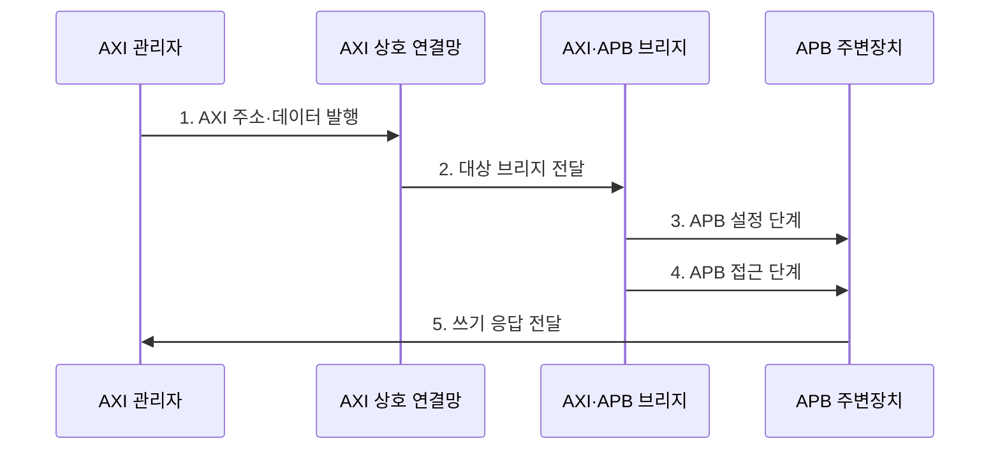

---
sidebar:
  order: 78
  label: "078. AMBA 버스 프로토콜"
  badge:
    text: "미출 · 50%"
    variant: note
title: "AMBA 버스 프로토콜 (AMBA Bus Protocol)"
date: "2026-07-30T18:00:00+09:00"
tags:
  - "notes-hardware"
weight: 78
extra:
  question_no: "078"
  source_status: "미출"
  source_history: ""
  priority: 50
  priority_note: "SoC 온칩 버스 계층 비교"
---

## 미리 알고가기

- **고급 마이크로컨트롤러 버스 아키텍처(Advanced Microcontroller Bus Architecture, AMBA)**: 시스템온칩 내부 연결을 표준화한 Arm 인터페이스 규격군
- **시스템온칩(System on Chip, SoC)**: 처리기·메모리 제어기·주변장치를 한 칩에 통합한 시스템
- **고급 확장 인터페이스(Advanced eXtensible Interface, AXI)**: 독립 채널과 다중 미완료 거래를 지원하는 고성능 인터페이스
- **고급 고성능 버스(Advanced High-performance Bus, AHB)**: 주소·데이터 단계를 파이프라인 처리하는 시스템 버스
- **고급 주변장치 버스(Advanced Peripheral Bus, APB)**: 저대역 주변장치 레지스터 접근을 위한 단순 인터페이스
- **거래(Transaction)**: 주소·제어·데이터·응답으로 완결되는 한 번의 읽기 또는 쓰기
- **미완료 거래(Outstanding Transaction)**: 요청을 수락했지만 응답이 끝나지 않은 거래
- **상호 연결망(Interconnect)**: 여러 관리자와 종속 장치를 연결하고 경로를 선택하는 구조
- **중재(Arbitration)**: 동시 요청 사이에서 자원 사용 순서를 결정하는 기능
- **주소 디코딩(Address Decoding)**: 요청 주소로 대상 종속 장치를 선택하는 기능
- **클록 도메인 교차(Clock Domain Crossing, CDC)**: 서로 다른 클록 영역 사이에서 신호를 안전하게 전달하는 기술
- **프로토콜 브리지(Protocol Bridge)**: 한 버스 거래를 다른 버스의 신호·순서로 변환하는 장치
- **VALID·READY 핸드셰이크**: 송신 측 VALID와 수신 측 READY가 동시에 1일 때 정보를 전달하는 AXI 규칙
- **AXI 쓰기 채널 신호**: AW는 쓰기 주소, W는 쓰기 데이터, B는 쓰기 응답 채널의 접두어
- **바이트 스트로브(Byte Strobe)**: 쓰기 데이터에서 유효한 바이트 위치를 표시하는 비트
- **APB 제어 신호**: PSEL은 장치 선택, PENABLE은 접근 단계, PREADY는 완료, PSLVERR는 오류 표시
- **준안정(Metastability)**: 비동기 신호를 받는 플립플롭 출력이 일정 시간 0이나 1로 확정되지 않는 상태

## Ⅰ. 개요

- 정의/개념: SoC 블록의 **거래·응답 규칙** 표준
- 배경/필요성: 블록 간 재사용·통합·검증 비용 절감

### 쉽게 이해하기 (학습용)

- 서로 다른 칩 블록이 같은 교통 규칙으로 통신하게 한다.

## Ⅱ. 특징

- **AXI 독립 채널**: 다중 거래와 높은 처리량
- **AHB 파이프라인**: 중간 복잡도 시스템 경로
- **APB 설정·접근**: 저속 제어 레지스터 연결

### 쉽게 이해하기 (학습용)

- 고속 도로는 AXI, 간선 도로는 AHB, 주변장치 골목은 APB에 가깝다.

## Ⅲ. 구조 및 구성요소

| 구성요소 | 책임 |
|:---|:---|
| 관리자 기능 블록 | **읽기·쓰기 거래 발행** |
| 고속 상호 연결망 | **디코딩·중재·라우팅** |
| 메모리·가속기 | **고대역 요청 처리** |
| 프로토콜 브리지 | **AXI·APB 거래 변환** |
| 저속 주변장치 | **제어 레지스터 제공** |

### 쉽게 이해하기 (학습용)

- 고속 거래를 브리지가 단순한 APB 접근으로 바꾼다.

## Ⅳ. 흐름도

**동작 원리**

- **1. AXI 주소·데이터 발행**: 독립 AW·W 채널에서 쓰기 정보 전송
- **2. 대상 브리지 전달**: 주소 디코딩 후 주소·데이터 거래 결합
- **3. APB 설정 단계**: PSEL과 주소·데이터를 한 주기 고정
- **4. APB 접근 단계**: PENABLE 활성화 후 PREADY까지 유지
- **5. 쓰기 응답 전달**: APB 완료·오류를 AXI B 응답으로 변환

### 쉽게 이해하기 (학습용)

- 브리지는 서로 독립적으로 들어온 AXI 주소와 데이터를 모은 뒤, APB의 설정·접근 2단계로 바꿔 레지스터를 쓴다.

## Ⅴ. 종류 및 비교

| 구분 | AXI | AHB | APB |
|:---|:---|:---|:---|
| 적용 기준 | 메모리·가속기 | 중간급 시스템 경로 | 제어·상태 레지스터 |
| 핵심 특징 | **독립 채널·다중 거래** | **주소·데이터 파이프라인** | **설정·접근 2단계** |
| 한계 | 채널·순서 제어 복잡 | 공유 경로 중재 | 낮은 처리량 |

### 쉽게 이해하기 (학습용)

- 큰 데이터에는 AXI, 단순한 설정에는 APB를 배치한다.

## Ⅵ. 실무 고려사항 및 대책

| 고려사항 | 대책 | 효과 |
|:---|:---|:---|
| 응답·식별자 순서 오류 | 프로토콜 검사기 적용 | **교착·혼선 방지** |
| 브리지 대기 증가 | 버퍼·타임아웃 적용 | **지연 전파 제한** |
| 주소 지도 중첩 | 단일 명세·자동 디코더 | **오접근 방지** |
| 클록 경계 결함 | CDC·리셋 검증 | **준안정 오류 감소** |

### 쉽게 이해하기 (학습용)

- 메모리는 고속 경로에, 설정 장치는 변환소 뒤의 단순 경로에 둔다.

## Ⅶ. 결론

- 처리량·거래 복잡도로 AXI·AHB·APB 계층을 선택한다.

### 쉽게 이해하기 (학습용)

- 장치의 속도와 역할에 맞는 통신 규칙을 골라 연결한다.
