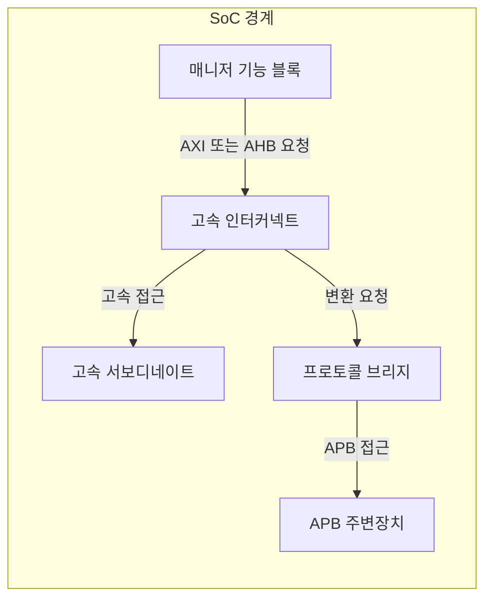
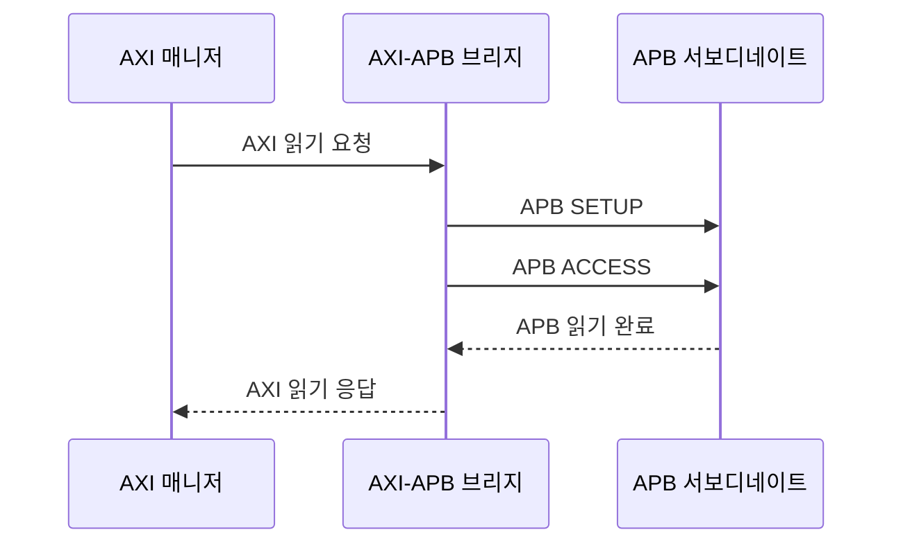

---
sidebar:
  order: 78
  label: "078. AMBA 버스 프로토콜 (AMBA Bus Protocol)"
  badge:
    text: "미출제 · 50%"
    variant: note
title: "AMBA 버스 프로토콜 (AMBA Bus Protocol)"
date: "2026-07-25T00:22:25+09:00"
tags:
  - "notes-hardware"
weight: 78
extra:
  question_no: "078"
  source_status: "미출제"
  source_history: ""
  priority: 50
  priority_note: "시스템온칩 내부 버스의 계층 비교가 가능함"
---

## 미리 알고가기

- **고급 마이크로컨트롤러 버스 아키텍처(Advanced Microcontroller Bus Architecture, AMBA)**: AMBA는 ‘암바’로 읽고 영문 머리글자를 딴 약어이며, 성능·용도별 온칩 인터페이스를 표준화
- **시스템 온 칩(System on Chip, SoC)**: SoC는 ‘에스오시’로 읽고 영문 머리글자를 딴 약어이며, 처리기·메모리·주변 기능을 한 칩에 통합
- **고급 확장 인터페이스(Advanced eXtensible Interface, AXI)**: AXI는 ‘악시’로 읽고 영문 명칭의 핵심 글자를 딴 약어이며, 5개 독립 채널로 다중 트랜잭션을 처리
- **고급 고성능 버스(Advanced High-performance Bus, AHB)**: AHB는 ‘에이에이치비’로 읽고 영문 머리글자를 딴 약어이며, 주소·데이터 단계를 파이프라인 처리
- **고급 주변장치 버스(Advanced Peripheral Bus, APB)**: APB는 ‘에이피비’로 읽고 영문 머리글자를 딴 약어이며, SETUP·ACCESS 단계로 제어 레지스터에 접근
- **매니저·서보디네이트(Manager·Subordinate)**: 요청 발행자와 요청 처리자
- **트랜잭션(Transaction)**: 주소·제어·데이터·응답으로 완결되는 한 번의 버스 읽기나 쓰기
- **AXI 5개 채널**: 읽기 주소·읽기 데이터·쓰기 주소·쓰기 데이터·쓰기 응답을 독립적으로 전달하는 경로
- **미완료 트랜잭션(Outstanding Transaction)**: 요청은 수락됐지만 응답이 끝나지 않은 상태
- **파이프라인(Pipeline)**: 앞 요청의 데이터 전송과 다음 요청의 주소 전송을 겹쳐 처리하는 방식
- **인터커넥트·중재(Interconnect·Arbitration)**: 인터커넥트는 기능 블록 사이의 연결망이고 중재는 동시 요청 중 사용할 경로와 순서를 결정함
- **주소 디코딩(Address Decoding)**: 요청 주소 범위를 해석해 대상 서보디네이트를 선택하는 동작
- **클럭 도메인 교차(Clock Domain Crossing, CDC)**: CDC는 ‘시디시’로 읽고 영문 머리글자를 딴 약어이며, 서로 다른 클럭으로 동작하는 회로 사이에 신호를 안전하게 전달
- **APB 제어 신호(PSEL·PENABLE·PREADY)**: PSEL·PENABLE·PREADY는 ‘피셀·피이네이블·피레디’로 읽고 APB 표준이 Select·Enable·Ready 역할에 붙인 신호명으로, 각각 대상 선택·ACCESS 진입·전송 완료를 표시

## Ⅰ. 개요

- 정의/개념: SoC 기능 블록 간 통신을 규정하는 온칩 인터페이스 표준
- **배경/필요성**: 이종 블록의 통신 조건이 달라 표준 인터페이스가 필요함

### 쉽게 이해하기 (학습용)

- 서로 만든 칩 블록도 같은 통신 규칙을 따르면 한 시스템에 연결할 수 있다.

## Ⅱ. 특징

- 프로토콜과 토폴로지를 분리해 블록 재사용을 높인다.

### 쉽게 이해하기 (학습용)

- 통신 규칙과 연결망 모양을 따로 정하므로 같은 블록을 여러 칩 구조에 재사용할 수 있다.

## Ⅲ. 아키텍처 및 구성요소

| 설계 요소 | 설명 |
|:---|:---|
| 매니저 기능 블록 | 주소·제어·데이터 트랜잭션 발행 |
| 고속 인터커넥트 | 주소 디코딩·중재·경로 선택 |
| 고속 서보디네이트 | 메모리·가속기 요청 처리 |
| 프로토콜 브리지 | AXI·AHB 요청의 APB 전송 변환 |
| APB 주변장치 | 저대역폭 제어 레지스터 접근 |

> 요약: 고속 경로에서 APB 주변 경로로 분기

### 쉽게 이해하기 (학습용)

- 큰 데이터는 고속 길로 보내고 제어 명령은 변환소를 거쳐 주변장치 길로 나눈다.

## Ⅳ. 원리 및 절차 흐름도

| 절차 | 설명 |
|:---|:---|
| AXI 읽기 요청 | 읽기 주소 채널 수락 후 변환 시작 |
| APB SETUP | PSEL=1·PENABLE=0으로 설정 |
| APB ACCESS | PSEL=1 유지·PENABLE=1 설정 후 PREADY 대기 |
| APB 읽기 완료 | PREADY=1에서 읽기 데이터·오류 수신 |
| AXI 읽기 응답 | 읽기 데이터 채널로 결과 반환 |

> 요약: AXI 읽기 요청을 APB 2단계로 변환

### 쉽게 이해하기 (학습용)

- 브리지는 고속 읽기 요청을 받고 주변장치를 선택한 뒤 한 박자 후 접근해 결과를 돌려준다.

## Ⅴ. 종류 및 비교

| 판단 기준 | AXI | AHB | APB |
|:---|:---|:---|:---|
| 핵심 특징 | 독립 채널·다중 미완료 처리 | 주소·데이터 파이프라인 | SETUP·ACCESS 단일 전송 |
| 적용 기준 | 고대역폭·다중 요청 경로 | 다중 미완료 요청이 불필요한 경로 | 저대역폭 제어 레지스터 |
| 주요 위험 | 채널·응답 순서 제어 복잡 | 공유 버스 중재 병목 | 낮은 처리량 |

> 요약: 트래픽 요구에 맞춰 세 프로토콜 선택

### 쉽게 이해하기 (학습용)

- 여러 짐을 겹쳐 보내면 AXI, 한 줄로 이어 보내면 AHB, 드문 제어에는 APB를 선택한다.

## Ⅵ. 실무 사례

1. 메모리 제어기 AXI·주변 레지스터 APB 배치
2. 비동기 브리지는 요청·응답 신호 동기화 검증

### 쉽게 이해하기 (학습용)

- 메모리는 많은 데이터를 겹쳐 보내는 길에 두고 설정 레지스터는 단순한 길에 둔다.
- 클럭이 다른 구간을 이을 때는 요청과 응답이 빠지거나 두 번 잡히지 않는지 확인한다.

## Ⅶ. 결론

- 트래픽·클럭 경계로 AMBA 계층·브리지 선택

### 쉽게 이해하기 (학습용)

- 큰 짐과 잦은 요청은 고속 길로, 드문 제어는 단순한 길로 보내고 클럭이 바뀌는 곳에 변환소를 둔다.
