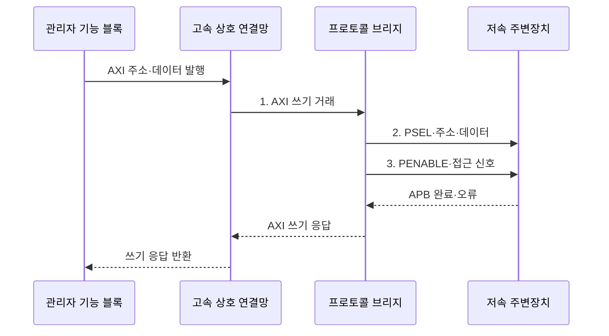

---
sidebar:
  order: 78
  label: "078. AMBA 버스 프로토콜"
  badge:
    text: "미출 · 50%"
    variant: note
title: "AMBA 버스 프로토콜 (AMBA Bus Protocol)"
date: "2026-07-30T21:41:16+09:00"
tags:
  - "notes-hardware"
weight: 78
extra:
  question_no: "078"
  source_status: "미출"
  source_history: ""
  priority: 50
  priority_note: "SoC 온칩 버스 계층 비교"
---

## 미리 알고가기

- **고급 마이크로컨트롤러 버스 아키텍처(Advanced Microcontroller Bus Architecture, AMBA)**: 시스템온칩 내부 연결을 표준화한 Arm 인터페이스 규격군
- **시스템온칩(System on Chip, SoC)**: 처리기·메모리 제어기·주변장치를 한 칩에 통합한 시스템
- **고급 확장 인터페이스(Advanced eXtensible Interface, AXI)**: 독립 채널과 다중 미완료 거래를 지원하는 고성능 인터페이스
- **고급 고성능 버스(Advanced High-performance Bus, AHB)**: 주소·데이터 단계를 파이프라인 처리하는 시스템 버스
- **고급 주변장치 버스(Advanced Peripheral Bus, APB)**: 저대역 주변장치 레지스터 접근을 위한 단순 인터페이스
- **거래(Transaction)**: 주소·제어·데이터·응답으로 완결되는 한 번의 읽기 또는 쓰기
- **미완료 거래(Outstanding Transaction)**: 요청을 수락했지만 응답이 끝나지 않은 거래
- **상호 연결망(Interconnect)**: 여러 관리자와 종속 장치를 연결하고 경로를 선택하는 구조
- **중재(Arbitration)**: 동시 요청 사이에서 자원 사용 순서를 결정하는 기능
- **주소 디코딩(Address Decoding)**: 요청 주소로 대상 종속 장치를 선택하는 기능
- **클록 도메인 교차(Clock Domain Crossing, CDC)**: 서로 다른 클록 영역 사이에서 신호를 안전하게 전달하는 기술
- **프로토콜 브리지(Protocol Bridge)**: 한 버스 거래를 다른 버스의 신호·순서로 변환하는 장치
- **VALID·READY 핸드셰이크**: 송신 측 VALID와 수신 측 READY가 동시에 1일 때 정보를 전달하는 AXI 규칙
- **APB 제어 신호**: PSEL은 장치 선택, PENABLE은 접근 단계, PREADY는 완료, PSLVERR는 오류 표시
- **프로토콜 검사기(Protocol Checker)**: 버스 신호와 거래 순서가 인터페이스 규칙을 따르는지 판정하는 검증 도구
- **준안정(Metastability)**: 비동기 신호를 받는 플립플롭 출력이 일정 시간 0이나 1로 확정되지 않는 상태

> **키워드:** AMBA 버스 프로토콜 (AMBA Bus Protocol)

## Ⅰ. 개요

- 정의/개념: SoC 블록의 거래·응답을 표준화한 **Arm AMBA 규격군**
- 배경/필요성: 블록별 독자 인터페이스는 **통합·검증 중복 비용 증가**

### 쉽게 이해하기 (학습용)

- 서로 다른 칩 블록이 같은 교통 규칙으로 통신하게 한다.

## Ⅱ. 특징

- **VALID·READY 독립 채널**과 **미완료 거래**로 AXI 병렬 처리
- **AHB 주소·데이터 파이프라인**으로 중간급 시스템 연결
- **APB 설정·접근 2단계**로 저속 제어 레지스터 연결

### 쉽게 이해하기 (학습용)

- 고속 도로는 AXI, 간선 도로는 AHB, 주변장치 골목은 APB에 가깝다.

## Ⅲ. 구조 및 구성요소

| 구성요소 | 책임 |
|:---|:---|
| 관리자 기능 블록 | **읽기·쓰기 거래 발행** |
| 고속 상호 연결망 | **디코딩·중재·라우팅** |
| 메모리·가속기 | **고대역 요청 처리** |
| 프로토콜 브리지 | **AXI·APB 거래 변환** |
| 저속 주변장치 | **제어 레지스터 제공** |

### 쉽게 이해하기 (학습용)

- 관리자 블록이 고속 상호 연결망으로 메모리·가속기에 닿고, 브리지는 옆길의 저속 주변장치에 맞게 거래를 변환한다.

## Ⅳ. 흐름도

**동작 원리**

1. **AXI 쓰기 거래**: 주소 디코딩 후 브리지 대상 거래로 결합
2. **PSEL·주소·데이터**: APB 설정 주기 동안 선택·요청값 고정
3. **PENABLE·접근 신호**: PREADY 응답까지 접근 상태 유지

### 쉽게 이해하기 (학습용)

- 브리지는 서로 독립적으로 들어온 AXI 주소와 데이터를 모은 뒤, APB의 설정·접근 2단계로 바꿔 레지스터를 쓴다.

## Ⅴ. 종류 및 비교

| AMBA 인터페이스 | AXI | AHB | APB |
|:---|:---|:---|:---|
| 적용 기준 | **메모리·가속기** | **중간급 시스템 경로** | **제어·상태 레지스터** |
| 핵심 특징 | **독립 채널·다중 거래** | **주소·데이터 파이프라인** | **설정·접근 2단계** |
| 한계 | **채널·순서 제어** 복잡 | **공유 경로 중재** | **낮은 처리량** |

### 쉽게 이해하기 (학습용)

- 큰 데이터에는 AXI, 단순한 설정에는 APB를 배치한다.

## Ⅵ. 실무 고려사항 및 대책

| 고려사항 | 대책 | 효과 |
|:---|:---|:---|
| AXI 식별자별 응답 순서를 어겨 거래 혼선 | **프로토콜 검사기·순서 점검** | **교착·응답 혼선** 방지 |
| APB 대기 상태가 브리지 버퍼에 누적 | **버퍼 깊이·타임아웃** 설정 | **지연 전파** 제한 |
| 주소 지도가 겹쳐 여러 종속 장치가 선택 | **단일 주소 명세·자동 디코더** | **오접근** 방지 |
| 서로 다른 클록 영역의 비동기 신호가 준안정 | **CDC·리셋 경로 검증** | **준안정 오류** 감소 |

### 쉽게 이해하기 (학습용)

- 교차로 신호와 주소판이 어긋나면 차가 엉뚱한 길로 가듯, 거래 순서·주소 지도·클록 경계를 함께 검증한다.

## Ⅶ. 결론

- 고대역·다중 거래는 **AXI**, 중간·저속 경로는 **AHB·APB** 선택

### 쉽게 이해하기 (학습용)

- 대형 화물은 고속도로 AXI, 보통 차량은 AHB, 설정 신호는 골목길 APB로 보내듯 대역폭과 역할에 맞춰 규격을 고른다.
