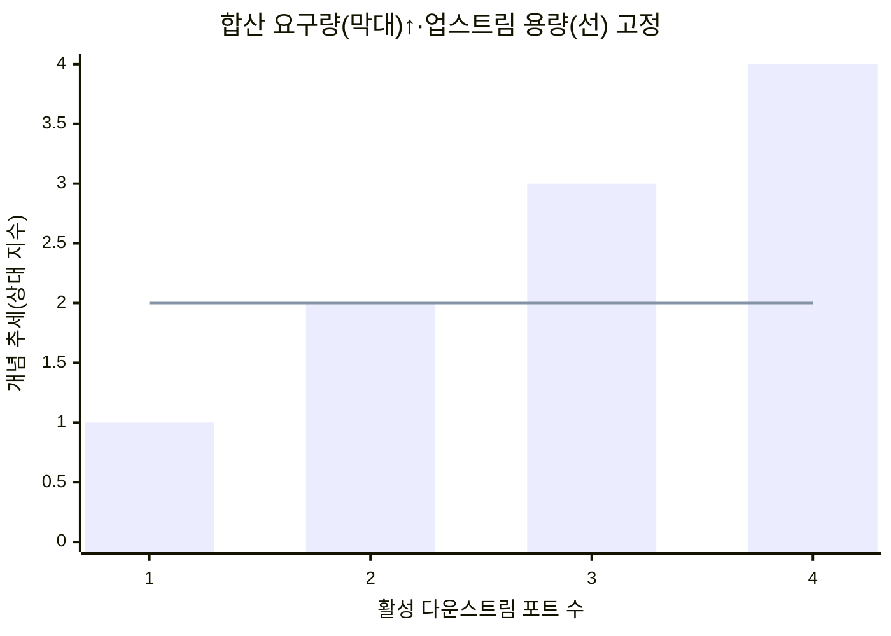
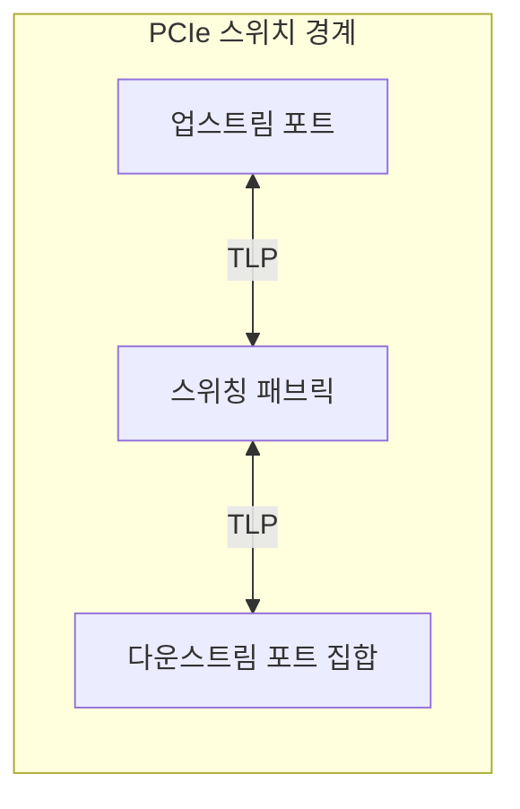
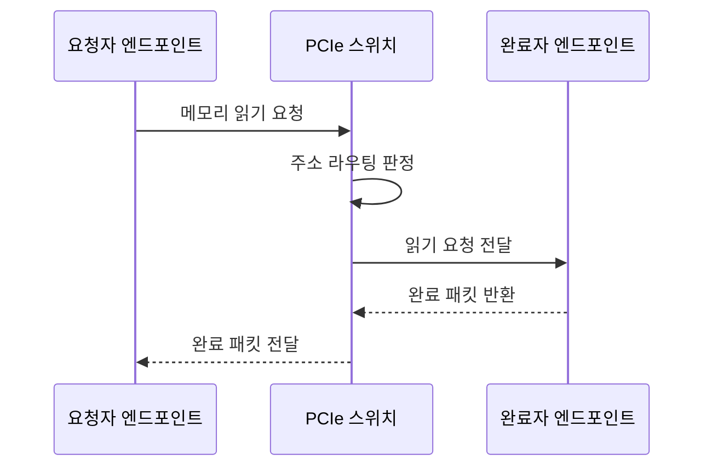
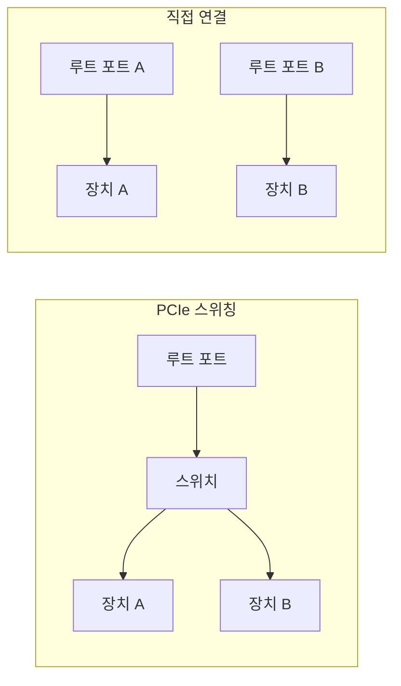

---
sidebar:
  order: 79
  label: "079. PCIe 스위칭 아키텍처 (PCIe Switching)"
  badge:
    text: "미출제 · 50%"
    variant: note
title: "PCIe 스위칭 아키텍처 (PCIe Switching)"
date: "2026-07-25T00:22:25+09:00"
tags:
  - "notes-hardware"
weight: 79
extra:
  question_no: "079"
  source_status: "미출제"
  source_history: ""
  priority: 50
  priority_note: "직렬 패브릭의 대역폭·격리 설계 수요가 있음"
---

## 미리 알고가기

- **PCI 익스프레스(Peripheral Component Interconnect Express, PCIe)**: PCIe는 ‘피시아이 익스프레스’로 읽고 PCI에 Express를 붙인 규격명이며, 직렬 점대점 링크로 주변장치를 연결
- **점대점 링크(Point-to-Point Link)**: 송신 포트와 수신 포트 한 쌍이 전용 전송 경로를 사용하는 연결
- **패브릭(Fabric)**: 여러 포트 사이에서 패킷의 목적지 경로와 전송 순서를 결정하는 내부 연결망
- **루트 컴플렉스·루트 포트(Root Complex·Root Port)**: PCIe 계층의 시작점과 장치 연결 포트
- **엔드포인트(Endpoint)**: PCIe 계층 끝에서 요청을 처리하는 장치
- **업스트림·다운스트림 포트(Upstream·Downstream Port)**: 루트 방향 포트와 장치 방향 포트
- **트랜잭션 계층 패킷(Transaction Layer Packet, TLP)**: TLP는 ‘티엘피’로 읽고 영문 머리글자를 딴 약어이며, 요청·데이터·완료 정보를 운반
- **요청자·완료자(Requester·Completer)**: 요청 패킷 발행자와 완료 응답자
- **동료 간 통신(Peer-to-Peer, P2P)**: P2P는 ‘피투피’로 읽고 두 Peer 사이 연결을 숫자 2로 줄인 표기이며, 엔드포인트끼리 스위치 경로로 직접 통신
- **오버서브스크립션(Oversubscription)**: 하위 요구량 합이 업스트림 용량 초과
- **흐름 제어(Flow Control)**: 수신 버퍼 여유에 맞춰 송신량을 제한해 패킷 손실을 피하는 제어
- **링크 폭(Link Width)**: x1·x4·x8은 ‘엑스 원·엑스 포·엑스 에이트’로 읽고 x 뒤 숫자로 레인 수를 나타내는 PCIe 표준 표기로, 한 링크의 병렬 전송 경로 수와 전송 용량을 구분
- **홉(Hop)**: 패킷이 목적지까지 이동하며 통과하는 스위치 한 단계
- **접근 제어 서비스(Access Control Services, ACS)**: ACS는 ‘에이시에스’로 읽고 영문 머리글자를 딴 약어이며, P2P 요청 허용·업스트림 리디렉션을 제어
- **직접 메모리 접근(Direct Memory Access, DMA)**: DMA는 ‘디엠에이’로 읽고 영문 머리글자를 딴 약어이며, 장치가 프로세서를 거치지 않고 메모리에 접근
- **입출력 메모리 관리 장치(Input-Output Memory Management Unit, IOMMU)**: IOMMU는 ‘아이오엠엠유’로 읽고 영문 머리글자를 딴 약어이며, 장치 DMA 주소를 변환하고 접근 범위를 제한
- **가상 머신(Virtual Machine, VM)**: VM은 ‘브이엠’으로 읽고 영문 머리글자를 딴 약어이며, 물리 자원을 격리된 가상 하드웨어로 제공받아 운영체제를 실행

## Ⅰ. 개요

- **정의/개념**: 업스트림 링크를 여러 다운스트림 포트로 분기하는 패브릭
- **배경/필요성**: 루트 포트 수가 제한되어 장치·P2P 경로 확장이 필요함

### 쉽게 이해하기 (학습용)

- 한 고속도로 진입로 뒤에 분기 교차로를 두어 여러 장치 길로 나누는 구조다.

## Ⅱ. 특징

- 포트별 점대점 링크가 흐름 제어를 독립 수행한다.
- 하위 요구량이 상위 용량을 넘으면 대기 지연이 는다.

### 쉽게 이해하기 (학습용)

- 갈래마다 흐름을 따로 조절해도 장치 요구량 합이 본선 용량을 넘으면 대기한다.

## Ⅲ. 아키텍처 및 구성요소

| 설계 요소 | 설명 |
|:---|:---|
| 업스트림 포트 | 루트 방향 링크와 내부 패브릭 연결 |
| 스위칭 패브릭 | TLP 헤더로 출력 포트 선택·중재 |
| 다운스트림 포트 집합 | 엔드포인트별 점대점 링크 제공 |

> 요약: 업스트림 TLP를 목적지 포트로 분기함

### 쉽게 이해하기 (학습용)

- 한 입구로 들어온 패킷의 목적지를 읽고 여러 장치 출구 중 하나로 보낸다.

## Ⅳ. 원리 및 절차 흐름도

| 절차 | 설명 |
|:---|:---|
| 메모리 읽기 요청 | 주소를 담은 메모리 읽기 TLP 발행 |
| 주소 라우팅 판정 | 요청 주소로 출력 포트 선택 |
| 읽기 요청 전달 | 선택한 다운스트림 포트로 전송 |
| 완료 패킷 반환 | 데이터·상태를 완료 패킷으로 반환 |
| 완료 패킷 전달 | 요청자 식별자로 반환 포트 선택 |

> 요약: 주소·요청자 식별자로 요청·완료 패킷 라우팅

### 쉽게 이해하기 (학습용)

- 장치가 읽기를 요청하면 스위치가 목적지로 보내고 받은 답을 요청 장치에 돌려준다.

## Ⅴ. 종류 및 비교

| 판단 기준 | PCIe 스위칭 | 직접 연결 |
|:---|:---|:---|
| 핵심 특징 | 한 업스트림에서 장치·P2P 분기 | 루트 포트와 장치 1:1 연결 |
| 적용 기준 | 장치 확장·P2P 경로 필요 | 장치 수가 적고 전용 대역폭 우선 |
| 주요 위험 | 공유 본선·중재 지연 | 루트 포트 소모·확장 한계 |

> 요약: 포트 확장 이득과 스위치 홉 비용 상충

### 쉽게 이해하기 (학습용)

- 스위치는 한 입구를 여러 장치가 나누고 직접 연결은 장치마다 전용 입구를 쓴다.

## Ⅵ. 실무 사례

1. 가속기 서버의 P2P 경로·업스트림 링크 폭 산정
2. 가상화 서버의 ACS·IOMMU 기반 장치 DMA 격리

### 쉽게 이해하기 (학습용)

- 여러 가속기가 서로 직접 통신하게 하되 입구 링크에 트래픽이 몰리지 않게 용량을 맞춘다.
- 가상 머신에 넘긴 장치가 다른 장치 경로나 메모리로 새지 않게 주소와 경로를 제한한다.

## Ⅶ. 결론

- 장치 수·P2P·격리 경계로 스위칭 구조 선택

### 쉽게 이해하기 (학습용)

- 장치를 많이 연결하거나 서로 직접 통신시킬 때만 스위치를 두고 공유 본선과 접근 경계를 함께 설계한다.
