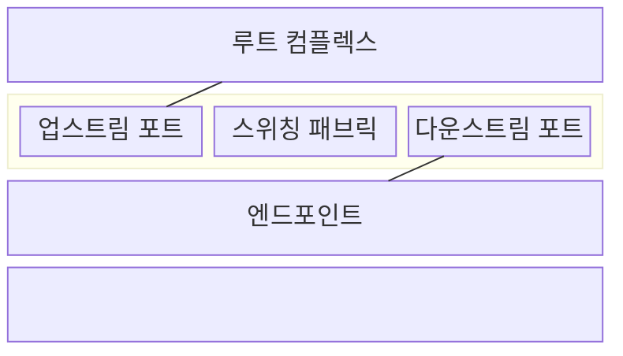
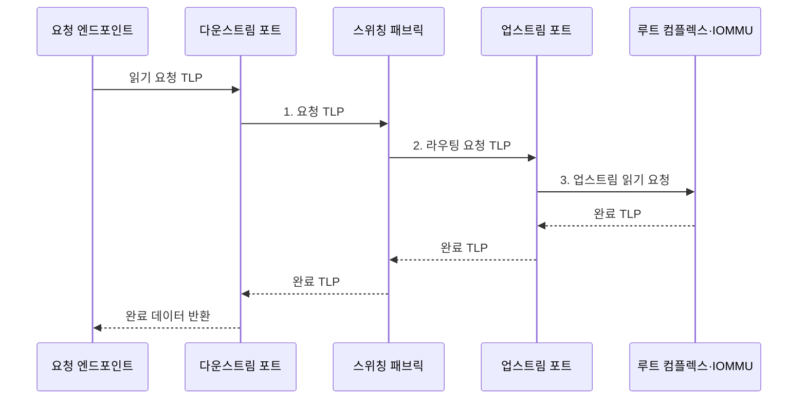

---
sidebar:
  order: 79
  label: "079. PCIe 스위칭 아키텍처 (PCIe Switching)"
  badge:
    text: "미출 · 50%"
    variant: note
title: "PCIe 스위칭 아키텍처 (PCIe Switching)"
date: "2026-08-02T11:39:00+09:00"
tags:
  - "notes-hardware"
weight: 79
extra:
  question_no: "079"
  source_status: "미출"
  source_history: ""
  priority: 50
  priority_note: "직렬 패브릭의 대역폭·격리 설계 수요가 있음"
---

## Ⅰ. 개요

핵심 용어

- **PCI 익스프레스(Peripheral Component Interconnect Express, PCIe)**: 직렬 점대점 링크로 프로세서와 주변장치를 연결하는 고속 인터커넥트이다.
- **PCIe 스위치(PCIe Switch)**: 하나의 업스트림 링크를 여러 다운스트림 포트로 분기하고 TLP를 라우팅하는 장치이다.
- **패브릭(Fabric)**: 여러 포트 사이에서 패킷의 목적지 경로와 전송 순서를 결정하는 내부 연결망이다.

- 정의/개념: 단일 업스트림 링크를 여러 포트로 분기하는 **PCIe 패브릭**
- 배경/필요성: 직접 연결은 루트 포트 수와 **P2P 경로 확장 제약**

### 쉽게 이해하기 (학습용)

- 하나의 루트 포트 아래에 PCIe 스위치를 배치하여 여러 엔드포인트로 계층적 연결을 확장하는 구조다.

## Ⅱ. 특징

핵심 용어

- **흐름 제어 크레딧(Flow-control Credit)**: 수신 버퍼가 받아들일 수 있는 패킷 양을 송신 측에 알리는 값이다.
- **트래픽 등급(Traffic Class)**: PCIe 패킷의 우선순위와 서비스 정책을 구분하는 속성이다.
- **오버서브스크립션(Oversubscription)**: 여러 하위 장치의 동시 요구 대역폭 합이 공유 업스트림 용량을 넘는 상태이다.
- **꼬리 지연(Tail Latency)**: 지연 분포의 높은 백분위에서 나타나는 가장 느린 요청들의 지연이다.

> 요약: **M/M/1 부하율**이 1에 가까워질수록 **대기 지연** 급증

- **흐름 제어 크레딧**으로 수신 버퍼 범위에서 송신량 제한
- **트래픽 등급·중재**로 우선순위별 패브릭 경로 할당
- **오버서브스크립션** 시 업스트림 대기·꼬리 지연 증가

### 쉽게 이해하기 (학습용)

- 갈래마다 흐름을 따로 조절해도 장치 요구량 합이 본선 용량을 넘으면 대기한다.

## Ⅲ. 구조 및 구성요소

핵심 용어

- **루트 컴플렉스(Root Complex)**: CPU와 메모리 시스템을 PCIe 장치 계층에 연결하는 시작점이다.
- **업스트림 포트(Upstream Port)**: PCIe 스위치에서 루트 컴플렉스 방향의 링크에 연결되는 포트이다.
- **다운스트림 포트(Downstream Port)**: PCIe 스위치에서 엔드포인트나 하위 스위치 방향 링크를 제공하는 포트이다.
- **엔드포인트(Endpoint)**: PCIe 계층 끝에서 메모리·입출력 요청을 발행하거나 처리하는 장치이다.

| 구성요소 | 책임 |
|:---|:---|
| 업스트림 포트 | **루트 링크 연결** |
| 스위칭 패브릭 | **출력 선택·중재** |
| 다운스트림 포트 | **장치별 링크 제공** |

### 쉽게 이해하기 (학습용)

- 하나의 루트 링크를 패브릭이 여러 장치 포트로 분기한다.

## Ⅳ. 흐름도

핵심 용어

- **트랜잭션 계층 패킷(Transaction Layer Packet, TLP)**: 메모리와 입출력 요청, 데이터 및 완료 정보를 전달하는 PCIe 패킷이다.
- **요청자·완료자(Requester·Completer)**: 요청 TLP를 발행하는 장치와 해당 요청을 처리하여 완료 응답을 보내는 장치이다.
- **IOMMU**: 장치의 DMA 주소를 변환하고 접근 가능한 메모리 범위를 제한하는 하드웨어이다.

**업스트림 오버서브스크립션 비율 산식**

$$
\rho = \frac{\sum_{i=1}^{N} B_{i,\mathrm{demand}}}{B_{\mathrm{up,usable}}}
$$

> 요약: **오버서브스크립션 비율**이 1을 넘으면 **중재 대기** 발생

**동작 원리**

1. **요청 TLP**: 다운스트림 포트에서 목적지 주소·태그 수신
2. **라우팅 요청 TLP**: 주소 디코딩·중재 후 업스트림 경로 선택
3. **업스트림 읽기 요청**: IOMMU 권한 확인 후 완료 패킷 생성

### 쉽게 이해하기 (학습용)

- 읽기 요청에는 돌아올 장치와 요청 번호가 붙어 있어, 메모리에서 온 완료 데이터가 스위치를 거쳐 원래 장치로 돌아간다.

## Ⅴ. 종류 및 비교

핵심 용어

- **동료 간 통신(Peer-to-peer, P2P)**: 두 PCIe 엔드포인트가 호스트 메모리를 경유하지 않고 스위치 경로로 직접 통신하는 방식이다.
- **직접 연결(Direct Attachment)**: 각 엔드포인트를 별도의 루트 포트에 일대일로 연결하는 구조이다.
- **전용 대역폭(Dedicated Bandwidth)**: 다른 장치와 업스트림 링크를 공유하지 않아 한 장치가 독점적으로 사용할 수 있는 용량이다.

| 연결 아키텍처 | PCIe 스위칭 | 직접 연결 |
|:---|:---|:---|
| 적용 기준 | **장치 확장·P2P 경로** 필요 | 적은 장치에 **전용 대역폭** 우선 |
| 핵심 특징 | **업스트림 공유·분기** | **루트 포트 1:1 연결** |
| 한계 | **공유 본선·중재 지연** | **루트 포트 소모** |

### 쉽게 이해하기 (학습용)

- 스위치는 한 입구를 여러 장치가 나누고 직접 연결은 장치마다 전용 입구를 쓴다.

## Ⅵ. 실무 고려사항 및 대책

핵심 용어

- **링크 폭(Link Width)**: x1·x4·x8처럼 링크를 구성하는 레인 수와 총 병렬 전송 용량을 나타내는 속성이다.
- **홉(Hop)**: 패킷이 목적지까지 이동하면서 통과하는 PCIe 스위치 한 단계이다.
- **접근 제어 서비스(Access Control Services, ACS)**: P2P 요청의 허용과 업스트림 리디렉션을 제어하는 PCIe 보안 기능이다.
- **다운트레이닝(Downtraining)**: 링크 협상 결과가 목표보다 낮은 속도나 레인 수로 동작하는 현상이다.

| 문제 | 대책 | 효과 |
|:---|:---|:---|
| 동시 요구량 합이 업스트림 유효 대역폭 초과 | **동시 부하·링크 폭** 산정 | **본선 병목** 완화 |
| 스위치 홉과 중재 대기가 누적돼 꼬리 지연 증가 | **홉 최소화·중재 지연 계측** | **꼬리 지연** 감소 |
| P2P DMA가 IOMMU를 거치지 않아 VM 격리 약화 | **ACS 리디렉션·IOMMU 정책** 검증 | **장치·VM 격리** 유지 |
| 협상 오류로 목표보다 낮은 링크 폭·속도로 동작 | **링크 상태·오류 수** 감시 | **다운트레이닝** 탐지 |

### 쉽게 이해하기 (학습용)

- 여러 가속기가 서로 직접 통신하게 하되 입구 링크에 트래픽이 몰리지 않게 용량을 맞춘다.

## Ⅶ. 결론

핵심 용어

- **장치 확장(Device Expansion)**: 제한된 루트 포트 아래에 더 많은 PCIe 엔드포인트를 연결하는 요구이다.
- **업스트림 용량(Upstream Capacity)**: 스위치의 모든 하위 트래픽이 루트 방향으로 공유하는 링크의 유효 대역폭이다.
- **접근 경계(Access Boundary)**: 장치와 가상 머신이 DMA로 접근할 수 있는 메모리와 P2P 대상의 범위이다.

- 장치 확장·P2P가 필요하고 **업스트림 용량**이 충분하면 스위칭 선택

### 쉽게 이해하기 (학습용)

- 장치를 많이 연결하거나 서로 직접 통신시킬 때만 스위치를 두고 공유 본선과 접근 경계를 함께 설계한다.
