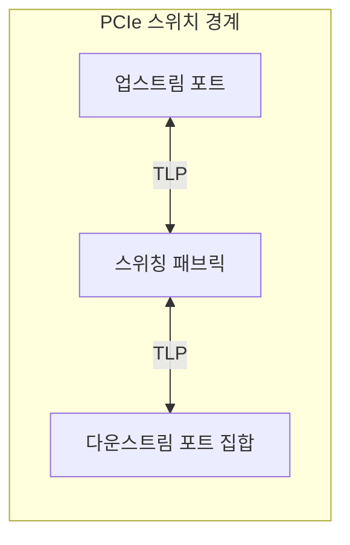
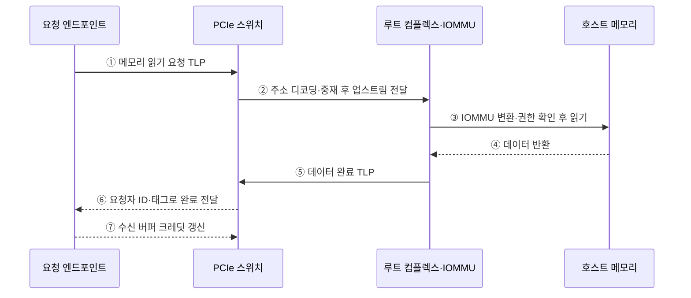

---
sidebar:
  order: 79
  label: "079. PCIe 스위칭 아키텍처 (PCIe Switching)"
  badge:
    text: "미출 · 50%"
    variant: note
title: "PCIe 스위칭 아키텍처 (PCIe Switching)"
date: "2026-07-25T00:22:25+09:00"
tags:
  - "notes-hardware"
weight: 79
extra:
  question_no: "079"
  source_status: "미출"
  source_history: ""
  priority: 50
  priority_note: "직렬 패브릭의 대역폭·격리 설계 수요가 있음"
---

## 미리 알고가기

- **PCI 익스프레스(Peripheral Component Interconnect Express, PCIe)**: 직렬 점대점 링크로 프로세서와 주변장치를 연결하는 고속 인터커넥트
- **점대점 링크(Point-to-Point Link)**: 송신 포트와 수신 포트 한 쌍이 전용 전송 경로를 사용하는 연결
- **패브릭(Fabric)**: 여러 포트 사이에서 패킷의 목적지 경로와 전송 순서를 결정하는 내부 연결망
- **루트 컴플렉스·루트 포트(Root Complex·Root Port)**: PCIe 계층의 시작점과 장치 연결 포트
- **엔드포인트(Endpoint)**: PCIe 계층 끝에서 요청을 처리하는 장치
- **업스트림·다운스트림 포트(Upstream·Downstream Port)**: 루트 방향 포트와 장치 방향 포트
- **트랜잭션 계층 패킷(Transaction Layer Packet, TLP)**: PCIe 링크에서 메모리·입출력 요청과 데이터·완료 정보를 전달하는 패킷
- **요청자·완료자(Requester·Completer)**: 요청 패킷 발행자와 완료 응답자
- **동료 간 통신(Peer-to-Peer, P2P)**: 두 PCIe 엔드포인트가 호스트 메모리를 경유하지 않고 스위치 경로로 직접 통신하는 방식
- **오버서브스크립션(Oversubscription)**: 하위 요구량 합이 업스트림 용량 초과
- **흐름 제어(Flow Control)**: 수신 버퍼 여유에 맞춰 송신량을 제한해 패킷 손실을 피하는 제어
- **링크 폭(Link Width)**: x1·x4·x8처럼 링크를 구성하는 레인 수로 병렬 전송 경로와 총대역폭을 나타내는 PCIe 속성
- **홉(Hop)**: 패킷이 목적지까지 이동하며 통과하는 스위치 한 단계
- **접근 제어 서비스(Access Control Services, ACS)**: P2P 요청의 허용 여부와 업스트림 리디렉션을 제어하는 PCIe 보안 기능
- **직접 메모리 접근(Direct Memory Access, DMA)**: 장치가 프로세서의 데이터 복사 없이 메모리에 직접 접근하는 방식
- **입출력 메모리 관리 장치(Input-Output Memory Management Unit, IOMMU)**: 장치의 DMA 주소를 변환하고 접근 가능한 메모리 범위를 제한하는 하드웨어
- **가상 머신(Virtual Machine, VM)**: 격리된 가상 하드웨어 자원을 할당받아 독립 운영체제를 실행하는 환경
- **흐름 제어 크레딧(Flow-Control Credit)**: 수신 버퍼가 받을 수 있는 패킷 양을 송신 측에 알리는 값
- **꼬리 지연(Tail Latency)**: 지연 분포에서 상위 백분위에 해당하는 느린 요청의 지연
- **트래픽 등급(Traffic Class)**: 우선순위와 서비스 정책을 구분하는 PCIe 패킷 속성
- **다운트레이닝(Downtraining)**: 링크 협상 결과가 목표보다 낮은 속도나 레인 수로 동작하는 현상

## Ⅰ. 개요

- 정의/개념: 업스트림 링크를 여러 다운스트림 포트로 분기하는 패브릭
- 기존 한계: CPU의 루트 포트 수와 직접 연결 구조만으로는 다수 PCIe 장치와 장치 간 P2P 통신 경로를 유연하게 확장하기 어렵다.

### 쉽게 이해하기 (학습용)

- 하나의 루트 포트 아래에 PCIe 스위치를 배치하여 여러 엔드포인트로 계층적 연결을 확장하는 구조다.

## Ⅱ. 특징

- 포트별 점대점 링크가 흐름 제어를 독립 수행한다.
- 하위 요구량이 상위 용량을 넘으면 대기 지연이 는다.
- TLP의 주소·요청자 식별자·태그로 목적지와 완료 응답 경로를 결정한다.

### 쉽게 이해하기 (학습용)

- 갈래마다 흐름을 따로 조절해도 장치 요구량 합이 본선 용량을 넘으면 대기한다.

## Ⅲ. 아키텍처

**도표안 A — 구조도**

**도표안 B — sequenceDiagram**

| 설계 요소 | 입력·상태 | 역할 |
|:---|:---|:---|
| 업스트림 포트 | 루트 방향 TLP·링크 크레딧 | 루트 링크와 내부 패브릭 연결 |
| 스위칭 패브릭 | 주소·요청자 식별자 | 출력 포트 선택·중재 |
| 다운스트림 포트 집합 | 장치별 TLP·흐름 상태 | 엔드포인트별 점대점 링크 제공 |

> 요약: 업스트림 TLP를 목적지 포트로 분기한다.

같은 업스트림 방향의 오버서브스크립션 비율은 다음과 같다.

$$
\rho = \frac{\sum_{i=1}^{N} B_{i,\mathrm{demand}}}{B_{\mathrm{up,usable}}}
$$

- \(B_{i,\mathrm{demand}}\): 장치 \(i\)의 지속 요구 대역폭
- \(B_{\mathrm{up,usable}}\): 인코딩·프로토콜 비용을 반영한 업스트림 유효 대역폭
- 같은 방향·단위·측정 시간의 동시 요구를 가정하며, \(\rho>1\)이면 본선 중재 대기가 발생한다.

**동작 원리**

1. **읽기 요청**: 엔드포인트가 주소·길이·요청자 ID·태그를 담은 TLP를 보낸다.
2. **업스트림 라우팅**: 스위치가 주소를 해석하고 중재해 루트로 보낸다.
3. **접근 판정**: IOMMU가 DMA 주소와 권한을 확인한 뒤 메모리를 읽는다.
4. **데이터 반환**: 호스트 메모리가 데이터를 루트 컴플렉스에 돌려준다.
5. **완료 생성**: 루트가 요청자 ID·태그를 담은 데이터 완료 TLP를 보낸다.
6. **요청 결합**: 스위치가 원래 장치로 라우팅하고 장치가 태그로 요청과 결합한다.
7. **크레딧 갱신**: 수신 버퍼가 비면 크레딧을 갱신해 추가 전송을 허용한다.

### 쉽게 이해하기 (학습용)

- 읽기 요청에는 돌아올 장치와 요청 번호가 붙어 있어, 메모리에서 온 완료 데이터가 스위치를 거쳐 원래 장치로 돌아간다.

## Ⅳ. 종류 및 비교

| 판단 기준 | PCIe 스위칭 | 직접 연결 |
|:---|:---|:---|
| 핵심 특징 | 한 업스트림에서 장치·P2P 분기 | 루트 포트와 장치 1:1 연결 |
| 적용 기준 | 장치 확장·P2P 경로 필요 | 장치 수가 적고 전용 대역폭 우선 |
| 주요 위험 | 공유 본선·중재 지연 | 루트 포트 소모·확장 한계 |

> 요약: 포트 확장 이득과 스위치 홉 비용이 상충한다.

### 쉽게 이해하기 (학습용)

- 스위치는 한 입구를 여러 장치가 나누고 직접 연결은 장치마다 전용 입구를 쓴다.

## Ⅴ. 실무 고려사항 및 대책

| 운영 위험 | 대응 | 기대 효과 |
|:---|:---|:---|
| 다운스트림 합산 요구가 업스트림 용량 초과 | 동시 부하 기준 링크 폭·오버서브스크립션 예산 산정 | 공유 본선 병목 완화 |
| 스위치 홉·중재로 꼬리 지연 증가 | 홉 수 최소화와 트래픽 등급별 중재·계측 | 지연 예측성 향상 |
| P2P DMA가 격리 경계 우회 | ACS·IOMMU 정책과 장치별 DMA 범위 검증 | 장치·VM 격리 강화 |
| 링크 오류·다운트레이닝으로 대역폭 저하 | 링크 폭·속도·오류 카운터 감시와 장애 경로 전환 | 성능 저하 조기 탐지 |

### 적용 사례

- 가속기 서버는 동시 호스트 전송과 장치 간 P2P 흐름을 기준으로 스위치 계층, 업스트림 링크 폭과 ACS·IOMMU 격리 정책을 함께 산정한다.

### 쉽게 이해하기 (학습용)

- 여러 가속기가 서로 직접 통신하게 하되 입구 링크에 트래픽이 몰리지 않게 용량을 맞춘다.

## Ⅵ. 결론

- PCIe 장치 확장성과 격리를 함께 확보하기 위해 **동시 트래픽·업스트림 유효 대역폭·스위치 홉·P2P 경로·ACS·IOMMU 경계**를 검토하고, 전용 대역폭 요구와 포트 확장 이득에 맞춰 스위칭 구조를 선택한다.

### 쉽게 이해하기 (학습용)

- 장치를 많이 연결하거나 서로 직접 통신시킬 때만 스위치를 두고 공유 본선과 접근 경계를 함께 설계한다.
