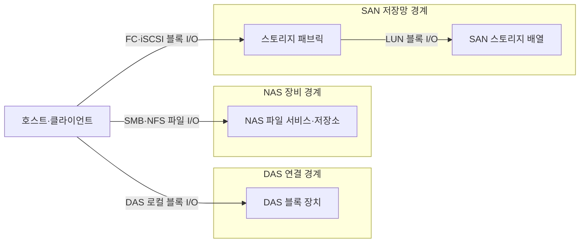
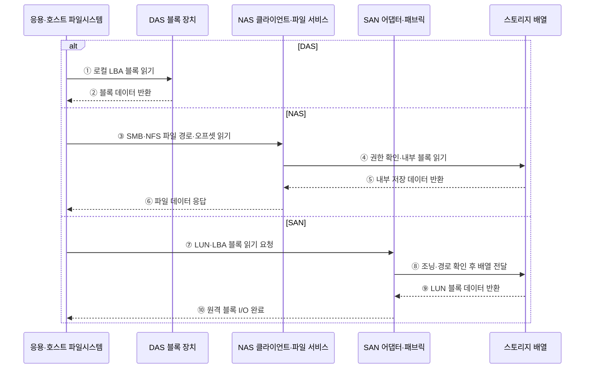

---
sidebar:
  order: 80
  label: "080. 스토리지 계층 — DAS·NAS·SAN (Storage DAS NAS SAN)"
  badge:
    text: "미출 · 50%"
    variant: note
title: "스토리지 계층 — DAS·NAS·SAN (Storage DAS NAS SAN)"
date: "2026-07-25T00:22:25+09:00"
tags:
  - "notes-hardware"
weight: 80
extra:
  question_no: "080"
  source_status: "미출"
  source_history: ""
  priority: 50
  priority_note: "직결·파일·패브릭 I/O 선택 비교"
---

## 미리 알고가기

- **스토리지 연결 구조**: 서버와 저장장치 사이의 I/O 경계
- **입출력(Input/Output, I/O)**: 서버와 저장장치 사이에서 읽기·쓰기 명령과 데이터를 전달하는 작업
- **블록·파일 저장(Block·File Storage)**: 블록 저장은 고정 크기 주소 단위를 제공하고 파일 저장은 경로와 파일 이름 단위를 제공함
- **파일시스템(File System)**: 블록 저장 공간을 파일·디렉터리 이름과 권한으로 조직하는 소프트웨어
- **직접 연결 스토리지(Direct Attached Storage, DAS)**: 하나의 서버에 직접 연결하여 블록 장치로 사용하는 저장장치
- **네트워크 연결 스토리지(Network Attached Storage, NAS)**: 네트워크를 통해 여러 클라이언트에 파일 단위 접근을 제공하는 저장장치
- **스토리지 영역 네트워크(Storage Area Network, SAN)**: 서버와 블록 저장장치를 전용 스토리지 네트워크로 연결하는 구조
- **서버 메시지 블록(Server Message Block, SMB)**: Windows 계열 환경에서 NAS 파일·프린터 공유에 사용하는 네트워크 프로토콜
- **네트워크 파일 시스템(Network File System, NFS)**: Unix·Linux 계열 환경에서 NAS 파일 공유에 사용하는 네트워크 프로토콜
- **인터넷 프로토콜(Internet Protocol, IP)**: NAS와 iSCSI 트래픽을 주소 기반으로 전달하는 네트워크 계층 프로토콜
- **파이버 채널(Fibre Channel, FC)**: 서버와 스토리지 사이의 블록 명령을 전달하는 전용 고속 네트워크
- **인터넷 소형 컴퓨터 시스템 인터페이스(Internet Small Computer Systems Interface, iSCSI)**: SCSI 블록 명령을 TCP/IP 네트워크로 전송하는 프로토콜
- **스토리지 패브릭(Storage Fabric)**: SAN의 블록 명령을 중계하는 연결망
- **스토리지 배열(Storage Array)**: 여러 물리 드라이브를 묶어 호스트에 논리 저장 공간을 제공하는 장치
- **이름공간(Namespace)**: 파일과 디렉터리의 경로 이름을 조직하고 식별하는 체계
- **논리 장치 번호(Logical Unit Number, LUN)**: SAN 스토리지가 서버에 제공하는 논리 블록 장치를 식별하는 번호
- **파일 오프셋(File Offset)**: 파일 시작점부터 떨어진 바이트 위치
- **다중 경로(Multipathing)**: 경로 장애 시 다른 I/O 경로로 전환
- **논리 블록 주소(Logical Block Address, LBA)**: 블록 장치의 데이터 위치를 번호로 나타낸 주소
- **소형 컴퓨터 시스템 인터페이스(Small Computer System Interface, SCSI)**: 저장장치의 블록 읽기·쓰기 명령 체계
- **조닝(Zoning)**: SAN 패브릭에서 통신할 수 있는 포트 집합을 제한하는 접근 통제
- **LUN 마스킹(LUN Masking)**: 스토리지 배열이 호스트별로 보이는 LUN을 제한하는 접근 통제

## Ⅰ. 개요

- 정의/개념: 연결 경계와 I/O 단위로 구분한 저장 구조
- 기존 한계: 저장장치 연결 방식을 구분하지 않으면 블록·파일 I/O 단위와 공유 범위, 성능·관리 요구에 맞는 구조를 선택하기 어렵다.

### 쉽게 이해하기 (학습용)

- 저장장치를 어떤 단위로 누구와 공유할지에 따라 세 연결 방식을 선택한다.

## Ⅱ. 특징

- 파일시스템 위치가 I/O 단위와 공유 경계를 정한다.
- 공유 범위가 커질수록 경로·장애 통제 비용이 는다.

### 쉽게 이해하기 (학습용)

- 파일 목록을 서버가 관리하면 블록 저장이고 NAS가 관리하면 네트워크 파일 저장이다.

## Ⅲ. 아키텍처

**도표안 A — 구조도**

**도표안 B — sequenceDiagram**

| 설계 요소 | 입력·상태 | 역할 |
|:---|:---|:---|
| 호스트·클라이언트 | 블록 주소 또는 파일 경로 | 저장 I/O 발행 |
| DAS 블록 장치 | 로컬 블록 명령 | 단일 호스트에 직접 저장 제공 |
| NAS 파일 서비스·저장소 | SMB·NFS 파일 요청 | 이름공간·권한·내부 블록 관리 |
| 스토리지 패브릭 | FC·iSCSI 명령 | 서버와 배열 사이 블록 요청 전달 |
| SAN 스토리지 배열 | LUN·보호 정책 | 공유 논리 블록 장치 제공 |

> 요약: DAS는 직결 블록, NAS는 파일, SAN은 패브릭 블록을 제공한다.

**동작 원리**

1. **DAS 요청**: 파일시스템이 파일 위치를 로컬 LBA로 바꿔 직접 읽는다.
2. **DAS 반환**: 직접 연결 장치가 블록 데이터를 반환한다.
3. **NAS 요청**: 호스트가 파일 경로·오프셋을 SMB·NFS로 보낸다.
4. **NAS 내부 읽기**: NAS가 이름공간·권한을 확인하고 내부 블록을 읽는다.
5. **NAS 저장 반환**: 내부 배열이 파일 서비스에 데이터를 돌려준다.
6. **NAS 파일 반환**: NAS가 블록 위치를 감춘 파일 데이터로 응답한다.
7. **SAN 요청**: 파일시스템이 파일 위치를 LUN·LBA 블록 요청으로 바꾼다.
8. **SAN 경로 선택**: 패브릭이 조닝과 경로 상태를 확인해 배열로 보낸다.
9. **SAN 배열 반환**: 배열이 LUN의 블록 데이터를 반환한다.
10. **SAN 완료**: 어댑터가 원격 LUN을 로컬 블록 장치처럼 완료 처리한다.

### 쉽게 이해하기 (학습용)

- DAS·SAN은 서버가 파일을 블록 주소로 바꾸지만, NAS는 파일 이름을 원격 장비에 보내 NAS가 내부 블록을 찾는다.

## Ⅳ. 종류 및 비교

| 판단 기준 | DAS | NAS | SAN |
|:---|:---|:---|:---|
| 핵심 특징 | 서버 직결 로컬 블록 | IP 기반 공유 파일 | 패브릭 기반 공유 블록 |
| 적용 기준 | 단일 서버 전용 블록 | 다중 사용자 공동 파일 | 다중 서버 중앙 블록 |
| 주요 위험 | 서버 종속·공유 한계 | 네트워크·파일 서비스 병목 | 패브릭 복잡도·비용 |

> 요약: 전용 블록은 DAS, 공동 파일은 NAS, 중앙 블록은 SAN이 적합하다.

### 쉽게 이해하기 (학습용)

- 한 서버의 디스크는 DAS, 함께 쓰는 폴더는 NAS, 여러 서버의 원격 디스크는 SAN에 맞다.

## Ⅴ. 실무 고려사항 및 대책

| 운영 위험 | 대응 | 기대 효과 |
|:---|:---|:---|
| NAS 이름공간·파일 서비스 병목 | 메타데이터·데이터 경로 분리 계측과 노드 확장 | 공유 파일 지연 완화 |
| SAN 패브릭·경로 단일 장애 | 이중 패브릭·다중 경로와 경로 전환 시험 | 블록 서비스 연속성 확보 |
| LUN·공유 파일 권한 오구성 | 최소 권한·조닝·마스킹과 정기 권한 검토 | 비인가 데이터 접근 방지 |
| 용량·성능 요구와 연결 방식 불일치 | I/O 크기·지연·공유 범위별 부하 시험 | 적합한 구조 선택 |

### 적용 사례

- 단일 서버의 지연 민감 데이터베이스 로그는 DAS, 부서 공동 문서는 NAS, 다중 서버 클러스터의 중앙 블록 볼륨은 이중 패브릭 SAN을 적용한다.

### 쉽게 이해하기 (학습용)

- 한 서버의 데이터베이스 로그는 서버에 직접 연결한 디스크에 저장한다.

## Ⅵ. 결론

- 저장 요구에 맞는 연결 경계를 선택하기 위해 **파일·블록 I/O 단위·공유 호스트 수·지연·처리량·경로 이중화·권한 관리**를 검토하고, 전용 블록은 DAS, 공동 파일은 NAS, 중앙 공유 블록은 SAN을 적용한다.

### 쉽게 이해하기 (학습용)

- 파일 또는 블록을 먼저 정하고 블록은 서버 범위로 DAS·SAN 중 하나를 선택한다.
