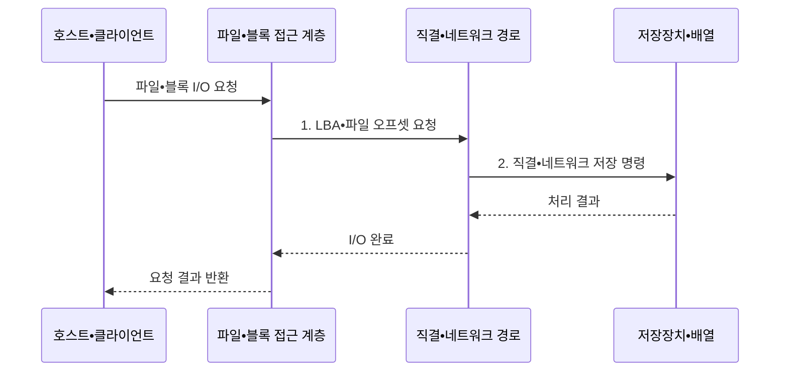

---
sidebar:
  order: 80
  label: "080. 스토리지 계층: DAS•NAS•SAN (Storage DAS NAS SAN)"
  badge:
    text: "미출 • 50%"
    variant: note
title: "스토리지 계층: DAS•NAS•SAN (Storage DAS NAS SAN)"
date: "2026-08-05T00:00:00+09:00"
tags:
  - "notes-hardware"
weight: 80
extra:
  question_no: "080"
  source_status: "미출"
  source_history: ""
  priority: 50
  priority_note: "직결•파일•패브릭 I/O 선택 비교"
---

## Ⅰ. 개요

<details><summary>핵심 용어</summary>

- **스토리지 연결 구조(Storage Connectivity)**: 서버와 저장장치 사이에서 I/O 단위와 공유 범위 및 전송 경로를 정하는 구조이다.
- **블록 저장(Block Storage)**: 고정 크기의 논리 블록 주소를 호스트에 제공하고 파일시스템은 호스트가 관리하는 저장 방식이다.
- **파일 저장(File Storage)**: 파일과 디렉터리 이름 및 권한을 스토리지 서비스가 관리하여 클라이언트에 제공하는 방식이다.
- **I/O(Input/Output)**: 컴퓨터와 저장장치 사이에서 데이터를 읽거나 쓰는 입출력 작업이다.
- **DAS(Direct Attached Storage)**: 서버에 직접 연결하여 사용하는 블록 저장 구조이다.
- **NAS(Network Attached Storage)**: 일반 네트워크를 통해 공유하는 파일 저장 구조이다.
- **SAN(Storage Area Network)**: 전용 저장망을 통해 공유하는 블록 저장 구조이다.

</details>

- 정의/개념: 서버 직결 DAS, 파일 공유 NAS, 저장망 블록 공유 SAN으로 **블록•파일 I/O** 를 제공하는 스토리지 연결 구조
- 배경/필요성: 서버 직결만으로는 **다중 사용자•서버 공유 요구 충족 불가**

#### 한줄 요약

- 저장장치를 어떤 단위로 누구와 공유할지에 따라 세 연결 방식을 선택한다.

## Ⅱ. 특징

<details><summary>핵심 용어</summary>

- **파일시스템(File System)**: 블록 저장 공간을 파일과 디렉터리 이름, 메타데이터 및 권한으로 조직하는 소프트웨어이다.
- **SMB(Server Message Block)**: 네트워크에서 파일과 디렉터리 공유 접근을 제공하는 프로토콜이다.
- **NFS(Network File System)**: 네트워크의 원격 파일시스템에 접근하는 프로토콜이다.
- **FC(Fibre Channel)**: 전용 패브릭으로 SCSI 블록 명령을 전달하는 SAN 기술이다.
- **iSCSI(Internet Small Computer Systems Interface)**: IP 네트워크로 SCSI 블록 명령을 전달하는 SAN 기술이다.
- **IP(Internet Protocol)**: 네트워크에서 패킷의 주소 지정과 전달을 담당하는 프로토콜이다.
- **논리 블록 주소(Logical Block Address, LBA)**: 블록 장치의 데이터 위치를 고정 크기 블록 번호로 나타낸 주소이다.

</details>

- **파일시스템 위치** 가 블록•파일 I/O 단위와 공유 경계 결정
- **NAS는 SMB•NFS**, **SAN은 FC•iSCSI** 로 원격 파일•블록 제공
- **DAS•SAN은 LBA**, NAS는 파일 오프셋으로 저장 위치 해석

#### 한줄 요약

- 파일 목록을 서버가 관리하면 블록 저장이고 NAS가 관리하면 네트워크 파일 저장이다.

## Ⅲ. 구조 및 구성요소

<details><summary>핵심 용어</summary>

- **호스트•클라이언트(Host•Client)**: 파일이나 블록 읽기•쓰기 요청을 발행하고 결과를 사용하는 컴퓨터이다.
- **파일•블록 접근 계층(File•Block Access Layer)**: 파일 오프셋 또는 LBA를 해석하여 저장 명령으로 변환하는 계층이다.
- **스토리지 패브릭(Storage Fabric)**: SAN에서 여러 호스트와 스토리지 배열 사이의 블록 명령을 중계하는 연결망이다.
- **스토리지 배열(Storage Array)**: 여러 물리 드라이브를 묶어 호스트에 논리 블록이나 파일 공간을 제공하는 장치이다.

</details>

```text
[호스트•클라이언트] ----- [파일•블록 접근 계층] ----- [직결•네트워크 경로] ----- [저장장치•배열]
```

선의 의미: 선은 저장 요청 해석, DAS•NAS•SAN 연결 경로와 저장 공간이 결합되는 인접 구성요소의 정적 I/O 경계를 뜻한다.

| 구성요소 | 책임 |
|:---|:---|
| 호스트•클라이언트 | **저장 I/O 발행** |
| 파일•블록 접근 계층 | **파일 오프셋•LBA 해석** |
| 직결•네트워크 경로 | **DAS•NAS•SAN 전송** |
| 저장장치•배열 | **블록•파일 저장 공간** 제공 |

#### 한줄 요약

- 사용자가 낸 저장 요청은 주소를 해석하는 창구와 직결•네트워크 통로를 지나 실제 저장장치•배열에 닿는다.

## Ⅳ. 흐름도

<details><summary>핵심 용어</summary>

- **파일 오프셋(File Offset)**: 파일 시작점부터 특정 데이터가 떨어진 바이트 위치이다.
- **SCSI(Small Computer System Interface)**: 블록 장치에 읽기•쓰기와 상태 조회를 요청하는 명령 체계이다.
- **I/O 완료(I/O Completion)**: 저장장치가 요청을 처리하고 성공•오류 상태 및 읽기 데이터를 호스트에 반환한 사건이다.

</details>



**동작 원리**

1. **LBA•파일 오프셋 요청**: DAS•SAN은 블록 주소, NAS는 파일 위치로 변환
2. **직결•네트워크 저장 명령**: 연결 방식에 맞는 SCSI•파일 명령 전달

#### 한줄 요약

- DAS•SAN은 서버가 파일을 블록 주소로 바꾸지만, NAS는 파일 이름을 원격 장비에 보내 NAS가 내부 블록을 찾는다.

## Ⅴ. 종류 및 비교

| 스토리지 연결 구조 | DAS | NAS | SAN |
|:---|:---|:---|:---|
| 적용 기준 | **단일 서버 전용 블록** | **다중 사용자 공동 파일** | **다중 서버 중앙 블록** |
| 핵심 특징 | **서버 직결 블록** | **IP 기반 공유 파일** | **패브릭 공유 블록** |
| 한계 | **서버 종속•공유 한계** | **파일 서비스 병목** | **패브릭 복잡도•비용** |

#### 한줄 요약

- 한 서버의 디스크는 DAS, 함께 쓰는 폴더는 NAS, 여러 서버의 원격 디스크는 SAN에 맞다.

## Ⅵ. 실무 고려사항 및 대책

<details><summary>핵심 용어</summary>

- **메타데이터 병목(Metadata Bottleneck)**: 파일 이름과 권한 및 디렉터리 조회가 집중되어 NAS 지연을 제한하는 현상이다.
- **다중 경로(Multipathing)**: 스토리지 경로 장애 시 다른 독립 I/O 경로로 전환하여 접근을 유지하는 기술이다.
- **조닝(Zoning)**: SAN 패브릭에서 서로 통신할 수 있는 호스트와 스토리지 포트의 집합을 제한하는 통제이다.
- **LUN(Logical Unit Number)**: 호스트에 제공하는 논리 블록 장치를 식별하는 번호이다.
- **LUN 마스킹**: 스토리지 배열이 호스트별로 볼 수 있는 LUN을 제한하는 통제이다.

</details>

| 문제 | 대책 | 효과 |
|:---|:---|:---|
| NAS 메타데이터 요청 집중으로 파일 서비스 병목 | **메타데이터 분산•노드 확장** | **파일 지연** 완화 |
| SAN 패브릭•경로 장애로 공유 LUN 접근 중단 | **이중 패브릭•다중 경로 전환 시험** | **블록 I/O 연속성** 확보 |
| 조닝•마스킹•파일 권한 불일치로 저장 공간 노출 | **조닝•LUN 마스킹•파일 권한** 교차 검토 | **비인가 접근** 방지 |
| I/O 단위•공유 범위와 연결 구조가 맞지 않아 병목 | **블록•파일 부하 시험** | **구조 선택 적합성** 검증 |

#### 한줄 요약

- 개인 서랍은 직결로, 공동 서류함은 파일 공유로, 여러 서버의 대형 창고는 이중 경로로 운영하듯 공유 범위와 장애 경로를 함께 설계한다.

## Ⅶ. 결론

<details><summary>핵심 용어</summary>

- **단일 서버 블록(Single-server Block)**: 한 서버가 독점적으로 파일시스템을 구성하고 사용하는 블록 저장 요구이다.
- **공유 파일(Shared File)**: 여러 사용자와 서버가 같은 이름공간과 파일을 동시에 접근하는 저장 요구이다.
- **다중 서버 블록(Multi-server Block)**: 여러 서버에 중앙 스토리지의 별도 또는 공유 LUN을 제공하는 저장 요구이다.

</details>

- 단일 서버 블록은 **DAS**, 공유 파일•다중 서버 블록은 **NAS•SAN** 선택

#### 한줄 요약

- 개인 서랍•공동 폴더•공유 창고 중 저장 단위와 사용자 범위에 맞는 구조를 고르듯, 파일•블록과 서버 범위로 연결 방식을 정한다.
