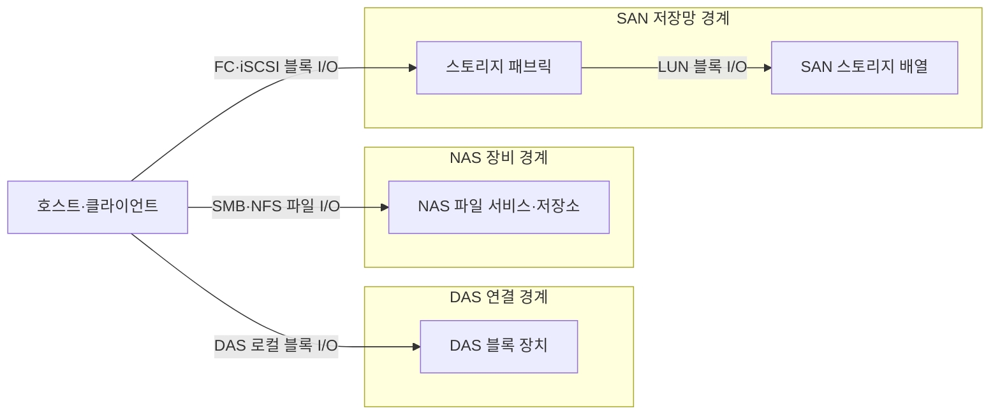
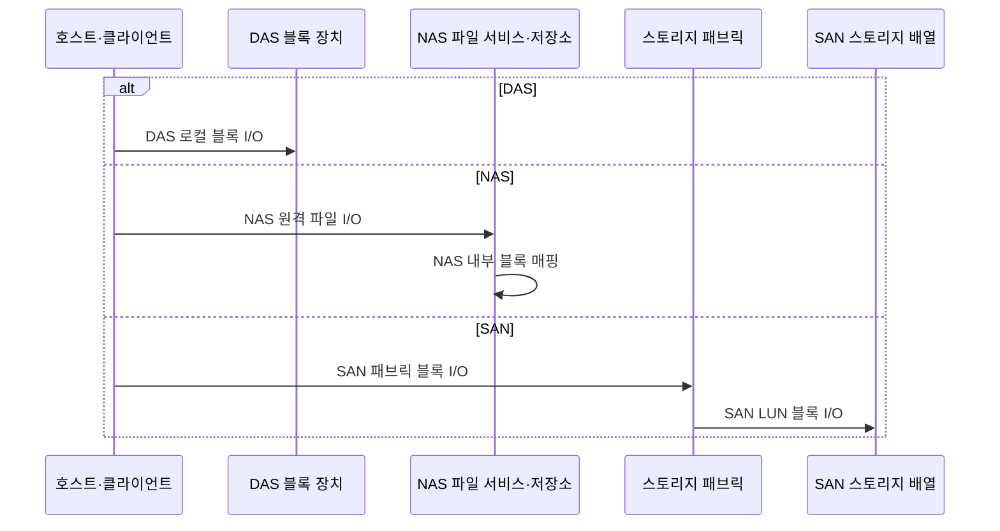

---
sidebar:
  order: 80
  label: "080. 스토리지 계층 — DAS·NAS·SAN (Storage DAS NAS SAN)"
  badge:
    text: "미출제 · 50%"
    variant: note
title: "스토리지 계층 — DAS·NAS·SAN (Storage DAS NAS SAN)"
date: "2026-07-25T00:22:25+09:00"
tags:
  - "notes-hardware"
weight: 80
extra:
  question_no: "080"
  source_status: "미출제"
  source_history: ""
  priority: 50
  priority_note: "직결·파일·패브릭 I/O 선택 비교"
---

## 미리 알고가기

- **스토리지 연결 구조**: 서버와 저장장치 사이의 I/O 경계
- **입출력(Input/Output, I/O)**: 서버와 저장장치 사이에서 읽기·쓰기 명령과 데이터를 전달하는 작업
- **블록·파일 저장(Block·File Storage)**: 블록 저장은 고정 크기 주소 단위를 제공하고 파일 저장은 경로와 파일 이름 단위를 제공함
- **파일시스템(File System)**: 블록 저장 공간을 파일·디렉터리 이름과 권한으로 조직하는 소프트웨어
- **직접 연결 스토리지(Direct Attached Storage, DAS)**: 하나의 서버에 직접 연결하여 블록 장치로 사용하는 저장장치
- **네트워크 연결 스토리지(Network Attached Storage, NAS)**: 네트워크를 통해 여러 클라이언트에 파일 단위 접근을 제공하는 저장장치
- **스토리지 영역 네트워크(Storage Area Network, SAN)**: 서버와 블록 저장장치를 전용 스토리지 네트워크로 연결하는 구조
- **서버 메시지 블록(Server Message Block, SMB)**: Windows 계열 환경에서 NAS 파일·프린터 공유에 사용하는 네트워크 프로토콜
- **네트워크 파일 시스템(Network File System, NFS)**: Unix·Linux 계열 환경에서 NAS 파일 공유에 사용하는 네트워크 프로토콜
- **인터넷 프로토콜(Internet Protocol, IP)**: NAS와 iSCSI 트래픽을 주소 기반으로 전달하는 네트워크 계층 프로토콜
- **파이버 채널(Fibre Channel, FC)**: 서버와 스토리지 사이의 블록 명령을 전달하는 전용 고속 네트워크
- **인터넷 소형 컴퓨터 시스템 인터페이스(Internet Small Computer Systems Interface, iSCSI)**: SCSI 블록 명령을 TCP/IP 네트워크로 전송하는 프로토콜
- **스토리지 패브릭(Storage Fabric)**: SAN의 블록 명령을 중계하는 연결망
- **스토리지 배열(Storage Array)**: 여러 물리 드라이브를 묶어 호스트에 논리 저장 공간을 제공하는 장치
- **이름공간(Namespace)**: 파일과 디렉터리의 경로 이름을 조직하고 식별하는 체계
- **논리 장치 번호(Logical Unit Number, LUN)**: SAN 스토리지가 서버에 제공하는 논리 블록 장치를 식별하는 번호
- **파일 오프셋(File Offset)**: 파일 시작점부터 떨어진 바이트 위치
- **다중 경로(Multipathing)**: 경로 장애 시 다른 I/O 경로로 전환

## Ⅰ. 개요

- 정의/개념: 연결 경계와 I/O 단위로 구분한 저장 구조
- **배경/필요성**: I/O 단위와 공유 범위가 달라 연결 구조 선택이 필요함

### 쉽게 이해하기 (학습용)

- 저장장치를 어떤 단위로 누구와 공유할지에 따라 세 연결 방식을 선택한다.

## Ⅱ. 특징

- 파일시스템 위치가 I/O 단위와 공유 경계를 정한다.
- 공유 범위가 커질수록 경로·장애 통제 비용이 는다.

### 쉽게 이해하기 (학습용)

- 파일 목록을 서버가 관리하면 블록 저장이고 NAS가 관리하면 네트워크 파일 저장이다.

## Ⅲ. 아키텍처 및 구성요소

| 설계 요소 | 설명 |
|:---|:---|
| 호스트·클라이언트 | DAS·SAN은 블록, NAS는 파일 요청 |
| DAS 블록 장치 | 호스트 포트에 직접 연결된 저장장치 |
| NAS 파일 서비스·저장소 | 이름공간·권한·내부 블록 저장 관리 |
| 스토리지 패브릭 | FC·iSCSI 블록 명령 전달 |
| SAN 스토리지 배열 | LUN을 논리 블록 장치로 제공 |

> 요약: DAS는 직결 블록, NAS는 파일, SAN은 패브릭 블록

### 쉽게 이해하기 (학습용)

- 서버가 디스크를 직접 다루면 DAS, 파일서버에 이름으로 요청하면 NAS, 전용망으로 원격 디스크를 다루면 SAN이다.

## Ⅳ. 원리 및 절차 흐름도

| 절차 | 설명 |
|:---|:---|
| DAS 로컬 블록 I/O | 호스트가 블록 주소·길이를 장치에 전달 |
| NAS 원격 파일 I/O | 클라이언트가 경로명·오프셋으로 요청 |
| NAS 내부 블록 매핑 | NAS가 파일 오프셋을 내부 블록에 연결 |
| SAN 패브릭 블록 I/O | 호스트가 FC·iSCSI로 명령 전송 |
| SAN LUN 블록 I/O | 배열이 LUN 주소를 물리 저장소에 매핑 |

> 요약: NAS만 파일 요청을 내부 블록 I/O로 변환

### 쉽게 이해하기 (학습용)

- DAS와 SAN은 서버가 블록을 요청하고, NAS는 파일 이름을 받은 뒤 내부에서 블록 위치를 찾는다.

## Ⅴ. 종류 및 비교

| 판단 기준 | DAS | NAS | SAN |
|:---|:---|:---|:---|
| 핵심 특징 | 서버 직결 로컬 블록 | IP 기반 공유 파일 | 패브릭 기반 공유 블록 |
| 적용 기준 | 단일 서버 전용 블록 | 다중 사용자 공동 파일 | 다중 서버 중앙 블록 |
| 주요 위험 | 서버 종속·공유 한계 | 네트워크·파일 서비스 병목 | 패브릭 복잡도·비용 |

> 요약: 전용 블록은 DAS, 공동 파일은 NAS, 중앙 블록은 SAN

### 쉽게 이해하기 (학습용)

- 한 서버의 디스크는 DAS, 함께 쓰는 폴더는 NAS, 여러 서버의 원격 디스크는 SAN에 맞다.

## Ⅵ. 실무 사례

1. 데이터베이스 로그는 직결 블록 장치에 저장

### 쉽게 이해하기 (학습용)

- 한 서버의 데이터베이스 로그는 서버에 직접 연결한 디스크에 저장한다.

## Ⅶ. 결론

- I/O 단위·공유 범위로 DAS·NAS·SAN 선택

### 쉽게 이해하기 (학습용)

- 파일 또는 블록을 먼저 정하고 블록은 서버 범위로 DAS·SAN 중 하나를 선택한다.
