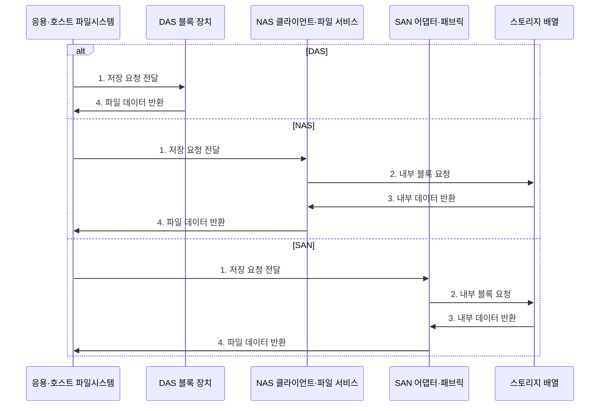

---
sidebar:
  order: 80
  label: "080. 스토리지 계층: DAS·NAS·SAN (Storage DAS NAS SAN)"
  badge:
    text: "미출 · 50%"
    variant: note
title: "스토리지 계층: DAS·NAS·SAN (Storage DAS NAS SAN)"
date: "2026-07-25T00:22:25+09:00"
tags:
  - "notes-hardware"
weight: 80
extra:
  question_no: "080"
  source_status: "미출"
  source_history: ""
  priority: 50
  priority_note: "직결·파일·패브릭 I/O 선택 비교"
---

## 미리 알고가기

- **스토리지 연결 구조**: 서버와 저장장치 사이의 I/O 경계
- **입출력(Input/Output, I/O)**: 서버와 저장장치 사이에서 읽기·쓰기 명령과 데이터를 전달하는 작업
- **블록·파일 저장(Block·File Storage)**: 블록 저장은 고정 크기 주소 단위를 제공하고 파일 저장은 경로와 파일 이름 단위를 제공함
- **파일시스템(File System)**: 블록 저장 공간을 파일·디렉터리 이름과 권한으로 조직하는 소프트웨어
- **직접 연결 스토리지(Direct Attached Storage, DAS)**: 하나의 서버에 직접 연결하여 블록 장치로 사용하는 저장장치
- **네트워크 연결 스토리지(Network Attached Storage, NAS)**: 네트워크를 통해 여러 클라이언트에 파일 단위 접근을 제공하는 저장장치
- **스토리지 영역 네트워크(Storage Area Network, SAN)**: 서버와 블록 저장장치를 전용 스토리지 네트워크로 연결하는 구조
- **서버 메시지 블록(Server Message Block, SMB)**: Windows 계열 환경에서 NAS 파일·프린터 공유에 사용하는 네트워크 프로토콜
- **네트워크 파일 시스템(Network File System, NFS)**: Unix·Linux 계열 환경에서 NAS 파일 공유에 사용하는 네트워크 프로토콜
- **인터넷 프로토콜(Internet Protocol, IP)**: NAS와 iSCSI 트래픽을 주소 기반으로 전달하는 네트워크 계층 프로토콜
- **파이버 채널(Fibre Channel, FC)**: 서버와 스토리지 사이의 블록 명령을 전달하는 전용 고속 네트워크
- **인터넷 소형 컴퓨터 시스템 인터페이스(Internet Small Computer Systems Interface, iSCSI)**: SCSI 블록 명령을 TCP/IP 네트워크로 전송하는 프로토콜
- **스토리지 패브릭(Storage Fabric)**: SAN의 블록 명령을 중계하는 연결망
- **스토리지 배열(Storage Array)**: 여러 물리 드라이브를 묶어 호스트에 논리 저장 공간을 제공하는 장치
- **이름공간(Namespace)**: 파일과 디렉터리의 경로 이름을 조직하고 식별하는 체계
- **논리 장치 번호(Logical Unit Number, LUN)**: SAN 스토리지가 서버에 제공하는 논리 블록 장치를 식별하는 번호
- **파일 오프셋(File Offset)**: 파일 시작점부터 떨어진 바이트 위치
- **다중 경로(Multipathing)**: 경로 장애 시 다른 I/O 경로로 전환
- **논리 블록 주소(Logical Block Address, LBA)**: 블록 장치의 데이터 위치를 번호로 나타낸 주소
- **소형 컴퓨터 시스템 인터페이스(Small Computer System Interface, SCSI)**: 저장장치의 블록 읽기·쓰기 명령 체계
- **조닝(Zoning)**: SAN 패브릭에서 통신할 수 있는 포트 집합을 제한하는 접근 통제
- **LUN 마스킹(LUN Masking)**: 스토리지 배열이 호스트별로 보이는 LUN을 제한하는 접근 통제

## Ⅰ. 개요

- 정의/개념: 연결 경계와 **블록·파일 I/O** 저장 구조
- 배경/필요성: 공유 범위·성능·관리 요구에 맞는 선택

### 쉽게 이해하기 (학습용)

- 저장장치를 어떤 단위로 누구와 공유할지에 따라 세 연결 방식을 선택한다.

## Ⅱ. 특징

- **파일시스템 위치**: I/O 단위와 공유 경계 결정
- **공유 범위 확대**: 경로·장애 통제 비용 증가
- **접근 제어**: 조닝·마스킹·파일 권한 적용

### 쉽게 이해하기 (학습용)

- 파일 목록을 서버가 관리하면 블록 저장이고 NAS가 관리하면 네트워크 파일 저장이다.

## Ⅲ. 구조 및 구성요소

| 구성요소 | 책임 |
|:---|:---|
| 호스트·클라이언트 | **저장 I/O 발행** |
| DAS 블록 장치 | **직결 블록 제공** |
| NAS 파일 서비스 | **이름공간·권한 관리** |
| 스토리지 패브릭 | **원격 블록 전달** |
| SAN 배열 | **공유 LUN 제공** |

### 쉽게 이해하기 (학습용)

- DAS는 직결 블록, NAS는 파일, SAN은 원격 블록을 제공한다.

## Ⅳ. 흐름도

**동작 원리**

- **1. 저장 요청 전달**: 파일·블록 위치 지정
- **2. 내부 블록 요청**: 권한·경로 확인
- **3. 내부 데이터 반환**: 배열 데이터 제공
- **4. 파일 데이터 반환**: 요청 형식으로 응답

### 쉽게 이해하기 (학습용)

- DAS·SAN은 서버가 파일을 블록 주소로 바꾸지만, NAS는 파일 이름을 원격 장비에 보내 NAS가 내부 블록을 찾는다.

## Ⅴ. 종류 및 비교

| 구분 | DAS | NAS | SAN |
|:---|:---|:---|:---|
| 적용 기준 | 단일 서버 전용 블록 | 다중 사용자 공동 파일 | 다중 서버 중앙 블록 |
| 핵심 특징 | **서버 직결 블록** | **IP 기반 공유 파일** | **패브릭 공유 블록** |
| 한계 | 서버 종속·공유 한계 | 파일 서비스 병목 | 패브릭 복잡도·비용 |

### 쉽게 이해하기 (학습용)

- 한 서버의 디스크는 DAS, 함께 쓰는 폴더는 NAS, 여러 서버의 원격 디스크는 SAN에 맞다.

## Ⅵ. 실무 고려사항 및 대책

| 고려사항 | 대책 | 효과 |
|:---|:---|:---|
| NAS 파일 병목 | 메타데이터 분리·노드 확장 | **파일 지연 완화** |
| SAN 경로 장애 | 이중 패브릭·전환 시험 | **블록 연속성 확보** |
| 권한 오구성 | 조닝·마스킹·권한 검토 | **비인가 접근 방지** |
| 구조 선택 오류 | I/O·공유 범위 부하 시험 | **요구 적합성 확보** |

### 쉽게 이해하기 (학습용)

- 한 서버의 데이터베이스 로그는 서버에 직접 연결한 디스크에 저장한다.

## Ⅶ. 결론

- I/O 단위·공유 범위로 DAS·NAS·SAN을 선택한다.

### 쉽게 이해하기 (학습용)

- 파일 또는 블록을 먼저 정하고 블록은 서버 범위로 DAS·SAN 중 하나를 선택한다.
