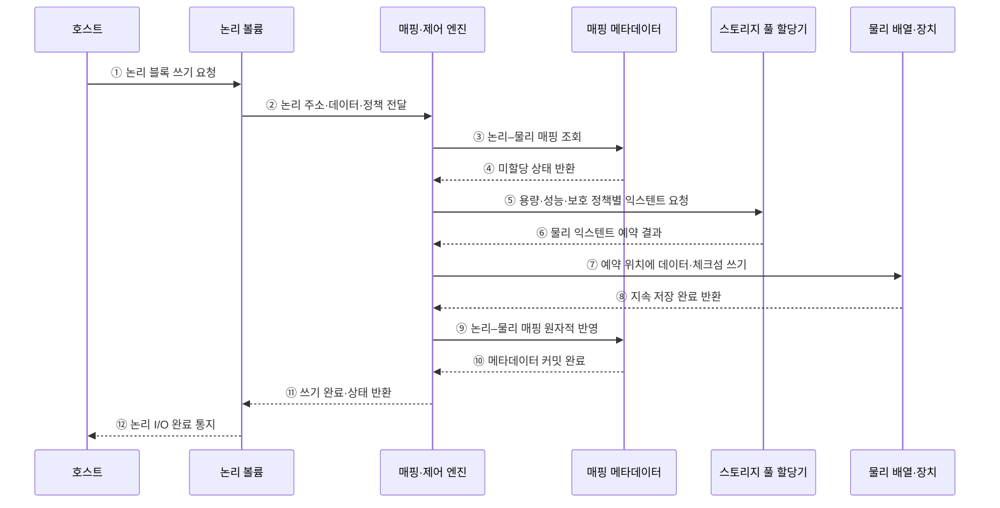

---
sidebar:
  order: 81
  label: "081. 스토리지 가상화 (Storage Virtualization)"
  badge:
    text: "미출 · 50%"
    variant: note
title: "스토리지 가상화 (Storage Virtualization)"
date: "2026-07-25T00:22:25+09:00"
tags:
  - "notes-hardware"
weight: 81
extra:
  question_no: "081"
  source_status: "미출"
  source_history: ""
  priority: 50
  priority_note: "논리·물리 매핑과 용량·장애 통제"
---

## 미리 알고가기

- **스토리지 가상화(Storage Virtualization)**: 물리 위치를 숨기고 논리 저장공간으로 제공
- **입출력(Input/Output, I/O)**: 저장장치에 데이터를 읽고 쓰는 요청
- **논리 볼륨(Logical Volume)**: 서버에 연속 블록 장치로 보이는 저장공간
- **논리 네임스페이스(Logical Namespace)**: 파일·객체 이름을 물리 위치와 분리한 공간
- **스토리지 풀(Storage Pool)**: 여러 장치의 용량·보호 수준을 묶은 자원 집합
- **주소 매핑(Address Mapping)**: 논리 주소를 물리 저장 위치에 연결하는 정보
- **매핑 메타데이터(Mapping Metadata)**: 위치·할당·이동 상태를 기록한 제어 정보
- **씬 프로비저닝(Thin Provisioning)**: 실제 쓰기 때 물리 공간을 할당하는 방식
- **온라인 마이그레이션(Online Migration)**: 서비스 중단 없이 데이터 위치를 이동
- **스토리지 배열(Storage Array)**: 여러 물리 드라이브를 묶어 논리 저장 공간과 보호 기능을 제공하는 장치
- **이기종 스토리지(Heterogeneous Storage)**: 제조사·성능·접속 방식이 서로 다른 저장장치들의 집합
- **가용성(Availability)**: 필요할 때 저장 서비스가 정상 요청을 처리할 수 있는 시간 비율
- **클러스터(Cluster)**: 여러 서버가 서비스나 데이터를 공동 처리하도록 연결된 시스템 집합
- **용량 임계치(Capacity Threshold)**: 물리 여유 공간이 부족해지기 전에 할당 제한이나 증설을 시작하는 기준값

## Ⅰ. 개요

- 정의/개념: 물리 저장장치를 풀로 묶어 논리 공간으로 제공
- 기존 한계: 이기종 저장장치가 개별적으로 분산되면 용량 활용률이 낮아지고 확장·이관·정책 관리가 복잡해진다.

### 쉽게 이해하기 (학습용)

- 여러 물리 스토리지를 하나의 논리 저장공간으로 제공하고 가상화 계층이 실제 데이터 위치를 매핑한다.

## Ⅱ. 특징

- 논리·물리 위치 분리가 무중단 이동을 가능하게 한다.
- 씬 할당은 이용률을 높이나 용량 고갈 위험을 키운다.
- 매핑 지연·장애가 성능과 가용성을 낮춘다.

### 쉽게 이해하기 (학습용)

- 통합 메타데이터로 여러 스토리지를 관리하므로 메타데이터 장애와 물리 용량 고갈을 지속적으로 감시해야 한다.

## Ⅲ. 아키텍처 및 구성요소

### 도표안 A. 논리·물리 매핑 정적 구조

| 설계 요소 | 입력·상태 | 역할 |
|:---|:---|:---|
| 논리 볼륨·네임스페이스 | 논리 주소·정책 | 호스트에 블록·파일 공간 제공 |
| 매핑·제어 엔진 | 논리 I/O·할당 상태 | 주소 해석·할당·이동 제어 |
| 매핑 메타데이터 | 물리 위치·이동 상태 | 논리·물리 대응 관계 보호 |
| 스토리지 풀 | 장치 용량·성능·보호 수준 | 물리 자원 통합 제공 |

> 요약: 매핑 계층이 논리 I/O를 물리 풀에 연결

### 쉽게 이해하기 (학습용)

- 논리 주소와 매핑 메타데이터를 조회하여 실제 스토리지의 물리 블록으로 요청을 전달하는 구조다.

### 도표안 B. 씬 프로비저닝 최초 쓰기 시퀀스

#### 동작 원리

1. **논리 쓰기 요청**: 호스트가 물리 위치를 알지 못한 채 논리 볼륨의 블록 주소에 쓰기를 요청한다.
2. **정책 전달**: 논리 볼륨 계층이 주소·데이터와 해당 볼륨의 성능·보호 정책을 매핑 엔진에 전달한다.
3. **매핑 조회**: 매핑 엔진이 논리 주소에 대응하는 기존 물리 위치가 있는지 조회한다.
4. **미할당 판정**: 씬 프로비저닝된 최초 쓰기이면 메타데이터가 아직 물리 공간이 없음을 반환한다.
5. **물리 공간 요청**: 매핑 엔진이 스토리지 풀에 필요한 크기와 계층·복제 정책을 만족하는 익스텐트를 요청한다.
6. **익스텐트 예약**: 풀 할당기가 용량 임계치와 장애 도메인을 확인해 물리 위치를 예약한다.
7. **데이터 기록**: 매핑 엔진이 예약한 배열·장치 위치에 데이터와 무결성 정보를 기록한다.
8. **지속성 확인**: 물리 장치가 캐시 플러시·보호 정책을 포함한 지속 저장 완료를 반환한다.
9. **매핑 커밋**: 데이터 기록이 끝난 뒤 논리 주소와 물리 익스텐트 관계를 저널·복제 메타데이터에 원자적으로 반영한다.
10. **메타데이터 완료**: 메타데이터 계층이 복구 가능한 상태로 커밋되었음을 반환한다.
11. **논리 완료 처리**: 매핑 엔진이 논리 볼륨에 쓰기 결과와 용량 상태를 반환한다.
12. **호스트 완료 통지**: 논리 볼륨은 내부 물리 위치를 노출하지 않고 호스트 I/O를 완료한다.

### 쉽게 이해하기 (학습용)

- 빈 논리 주소에 처음 쓸 때 실제 공간을 예약하고 데이터를 안전하게 기록한 뒤 주소표를 확정한다.

## Ⅳ. 종류 및 비교

| 판단 기준 | 호스트 기반 | 네트워크 기반 | 배열 기반 |
|:---|:---|:---|:---|
| 핵심 특징 | 호스트에서 장치 통합 | 전용망에서 배열 통합 | 배열 내부 용량 통합 |
| 적용 기준 | 소수 서버의 저비용 통합 | 다중 배열 공통 풀 | 배열 기능 중심 통합 |
| 주요 위험 | 호스트 설정·처리기 부하 | 중간 노드 병목·장애 | 배열 종속·장애 집중 |

> 요약: 범위·데이터 경로·장애 경계로 방식 선택

### 쉽게 이해하기 (학습용)

- 가상화 계층을 호스트·네트워크·스토리지 중 어디에 배치할지 통합 범위와 장애 경계에 따라 결정한다.

## Ⅴ. 실무 고려사항 및 대응 방안

| 운영 위험 | 대응 | 기대 효과 |
|:---|:---|:---|
| 씬 프로비저닝 물리 용량 고갈 | 예약 공간·다단계 임계치·자동 증설 절차 | 쓰기 중단 예방 |
| 매핑 메타데이터 손상·불일치 | 복제·체크섬·일관된 스냅숏과 복구 훈련 | 논리 볼륨 복구성 확보 |
| 온라인 이동 중 성능·정합성 저하 | 변경 블록 추적과 대역폭 제한·완료 검증 | 무중단 이관 안정성 향상 |
| 가상화 계층 장애가 다수 배열에 전파 | 이중화·장애 도메인 분리와 우회 경로 시험 | 장애 범위 축소 |

### 쉽게 이해하기 (학습용)

- 논리 주소의 매핑을 조회하고 공간이 할당되지 않았으면 물리 블록을 배정한 뒤 매핑 메타데이터를 갱신한다.

### 적용 사례

- 클러스터는 호스트에 노출한 논리 주소를 유지한 채 변경 블록을 추적하고 매핑을 전환해 배열 간 볼륨을 온라인 이동한다.

### 쉽게 이해하기 (학습용)

- 서비스 주소는 둔 채 데이터를 다른 배열로 옮긴다.

## Ⅵ. 결론

- 이기종 용량의 활용률과 이동성을 높이기 위해 **가상화 배치 위치·논리–물리 매핑 일관성·씬 용량 임계치·데이터 경로 지연·장애 도메인**을 검토하고, 메타데이터 복구와 우회 경로를 갖춘 가상화 방식을 선택한다.

### 쉽게 이해하기 (학습용)

- 자원 통합·이동성의 이점이 메타데이터 장애와 물리 용량 고갈 위험보다 클 때 적용한다.
