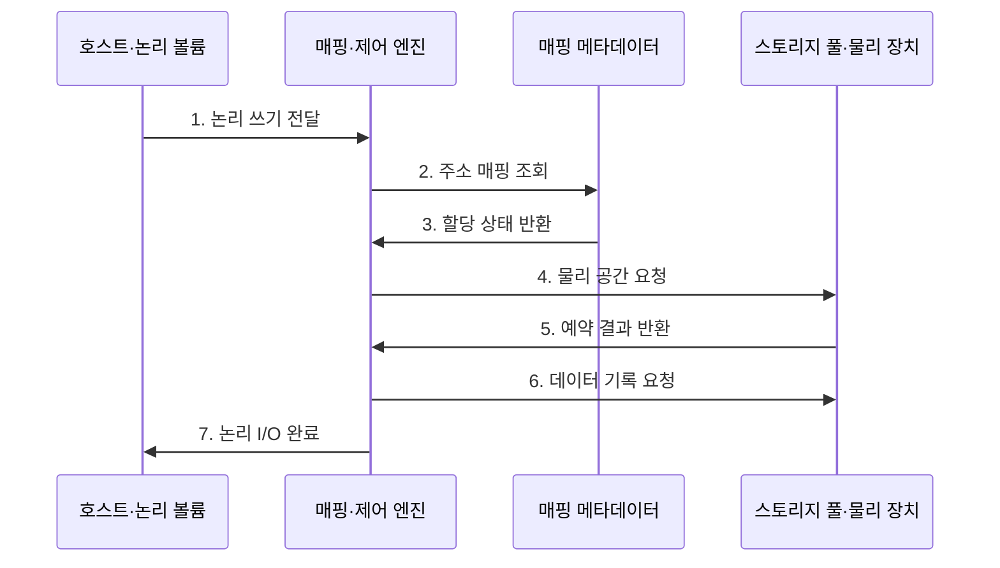

---
sidebar:
  order: 81
  label: "081. 스토리지 가상화 (Storage Virtualization)"
  badge:
    text: "미출 · 50%"
    variant: note
title: "스토리지 가상화 (Storage Virtualization)"
date: "2026-07-25T00:22:25+09:00"
tags:
  - "notes-hardware"
weight: 81
extra:
  question_no: "081"
  source_status: "미출"
  source_history: ""
  priority: 50
  priority_note: "논리·물리 매핑과 용량·장애 통제"
---

## 미리 알고가기

- **스토리지 가상화(Storage Virtualization)**: 물리 위치를 숨기고 논리 저장공간으로 제공
- **입출력(Input/Output, I/O)**: 저장장치에 데이터를 읽고 쓰는 요청
- **논리 볼륨(Logical Volume)**: 서버에 연속 블록 장치로 보이는 저장공간
- **논리 네임스페이스(Logical Namespace)**: 파일·객체 이름을 물리 위치와 분리한 공간
- **스토리지 풀(Storage Pool)**: 여러 장치의 용량·보호 수준을 묶은 자원 집합
- **주소 매핑(Address Mapping)**: 논리 주소를 물리 저장 위치에 연결하는 정보
- **매핑 메타데이터(Mapping Metadata)**: 위치·할당·이동 상태를 기록한 제어 정보
- **씬 프로비저닝(Thin Provisioning)**: 실제 쓰기 때 물리 공간을 할당하는 방식
- **온라인 마이그레이션(Online Migration)**: 서비스 중단 없이 데이터 위치를 이동
- **스토리지 배열(Storage Array)**: 여러 물리 드라이브를 묶어 논리 저장 공간과 보호 기능을 제공하는 장치
- **이기종 스토리지(Heterogeneous Storage)**: 제조사·성능·접속 방식이 서로 다른 저장장치들의 집합
- **가용성(Availability)**: 필요할 때 저장 서비스가 정상 요청을 처리할 수 있는 시간 비율
- **클러스터(Cluster)**: 여러 서버가 서비스나 데이터를 공동 처리하도록 연결된 시스템 집합
- **용량 임계치(Capacity Threshold)**: 물리 여유 공간이 부족해지기 전에 할당 제한이나 증설을 시작하는 기준값
- **익스텐트(Extent)**: 연속된 여러 블록을 하나로 묶은 공간 할당 단위
- **체크섬(Checksum)**: 데이터에서 계산해 손상 여부를 확인하는 값
- **캐시 플러시(Cache Flush)**: 캐시의 미기록 데이터를 영구 저장장치에 반영하는 동작
- **저널(Journal)**: 장애 복구를 위해 메타데이터 변경 순서를 먼저 기록하는 로그
- **원자적 반영(Atomic Commit)**: 변경 전체가 적용되거나 전혀 적용되지 않게 하는 처리
- **스냅숏(Snapshot)**: 특정 시점의 데이터·메타데이터 상태를 보존한 복구 기준

## Ⅰ. 개요

- 정의/개념: 물리 저장장치를 풀로 묶는 **논리 저장 계층**
- 배경/필요성: 용량 활용·이관·정책 관리의 통합

### 쉽게 이해하기 (학습용)

- 여러 물리 스토리지를 하나의 논리 저장공간으로 제공하고 가상화 계층이 실제 데이터 위치를 매핑한다.

## Ⅱ. 특징

- **논리·물리 분리**: 온라인 데이터 이동 지원
- **씬 할당**: 이용률 향상과 용량 고갈 위험
- **매핑 계층**: 지연·장애가 전체 가용성에 영향

### 쉽게 이해하기 (학습용)

- 통합 메타데이터로 여러 스토리지를 관리하므로 메타데이터 장애와 물리 용량 고갈을 지속적으로 감시해야 한다.

## Ⅲ. 구조 및 구성요소

| 구성요소 | 책임 |
|:---|:---|
| 논리 볼륨 | **논리 저장공간 제공** |
| 매핑·제어 엔진 | **주소 해석·이동 제어** |
| 매핑 메타데이터 | **논리·물리 관계 보호** |
| 스토리지 풀 | **물리 자원 통합** |

### 쉽게 이해하기 (학습용)

- 주소표가 논리 주소를 실제 스토리지 위치에 연결한다.

## Ⅳ. 흐름도

**동작 원리**

- **1. 논리 쓰기 전달**: 주소·정책 수신
- **2. 주소 매핑 조회**: 물리 위치 확인
- **3. 할당 상태 반환**: 신규·기존 판정
- **4. 물리 공간 요청**: 정책별 익스텐트 선택
- **5. 예약 결과 반환**: 용량·장애 도메인 확인
- **6. 데이터 기록 요청**: 데이터·체크섬 쓰기
- **7. 논리 I/O 완료**: 매핑 확정 후 응답

### 쉽게 이해하기 (학습용)

- 빈 논리 주소에 처음 쓸 때 실제 공간을 예약하고 데이터를 안전하게 기록한 뒤 주소표를 확정한다.

## Ⅴ. 종류 및 비교

| 구분 | 호스트 기반 | 네트워크 기반 | 배열 기반 |
|:---|:---|:---|:---|
| 적용 기준 | 소수 서버의 저비용 통합 | 다중 배열 공통 풀 | 배열 기능 중심 통합 |
| 핵심 특징 | **호스트 장치 통합** | **전용망 배열 통합** | **배열 내부 통합** |
| 한계 | 호스트 부하 | 중간 노드 병목 | 배열 종속 |

### 쉽게 이해하기 (학습용)

- 가상화 계층을 호스트·네트워크·스토리지 중 어디에 배치할지 통합 범위와 장애 경계에 따라 결정한다.

## Ⅵ. 실무 고려사항 및 대책

| 고려사항 | 대책 | 효과 |
|:---|:---|:---|
| 물리 용량 고갈 | 임계치·자동 증설 적용 | **쓰기 중단 예방** |
| 매핑 메타데이터 손상 | 복제·체크섬·복구 훈련 | **볼륨 복구성 확보** |
| 온라인 이동 정합성 | 변경 블록 추적·검증 | **이관 안정성 향상** |
| 가상화 장애 전파 | 이중화·장애 영역 분리 | **장애 범위 축소** |

### 쉽게 이해하기 (학습용)

- 서비스 주소는 둔 채 데이터를 다른 배열로 옮긴다.

## Ⅶ. 결론

- 배치 위치·매핑·장애 영역으로 스토리지 가상화를 정한다.

### 쉽게 이해하기 (학습용)

- 자원 통합·이동성의 이점이 메타데이터 장애와 물리 용량 고갈 위험보다 클 때 적용한다.
