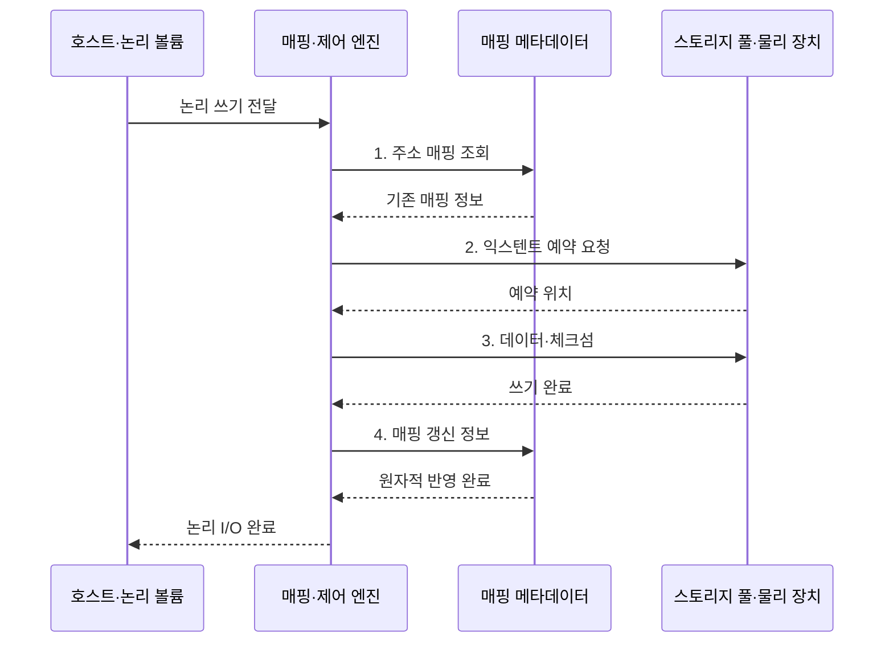

---
sidebar:
  order: 81
  label: "081. 스토리지 가상화 (Storage Virtualization)"
  badge:
    text: "미출 · 50%"
    variant: note
title: "스토리지 가상화 (Storage Virtualization)"
date: "2026-07-31T10:14:07+09:00"
tags:
  - "notes-hardware"
weight: 81
extra:
  question_no: "081"
  source_status: "미출"
  source_history: ""
  priority: 50
  priority_note: "논리·물리 매핑과 용량·장애 통제"
---

## 미리 알고가기

- **스토리지 가상화(Storage Virtualization)**: 물리 위치를 숨기고 논리 저장공간으로 제공
- **입출력(Input/Output, I/O)**: 저장장치에 데이터를 읽고 쓰는 요청
- **논리 볼륨(Logical Volume)**: 서버에 연속 블록 장치로 보이는 저장공간
- **스토리지 풀(Storage Pool)**: 여러 장치의 용량·보호 수준을 묶은 자원 집합
- **주소 매핑(Address Mapping)**: 논리 주소를 물리 저장 위치에 연결하는 정보
- **매핑 메타데이터(Mapping Metadata)**: 위치·할당·이동 상태를 기록한 제어 정보
- **씬 프로비저닝(Thin Provisioning)**: 실제 쓰기 때 물리 공간을 할당하는 방식
- **온라인 마이그레이션(Online Migration)**: 서비스 중단 없이 데이터 위치를 이동
- **스토리지 배열(Storage Array)**: 여러 물리 드라이브를 묶어 논리 저장 공간과 보호 기능을 제공하는 장치
- **이기종 스토리지(Heterogeneous Storage)**: 제조사·성능·접속 방식이 서로 다른 저장장치들의 집합
- **가용성(Availability)**: 필요할 때 저장 서비스가 정상 요청을 처리할 수 있는 시간 비율
- **용량 임계치(Capacity Threshold)**: 물리 여유 공간이 부족해지기 전에 할당 제한이나 증설을 시작하는 기준값
- **익스텐트(Extent)**: 연속된 여러 블록을 하나로 묶은 공간 할당 단위
- **체크섬(Checksum)**: 데이터에서 계산해 손상 여부를 확인하는 값
- **저널(Journal)**: 장애 복구를 위해 메타데이터 변경 순서를 먼저 기록하는 로그
- **원자적 반영(Atomic Commit)**: 변경 전체가 적용되거나 전혀 적용되지 않게 하는 처리
- **스냅숏(Snapshot)**: 특정 시점의 데이터·메타데이터 상태를 보존한 복구 기준

> **키워드:** 스토리지 가상화 (Storage Virtualization)

## Ⅰ. 개요

- 정의/개념: 물리 저장장치를 풀로 묶는 **논리 저장 계층**
- 배경/필요성: 개별 장치 관리로는 이기종 자원의 **통합 운용 제약**

### 쉽게 이해하기 (학습용)

- 여러 물리 스토리지를 하나의 논리 저장공간으로 제공하고 가상화 계층이 실제 데이터 위치를 매핑한다.

## Ⅱ. 특징

- **논리·물리 분리**: 온라인 데이터 이동 지원
- **씬 프로비저닝**: 이용률 향상과 용량 고갈 위험
- **매핑 계층** 지연·장애가 전체 I/O 지연·가용성 저하로 전파

### 쉽게 이해하기 (학습용)

- 하나의 안내판이 여러 창고 주소를 가리키듯 매핑 계층이 물리 위치를 숨기지만, 안내판 장애와 빈 창고는 전체 서비스를 멈춘다.

## Ⅲ. 구조 및 구성요소

| 구성요소 | 책임 |
|:---|:---|
| 논리 볼륨 | **논리 저장공간 제공** |
| 매핑·제어 엔진 | **주소 해석·이동 제어** |
| 매핑 메타데이터 | **논리·물리 관계 보호** |
| 스토리지 풀 | **물리 자원 통합** |

### 쉽게 이해하기 (학습용)

- 도서관의 청구기호표처럼 매핑 메타데이터가 논리 볼륨의 주소를 스토리지 풀의 실제 위치와 연결한다.

## Ⅳ. 흐름도

**동작 원리**

1. **주소 매핑 조회**: 기존 위치 여부로 신규·덮어쓰기 판정
2. **익스텐트 예약 요청**: 용량·장애 영역 정책에 맞는 공간 예약
3. **데이터·체크섬**: 예약 위치의 데이터 무결성 보호
4. **매핑 갱신 정보**: 물리 쓰기 후 논리·물리 관계 원자적 확정

### 쉽게 이해하기 (학습용)

- 사서가 빈 서가를 예약하고 책과 점검표를 둔 뒤 청구기호표를 바꾸듯, 제어 엔진이 데이터 기록 후 매핑을 확정한다.

## Ⅴ. 종류 및 비교

| 가상화 계층 위치 | 호스트 기반 | 네트워크 기반 | 배열 기반 |
|:---|:---|:---|:---|
| 적용 기준 | 소수 서버의 **저비용 통합** | 다중 배열의 **공통 풀** | 단일 배열의 **내장 기능** 활용 |
| 핵심 특징 | **호스트 장치 통합** | **전용망 배열 통합** | **배열 내부 통합** |
| 한계 | **호스트 부하** 증가 | **중간 노드 병목** | **배열 종속** |

### 쉽게 이해하기 (학습용)

- 작은 사무실은 서버마다 안내판을 두고 여러 창고는 중앙 안내소를 두듯, 통합 범위에 따라 가상화 계층 위치가 달라진다.

## Ⅵ. 실무 고려사항 및 대책

| 고려사항 | 대책 | 효과 |
|:---|:---|:---|
| 물리 여유 공간이 임계치 아래로 내려 **쓰기 중단** 위험 | **용량 임계치·자동 증설** 적용 | **할당 실패** 예방 |
| 매핑 메타데이터 손상으로 **논리 볼륨** 접근 불가 | **저널·스냅숏** 기반 복구 | **주소 매핑 복구** |
| 이동 중 변경 블록 누락으로 **복제본 불일치** | **변경 블록 추적·체크섬 검증** | **온라인 마이그레이션 정합성** 유지 |
| 제어 엔진 장애가 모든 볼륨으로 **장애 전파** | **제어 엔진 이중화·장애 영역 분리** | **가용성 유지·장애 범위 축소** |

### 쉽게 이해하기 (학습용)

- 이삿짐을 옮기는 동안 새로 들어온 상자를 따로 표시하듯 변경 블록을 추적해 서비스 주소를 유지한 채 데이터를 이동한다.

## Ⅶ. 결론

- 소수 서버는 **호스트**, 단일 배열은 배열, 다중 배열은 **네트워크 기반** 선택

### 쉽게 이해하기 (학습용)

- 방 하나는 각 서버가 직접 관리하고 여러 창고는 중앙 안내소를 두듯, 서버·배열 범위에 따라 호스트 기반과 네트워크 기반을 고른다.
