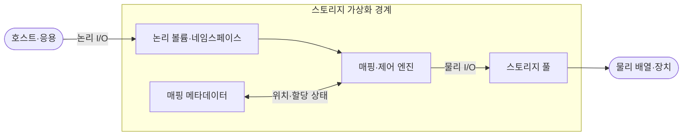
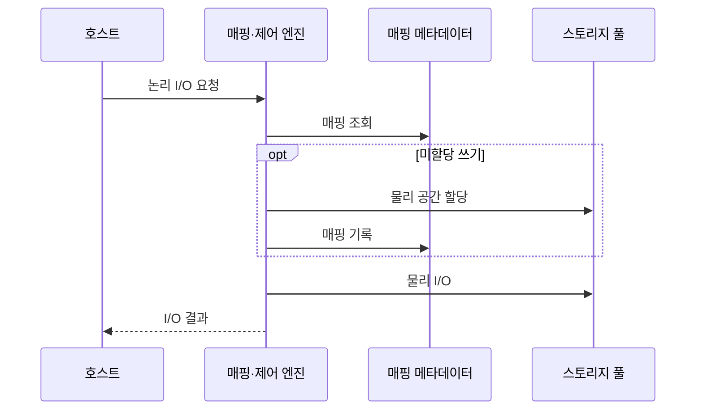

---
sidebar:
  order: 81
  label: "081. 스토리지 가상화 (Storage Virtualization)"
  badge:
    text: "미출제 · 50%"
    variant: note
title: "스토리지 가상화 (Storage Virtualization)"
date: "2026-07-25T00:22:25+09:00"
tags:
  - "notes-hardware"
weight: 81
extra:
  question_no: "081"
  source_status: "미출제"
  source_history: ""
  priority: 50
  priority_note: "논리·물리 매핑과 용량·장애 통제"
---

## 미리 알고가기

- **스토리지 가상화(Storage Virtualization)**: 물리 위치를 숨기고 논리 저장공간으로 제공
- **입출력(Input/Output, I/O)**: 저장장치에 데이터를 읽고 쓰는 요청
- **논리 볼륨(Logical Volume)**: 서버에 연속 블록 장치로 보이는 저장공간
- **논리 네임스페이스(Logical Namespace)**: 파일·객체 이름을 물리 위치와 분리한 공간
- **스토리지 풀(Storage Pool)**: 여러 장치의 용량·보호 수준을 묶은 자원 집합
- **주소 매핑(Address Mapping)**: 논리 주소를 물리 저장 위치에 연결하는 정보
- **매핑 메타데이터(Mapping Metadata)**: 위치·할당·이동 상태를 기록한 제어 정보
- **씬 프로비저닝(Thin Provisioning)**: 실제 쓰기 때 물리 공간을 할당하는 방식
- **온라인 마이그레이션(Online Migration)**: 서비스 중단 없이 데이터 위치를 이동
- **스토리지 배열(Storage Array)**: 여러 물리 드라이브를 묶어 논리 저장 공간과 보호 기능을 제공하는 장치
- **이기종 스토리지(Heterogeneous Storage)**: 제조사·성능·접속 방식이 서로 다른 저장장치들의 집합
- **가용성(Availability)**: 필요할 때 저장 서비스가 정상 요청을 처리할 수 있는 시간 비율
- **클러스터(Cluster)**: 여러 서버가 서비스나 데이터를 공동 처리하도록 연결된 시스템 집합
- **용량 임계치(Capacity Threshold)**: 물리 여유 공간이 부족해지기 전에 할당 제한이나 증설을 시작하는 기준값

## Ⅰ. 개요

- **정의/개념**: 물리 저장장치를 풀로 묶어 논리 공간으로 제공
- **배경/필요성**: 이기종 장치 분산으로 통합 논리 공간 필요

### 쉽게 이해하기 (학습용)

- 여러 창고를 하나의 재고 목록으로 보이고 실제 위치는 관리 시스템이 정한다.

## Ⅱ. 특징

- 논리·물리 위치 분리가 무중단 이동을 가능하게 한다.
- 씬 할당은 이용률을 높이나 용량 고갈 위험을 키운다.
- 매핑 지연·장애가 성능과 가용성을 낮춘다.

### 쉽게 이해하기 (학습용)

- 장부로 여러 창고를 함께 쓰지만 장부 장애와 빈 공간 부족을 계속 감시해야 한다.

## Ⅲ. 아키텍처 및 구성요소

| 설계 요소 | 설명 |
|:---|:---|
| 논리 볼륨·네임스페이스 | 호스트에 블록·파일 논리 공간 제공 |
| 매핑·제어 엔진 | 논리 주소 해석·할당·이동 제어 |
| 매핑 메타데이터 | 물리 위치·할당·이동 상태 보호 |
| 스토리지 풀 | 물리 용량·성능·보호 수준 통합 |

> 요약: 매핑 계층이 논리 I/O를 물리 풀에 연결

### 쉽게 이해하기 (학습용)

- 주문 번호와 위치 장부를 보고 실제 창고의 물건을 찾아 주는 구조다.

## Ⅳ. 원리 및 절차 흐름도

| 절차 | 설명 |
|:---|:---|
| 논리 I/O 요청 | 논리 블록·파일 경로로 읽기·쓰기 요청 |
| 매핑 조회 | 논리 주소의 물리 대상 확인 |
| 물리 공간 할당 | 미할당 쓰기에 저장 블록 배정 |
| 매핑 기록 | 논리 주소와 할당 블록 연결 |
| 물리 I/O | 대상 배열·장치에서 데이터 처리 |
| I/O 결과 | 처리 상태·데이터를 호스트에 반환 |

> 요약: 미할당 쓰기는 공간 할당·매핑 후 I/O

### 쉽게 이해하기 (학습용)

- 주문 번호로 창고를 찾고 자리가 없으면 공간을 배정한 뒤 장부에 위치를 기록한다.

## Ⅴ. 종류 및 비교

| 판단 기준 | 호스트 기반 | 네트워크 기반 | 배열 기반 |
|:---|:---|:---|:---|
| 핵심 특징 | 호스트에서 장치 통합 | 전용망에서 배열 통합 | 배열 내부 용량 통합 |
| 적용 기준 | 소수 서버의 저비용 통합 | 다중 배열 공통 풀 | 배열 기능 중심 통합 |
| 주요 위험 | 호스트 설정·처리기 부하 | 중간 노드 병목·장애 | 배열 종속·장애 집중 |

> 요약: 범위·데이터 경로·장애 경계로 방식 선택

### 쉽게 이해하기 (학습용)

- 재고 장부를 서버와 물류망과 창고 중 어디에 둘지 통합 범위로 정한다.

## Ⅵ. 실무 사례

1. 클러스터: 논리 주소를 유지한 채 배열 간 볼륨 이동
2. 씬 풀: 여유 용량 임계치에서 신규 할당 제한

### 쉽게 이해하기 (학습용)

- 서비스 주소는 둔 채 데이터를 다른 배열로 옮긴다.
- 실제 빈 공간이 부족해지기 전에 새 공간 약속을 제한한다.

## Ⅶ. 결론

- 이기종 통합·무중단 이동 시 가상화 선택

### 쉽게 이해하기 (학습용)

- 여러 창고를 묶는 이득이 장부 장애와 공간 부족 위험보다 클 때 사용한다.
