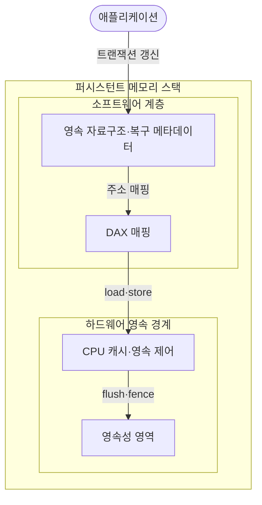
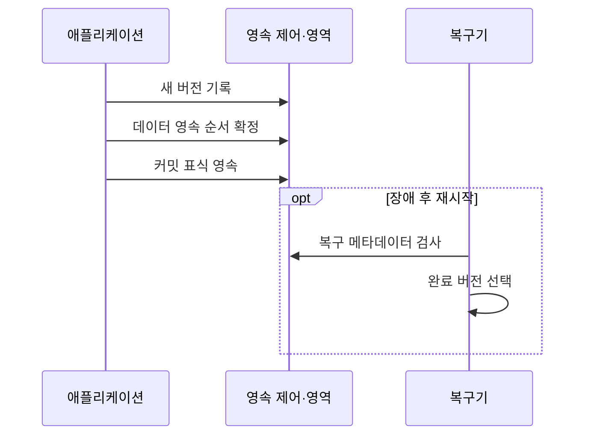

---
sidebar:
  order: 82
  label: "082. 퍼시스턴트 메모리 (Persistent Memory)"
  badge:
    text: "미출제 · 50%"
    variant: note
title: "퍼시스턴트 메모리 (Persistent Memory)"
date: "2026-07-25T00:22:25+09:00"
tags:
  - "notes-hardware"
weight: 82
extra:
  question_no: "082"
  source_status: "미출제"
  source_history: ""
  priority: 50
  priority_note: "바이트 접근·영속 순서·장애 복구"
---

## 미리 알고가기

- **퍼시스턴트 메모리(Persistent Memory)**: 전원 차단 뒤에도 보존되는 바이트 주소 지정 메모리
- **중앙처리장치(Central Processing Unit, CPU)**: 메모리 주소로 명령을 실행하는 처리기
- **동적 임의접근 메모리(Dynamic Random-Access Memory, DRAM)**: 전원 차단 시 사라지는 작업 메모리
- **솔리드 스테이트 드라이브(Solid-State Drive, SSD)**: 플래시 기반 비휘발 블록 저장장치
- **바이트 주소 지정(Byte Addressability)**: CPU가 주소 단위로 직접 읽고 쓰는 성질
- **로드·스토어(Load·Store)**: 처리기가 메모리 값을 읽고 쓰는 명령
- **직접 접근(Direct Access, DAX)**: 페이지 캐시 없이 영속 영역을 주소 공간에 매핑
- **페이지 캐시(Page Cache)**: 파일·블록 데이터를 메모리에 보관해 반복 I/O를 줄이는 운영체제 캐시
- **영속성 영역(Persistence Domain)**: 쓰기 도달 시 정전 뒤 보존되는 하드웨어 경계
- **캐시 라인 플러시(Cache-Line Flush)**: 변경 캐시 라인을 영속 경계로 내보내는 명령
- **메모리 펜스(Memory Fence)**: 선행 쓰기의 완료 순서를 확정하는 명령
- **장애 정합성(Crash Consistency)**: 장애 뒤 완료 상태만 안전하게 복원하는 성질
- **원자성(Atomicity)**: 여러 쓰기가 모두 반영되거나 모두 반영되지 않은 것처럼 보이는 성질
- **쓰기 로그(Write Log)**: 장애 복구를 위해 변경 전후 데이터나 갱신 내용을 순서대로 기록한 영역
- **트랜잭션(Transaction)**: 데이터 갱신을 하나의 성공·실패 단위로 묶는 작업
- **커밋 표식(Commit Record)**: 새 버전의 완료 여부를 나타내는 영속 메타데이터
- **인메모리 데이터베이스(In-memory Database)**: 주 데이터를 메모리에 두어 낮은 접근 지연을 얻는 데이터베이스

## Ⅰ. 개요

- **정의/개념**: 바이트 직접 접근과 전원 후 보존을 결합한 메모리
- **배경/필요성**: 휘발 메모리 재시작 손실로 영속 접근 필요

### 쉽게 이해하기 (학습용)

- 메모리처럼 바로 고치면서 전원이 꺼져도 장부 내용이 남는 저장공간이다.

## Ⅱ. 특징

- DAX는 페이지 캐시를 우회해 I/O 지연을 줄인다.
- 플러시·펜스가 영속 도달과 쓰기 순서를 보장한다.
- 원자성을 보장하지 않아 로그·복구 비용이 든다.

### 쉽게 이해하기 (학습용)

- 바로 쓰더라도 잉크를 말리고 완료 도장을 찍는 순서를 지켜야 정전 뒤 복구된다.

## Ⅲ. 아키텍처 및 구성요소

| 설계 요소 | 설명 |
|:---|:---|
| 영속 자료구조·복구 메타데이터 | 데이터 버전·로그·커밋 상태 관리 |
| DAX 매핑 | 영속 영역을 프로세스 주소 공간에 연결 |
| CPU 캐시·영속 제어 | 캐시 반영·쓰기 완료 순서 제어 |
| 영속성 영역 | 도달한 데이터의 전원 차단 후 보존 |

> 요약: DAX로 접근하고 캐시·메타데이터로 완료 통제

### 쉽게 이해하기 (학습용)

- 장부 주소와 잉크 건조 순서와 완료 도장을 함께 관리하는 구조다.

## Ⅳ. 원리 및 절차 흐름도

| 절차 | 설명 |
|:---|:---|
| 새 버전 기록 | 이전 상태를 보존하며 새 데이터 작성 |
| 데이터 영속 순서 확정 | 데이터 플러시 뒤 펜스로 완료 대기 |
| 커밋 표식 영속 | 새 버전 포인터·완료 표식 반영 |
| 복구 메타데이터 검사 | 로그·버전·커밋 표식 유효성 확인 |
| 완료 버전 선택 | 완료된 새 상태나 이전 상태 복원 |

> 요약: 데이터 뒤 커밋을 영속화해 완료 버전 복구

### 쉽게 이해하기 (학습용)

- 장부 내용을 먼저 말리고 도장을 남겨 정전 뒤 완성된 쪽만 선택한다.

## Ⅴ. 종류 및 비교

| 판단 기준 | 퍼시스턴트 메모리 | DRAM | SSD |
|:---|:---|:---|:---|
| 핵심 특징 | 바이트 접근·비휘발 | 바이트 접근·휘발 | 블록 접근·비휘발 |
| 적용 기준 | 직접 갱신·빠른 재시작 | 실행 중 작업 데이터 | 대용량·단순 영속 저장 |
| 주요 위험 | 플러시 순서·장애 복구 | 전원 차단 시 데이터 소실 | 파일·블록 계층 동기화 |

> 요약: 직접 영속 갱신은 퍼시스턴트 메모리 선택

### 쉽게 이해하기 (학습용)

- 이어 쓸 장부는 퍼시스턴트, 임시 메모는 DRAM, 보관 문서는 SSD에 둔다.

## Ⅵ. 실무 사례

1. 인메모리 데이터베이스: DAX 갱신·커밋 표식으로 재시작 복구

### 쉽게 이해하기 (학습용)

- 데이터베이스는 기록과 도장을 남겨 재시작 뒤 완료된 버전을 선택한다.

## Ⅶ. 결론

- DAX 직접 갱신·재시작 단축 시 선택

### 쉽게 이해하기 (학습용)

- 장부를 바로 이어 쓰는 이득이 순서와 복구 관리 비용보다 클 때 사용한다.
