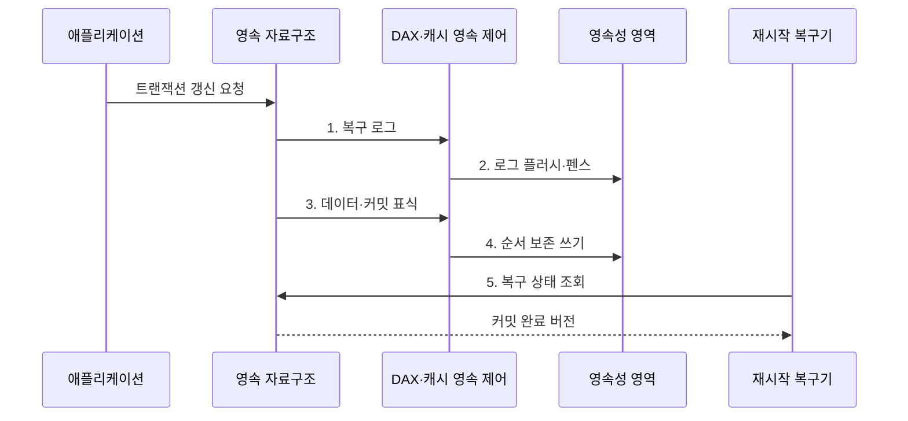

---
sidebar:
  order: 82
  label: "082. 퍼시스턴트 메모리 (Persistent Memory)"
  badge:
    text: "미출 · 50%"
    variant: note
title: "퍼시스턴트 메모리 (Persistent Memory)"
date: "2026-07-30T21:37:24+09:00"
tags:
  - "notes-hardware"
weight: 82
extra:
  question_no: "082"
  source_status: "미출"
  source_history: ""
  priority: 50
  priority_note: "바이트 접근·영속 순서·장애 복구"
---

## 미리 알고가기

- **퍼시스턴트 메모리(Persistent Memory)**: 전원 차단 뒤에도 보존되는 바이트 주소 지정 메모리
- **중앙처리장치(Central Processing Unit, CPU)**: 메모리 주소로 명령을 실행하는 처리기
- **동적 임의접근 메모리(Dynamic Random-Access Memory, DRAM)**: 전원 차단 시 사라지는 작업 메모리
- **솔리드 스테이트 드라이브(Solid-State Drive, SSD)**: 플래시 기반 비휘발 블록 저장장치
- **바이트 주소 지정(Byte Addressability)**: CPU가 주소 단위로 직접 읽고 쓰는 성질
- **로드·스토어(Load·Store)**: 처리기가 메모리 값을 읽고 쓰는 명령
- **직접 접근(Direct Access, DAX)**: 페이지 캐시 없이 영속 영역을 주소 공간에 매핑
- **페이지 캐시(Page Cache)**: 파일·블록 데이터를 메모리에 보관해 반복 I/O를 줄이는 운영체제 캐시
- **영속성 영역(Persistence Domain)**: 쓰기 도달 시 정전 뒤 보존되는 하드웨어 경계
- **캐시 라인 플러시(Cache-Line Flush)**: 변경 캐시 라인을 영속 경계로 내보내는 명령
- **메모리 펜스(Memory Fence)**: 선행 쓰기의 완료 순서를 확정하는 명령
- **장애 정합성(Crash Consistency)**: 장애 뒤 완료 상태만 안전하게 복원하는 성질
- **원자성(Atomicity)**: 여러 쓰기가 모두 반영되거나 모두 반영되지 않은 것처럼 보이는 성질
- **쓰기 로그(Write Log)**: 장애 복구를 위해 변경 전후 데이터나 갱신 내용을 순서대로 기록한 영역
- **트랜잭션(Transaction)**: 데이터 갱신을 하나의 성공·실패 단위로 묶는 작업
- **커밋 표식(Commit Record)**: 새 버전의 완료 여부를 나타내는 영속 메타데이터
- **캐시 라인(Cache Line)**: CPU 캐시와 메모리 사이에서 한 번에 이동하는 고정 크기 데이터 블록
- **상대 포인터(Relative Pointer)**: 고정 가상 주소 대신 기준점으로부터의 거리로 객체 위치를 나타내는 참조
- **정전 주입 시험(Power-Failure Injection Test)**: 실행 중 전원을 강제로 차단해 복구 정확성을 확인하는 시험
- **복구 불변식(Recovery Invariant)**: 장애 시점과 무관하게 복구 후 반드시 성립해야 하는 데이터 조건
- **체크섬(Checksum)**: 데이터에서 계산해 매체 오류로 값이 바뀌었는지 확인하는 값
- **복제(Replication)**: 같은 데이터를 둘 이상의 영속 영역에 보관하는 기법
- **매체 마모(Media Wear)**: 반복 쓰기로 저장 셀의 수명이 줄어드는 현상

## Ⅰ. 개요

- 정의/개념: 바이트 단위로 접근하며 전원 차단 뒤에도 값을 보존하는 **메모리**
- 배경/필요성: DRAM 휘발성과 SSD 블록 I/O로 **재시작 지연**

### 쉽게 이해하기 (학습용)

- 작업대 위 메모지에 직접 쓰되 정전 뒤에도 글씨가 남듯, 바이트 주소로 갱신한 상태를 전원 차단 뒤에도 보존한다.

## Ⅱ. 특징

- **DAX·로드 스토어**: 페이지 캐시 우회로 바이트 직접 접근
- **플러시·펜스**: 영속 도달과 쓰기 순서 보장
- **장애 정합성**: 로그로 완료된 트랜잭션만 복구

### 쉽게 이해하기 (학습용)

- 바로 쓰더라도 잉크를 말리고 완료 도장을 찍는 순서를 지켜야 정전 뒤 복구된다.

## Ⅲ. 구조 및 구성요소

| 구성요소 | 책임 |
|:---|:---|
| 영속 자료구조 | **로그·커밋 관리** |
| DAX 매핑 | **주소 공간 연결** |
| 캐시·영속 제어 | **플러시·순서 보장** |
| 영속성 영역 | **전원 후 데이터 보존** |

### 쉽게 이해하기 (학습용)

- 서류함 앞의 주소표가 영속 자료구조를 메모리에 연결하고, 기록 담당자가 로그·데이터·완료 표식을 영속 영역에 남긴다.

## Ⅳ. 흐름도

**동작 원리**

1. **복구 로그**: 장애 전 상태로 되돌릴 갱신 내용 기록
2. **로그 플러시·펜스**: 본 데이터보다 로그를 먼저 영속 경계에 도달
3. **데이터·커밋 표식**: 본 데이터 갱신 뒤 완료 상태 기록
4. **순서 보존 쓰기**: 데이터가 커밋보다 먼저 영속되도록 순서 확정
5. **복구 상태 조회**: 완료 갱신은 채택하고 미완료 로그는 복원

### 쉽게 이해하기 (학습용)

- 복구 기록, 실제 데이터, 완료 도장의 순서로 잉크를 말려야 정전 뒤 완료 여부를 정확히 판단할 수 있다.

## Ⅴ. 종류 및 비교

| 저장 매체 | 퍼시스턴트 메모리 | DRAM | SSD |
|:---|:---|:---|:---|
| 적용 기준 | **직접 갱신·빠른 재시작** | 실행 중 **작업 데이터** | **대용량·단순 영속 저장** |
| 핵심 특징 | **바이트 접근·비휘발** | **바이트 접근·휘발** | **블록 접근·비휘발** |
| 한계 | **플러시 순서·복구** 복잡성 | 전원 차단 시 **데이터 소실** | **블록 계층 동기화** 비용 |

### 쉽게 이해하기 (학습용)

- 장애 후 즉시 이어 사용할 상태는 퍼시스턴트 메모리, 일시적 작업 데이터는 DRAM, 대용량 보관 데이터는 SSD에 배치한다.

## Ⅵ. 실무 고려사항 및 대책

| 고려사항 | 대책 | 효과 |
|:---|:---|:---|
| 커밋 표식이 데이터보다 먼저 영속돼 **부분 갱신** 노출 | **데이터 플러시·펜스 후 커밋** | **장애 정합성** 유지 |
| 영속성 영역을 잘못 가정해 정전 뒤 **쓰기 소실** | 경계 확인·**정전 주입 시험** | **복구 불변식** 검증 |
| 재시작 주소가 바뀌어 절대 포인터의 **참조 단절** | **상대 포인터·재연결 검사** | **객체 그래프 복구** |
| 매체 마모·비트 오류로 **영속 데이터 손상** | **체크섬·복제·마모 감시** | **데이터 내구성** 향상 |

### 쉽게 이해하기 (학습용)

- 장부의 본문보다 완료 도장이 먼저 마르지 않게 순서를 지키고, 정전 시험으로 다시 펼친 장부의 불변 조건을 확인한다.

## Ⅶ. 결론

- 재시작 상태는 **영속 메모리**, 휘발 작업은 **DRAM**, 보관 데이터는 SSD 선택

### 쉽게 이해하기 (학습용)

- 정전 뒤 이어 쓸 장부는 영속 메모리, 잠깐 계산할 종이는 DRAM, 큰 보관함은 SSD에 배치한다.
