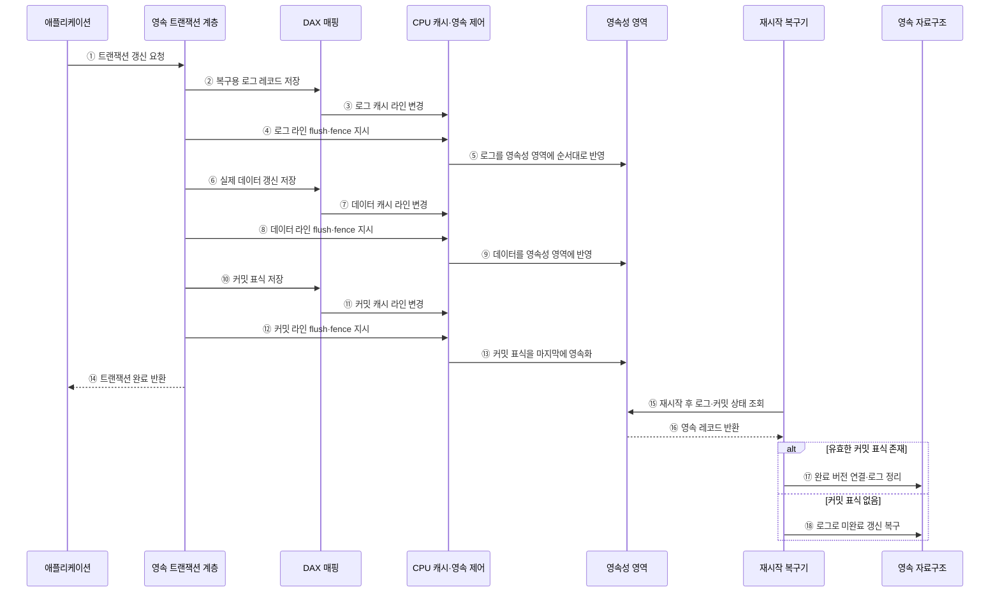

---
sidebar:
  order: 82
  label: "082. 퍼시스턴트 메모리 (Persistent Memory)"
  badge:
    text: "미출 · 50%"
    variant: note
title: "퍼시스턴트 메모리 (Persistent Memory)"
date: "2026-07-25T00:22:25+09:00"
tags:
  - "notes-hardware"
weight: 82
extra:
  question_no: "082"
  source_status: "미출"
  source_history: ""
  priority: 50
  priority_note: "바이트 접근·영속 순서·장애 복구"
---

## 미리 알고가기

- **퍼시스턴트 메모리(Persistent Memory)**: 전원 차단 뒤에도 보존되는 바이트 주소 지정 메모리
- **중앙처리장치(Central Processing Unit, CPU)**: 메모리 주소로 명령을 실행하는 처리기
- **동적 임의접근 메모리(Dynamic Random-Access Memory, DRAM)**: 전원 차단 시 사라지는 작업 메모리
- **솔리드 스테이트 드라이브(Solid-State Drive, SSD)**: 플래시 기반 비휘발 블록 저장장치
- **바이트 주소 지정(Byte Addressability)**: CPU가 주소 단위로 직접 읽고 쓰는 성질
- **로드·스토어(Load·Store)**: 처리기가 메모리 값을 읽고 쓰는 명령
- **직접 접근(Direct Access, DAX)**: 페이지 캐시 없이 영속 영역을 주소 공간에 매핑
- **페이지 캐시(Page Cache)**: 파일·블록 데이터를 메모리에 보관해 반복 I/O를 줄이는 운영체제 캐시
- **영속성 영역(Persistence Domain)**: 쓰기 도달 시 정전 뒤 보존되는 하드웨어 경계
- **캐시 라인 플러시(Cache-Line Flush)**: 변경 캐시 라인을 영속 경계로 내보내는 명령
- **메모리 펜스(Memory Fence)**: 선행 쓰기의 완료 순서를 확정하는 명령
- **장애 정합성(Crash Consistency)**: 장애 뒤 완료 상태만 안전하게 복원하는 성질
- **원자성(Atomicity)**: 여러 쓰기가 모두 반영되거나 모두 반영되지 않은 것처럼 보이는 성질
- **쓰기 로그(Write Log)**: 장애 복구를 위해 변경 전후 데이터나 갱신 내용을 순서대로 기록한 영역
- **트랜잭션(Transaction)**: 데이터 갱신을 하나의 성공·실패 단위로 묶는 작업
- **커밋 표식(Commit Record)**: 새 버전의 완료 여부를 나타내는 영속 메타데이터
- **인메모리 데이터베이스(In-memory Database)**: 주 데이터를 메모리에 두어 낮은 접근 지연을 얻는 데이터베이스

## Ⅰ. 개요

- 정의/개념: 바이트 직접 접근과 전원 후 보존을 결합한 메모리
- 기존 한계: 휘발성 메모리는 전원 차단과 재시작 시 데이터가 사라지고, 저장장치는 메모리보다 접근 지연이 크다.

### 쉽게 이해하기 (학습용)

- 바이트 주소로 직접 읽고 쓰면서 전원이 차단되어도 데이터가 유지되는 비휘발성 메모리다.

## Ⅱ. 특징

- DAX는 페이지 캐시를 우회해 I/O 지연을 줄인다.
- 플러시·펜스가 영속 도달과 쓰기 순서를 보장한다.
- 원자성을 보장하지 않아 로그·복구 비용이 든다.

### 쉽게 이해하기 (학습용)

- 바로 쓰더라도 잉크를 말리고 완료 도장을 찍는 순서를 지켜야 정전 뒤 복구된다.

## Ⅲ. 아키텍처 및 구성요소

### 도표안 A. DAX·캐시·영속성 영역 정적 구조

| 설계 요소 | 입력·상태 | 역할 |
|:---|:---|:---|
| 영속 자료구조·복구 메타데이터 | 버전·로그·커밋 상태 | 장애 일관성과 복구 기준 관리 |
| DAX 매핑 | 파일 오프셋·가상 주소 | 영속 영역을 주소 공간에 연결 |
| CPU 캐시·영속 제어 | 변경 캐시 라인·순서 | 플러시·펜스로 완료 순서 제어 |
| 영속성 영역 | 도달한 쓰기 | 전원 차단 뒤 데이터 보존 |

> 요약: DAX로 접근하고 캐시·메타데이터로 완료 통제

### 쉽게 이해하기 (학습용)

- 바이트 주소·캐시라인 영속화 순서·트랜잭션 완료 기록을 함께 관리하는 구조다.

### 도표안 B. 로그 기반 영속 트랜잭션·복구 시퀀스

#### 동작 원리

1. **트랜잭션 시작**: 애플리케이션이 여러 영속 쓰기를 하나의 성공·실패 단위로 갱신해 달라고 요청한다.
2. **로그 저장**: 트랜잭션 계층이 장애 때 되돌리거나 재적용할 수 있는 로그 레코드를 DAX 주소에 쓴다.
3. **로그 캐시 변경**: 일반 store 명령이 먼저 CPU 캐시 라인만 변경할 수 있다.
4. **로그 순서 확정**: 트랜잭션 계층이 해당 캐시 라인을 flush하고 fence로 선행 로그의 완료를 기다린다.
5. **로그 영속화**: 캐시·영속 제어가 플랫폼의 영속성 영역까지 로그를 보낸다.
6. **실제 데이터 갱신**: 복구 기준이 안전해진 뒤 자료구조의 실제 데이터를 DAX 주소로 갱신한다.
7. **데이터 캐시 변경**: 실제 데이터 store도 변경된 캐시 라인에 먼저 머물 수 있다.
8. **데이터 순서 확정**: 데이터 라인을 flush하고 fence해 커밋 표식보다 먼저 영속되도록 한다.
9. **데이터 영속화**: 갱신 데이터가 정전 뒤 보존되는 영역에 도달한다.
10. **커밋 표식 저장**: 로그와 실제 데이터가 안전해진 뒤 완료를 나타내는 커밋 레코드를 기록한다.
11. **커밋 캐시 변경**: 커밋 store 역시 처음에는 CPU 캐시에 남을 수 있다.
12. **커밋 완료 대기**: 커밋 라인을 flush하고 fence해 영속 완료를 확인한다.
13. **커밋 최종 반영**: 커밋 표식이 마지막 순서로 영속성 영역에 도달한다.
14. **성공 반환**: 커밋의 영속성이 확보된 뒤에만 애플리케이션에 성공을 반환한다.
15. **복구 상태 조회**: 재시작 시 복구기가 로그와 커밋 레코드를 검사한다.
16. **영속 레코드 반환**: 영속성 영역이 정전 직전까지 도달한 복구 메타데이터를 반환한다.
17. **완료 버전 채택**: 유효한 커밋 표식이 있으면 갱신된 자료구조를 연결하고 불필요한 로그를 정리한다.
18. **미완료 갱신 복구**: 커밋 표식이 없으면 로그 방식에 따라 부분 쓰기를 되돌리거나 안전하게 재적용한다.

### 쉽게 이해하기 (학습용)

- 복구 기록, 실제 데이터, 완료 도장의 순서로 잉크를 말려야 정전 뒤 완료 여부를 정확히 판단할 수 있다.

## Ⅳ. 종류 및 비교

| 판단 기준 | 퍼시스턴트 메모리 | DRAM | SSD |
|:---|:---|:---|:---|
| 핵심 특징 | 바이트 접근·비휘발 | 바이트 접근·휘발 | 블록 접근·비휘발 |
| 적용 기준 | 직접 갱신·빠른 재시작 | 실행 중 작업 데이터 | 대용량·단순 영속 저장 |
| 주요 위험 | 플러시 순서·장애 복구 | 전원 차단 시 데이터 소실 | 파일·블록 계층 동기화 |

> 요약: 직접 영속 갱신은 퍼시스턴트 메모리 선택

### 쉽게 이해하기 (학습용)

- 장애 후 즉시 이어 사용할 상태는 퍼시스턴트 메모리, 일시적 작업 데이터는 DRAM, 대용량 보관 데이터는 SSD에 배치한다.

## Ⅴ. 실무 고려사항 및 대응 방안

| 운영 위험 | 대응 | 기대 효과 |
|:---|:---|:---|
| 데이터보다 커밋 표식이 먼저 영속 | 데이터 플러시 후 펜스·커밋 순서 강제 | 부분 갱신 복구 방지 |
| 영속성 영역을 잘못 가정 | 플랫폼별 보장 경계 확인과 정전 주입 시험 | 하드웨어별 정확성 확보 |
| 포인터·주소가 재매핑 뒤 무효 | 상대 포인터·객체 식별자와 재연결 검사 | 재시작 복구 가능 |
| 매체 오류·마모로 장기 데이터 손상 | 체크섬·복제·불량 영역 감시 | 데이터 내구성 향상 |

### 쉽게 이해하기 (학습용)

- 변경 캐시라인을 정해진 순서로 영속화한 뒤 커밋 레코드를 기록하여 장애 후 완료된 트랜잭션만 복구한다.

### 적용 사례

- 인메모리 데이터베이스는 DAX 매핑에 로그·데이터·커밋 표식을 순서대로 영속화해 재시작 때 완료된 트랜잭션만 복구한다.

### 쉽게 이해하기 (학습용)

- 데이터베이스는 기록과 도장을 남겨 재시작 뒤 완료된 버전을 선택한다.

## Ⅵ. 결론

- 장애 후 빠른 재시작과 직접 바이트 갱신을 확보하기 위해 **영속성 영역·캐시 flush·fence 순서·쓰기 원자성·로그·포인터 재연결**을 검토하고, 정전 주입으로 복구 불변식을 검증한 퍼시스턴트 메모리 구조를 적용한다.

### 쉽게 이해하기 (학습용)

- 장애 후 즉시 복구하는 이점이 영속화 순서와 일관성 관리 비용보다 클 때 적용한다.
