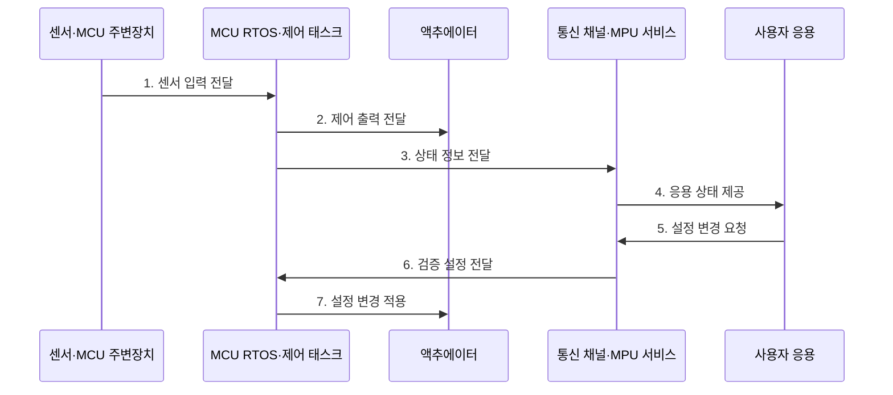

---
sidebar:
  order: 83
  label: "083. 마이크로컨트롤러 vs 마이크로프로세서 (Microcontroller vs Microprocessor)"
  badge:
    text: "미출 · 50%"
    variant: note
title: "마이크로컨트롤러 vs 마이크로프로세서 (Microcontroller vs Microprocessor)"
date: "2026-07-25T00:22:25+09:00"
tags:
  - "notes-hardware"
weight: 83
extra:
  question_no: "083"
  source_status: "미출"
  source_history: ""
  priority: 50
  priority_note: "통합도·시간 제약·OS 요구 비교"
---

## 미리 알고가기

- **마이크로컨트롤러(Microcontroller Unit, MCU)**: 처리기·메모리·제어 주변장치를 통합한 칩
- **마이크로프로세서(Microprocessor Unit, MPU)**: 외부 메모리·입출력을 확장하는 처리 중심 칩
- **데드라인(Deadline)**: 제어 처리를 끝내야 하는 시각
- **하드 실시간(Hard Real-Time)**: 데드라인 위반을 허용하지 않는 제어 조건
- **실시간 운영체제(Real-Time Operating System, RTOS)**: 결정적 스케줄링을 지원하는 운영체제
- **메모리 관리 장치(Memory Management Unit, MMU)**: 주소 변환·프로세스 메모리 격리 장치
- **캐시(Cache)**: 자주 쓰는 명령·데이터를 처리기 가까이에 보관해 외부 메모리 접근 지연을 줄이는 기억장치
- **온칩(On-chip)**: 처리기와 메모리·주변장치가 같은 반도체 칩 안에 배치된 상태
- **인터럽트(Interrupt)**: 장치 사건이 현재 실행을 멈추고 처리기를 호출
- **주변장치(Peripheral)**: 타이머·변환기·통신·입출력 제어 모듈
- **베어메탈(Bare Metal)**: 운영체제 없이 하드웨어를 직접 제어하는 실행 방식
- **범용 운영체제(General-Purpose Operating System, OS)**: 프로세스·가상 메모리·파일 제공
- **커널·드라이버(Kernel·Driver)**: 커널은 시스템 자원을 통제하고 드라이버는 장치별 레지스터와 운영체제 요청을 연결함
- **레지스터(Register)**: 처리기나 주변장치가 상태·설정·데이터를 보관하는 작은 고속 저장 공간
- **산업 게이트웨이(Industrial Gateway)**: 현장 제어망과 상위 네트워크 사이에서 프로토콜 변환·데이터 전달을 수행하는 장치
- **텔레메트리(Telemetry)**: 장치의 상태·진단값을 원격 시스템에 전달하는 데이터
- **지터(Jitter)**: 주기 작업의 실제 시작·완료 시각이 기준 시각에서 흔들리는 정도
- **신호 무결성(Signal Integrity)**: 전기 신호가 왜곡·잡음 없이 수신 조건을 만족하는 성질

## Ⅰ. 개요

- 정의/개념: **MCU 통합 제어**와 MPU 외부 확장 비교
- 배경/필요성: 시간·전력·OS 요구에 맞는 처리기 선택

### 쉽게 이해하기 (학습용)

- MCU는 메모리·주변장치를 내장한 단일 칩 제어장치이고, MPU는 외부 메모리·장치와 연결해 범용 운영체제를 실행하는 처리장치다.

## Ⅱ. 특징

- **MCU 온칩 통합**: 보드·전력·제어 지연 감소
- **MPU 외부 확장**: 복합 OS·대용량 응용 지원
- **실행 환경 차이**: RTOS·베어메탈과 범용 OS

### 쉽게 이해하기 (학습용)

- 즉시 움직일 장치는 MCU, 큰 화면·앱은 MPU가 유리하나 실제 요구로 결정한다.

## Ⅲ. 구조 및 구성요소

| 구성요소 | 책임 |
|:---|:---|
| MCU 제어부 | **결정적 제어 실행** |
| MCU 온칩 자원 | **메모리·주변장치 제공** |
| MPU 처리부 | **범용 OS·응용 실행** |
| MPU 외부 자원 | **메모리·I/O 확장** |

### 쉽게 이해하기 (학습용)

- MCU는 즉시 제어하고 MPU는 화면·통신 같은 복합 기능을 맡는다.

## Ⅳ. 흐름도

**동작 원리**

- **1. 센서 입력 전달**: MCU 제어 기동
- **2. 제어 출력 전달**: 데드라인 내 구동
- **3. 상태 정보 전달**: 텔레메트리 송신
- **4. 응용 상태 제공**: MPU 화면·통신 처리
- **5. 설정 변경 요청**: 권한 확인
- **6. 검증 설정 전달**: 범위·무결성 검사
- **7. 설정 변경 적용**: 제어 주기 경계 반영

### 쉽게 이해하기 (학습용)

- MCU는 제어 시간표를 지키고, MPU는 화면·네트워크를 맡으며 설정 변경도 MCU의 안전한 주기에 맞춰 넘긴다.

## Ⅴ. 종류 및 비교

| 구분 | 마이크로컨트롤러(MCU) | 마이크로프로세서(MPU) |
|:---|:---|:---|
| 적용 기준 | 센서·모터·안전 제어 | 사용자 화면·네트워크·대용량 응용 |
| 핵심 특징 | **제어 자원 온칩 통합** | **외부 메모리·I/O 확장** |
| 한계 | 메모리·연산 확장 제한 | 전력·보드·응답 변동 |

### 쉽게 이해하기 (학습용)

- 약속 시간을 지키는 제어기는 MCU, 큰 앱을 돌리는 컴퓨터는 MPU에 가깝다.

## Ⅵ. 실무 고려사항 및 대책

| 고려사항 | 대책 | 효과 |
|:---|:---|:---|
| 최악 데드라인 위반 | WCET·인터럽트 지연 측정 | **실시간 제어 보장** |
| MCU 메모리 고갈 | 정적 할당·스택 계측 | **실행 실패 예방** |
| MPU 제어 지터 | 실시간 코어·MCU 분담 | **응답 예측성 향상** |
| 외부 부품 장애 | 전원·신호·복구 검증 | **시스템 신뢰 향상** |

### 쉽게 이해하기 (학습용)

- 즉시 움직이는 제어는 MCU, 화면과 네트워크는 MPU가 맡아 서로 방해하지 않는다.

## Ⅶ. 결론

- 결정적 제어는 MCU, 복합 응용은 MPU에 배치한다.

### 쉽게 이해하기 (학습용)

- 한 장치의 메모리·시간 한도를 넘으면 두 장치로 나눈다.
