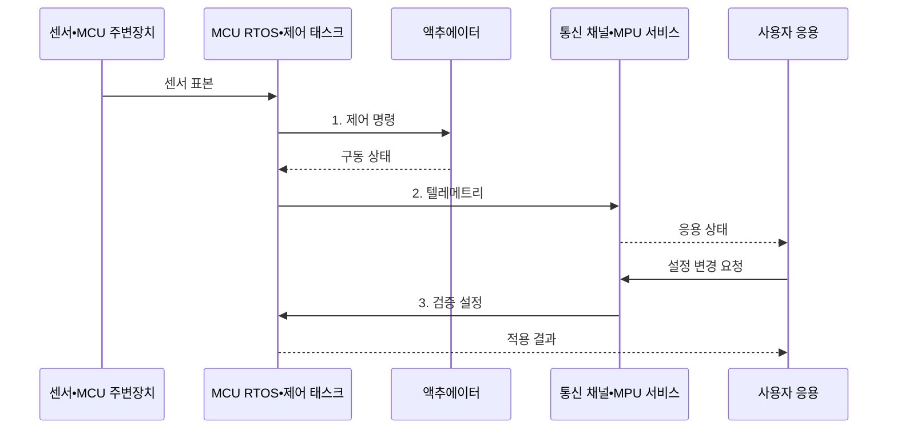

---
sidebar:
  order: 83
  label: "083. 마이크로컨트롤러 vs 마이크로프로세서 (Microcontroller vs Microprocessor)"
  badge:
    text: "미출 • 50%"
    variant: note
title: "마이크로컨트롤러 vs 마이크로프로세서 (Microcontroller vs Microprocessor)"
date: "2026-08-03T09:07:03+09:00"
tags:
  - "notes-hardware"
weight: 83
extra:
  question_no: "083"
  source_status: "미출"
  source_history: ""
  priority: 50
  priority_note: "통합도•시간 제약•OS 요구 비교"
---

## Ⅰ. 개요

핵심 용어

- **마이크로컨트롤러(MCU)**: 처리기•메모리•주변장치를 한 칩에 통합한 제어용 반도체이다.
- **마이크로프로세서(MPU)**: 외부 메모리•입출력을 확장하는 처리기 중심 반도체이다.

- 정의/개념: MCU는 처리기•메모리•주변장치를 한 칩에 통합한 **제어용 반도체**, MPU는 외부 메모리•I/O를 확장하는 **처리기 중심 반도체**
- 배경/필요성: 시간•전력•OS 요구에 맞는 처리기 선택

#### 한줄 요약

- 공구가 든 휴대 상자처럼 MCU는 제어 자원을 한 칩에 모으고, 확장형 작업대처럼 MPU는 외부 자원을 붙여 큰 운영체제를 실행한다.

## Ⅱ. 특징

핵심 용어

- **온칩(On-Chip)**: 처리기와 메모리•주변장치가 같은 칩 안에 배치된 상태이다.
- **메모리 관리 장치(MMU)**: 주소를 변환하고 프로세스 메모리를 격리하는 하드웨어이다.
- **실시간 운영체제(RTOS)**: 태스크의 실행 시점을 예측할 수 있도록 결정적 스케줄링을 지원하는 운영체제이다.

- **MCU 온칩 통합**: 보드•전력•제어 지연 감소
- **MPU 외부 확장•MMU**: 대용량 응용과 프로세스 격리
- **실행 환경 차이**: RTOS•베어메탈의 결정성과 범용 OS의 기능성

#### 한줄 요약

- 한 상자 안의 공구가 즉시 모터를 움직이는 MCU라면, 외부 장비를 붙인 작업대에서 여러 앱을 돌리는 쪽은 MPU다.

## Ⅲ. 구조 및 구성요소

핵심 용어

- **주변장치(Peripheral)**: 타이머•변환기•통신•입출력 제어를 담당하는 모듈이다.
- **입출력(I/O)**: 처리기와 외부 장치가 데이터나 제어 신호를 주고받는 동작이다.

| 구성요소 | 책임 |
|:---|:---|
| MCU 제어부 | **결정적 제어 실행** |
| MCU 온칩 자원 | **메모리•주변장치 제공** |
| MPU 처리부 | **범용 OS•응용 실행** |
| MPU 외부 자원 | **메모리•I/O 확장** |

#### 한줄 요약

- MCU 상자 안에는 제어부와 온칩 자원이 붙어 있고, MPU 작업대에는 처리부와 외부 메모리•입출력 장치가 연결된다.

## Ⅳ. 흐름도

핵심 용어

- **인터럽트(Interrupt)**: 장치 사건이 현재 실행을 잠시 멈추고 처리 루틴을 호출하는 신호이다.
- **텔레메트리(Telemetry)**: 장치의 상태•진단값을 원격 시스템에 전달하는 데이터이다.

**동작 원리**

1. **제어 명령**: 센서 표본을 데드라인 내 액추에이터 동작으로 변환
2. **텔레메트리**: MCU 상태를 MPU의 화면•통신 처리로 전달
3. **검증 설정**: 권한•범위 확인 후 MCU 제어 주기 경계에 반영

#### 한줄 요약

- MCU는 제어 시간표를 지키고, MPU는 화면•네트워크를 맡으며 설정 변경도 MCU의 안전한 주기에 맞춰 넘긴다.

## Ⅴ. 종류 및 비교

핵심 용어

- **하드 실시간**: 데드라인 위반을 시스템 실패로 보아 허용하지 않는 제어 조건이다.
- **범용 운영체제**: 프로세스•가상 메모리•파일 등 다양한 응용 기능을 제공하는 운영체제이다.

| 처리기 유형 | 마이크로컨트롤러(MCU) | 마이크로프로세서(MPU) |
|:---|:---|:---|
| 적용 기준 | 센서•모터의 **하드 실시간 제어** | 화면•네트워크의 **대용량 응용** |
| 핵심 특징 | **제어 자원 온칩 통합** | **외부 메모리•I/O 확장** |
| 한계 | **메모리•연산 확장** 제한 | **전력•보드 비용•응답 변동** |

#### 한줄 요약

- 약속 시간을 지키는 제어기는 MCU, 큰 앱을 돌리는 컴퓨터는 MPU에 가깝다.

## Ⅵ. 실무 고려사항 및 대책

핵심 용어

- **최악 실행 시간(WCET)**: 태스크가 가장 오래 걸리는 경로의 실행 시간 상한이다.
- **지터(Jitter)**: 주기 작업의 실제 시작•완료 시각이 기준 시각에서 흔들리는 정도이다.
- **신호 무결성**: 전기 신호가 왜곡•잡음 없이 수신 조건을 만족하는 성질이다.

| 문제 | 대책 | 효과 |
|:---|:---|:---|
| WCET와 인터럽트 지연 합이 주기를 넘어 **데드라인 위반** | **WCET•인터럽트 지연 측정** | **하드 실시간 제어** 보장 |
| 동적 할당과 깊은 호출로 **MCU 메모리 고갈** | **정적 할당•스택 사용량 계측** | **실행 중 메모리 부족** 예방 |
| 범용 OS 스케줄링으로 **MPU 제어 지터** 증가 | **실시간 코어•MCU 제어 분담** | **응답 시간 예측성** 향상 |
| 외부 메모리•I/O 배선 잡음으로 **신호 무결성 저하** | **전원•배선•신호 무결성 검증** | **외부 장치 통신 오류** 감소 |

#### 한줄 요약

- 즉시 움직이는 제어는 MCU, 화면과 네트워크는 MPU가 맡아 서로 방해하지 않는다.

## Ⅶ. 결론

핵심 용어

- **베어메탈(Bare Metal)**: 운영체제 없이 펌웨어가 하드웨어를 직접 제어하는 실행 방식이다.
- **데드라인(Deadline)**: 제어 처리를 끝내야 하는 제한 시각이다.

- 결정적 제어는 **MCU**, 복합 응용은 **MPU** 배치

#### 한줄 요약

- 한 장치의 메모리•시간 한도를 넘으면 두 장치로 나눈다.
