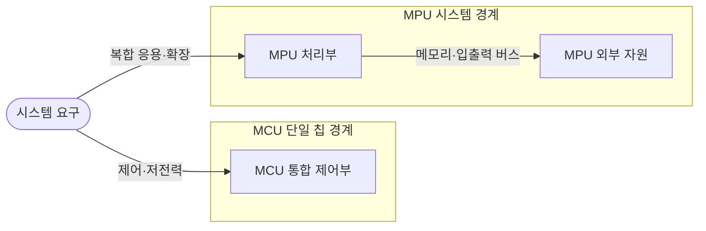

---
sidebar:
  order: 83
  label: "083. 마이크로컨트롤러 vs 마이크로프로세서 (Microcontroller vs Microprocessor)"
  badge:
    text: "미출 · 50%"
    variant: note
title: "마이크로컨트롤러 vs 마이크로프로세서 (Microcontroller vs Microprocessor)"
date: "2026-07-25T00:22:25+09:00"
tags:
  - "notes-hardware"
weight: 83
extra:
  question_no: "083"
  source_status: "미출"
  source_history: ""
  priority: 50
  priority_note: "통합도·시간 제약·OS 요구 비교"
---

## 미리 알고가기

- **마이크로컨트롤러(Microcontroller Unit, MCU)**: 처리기·메모리·제어 주변장치를 통합한 칩
- **마이크로프로세서(Microprocessor Unit, MPU)**: 외부 메모리·입출력을 확장하는 처리 중심 칩
- **데드라인(Deadline)**: 제어 처리를 끝내야 하는 시각
- **하드 실시간(Hard Real-Time)**: 데드라인 위반을 허용하지 않는 제어 조건
- **실시간 운영체제(Real-Time Operating System, RTOS)**: 결정적 스케줄링을 지원하는 운영체제
- **메모리 관리 장치(Memory Management Unit, MMU)**: 주소 변환·프로세스 메모리 격리 장치
- **캐시(Cache)**: 자주 쓰는 명령·데이터를 처리기 가까이에 보관해 외부 메모리 접근 지연을 줄이는 기억장치
- **온칩(On-chip)**: 처리기와 메모리·주변장치가 같은 반도체 칩 안에 배치된 상태
- **인터럽트(Interrupt)**: 장치 사건이 현재 실행을 멈추고 처리기를 호출
- **주변장치(Peripheral)**: 타이머·변환기·통신·입출력 제어 모듈
- **베어메탈(Bare Metal)**: 운영체제 없이 하드웨어를 직접 제어하는 실행 방식
- **범용 운영체제(General-Purpose Operating System, OS)**: 프로세스·가상 메모리·파일 제공
- **커널·드라이버(Kernel·Driver)**: 커널은 시스템 자원을 통제하고 드라이버는 장치별 레지스터와 운영체제 요청을 연결함
- **레지스터(Register)**: 처리기나 주변장치가 상태·설정·데이터를 보관하는 작은 고속 저장 공간
- **산업 게이트웨이(Industrial Gateway)**: 현장 제어망과 상위 네트워크 사이에서 프로토콜 변환·데이터 전달을 수행하는 장치

## Ⅰ. 개요

- 정의/개념: MCU 통합 제어와 MPU 외부 확장의 대비
- 기존 한계: 제어 주기·전력·비용과 운영체제·응용 성능 요구를 구분하지 않으면 MCU와 MPU를 적절히 선택하기 어렵다.

### 쉽게 이해하기 (학습용)

- MCU는 메모리·주변장치를 내장한 단일 칩 제어장치이고, MPU는 외부 메모리·장치와 연결해 범용 운영체제를 실행하는 처리장치다.

## Ⅱ. 특징

- MCU 통합은 보드·전력·제어 지연을 줄인다.
- MPU 확장은 복합 OS 응용을 지원하나 전력을 높인다.

### 쉽게 이해하기 (학습용)

- 즉시 움직일 장치는 MCU, 큰 화면·앱은 MPU가 유리하나 실제 요구로 결정한다.

## Ⅲ. 아키텍처 및 구성요소

| 설계 요소 | 입력·상태 | 역할 |
|:---|:---|:---|
| MCU 통합 제어부 | 센서 사건·제어 주기 | 온칩 메모리·타이머·입출력으로 결정적 제어 |
| MPU 처리부 | 프로세스·가상 주소 | 고성능 연산과 범용 운영체제 실행 |
| MPU 외부 자원 | 메모리·저장·고속 I/O | 용량·기능 확장 |

> 요약: MCU는 온칩 통합, MPU는 외부 자원 확장

### 쉽게 이해하기 (학습용)

- MCU는 제어 기능을 한 칩에 통합하고, MPU는 외부 메모리와 주변장치를 확장하여 고성능 응용을 실행한다.

## Ⅳ. 운영 고려사항

| 운영 위험 | 대응 | 기대 효과 |
|:---|:---|:---|
| 평균 응답만 보고 최악 데드라인 위반 | 최악 실행시간·인터럽트 지연·주기 여유 측정 | 실시간 제어 보장 |
| MCU 메모리·플래시 용량 고갈 | 정적 할당·스택 계측과 기능 분리 | 런타임 실패 예방 |
| MPU OS 부하로 제어 지터 증가 | 실시간 코어·우선순위 분리 또는 MCU로 제어 분담 | 응답 예측성 향상 |
| 외부 메모리·보드 부품 증가로 장애 확대 | 전원·신호 무결성 검증과 부팅 복구 설계 | 시스템 신뢰성 향상 |

### 쉽게 이해하기 (학습용)

- MCU는 장치 사건에 짧은 경로로 반응하고 MPU는 운영체제가 응용 순서를 정해 처리한다.

## Ⅴ. 종류 및 비교

| 판단 기준 | 마이크로컨트롤러(MCU) | 마이크로프로세서(MPU) |
|:---|:---|:---|
| 핵심 특징 | 제어 자원 온칩 통합 | 처리 중심·외부 자원 확장 |
| 적용 기준 | 센서·모터·안전 제어 | 사용자 화면·네트워크·대용량 응용 |
| 주요 위험 | 메모리·연산·확장 제약 | 보드 복잡도·전력·응답 변동 |

> 요약: 제어 마감은 MCU, 복합 응용은 MPU 선택

### 쉽게 이해하기 (학습용)

- 약속 시간을 지키는 제어기는 MCU, 큰 앱을 돌리는 컴퓨터는 MPU에 가깝다.

## Ⅵ. 실무 사례

1. 산업 게이트웨이: MCU 제어·MPU 통신·화면 분리

### 쉽게 이해하기 (학습용)

- 즉시 움직이는 제어는 MCU, 화면과 네트워크는 MPU가 맡아 서로 방해하지 않는다.

## Ⅶ. 결론

- 데드라인·메모리·전력 충돌 시 MCU·MPU 역할 분리

### 쉽게 이해하기 (학습용)

- 한 장치의 메모리·시간 한도를 넘으면 두 장치로 나눈다.
