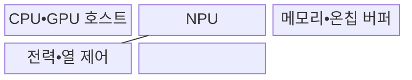

---
sidebar:
  order: 84
  label: "084. SoC AI 온디바이스 칩 (SoC On-Device AI Chip)"
  badge:
    text: "기출 • 85%"
    variant: note
title: "SoC AI 온디바이스 칩 (SoC On-Device AI Chip)"
date: "2026-08-04T13:40:00+09:00"
tags:
  - "notes-hardware"
weight: 84
extra:
  question_no: "084"
  source_status: "기출"
  source_history: "134회, 135회"
  priority: 85
  priority_note: "연산자•메모리•지속 전력의 반복 기출"
---

## Ⅰ. 개요

핵심 용어

- **SoC(System on Chip)**: 연산•메모리•입출력 제어 기능을 한 칩에 통합한 반도체이다.
- **AI(Artificial Intelligence)**: 데이터로 학습한 모델을 이용해 인식•판단을 수행하는 기술이다.
- **CPU(Central Processing Unit)**: 범용 명령과 제어 중심 연산을 수행하는 중앙 처리 장치이다.
- **GPU(Graphics Processing Unit)**: 다수 연산 코어로 데이터 병렬 처리를 수행하는 장치이다.
- **NPU(Neural Processing Unit)**: 신경망의 텐서 연산을 병렬 처리하는 AI 가속기이다.
- **온디바이스 AI**: 단말 내부 자원으로 학습 모델의 추론을 수행하는 기술이다.

- 정의/개념: CPU•GPU•NPU를 통합한 **단말 AI용 SoC**
- 배경/필요성: 클라우드 추론의 **망 지연•연결 의존** 완화

#### 한줄 요약

- 카메라가 사진을 원격 서버로 보내지 않고 손안의 칩에서 바로 분류하듯, 단말 내부 연산기로 AI 추론을 끝낸다.

## Ⅱ. 특징

핵심 용어

- **TOPS(Tera Operations per Second)**: 특정 수치 정밀도에서 가속기가 수행하는 초당 수조 연산 지표이다.
- **메모리 대역폭**: 단위 시간에 메모리에서 연산기로 공급할 수 있는 데이터양이다.
- **TDP(Thermal Design Power)**: 냉각 설계가 지속적으로 처리해야 하는 기준 발열량이다.
- **DVFS(Dynamic Voltage and Frequency Scaling)**: 부하와 온도에 따라 전압•주파수를 조절하는 전력 관리 기법이다.

- **이기종 연산기•연산자 지원** 으로 전후처리와 추론 분담
- **TOPS** 대비 낮은 메모리 공급•**온칩 재사용률** 로 지속 처리량 저하
- **TDP•DVFS** 한도 초과 시 열 스로틀링으로 지속 처리량 감소

#### 한줄 요약

- 전담 계산기가 빨라도 재료가 늦거나 칩이 뜨거워지면 지속 처리량은 낮아진다.

## Ⅲ. 구조 및 구성요소

핵심 용어

- **온칩 버퍼**: 재사용할 데이터가 외부 메모리를 왕복하지 않도록 가속기 가까이에 두는 저장 공간이다.

| 구성요소 | 책임 |
|:---|:---|
| CPU•GPU 호스트 | **전후처리•대체 연산** |
| NPU | **텐서 연산 가속** |
| 메모리•온칩 버퍼 | **가중치•활성값 공급** |
| 전력•열 제어 | **DVFS•온도 제한** |

#### 한줄 요약

- 주방의 범용 조리대와 전용 기계처럼 CPU•GPU와 NPU가 연산을 나누고, 공동 재료 창고와 열 제어가 작업 속도를 제한한다.

## Ⅳ. 흐름도

핵심 용어

- **모델 컴파일러(Model Compiler)**: 모델 연산자를 대상 하드웨어 명령과 서브그래프로 변환하는 도구이다.
- **런타임(Runtime)**: 장치별 서브그래프 실행과 텐서 메모리를 제어하는 소프트웨어 계층이다.
- **서브그래프**: 전체 연산 그래프에서 특정 연산기에 함께 배치해 실행하도록 나눈 연산 집합이다.

**동작 원리**

1. **실행 계획**: 지원 연산자는 NPU, 미지원 연산자는 호스트에 배치
2. **텐서•버퍼 계획**: 가중치•활성값 타일의 온칩 재사용 순서 결정
3. **서브그래프 실행 명령**: 전력•열 한도에서 NPU 연산 수행

#### 한줄 요약

- 모델을 NPU에 올리는 것만으로 끝나지 않고, 입력 전처리•메모리 공급•후처리•발열 조절까지 이어져야 지속 추론이 된다.

## Ⅴ. 종류 및 비교

핵심 용어

- **추론(Inference)**: 학습된 모델이 새 입력으로부터 분류•생성 결과를 계산하는 과정이다.
- **연산자(Operator)**: 합성곱•행렬 곱처럼 모델을 구성하는 개별 계산 단위이다.

| AI 추론 위치 | 온디바이스 추론 | 클라우드 추론 |
|:---|:---|:---|
| 적용 기준 | 개인정보•**즉시 응답•반복 추론** | 대형 모델•**집중 갱신** |
| 핵심 특징 | 단말 **원본 처리•오프라인 실행** | 원격 가속기•**집중 모델 실행** |
| 한계 | 연산자 미지원•**발열•배터리** | 통신 장애•**비용•정보 노출** |

#### 한줄 요약

- 단말의 전력•온도 한도 안의 일은 내부에서 하고 초과분만 서버에 맡긴다.

## Ⅵ. 실무 고려사항 및 대책

핵심 용어

- **양자화(Quantization)**: 가중치•활성값의 수 표현 폭을 줄여 연산량과 메모리 사용량을 낮추는 기법이다.
- **열 스로틀링**: 온도 한계를 지키기 위해 전압•주파수를 낮춰 처리량을 제한하는 제어이다.
- **자원 프로파일러**: 실행 중 지연•메모리•대역폭•전력•온도를 측정하는 도구이다.

| 문제 | 대책 | 효과 |
|:---|:---|:---|
| 미지원 연산자가 호스트로 이동해 **추론 지연 증가** | **연산자 지원 확인•그래프 변환** | **NPU 이탈** 최소화 |
| 지속 부하가 TDP를 넘어 **열 스로틀링** 발생 | **지속 부하•DVFS 시험** | **지속 처리량** 예측성 향상 |
| 가중치•활성값이 버퍼를 넘어 **메모리 대역폭 병목** | **양자화•타일링•버퍼 재사용** | **외부 메모리 이동량** 감소 |
| 운영 입력 분포 변화로 **현장 정확도 저하** | **입력 분포 감시•모델 재검증** | **배포 모델 정확도** 회복 |

#### 한줄 요약

- 조리대에 없는 연산자는 다른 주방으로 넘기고, 과열과 재료 이동을 함께 재야 단말의 지속 추론 속도를 지킬 수 있다.

## Ⅶ. 결론

핵심 용어

- **타일링(Tiling)**: 큰 텐서와 연산을 온칩 버퍼에 맞는 작은 블록으로 나누어 처리하는 기법이다.
- **입력 분포**: 운영 환경에서 모델 입력값이 나타나는 빈도와 범위이다.

- 개인정보•지연 요구를 TDP 안에서 충족하면 **온디바이스**, 초과하면 **클라우드 분담**

#### 한줄 요약

- 손안의 칩이 발열 뒤에도 개인정보•응답 조건을 지키면 내부에서 실행하고, 넘치는 연산만 서버로 보낸다.
