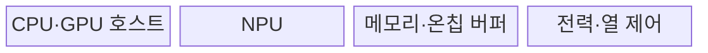
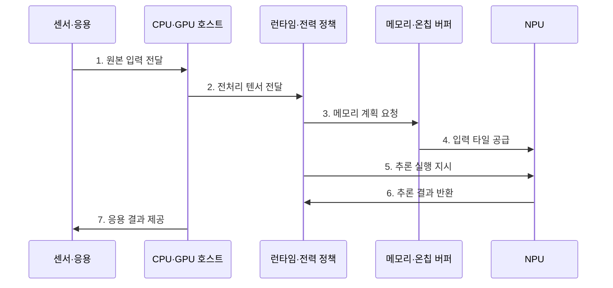

---
sidebar:
  order: 84
  label: "084. SoC AI 온디바이스 칩 (SoC On-Device AI Chip)"
  badge:
    text: "기출 · 85%"
    variant: note
title: "SoC AI 온디바이스 칩 (SoC On-Device AI Chip)"
date: "2026-07-27T23:59:59+09:00"
tags:
  - "notes-hardware"
weight: 84
extra:
  question_no: "084"
  source_status: "기출"
  source_history: "134회, 135회"
  priority: 85
  priority_note: "연산자·메모리·지속 전력의 반복 기출"
---

## 미리 알고가기

- **시스템 온 칩(System on Chip, SoC)**: 연산·메모리·입출력 제어를 한 칩에 통합
- **인공지능(Artificial Intelligence, AI)**: 학습 모델로 입력을 분류·생성하는 기술
- **온디바이스 AI(On-Device AI)**: 단말 내부 자원으로 모델을 추론
- **추론(Inference)**: 학습된 모델이 새 입력에서 분류·생성 결과를 계산하는 과정
- **중앙처리장치(Central Processing Unit, CPU)**: 범용 제어·전후 처리 장치
- **그래픽처리장치(Graphics Processing Unit, GPU)**: 병렬 연산·미지원 연산 처리 장치
- **신경망처리장치(Neural Processing Unit, NPU)**: 텐서 연산용 병렬 가속기
- **초당 수조 연산(Trillion Operations Per Second, TOPS)**: 특정 정밀도의 이론 연산량 지표
- **연산자(Operator)**: 합성곱·행렬 곱 등 모델 계산 단위
- **텐서·가중치·활성값(Tensor·Weight·Activation)**: 텐서는 다차원 수치 배열, 가중치는 학습된 계수, 활성값은 계층 연산의 중간 출력
- **양자화(Quantization)**: 가중치·활성값의 수 표현 폭 축소
- **메모리 대역폭(Memory Bandwidth)**: 단위 시간에 연산기로 공급하는 데이터양
- **온칩 버퍼(On-Chip Buffer)**: 재사용 데이터를 가속기 가까이에 보관
- **동적 전압·주파수 조절(Dynamic Voltage and Frequency Scaling, DVFS)**: 전력·온도에 따라 전압·주파수 조절
- **모델 컴파일러·런타임(Model Compiler·Runtime)**: 컴파일러는 모델 연산자를 하드웨어 명령으로 바꾸고 런타임은 장치별 실행·메모리를 제어함
- **자원 프로파일러(Resource Profiler)**: 실행 중 지연·메모리·대역폭·전력·온도를 측정하는 도구
- **열 스로틀링(Thermal Throttling)**: 온도 한계를 넘지 않도록 주파수와 전압을 낮춰 처리량을 제한하는 제어
- **열설계전력(Thermal Design Power, TDP)**: 냉각 설계가 지속적으로 처리해야 하는 기준 발열량
- **서브그래프(Subgraph)**: 전체 연산 그래프에서 함께 실행하도록 나눈 일부 연산 집합
- **타일링(Tiling)**: 큰 텐서와 연산을 작은 블록으로 나눠 처리하는 기법
- **이중 버퍼링(Double Buffering)**: 한 버퍼를 처리하는 동안 다른 버퍼에 다음 데이터를 채우는 기법
- **성능 카운터(Performance Counter)**: 실행 횟수·지연·대역폭 등 하드웨어 사건을 세는 레지스터
- **입력 분포(Input Distribution)**: 운영 환경에서 입력값이 나타나는 빈도와 범위

## Ⅰ. 개요

- 정의/개념: CPU·GPU·NPU 통합 **단말 AI SoC**
- 배경/필요성: 망 지연·연결 의존·원본 전송 감소

### 쉽게 이해하기 (학습용)

- 사진과 음성을 서버에 보내지 않고 단말 칩 안에서 바로 판단한다.

## Ⅱ. 특징

- **이기종 연산기 통합**으로 전후처리·추론 경로 단축
- **공유 메모리·온칩 재사용**으로 데이터 이동 절감
- **연산자 지원·발열·DVFS**가 지속 추론 성능 결정

### 쉽게 이해하기 (학습용)

- 전담 계산기가 빨라도 재료가 늦거나 칩이 뜨거워지면 지속 처리량은 낮아진다.

## Ⅲ. 구조 및 구성요소

| 구성요소 | 책임 |
|:---|:---|
| CPU·GPU 호스트 | **전후처리·대체 연산** |
| NPU | **텐서 연산 가속** |
| 메모리·온칩 버퍼 | **가중치·활성값 공급** |
| 전력·열 제어 | **DVFS·온도 제한** |

### 쉽게 이해하기 (학습용)

- 호스트와 NPU가 작업을 나누고 메모리·열이 지속 성능을 정한다.

## Ⅳ. 흐름도

**동작 원리**

- **1. 원본 입력 전달**: 센서 프레임 수신
- **2. 전처리 텐서 전달**: 형식·양자화 변환
- **3. 메모리 계획 요청**: 가중치·버퍼 할당
- **4. 입력 타일 공급**: 온칩 데이터 전달
- **5. 추론 실행 지시**: 지원 연산자 실행
- **6. 추론 결과 반환**: 카운터·텐서 전달
- **7. 응용 결과 제공**: 후처리 후 출력

### 쉽게 이해하기 (학습용)

- 모델을 NPU에 올리는 것만으로 끝나지 않고, 입력 전처리·메모리 공급·후처리·발열 조절까지 이어져야 지속 추론이 된다.

## Ⅴ. 종류 및 비교

| AI 추론 위치 | 온디바이스 추론 | 클라우드 추론 |
|:---|:---|:---|
| 적용 기준 | 개인정보·**즉시 응답·반복 추론** | 대형 모델·**집중 갱신** |
| 핵심 특징 | 단말 **원본 처리·오프라인 실행** | 원격 가속기·**집중 모델 실행** |
| 한계 | 연산자 미지원·**발열·배터리** | 통신 장애·**비용·정보 노출** |

### 쉽게 이해하기 (학습용)

- 단말의 전력·온도 한도 안의 일은 내부에서 하고 초과분만 서버에 맡긴다.

## Ⅵ. 실무 고려사항 및 대책

| 고려사항 | 대책 | 효과 |
|:---|:---|:---|
| 미지원 연산 지연 | 지원률 검사·그래프 변환 | **가속기 이탈 최소화** |
| 열 스로틀링 | 지속 부하·DVFS 시험 | **처리량 안정화** |
| 메모리 한도 초과 | 양자화·타일링·버퍼 재사용 | **메모리 병목 완화** |
| 현장 정확도 저하 | 분포 감시·서명 갱신 | **품질·공급망 보호** |

### 쉽게 이해하기 (학습용)

- 카메라는 영상을 보내지 않고 현장에서 객체를 판정한다.

## Ⅶ. 결론

- 연산자·메모리·지속 전력으로 온디바이스 배치를 정한다.

### 쉽게 이해하기 (학습용)

- 최고 속도보다 발열 뒤에도 처리량을 유지하는지 보고 배포 위치를 정한다.
