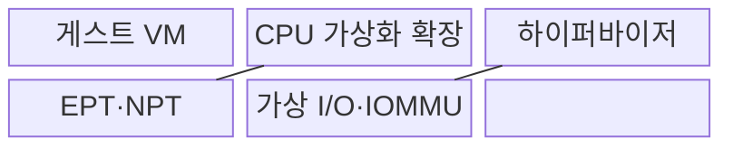
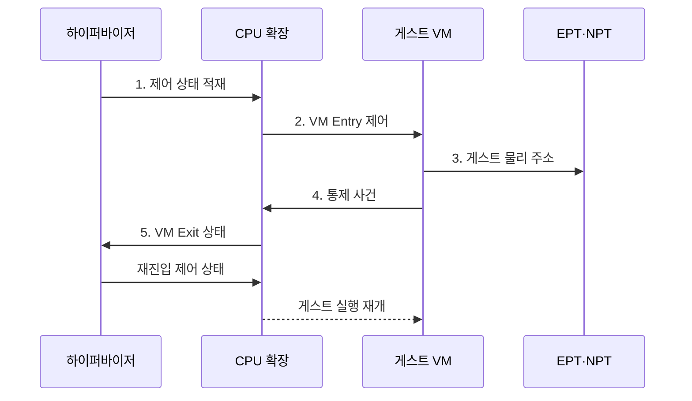

---
sidebar:
  order: 85
  label: "085. 하드웨어 가상화: VT-x·AMD-V (Hardware Virtualization)"
  badge:
    text: "기출 · 70%"
    variant: note
title: "하드웨어 가상화: VT-x·AMD-V (Hardware Virtualization)"
date: "2026-08-02T11:45:00+09:00"
tags:
  - "notes-hardware"
weight: 85
extra:
  question_no: "085"
  source_status: "기출"
  source_history: "137회"
  priority: 70
  priority_note: "VM 전환·2단계 주소 변환 병목"
---

## Ⅰ. 개요

핵심 용어

- **하드웨어 가상화**: 처리기가 게스트 명령의 직접 실행과 자원 격리를 지원하는 기술이다.
- **하이퍼바이저**: 가상머신의 물리 자원과 실행 상태를 중재하는 제어 계층이다.

- 정의/개념: CPU 가상화 확장으로 **게스트 직접 실행·격리**를 지원하는 기술
- 배경/필요성: 소프트웨어 명령 변환의 **실행 비용·호환 복잡도 증가**

### 쉽게 이해하기 (학습용)

- 손님은 방 안에서 직접 일하고 통제가 필요한 사건만 관리실이 처리한다.

## Ⅱ. 특징

핵심 용어

- **VT-x·AMD-V**: x86 처리기에 게스트 실행 모드와 하이퍼바이저 전환 기능을 제공하는 가상화 확장이다.
- **VMCS·VMCB**: 게스트 상태와 VM 진입·탈출 조건을 저장하는 인텔·AMD의 제어 구조이다.
- **EPT·NPT**: 게스트 물리 주소를 호스트 물리 주소로 바꾸는 2단계 주소 변환 표이다.

- **VT-x·AMD-V**의 비특권 명령 직접 실행으로 변환 비용 절감
- **VMCS·VMCB** 기반 VM Entry·Exit로 통제 사건 중재
- **EPT·NPT** 2단계 주소 변환으로 게스트 메모리 격리

### 쉽게 이해하기 (학습용)

- 게스트 명령은 직접 실행되지만 VM Exit와 중첩 페이지 테이블 조회가 잦으면 가상화 오버헤드가 증가한다.

## Ⅲ. 구조 및 구성요소

핵심 용어

- **가상머신(VM)**: 격리된 가상 하드웨어에서 게스트 운영체제를 실행하는 시스템이다.
- **가상 CPU(vCPU)**: VM에 할당되어 물리 CPU 시간으로 실행되는 논리 처리기이다.
- **IOMMU**: 장치 DMA 주소를 변환하고 장치별 메모리 접근 범위를 격리하는 하드웨어이다.

| 구성요소 | 책임 |
|:---|:---|
| 게스트 VM | **운영체제·응용 실행** |
| CPU 가상화 확장 | **진입·탈출 전환** |
| 하이퍼바이저 | **상태·자원 중재** |
| EPT·NPT | **2단계 주소 변환** |
| 가상 I/O·IOMMU | **장치·DMA 격리** |

### 쉽게 이해하기 (학습용)

- 일반 명령은 방 안에서 직접 실행하고, 권한·장치 처리가 필요한 사건만 VM Exit로 관리실에 넘긴 뒤 다시 들어간다.

## Ⅳ. 흐름도

핵심 용어

- **VM Entry**: 하이퍼바이저가 게스트에 제어권을 넘기는 전환이다.
- **VM Exit**: 통제가 필요한 사건에서 처리기가 하이퍼바이저로 제어권을 회수하는 전환이다.
- **민감 명령**: 자원 통제나 시스템 상태에 영향을 주어 하이퍼바이저 중재가 필요한 명령이다.

**동작 원리**

1. **제어 상태 적재**: 레지스터와 VM Exit 조건 설정
2. **VM Entry 제어**: 비특권 명령을 게스트 모드에서 직접 실행
3. **게스트 물리 주소**: EPT·NPT로 호스트 물리 주소에 매핑
4. **통제 사건**: 민감 명령·I/O·예외에서 제어권 회수
5. **VM Exit 상태**: 원인과 게스트 실행 상태를 하이퍼바이저에 전달

### 쉽게 이해하기 (학습용)

- 통제가 필요한 사건만 관리자가 처리하고 실행을 재개한다.

## Ⅴ. 종류 및 비교

핵심 용어

- **명령어 집합 구조(ISA)**: 처리기가 지원하는 명령 형식과 동작의 규약이다.
- **에뮬레이션·이진 변환**: 다른 하드웨어 동작을 소프트웨어로 재현하거나 게스트 명령을 호스트 명령으로 바꾸는 실행 방식이다.

| 가상화 실행 방식 | 하드웨어 지원 가상화 | 에뮬레이션·이진 변환 |
|:---|:---|:---|
| 적용 기준 | 동일 ISA **VM 직접 실행** | 다른 ISA·**장치 동작 재현** |
| 핵심 특징 | 게스트의 **비특권 명령 직접 실행** | 명령 **해석·변환 후 실행** |
| 한계 | VM Exit·**TLB 미스·I/O 중재** | **명령 해석·변환 오버헤드** |

> 요약: 동일 ISA의 VM은 하드웨어 지원으로 직접 실행한다.

### 쉽게 이해하기 (학습용)

- 같은 언어의 손님은 직접 일하고 다른 언어의 장비는 통역해 실행한다.

## Ⅵ. 실무 고려사항 및 대책

핵심 용어

- **TLB 미스**: 필요한 주소 변환이 TLB에 없어 페이지 테이블 순회가 발생하는 상태이다.
- **큰 페이지**: 한 TLB 항목이 더 넓은 메모리 범위를 덮도록 기본보다 큰 주소 단위를 쓰는 페이지이다.
- **NUMA 노드**: CPU와 가까운 로컬 메모리를 하나의 접근 지연 영역으로 묶은 단위이다.

| 문제 | 대책 | 효과 |
|:---|:---|:---|
| 잦은 VM Exit로 **전환 지연 증가** | **Exit 원인 계측·준가상 장치·인터럽트 병합** | **vCPU 처리량** 향상 |
| 2단계 페이지 순회로 **TLB 미스 비용 증폭** | **큰 페이지·TLB 지역성 최적화** | **주소 변환 지연** 감소 |
| vCPU·메모리가 원격 NUMA에 배치돼 **접근 지연 증가** | **vCPU·메모리·장치의 동일 NUMA 배치** | **원격 메모리 접근** 축소 |
| 장치 직접 할당이 DMA 범위를 넓혀 **VM 격리 약화** | **IOMMU 최소 권한·재할당 전 초기화** | **DMA 침해·잔류 상태** 방지 |

### 쉽게 이해하기 (학습용)

- 여러 장치 알림을 묶고 전용 통로를 써 관리실 호출을 줄인다.

## Ⅶ. 결론

핵심 용어

- **장치 직접 할당**: 물리 장치를 특정 VM이 직접 사용하도록 배정하는 방식이다.
- **준가상 드라이버**: 하이퍼바이저를 인식하여 가상 장치의 중재 비용을 줄이는 드라이버이다.

- 동일 ISA는 **하드웨어 지원**, 다른 ISA는 **에뮬레이션** 선택

### 쉽게 이해하기 (학습용)

- 직접 일하는 이득이 관리실 호출과 주소·장치 통로 비용보다 클 때 사용한다.
