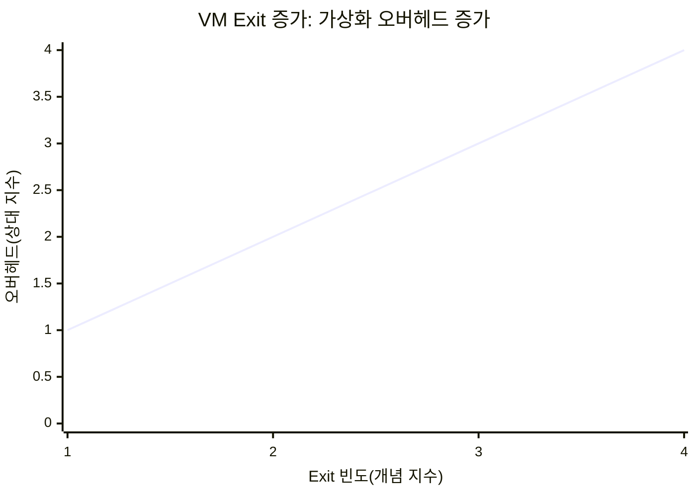
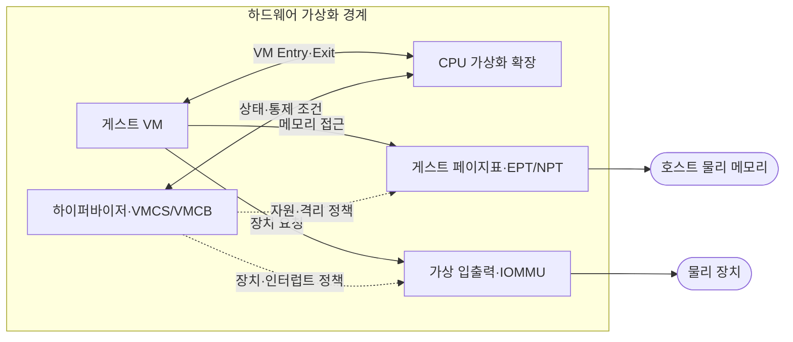
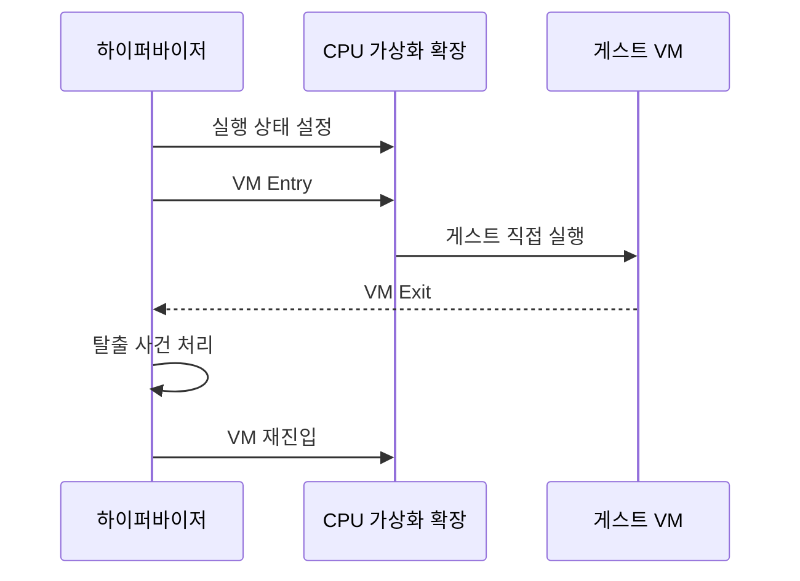

---
sidebar:
  order: 85
  label: "085. 하드웨어 가상화 — VT-x·AMD-V (Hardware Virtualization)"
  badge:
    text: "기출 · 70%"
    variant: note
title: "하드웨어 가상화 — VT-x·AMD-V (Hardware Virtualization)"
date: "2026-07-27T23:59:59+09:00"
tags:
  - "notes-hardware"
weight: 85
extra:
  question_no: "085"
  source_status: "기출"
  source_history: "137회"
  priority: 70
  priority_note: "VM 전환·2단계 주소 변환 병목"
---

## 미리 알고가기

- **하드웨어 가상화(Hardware Virtualization)**: 처리기가 게스트 실행·격리를 직접 지원
- **중앙처리장치(Central Processing Unit, CPU)**: 명령 실행·주소 변환을 담당하는 처리기
- **가상머신(Virtual Machine, VM)**: 격리된 가상 하드웨어에서 실행하는 시스템
- **하이퍼바이저(Hypervisor)**: VM 자원·실행 상태를 중재하는 제어 계층
- **인텔 가상화 기술(Intel Virtualization Technology for x86, VT-x)**: ‘브이티 엑스’로 읽고 Virtualization Technology의 머리글자와 x86의 x를 붙인 제품 표기이며 인텔 CPU의 게스트 실행·전환을 지원함
- **AMD 가상화(AMD Virtualization, AMD-V)**: ‘에이엠디 브이’로 읽고 제조사명 AMD와 Virtualization의 머리글자 V를 붙인 제품 표기이며 AMD CPU의 게스트 실행·전환을 지원함
- **가상머신 제어 구조(Virtual-Machine Control Structure, VMCS)**: 인텔의 게스트 상태·전환 제어 구조
- **가상머신 제어 블록(Virtual Machine Control Block, VMCB)**: AMD의 게스트 상태·전환 제어 구조
- **가상머신 진입(VM Entry)**: 하이퍼바이저에서 게스트로 제어권 전환
- **가상머신 탈출(VM Exit)**: 통제 사건에서 하이퍼바이저로 제어권 회수
- **확장 페이지 테이블(Extended Page Tables, EPT)**: 게스트 물리 주소를 호스트 물리 주소로 변환
- **중첩 페이지 테이블(Nested Page Tables, NPT)**: 게스트 물리 주소를 호스트 물리 주소로 변환
- **변환 참조 버퍼(Translation Lookaside Buffer, TLB)**: 최근 주소 변환 캐시
- **2단계 주소 변환(Two-stage Address Translation)**: 게스트 가상 주소를 게스트 물리 주소로, 다시 호스트 물리 주소로 바꾸는 변환
- **페이지 테이블 순회(Page-table Walk)**: TLB에 변환값이 없을 때 메모리의 페이지 테이블 계층을 따라 주소를 찾는 동작
- **가상 인터럽트(Virtual Interrupt)**: 하이퍼바이저나 하드웨어가 물리 장치 사건을 게스트 운영체제에 전달하는 가상 알림
- **직접 메모리 접근(Direct Memory Access, DMA)**: 장치가 처리기 없이 메모리에 접근
- **입출력 메모리 관리 장치(Input-Output Memory Management Unit, IOMMU)**: 장치 DMA 주소 변환·격리
- **불균일 메모리 접근(Non-Uniform Memory Access, NUMA)**: CPU 위치별 메모리 지연 차이
- **명령어 집합 구조(Instruction Set Architecture, ISA)**: 명령 형식·동작의 처리기 규약
- **준가상 드라이버(Paravirtualized Driver)**: 하이퍼바이저를 인식하는 가상 장치 드라이버
- **인터럽트 병합(Interrupt Coalescing)**: 여러 장치 알림을 하나의 인터럽트로 결합
- **에뮬레이션·이진 변환(Emulation·Binary Translation)**: 에뮬레이션은 다른 하드웨어 동작을 소프트웨어로 재현하고 이진 변환은 게스트 명령을 호스트 명령으로 바꿈
- **큰 페이지(Huge Page)**: 기본 페이지보다 큰 주소 단위를 사용해 TLB 항목 하나가 더 넓은 메모리를 덮게 하는 페이지

## Ⅰ. 개요

- 정의/개념: CPU 실행 모드·주소 변환으로 **게스트를 격리 실행**하는 기술
- 기존 한계: 소프트웨어 명령 변환은 **실행 오버헤드·호환 복잡도** 증가

### 쉽게 이해하기 (학습용)

- 손님은 방 안에서 직접 일하고 통제가 필요한 사건만 관리실이 처리한다.

## Ⅱ. 특징

- **비특권 명령 직접 실행**으로 명령 변환 비용 절감
- **EPT·NPT 2단계 주소 변환**으로 게스트 메모리 격리
- **VM Exit**가 특권 연산·입출력 전환 지연 증가

### 쉽게 이해하기 (학습용)

- 방 안에서는 빠르게 일하지만 관리실 호출과 주소 장부 조회가 잦으면 느려진다.

## Ⅲ. 아키텍처 및 구성요소

| 설계 요소 | 설명 |
|:---|:---|
| 게스트 VM | 가상 CPU·메모리·장치에서 운영체제 실행 |
| CPU 가상화 확장 | 게스트 모드·진입·탈출 처리 |
| 하이퍼바이저·VMCS/VMCB | 상태 저장·Exit 조건·자원 정책 관리 |
| 게스트 페이지표·EPT/NPT | 가상→게스트 물리→호스트 물리 변환 |
| 가상 입출력·IOMMU | 장치 요청·DMA 주소·인터럽트 격리 |

> 요약: CPU·주소·입출력 확장이 게스트 경계를 집행

### 쉽게 이해하기 (학습용)

- 관리실은 손님 상태와 주소 장부와 장치 통로를 각각 분리해 관리한다.

## Ⅳ. 원리 및 절차 흐름도

| 절차 | 설명 |
|:---|:---|
| 실행 상태 설정 | VMCS/VMCB·EPT/NPT·Exit 조건 구성 |
| VM Entry | 저장 상태를 적재해 게스트로 전환 |
| 게스트 직접 실행 | 일반 명령을 CPU에서 직접 처리 |
| VM Exit | 지정 사건·예외에서 제어권 회수 |
| 탈출 사건 처리 | 장치·특권·예외를 하이퍼바이저가 처리 |
| VM 재진입 | 갱신 상태로 게스트 실행 재개 |

> 요약: 직접 실행 중 통제 사건만 Exit 처리 후 재진입

### 쉽게 이해하기 (학습용)

- 손님이 직접 일하다 허가가 필요한 사건만 관리실을 거쳐 다시 방으로 간다.

## Ⅴ. 종류 및 비교

| 가상화 실행 방식 | 하드웨어 지원 가상화 | 소프트웨어 에뮬레이션·이진 변환 |
|:---|:---|:---|
| 적용 기준 | 동일 ISA **VM 직접 실행** | 다른 ISA·**장치 동작 재현** |
| 핵심 특징 | 게스트의 **비특권 명령 직접 실행** | 명령 **해석·변환 후 실행** |
| 한계 | VM Exit·**TLB 미스·I/O 중재** | 해석·변환·**모형 갱신 비용** |

> 요약: 동일 ISA VM은 하드웨어 지원으로 직접 실행

### 쉽게 이해하기 (학습용)

- 같은 언어의 손님은 직접 일하고 다른 언어의 장비는 통역해 실행한다.

## Ⅵ. 실무 사례

1. 클라우드 VM은 **인터럽트 병합·준가상 드라이버**로 Exit 축소

### 쉽게 이해하기 (학습용)

- 여러 장치 알림을 묶고 전용 통로를 써 관리실 호출을 줄인다.

## Ⅶ. 결론

- 가상머신의 격리 성능과 하이퍼바이저 단순성을 확보하기 위해 **게스트 ISA·특권 명령·2단계 주소 변환·I/O 가상화·전환 비용**을 검토하고, 동일 ISA 게스트의 직접 실행에는 하드웨어 가상화를 적용한다

### 쉽게 이해하기 (학습용)

- 직접 일하는 이득이 관리실 호출과 주소·장치 통로 비용보다 클 때 사용한다.
