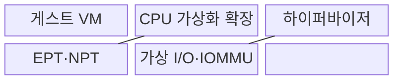
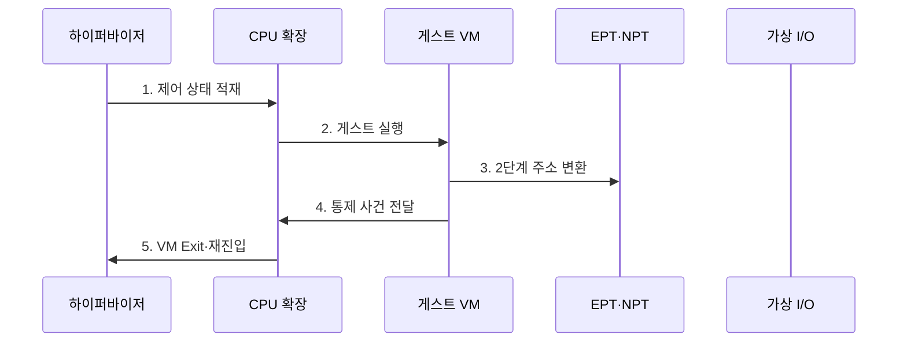

---
sidebar:
  order: 85
  label: "085. 하드웨어 가상화: VT-x·AMD-V (Hardware Virtualization)"
  badge:
    text: "기출 · 70%"
    variant: note
title: "하드웨어 가상화: VT-x·AMD-V (Hardware Virtualization)"
date: "2026-07-30T18:00:00+09:00"
tags:
  - "notes-hardware"
weight: 85
extra:
  question_no: "085"
  source_status: "기출"
  source_history: "137회"
  priority: 70
  priority_note: "VM 전환·2단계 주소 변환 병목"
---

## 미리 알고가기

- **하드웨어 가상화(Hardware Virtualization)**: 처리기가 게스트 실행·격리를 직접 지원
- **중앙처리장치(Central Processing Unit, CPU)**: 명령 실행·주소 변환을 담당하는 처리기
- **가상머신(Virtual Machine, VM)**: 격리된 가상 하드웨어에서 실행하는 시스템
- **하이퍼바이저(Hypervisor)**: VM 자원·실행 상태를 중재하는 제어 계층
- **인텔 가상화 기술(Intel Virtualization Technology for x86, VT-x)**: 인텔 x86 프로세서에서 게스트 실행 모드와 하이퍼바이저 전환을 지원하는 하드웨어 기능
- **AMD 가상화(AMD Virtualization, AMD-V)**: AMD x86 프로세서에서 게스트 실행 모드와 하이퍼바이저 전환을 지원하는 하드웨어 기능
- **가상머신 제어 구조(Virtual-Machine Control Structure, VMCS)**: 인텔의 게스트 상태·전환 제어 구조
- **가상머신 제어 블록(Virtual Machine Control Block, VMCB)**: AMD의 게스트 상태·전환 제어 구조
- **가상머신 진입(VM Entry)**: 하이퍼바이저에서 게스트로 제어권 전환
- **가상머신 탈출(VM Exit)**: 통제 사건에서 하이퍼바이저로 제어권 회수
- **확장 페이지 테이블(Extended Page Tables, EPT)**: 게스트 물리 주소를 호스트 물리 주소로 변환
- **중첩 페이지 테이블(Nested Page Tables, NPT)**: 게스트 물리 주소를 호스트 물리 주소로 변환
- **변환 참조 버퍼(Translation Lookaside Buffer, TLB)**: 최근 주소 변환 캐시
- **2단계 주소 변환(Two-stage Address Translation)**: 게스트 가상 주소를 게스트 물리 주소로, 다시 호스트 물리 주소로 바꾸는 변환
- **페이지 테이블 순회(Page-table Walk)**: TLB에 변환값이 없을 때 메모리의 페이지 테이블 계층을 따라 주소를 찾는 동작
- **가상 인터럽트(Virtual Interrupt)**: 하이퍼바이저나 하드웨어가 물리 장치 사건을 게스트 운영체제에 전달하는 가상 알림
- **직접 메모리 접근(Direct Memory Access, DMA)**: 장치가 처리기 없이 메모리에 접근
- **입출력 메모리 관리 장치(Input-Output Memory Management Unit, IOMMU)**: 장치 DMA 주소 변환·격리
- **불균일 메모리 접근(Non-Uniform Memory Access, NUMA)**: CPU 위치별 메모리 지연 차이
- **명령어 집합 구조(Instruction Set Architecture, ISA)**: 명령 형식·동작의 처리기 규약
- **준가상 드라이버(Paravirtualized Driver)**: 하이퍼바이저를 인식하는 가상 장치 드라이버
- **인터럽트 병합(Interrupt Coalescing)**: 여러 장치 알림을 하나의 인터럽트로 결합
- **에뮬레이션·이진 변환(Emulation·Binary Translation)**: 에뮬레이션은 다른 하드웨어 동작을 소프트웨어로 재현하고 이진 변환은 게스트 명령을 호스트 명령으로 바꿈
- **큰 페이지(Huge Page)**: 기본 페이지보다 큰 주소 단위를 사용해 TLB 항목 하나가 더 넓은 메모리를 덮게 하는 페이지
- **가상 CPU(Virtual CPU, vCPU)**: VM에 할당되어 물리 CPU 시간으로 실행되는 논리 처리기
- **TLB 미스(TLB Miss)**: 필요한 주소 변환값이 TLB에 없어 페이지 테이블을 조회해야 하는 상태
- **완료 큐(Completion Queue)**: 장치가 끝낸 요청의 상태와 결과 위치를 기록하는 큐
- **장치 직접 할당(Device Passthrough)**: 물리 장치를 특정 VM이 직접 사용하도록 배정하는 방식
- **NUMA 노드(NUMA Node)**: CPU와 가까운 로컬 메모리를 하나의 접근 지연 영역으로 묶은 단위

## Ⅰ. 개요

- 정의/개념: CPU 확장으로 **게스트를 격리 실행**하는 기술
- 배경/필요성: 명령 변환의 **실행 비용·호환 복잡도** 감소

### 쉽게 이해하기 (학습용)

- 손님은 방 안에서 직접 일하고 통제가 필요한 사건만 관리실이 처리한다.

## Ⅱ. 특징

- **비특권 명령 직접 실행**으로 변환 비용 절감
- **EPT·NPT 주소 변환**으로 메모리 격리
- 잦은 **VM Exit**는 전환 지연 증가

### 쉽게 이해하기 (학습용)

- 게스트 명령은 직접 실행되지만 VM Exit와 중첩 페이지 테이블 조회가 잦으면 가상화 오버헤드가 증가한다.

## Ⅲ. 구조 및 구성요소

| 구성요소 | 책임 |
|:---|:---|
| 게스트 VM | **운영체제·응용 실행** |
| CPU 가상화 확장 | **진입·탈출 전환** |
| 하이퍼바이저 | **상태·자원 중재** |
| EPT·NPT | **2단계 주소 변환** |
| 가상 I/O·IOMMU | **장치·DMA 격리** |

### 쉽게 이해하기 (학습용)

- 일반 명령은 방 안에서 직접 실행하고, 권한·장치 처리가 필요한 사건만 VM Exit로 관리실에 넘긴 뒤 다시 들어간다.

## Ⅳ. 흐름도

**동작 원리**

- **1. 제어 상태 적재**: 레지스터·Exit 조건 설정
- **2. 게스트 실행**: VM Entry 후 비특권 명령 직접 수행
- **3. 2단계 주소 변환**: 게스트 가상 주소를 EPT·NPT로 호스트 물리 주소에 매핑
- **4. 통제 사건 전달**: 민감 명령·I/O·예외에서 제어권 회수
- **5. VM Exit·재진입**: 원인 처리와 상태 갱신 후 게스트 실행 재개

### 쉽게 이해하기 (학습용)

- 통제가 필요한 사건만 관리자가 처리하고 실행을 재개한다.

## Ⅴ. 종류 및 비교

| 구분 | 하드웨어 지원 가상화 | 에뮬레이션·이진 변환 |
|:---|:---|:---|
| 적용 기준 | 동일 ISA **VM 직접 실행** | 다른 ISA·**장치 동작 재현** |
| 핵심 특징 | 게스트의 **비특권 명령 직접 실행** | 명령 **해석·변환 후 실행** |
| 한계 | VM Exit·**TLB 미스·I/O 중재** | 해석·변환·**모형 갱신 비용** |

> 요약: 동일 ISA의 VM은 하드웨어 지원으로 직접 실행한다.

### 쉽게 이해하기 (학습용)

- 같은 언어의 손님은 직접 일하고 다른 언어의 장비는 통역해 실행한다.

## Ⅵ. 실무 고려사항 및 대책

| 고려사항 | 대책 | 효과 |
|:---|:---|:---|
| 잦은 VM Exit로 전환 지연 증가 | Exit 원인 계측과 준가상 장치·인터럽트 병합 적용 | 가상 CPU 처리량 향상 |
| 2단계 페이지 순회로 TLB 미스 비용 증폭 | 큰 페이지·TLB 지역성과 메모리 배치 최적화 | 주소 변환 지연 감소 |
| vCPU·메모리의 원격 NUMA 배치 | vCPU·메모리·장치의 동일 NUMA 노드 배치 | 원격 접근 지연 축소 |
| 장치 직접 할당이 VM 격리 약화 | IOMMU 최소 권한과 재할당 전 장치 초기화 | DMA 침해·잔류 상태 방지 |

### 쉽게 이해하기 (학습용)

- 여러 장치 알림을 묶고 전용 통로를 써 관리실 호출을 줄인다.

## Ⅶ. 결론

- VM Exit·주소 변환 비용으로 **하드웨어 가상화**를 적용한다.

### 쉽게 이해하기 (학습용)

- 직접 일하는 이득이 관리실 호출과 주소·장치 통로 비용보다 클 때 사용한다.
