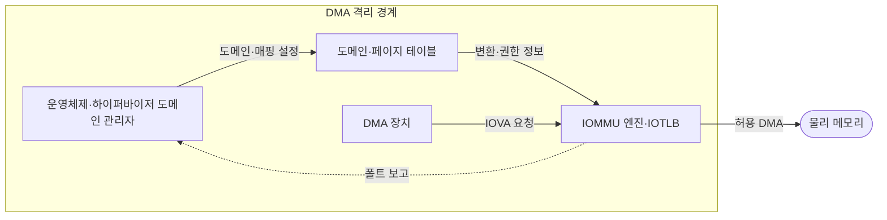
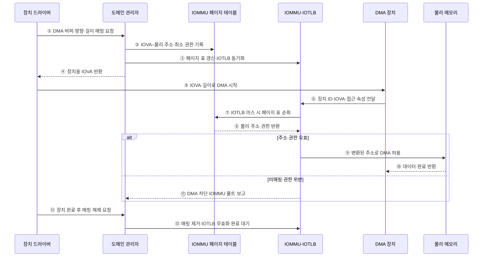

---
sidebar:
  order: 86
  label: "086. 입출력 메모리 관리 장치 (IOMMU)"
  badge:
    text: "기출 · 70%"
    variant: note
title: "입출력 메모리 관리 장치 (IOMMU)"
date: "2026-07-27T23:59:59+09:00"
tags:
  - "notes-hardware"
weight: 86
extra:
  question_no: "086"
  source_status: "기출"
  source_history: "137회"
  priority: 70
  priority_note: "DMA 주소·권한 격리와 IOTLB 비용"
---

## 미리 알고가기

- **입출력 메모리 관리 장치(Input-Output Memory Management Unit, IOMMU)**: DMA 주소 변환·권한 검사 장치
- **직접 메모리 접근(Direct Memory Access, DMA)**: 장치가 처리기 없이 메모리를 읽고 쓰는 방식
- **가상머신(Virtual Machine, VM)**: 격리된 가상 하드웨어에서 실행하는 시스템
- **입출력 가상 주소(Input/Output Virtual Address, IOVA)**: 장치가 DMA 요청에 사용하는 주소
- **IOMMU 도메인(IOMMU Domain)**: 변환표·권한을 공유하는 장치 격리 단위
- **입출력 변환 참조 버퍼(Input/Output Translation Lookaside Buffer, IOTLB)**: 최근 IOVA 변환 캐시
- **IOTLB 적중·미스·무효화(Hit·Miss·Invalidation)**: 적중은 캐시 변환 사용, 미스는 페이지 표 조회, 무효화는 낡은 변환 제거를 뜻함
- **페이지 테이블 순회(Page-table Walk)**: IOTLB 미스 때 메모리의 변환표 계층을 따라 물리 주소와 권한을 찾는 동작
- **IOMMU 폴트(IOMMU Fault)**: 무효·권한 밖 DMA를 차단한 예외
- **단일 루트 입출력 가상화(Single Root I/O Virtualization, SR-IOV)**: 장치를 가상 기능으로 나누는 기술
- **가상 기능(Virtual Function, VF)**: SR-IOV 장치가 VM에 직접 할당하도록 제공하는 경량 PCIe 기능
- **장치 직접 할당(Device Passthrough)**: 물리 장치나 가상 기능을 특정 VM이 하이퍼바이저 중재 없이 사용하게 하는 방식
- **드라이버 버퍼(Driver Buffer)**: 장치와 운영체제 드라이버가 DMA로 데이터를 주고받도록 할당한 메모리 영역

## Ⅰ. 개요

- 정의/개념: IOVA 변환·권한 검사로 **장치 DMA를 격리**하는 장치
- 기존 한계: 직접 DMA는 **임의 물리 메모리 침범·데이터 훼손** 가능

### 쉽게 이해하기 (학습용)

- 장치가 낸 방 번호를 실제 주소로 바꾸고 허가된 방에만 들이는 경비실이다.

## Ⅱ. 특징

- **장치·VM별 변환 도메인**으로 DMA 접근 범위 분리
- **IOVA→물리 주소 변환**과 페이지 권한 동시 검사
- **IOTLB 미스·무효화**가 장치 주소 변환 지연 증가

### 쉽게 이해하기 (학습용)

- 장치마다 출입 구역을 나누되 주소 기록을 자주 못 찾거나 바꾸면 확인이 느려진다.

## Ⅲ. 아키텍처 및 구성요소

### 도표안 A. IOMMU DMA 격리 정적 구조

| 설계 요소 | 입력·상태 | 역할 |
|:---|:---|:---|
| 도메인 관리자 | 장치 식별자·버퍼·권한 | 장치·VM별 매핑과 폴트 정책 관리 |
| 도메인·페이지 테이블 | IOVA·물리 주소·권한 | 변환·접근 범위 저장 |
| IOMMU 엔진·IOTLB | DMA 주소·접근 속성 | 변환 캐시 조회·주소·권한 검사 |
| DMA 장치 | IOVA·길이·읽기·쓰기 | 메모리 접근 요청 |

> 요약: 도메인 표와 IOMMU가 장치별 DMA 경계 집행

### 쉽게 이해하기 (학습용)

- 관리자가 장치별 명단을 만들고 경비실이 주소와 권한을 검사한다.

### 도표안 B. DMA 버퍼 매핑·접근·해제 시퀀스

#### 동작 원리

1. **버퍼 매핑 요청**: 드라이버가 DMA 버퍼의 물리 페이지, 전송 방향과 길이를 도메인 관리자에 전달한다.
2. **최소 권한 기록**: 관리자가 장치 도메인의 페이지 표에 필요한 범위만 읽기·쓰기 권한으로 연결한다.
3. **변환 동기화**: 페이지 표 기록 뒤 메모리 순서와 기존 IOTLB 항목을 동기화한다.
4. **IOVA 반환**: 드라이버에는 물리 주소가 아닌 장치가 사용할 IOVA를 반환한다.
5. **장치 기동**: 드라이버가 IOVA와 전송 길이를 장치 디스크립터에 기록해 DMA를 시작한다.
6. **변환 요청**: 장치의 DMA 요청이 장치 식별자·주소·읽기·쓰기 속성과 함께 IOMMU에 도착한다.
7. **페이지 표 순회**: IOTLB에 변환이 없으면 IOMMU가 해당 도메인의 페이지 표를 조회한다.
8. **주소·권한 반환**: 페이지 표가 호스트 물리 주소와 허용 접근 속성을 반환한다.
9. **정상 DMA 허용**: 요청 범위와 권한이 맞으면 변환된 물리 주소로만 메모리 접근을 전달한다.
10. **전송 완료**: 메모리 데이터와 장치 완료 상태가 원래 DMA 요청에 반환된다.
11. **위반 차단**: 미매핑 주소나 권한 밖 접근은 메모리로 보내지 않고 폴트로 기록·격리한다.
12. **매핑 해제 요청**: 장치가 더 이상 버퍼를 사용하지 않음을 확인한 뒤 드라이버가 매핑 제거를 요청한다.
13. **낡은 변환 제거**: 관리자가 매핑을 제거하고 IOTLB 무효화 완료를 기다린 뒤에만 물리 페이지를 재사용한다.

### 쉽게 이해하기 (학습용)

- 버퍼를 쓸 때만 장치용 주소와 권한을 열고, 작업이 끝나면 낡은 주소 기록까지 지운 뒤 메모리를 재사용한다.

## Ⅳ. 종류 및 비교

| DMA 주소 보호 | IOMMU 사용 | IOMMU 미사용 |
|:---|:---|:---|
| 적용 기준 | 장치 직접 할당·**외부 확장 포트** | 신뢰된 **단일 목적 장치** |
| 핵심 특징 | IOVA 변환·**권한 기반 DMA 격리** | 장치 주소의 **물리 메모리 직접 접근** |
| 한계 | IOTLB 미스·**매핑 무효화 지연** | 임의 메모리 침범·**데이터 훼손** |

> 요약: 직접 DMA 장치는 IOMMU로 허용 버퍼만 공개

### 쉽게 이해하기 (학습용)

- 외부 장치와 VM에 넘긴 장치에는 필요한 메모리 방의 열쇠만 줘야 한다.

## Ⅴ. 실무 고려사항 및 대응 방안

| 운영 위험 | 대응 | 기대 효과 |
|:---|:---|:---|
| 장치에 과도한 DMA 범위 매핑 | 전송 시점·버퍼 단위 최소 권한 매핑 | 메모리 노출 범위 축소 |
| 작은 페이지·분산 버퍼로 IOTLB 미스 증가 | 연속 버퍼·적정 큰 페이지와 배치 처리 | 변환 순회 비용 감소 |
| 매핑 변경 뒤 낡은 IOTLB 항목 사용 | 변경 순서·무효화 완료 동기화 | 해제 메모리 오접근 방지 |
| 반복 폴트를 단순 장애로만 처리 | 장치·도메인·주소별 감사 로그와 격리 | 공격·드라이버 결함 조기 탐지 |

### 쉽게 이해하기 (학습용)

- 주소와 열쇠가 모두 맞는 장치 요청만 실제 방으로 보낸다.

### 적용 사례

- SR-IOV 네트워크는 각 가상 기능을 해당 VM의 IOMMU 도메인에 연결해 할당된 게스트 메모리만 DMA하도록 제한한다.

### 쉽게 이해하기 (학습용)

- 각 가상 네트워크 기능에 자기 메모리 구역만 연다.

## Ⅵ. 결론

- 장치 DMA로 인한 메모리 침해를 방지하면서 I/O 성능을 유지하기 위해 **장치별 주소 공간·DMA 허용 범위·페이지 크기·IOTLB 무효화 비용**을 검토하고, IOMMU에 최소권한 매핑을 적용한다

### 쉽게 이해하기 (학습용)

- 장치마다 필요한 방만 열고 주소 명단을 바꾸는 횟수를 줄인다.
