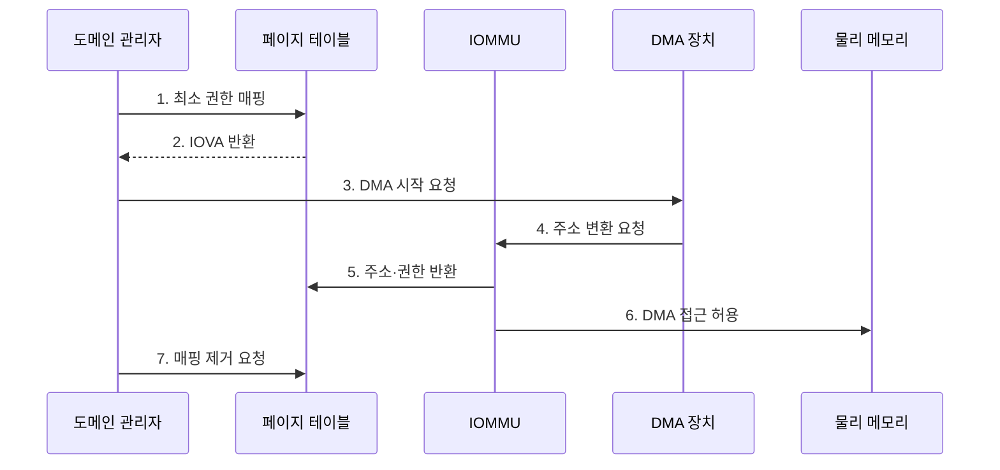

---
sidebar:
  order: 86
  label: "086. 입출력 메모리 관리 장치 (IOMMU)"
  badge:
    text: "기출 · 70%"
    variant: note
title: "입출력 메모리 관리 장치 (IOMMU)"
date: "2026-07-27T23:59:59+09:00"
tags:
  - "notes-hardware"
weight: 86
extra:
  question_no: "086"
  source_status: "기출"
  source_history: "137회"
  priority: 70
  priority_note: "DMA 주소·권한 격리와 IOTLB 비용"
---

## 미리 알고가기

- **입출력 메모리 관리 장치(Input-Output Memory Management Unit, IOMMU)**: DMA 주소 변환·권한 검사 장치
- **직접 메모리 접근(Direct Memory Access, DMA)**: 장치가 처리기 없이 메모리를 읽고 쓰는 방식
- **가상머신(Virtual Machine, VM)**: 격리된 가상 하드웨어에서 실행하는 시스템
- **입출력 가상 주소(Input/Output Virtual Address, IOVA)**: 장치가 DMA 요청에 사용하는 주소
- **IOMMU 도메인(IOMMU Domain)**: 변환표·권한을 공유하는 장치 격리 단위
- **입출력 변환 참조 버퍼(Input/Output Translation Lookaside Buffer, IOTLB)**: 최근 IOVA 변환 캐시
- **IOTLB 적중·미스·무효화(Hit·Miss·Invalidation)**: 적중은 캐시 변환 사용, 미스는 페이지 표 조회, 무효화는 낡은 변환 제거를 뜻함
- **페이지 테이블 순회(Page-table Walk)**: IOTLB 미스 때 메모리의 변환표 계층을 따라 물리 주소와 권한을 찾는 동작
- **IOMMU 폴트(IOMMU Fault)**: 무효·권한 밖 DMA를 차단한 예외
- **단일 루트 입출력 가상화(Single Root I/O Virtualization, SR-IOV)**: 장치를 가상 기능으로 나누는 기술
- **가상 기능(Virtual Function, VF)**: SR-IOV 장치가 VM에 직접 할당하도록 제공하는 경량 PCIe 기능
- **장치 직접 할당(Device Passthrough)**: 물리 장치나 가상 기능을 특정 VM이 하이퍼바이저 중재 없이 사용하게 하는 방식
- **드라이버 버퍼(Driver Buffer)**: 장치와 운영체제 드라이버가 DMA로 데이터를 주고받도록 할당한 메모리 영역
- **장치 디스크립터(Device Descriptor)**: 장치가 처리할 버퍼 주소·길이·명령을 기록한 메모리 구조
- **메모리 순서(Memory Ordering)**: 여러 메모리 읽기·쓰기가 다른 구성요소에 관측되는 순서

## Ⅰ. 개요

- 정의/개념: IOVA 변환으로 **장치 DMA를 격리**하는 장치
- 배경/필요성: 직접 DMA의 **메모리 침범·데이터 훼손** 방지

### 쉽게 이해하기 (학습용)

- 장치가 낸 방 번호를 실제 주소로 바꾸고 허가된 방에만 들이는 경비실이다.

## Ⅱ. 특징

- **장치·VM별 변환 도메인**으로 DMA 접근 범위 분리
- **IOVA→물리 주소 변환**과 페이지 권한 동시 검사
- **IOTLB 미스·무효화**가 장치 주소 변환 지연 증가

### 쉽게 이해하기 (학습용)

- 장치마다 출입 구역을 나누되 주소 기록을 자주 못 찾거나 바꾸면 확인이 느려진다.

## Ⅲ. 구조 및 구성요소

| 구성요소 | 책임 |
|:---|:---|
| 도메인 관리자 | **매핑·권한 관리** |
| 페이지 테이블 | **주소·권한 저장** |
| IOMMU·IOTLB | **변환·접근 검증** |
| DMA 장치 | **메모리 접근 요청** |

### 쉽게 이해하기 (학습용)

- 버퍼를 쓸 때만 장치용 주소와 권한을 열고, 작업이 끝나면 낡은 주소 기록까지 지운 뒤 메모리를 재사용한다.

## Ⅳ. 흐름도

**동작 원리**

- **1. 최소 권한 매핑**: 필요한 범위만 연결
- **2. IOVA 반환**: 장치용 주소 제공
- **3. DMA 시작 요청**: 주소·길이 전달
- **4. 주소 변환 요청**: 장치 ID·IOVA 전달
- **5. 주소·권한 반환**: 접근 범위 검증
- **6. DMA 접근 허용**: 유효 요청만 전달
- **7. 매핑 제거 요청**: 완료 후 연결 해제

### 쉽게 이해하기 (학습용)

- 장치에는 필요한 방의 열쇠만 주고 작업 후 회수한다.

## Ⅴ. 종류 및 비교

| 구분 | IOMMU 사용 | IOMMU 미사용 |
|:---|:---|:---|
| 적용 기준 | 장치 직접 할당·**외부 확장 포트** | 신뢰된 **단일 목적 장치** |
| 핵심 특징 | IOVA 변환·**권한 기반 DMA 격리** | 장치 주소의 **물리 메모리 직접 접근** |
| 한계 | IOTLB 미스·**매핑 무효화 지연** | 임의 메모리 침범·**데이터 훼손** |

> 요약: 직접 DMA 장치에는 IOMMU로 허용 버퍼만 공개한다.

### 쉽게 이해하기 (학습용)

- 외부 장치와 VM에 넘긴 장치에는 필요한 메모리 방의 열쇠만 줘야 한다.

## Ⅵ. 실무 고려사항 및 대책

| 고려사항 | 대책 | 효과 |
|:---|:---|:---|
| 장치에 과도한 DMA 범위 매핑 | 전송 시점·버퍼 단위 최소 권한 매핑 | 메모리 노출 범위 축소 |
| 작은 페이지·분산 버퍼로 IOTLB 미스 증가 | 연속 버퍼·적정 큰 페이지와 배치 처리 | 변환 순회 비용 감소 |
| 매핑 변경 뒤 낡은 IOTLB 항목 사용 | 변경 순서·무효화 완료 동기화 | 해제 메모리 오접근 방지 |
| 반복 폴트를 단순 장애로만 처리 | 장치·도메인·주소별 감사 로그와 격리 | 공격·드라이버 결함 조기 탐지 |

### 쉽게 이해하기 (학습용)

- 각 가상 네트워크 기능에 자기 메모리 구역만 연다.

## Ⅶ. 결론

- DMA 범위·IOTLB 비용으로 **IOMMU 매핑**을 적용한다.

### 쉽게 이해하기 (학습용)

- 장치마다 필요한 방만 열고 주소 명단을 바꾸는 횟수를 줄인다.
