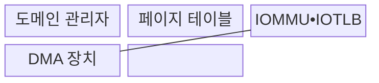
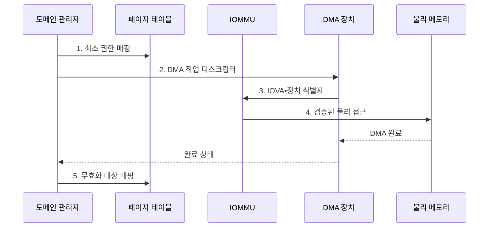

---
sidebar:
  order: 86
  label: "086. 입출력 메모리 관리 장치 (IOMMU)"
  badge:
    text: "기출 • 70%"
    variant: note
title: "입출력 메모리 관리 장치 (IOMMU)"
date: "2026-08-03T09:07:03+09:00"
tags:
  - "notes-hardware"
weight: 86
extra:
  question_no: "086"
  source_status: "기출"
  source_history: "137회"
  priority: 70
  priority_note: "DMA 주소•권한 격리와 IOTLB 비용"
---

## Ⅰ. 개요

핵심 용어

- **IOMMU**: 장치가 낸 IOVA를 물리 주소로 변환하고 DMA 접근 권한을 검사하는 하드웨어이다.
- **직접 메모리 접근(DMA)**: 장치가 처리기를 거치지 않고 메모리를 읽고 쓰는 방식이다.

- 정의/개념: 장치의 IOVA를 물리 주소로 변환하고 **DMA 접근 권한을 검사하는 하드웨어**
- 배경/필요성: 직접 DMA에는 주소•권한 중재가 없어 **메모리 침범•데이터 훼손**

#### 한줄 요약

- 장치가 낸 방 번호를 실제 주소로 바꾸고 허가된 방에만 들이는 경비실이다.

## Ⅱ. 특징

핵심 용어

- **IOMMU 도메인**: 변환표와 접근 권한을 공유하는 장치 격리 단위이다.
- **입출력 가상 주소(IOVA)**: 장치가 DMA 요청에 사용하는 가상 주소이다.
- **IOTLB**: 최근의 IOVA 변환 결과를 저장하는 주소 변환 캐시이다.

- **장치•VM별 도메인•SR-IOV** 로 직접 할당 DMA 범위 분리
- **IOVA→물리 주소 변환** 과 페이지 권한 동시 검사
- **IOTLB 미스•무효화** 가 장치 주소 변환 지연 증가

#### 한줄 요약

- 장치마다 출입 구역을 나누되 주소 기록을 자주 못 찾거나 바꾸면 확인이 느려진다.

## Ⅲ. 구조 및 구성요소

핵심 용어

- **페이지 테이블**: IOVA와 물리 주소의 대응 및 접근 권한을 기록하는 계층형 자료구조이다.
- **SR-IOV 가상 기능(VF)**: 하나의 PCIe 장치가 VM별 직접 할당을 위해 제공하는 경량 기능이다.

| 구성요소 | 책임 |
|:---|:---|
| 도메인 관리자 | **매핑•권한 관리** |
| 페이지 테이블 | **주소•권한 저장** |
| IOMMU•IOTLB | **변환•접근 검증** |
| DMA 장치 | **메모리 접근 요청** |

#### 한줄 요약

- 건물 관리자가 출입 명단과 방 번호표를 두고 경비실이 장치의 열쇠를 검사하듯, 도메인 관리자•페이지 테이블•IOMMU가 DMA 범위를 나눈다.

## Ⅳ. 흐름도

핵심 용어

- **페이지 테이블 순회**: IOTLB 미스 때 변환표 계층을 따라 물리 주소와 권한을 찾는 동작이다.
- **IOMMU 폴트**: 무효 주소나 허용 범위 밖의 DMA 요청을 차단하면서 발생하는 예외이다.

**동작 원리**

1. **최소 권한 매핑**: 전송에 필요한 버퍼 범위만 도메인에 연결
2. **DMA 작업 디스크립터**: 장치에 IOVA•길이•작업 종류 전달
3. **IOVA•장치 식별자**: 장치가 속한 도메인의 주소•권한 조회
4. **검증된 물리 접근**: 유효 요청을 물리 주소로 변환해 메모리에 전달
5. **무효화 대상 매핑**: 완료 후 낡은 매핑과 IOTLB 항목 제거

#### 한줄 요약

- 장치에는 필요한 방의 열쇠만 주고 작업 후 회수한다.

## Ⅴ. 종류 및 비교

핵심 용어

- **장치 직접 할당**: 물리 장치나 가상 기능을 특정 VM이 하이퍼바이저 중재 없이 사용하게 하는 방식이다.
- **권한 기반 DMA 격리**: 장치마다 허용된 메모리 범위만 접근하도록 IOMMU가 요청을 검사하는 방식이다.

| DMA 격리 방식 | IOMMU 사용 | IOMMU 미사용 |
|:---|:---|:---|
| 적용 기준 | 장치 직접 할당•**외부 확장 포트** | 신뢰된 **단일 목적 장치** |
| 핵심 특징 | IOVA 변환•**권한 기반 DMA 격리** | 장치 주소의 **물리 메모리 직접 접근** |
| 한계 | IOTLB 미스•**매핑 무효화 지연** | 임의 메모리 침범•**데이터 훼손** |

> 요약: 직접 DMA 장치에는 IOMMU로 허용 버퍼만 공개한다.

#### 한줄 요약

- 외부 장치와 VM에 넘긴 장치에는 필요한 메모리 방의 열쇠만 줘야 한다.

## Ⅵ. 실무 고려사항 및 대책

핵심 용어

- **IOTLB 무효화**: 매핑 변경 뒤 캐시에 남은 낡은 주소 변환을 제거하는 동작이다.
- **큰 페이지**: IOTLB 항목 하나가 더 넓은 메모리 영역을 덮게 하는 큰 주소 단위이다.
- **드라이버 버퍼**: 장치와 운영체제 드라이버가 DMA로 데이터를 교환하도록 할당한 메모리 영역이다.

| 문제 | 대책 | 효과 |
|:---|:---|:---|
| 장치에 과도한 DMA 범위를 열어 **메모리 노출 확대** | 전송 시점•버퍼 단위 **최소 권한 매핑** | **DMA 접근 범위** 축소 |
| 작은 페이지•분산 버퍼로 **IOTLB 미스 증가** | **연속 버퍼•큰 페이지** 적용 | **페이지 테이블 순회 비용** 감소 |
| 매핑 변경 뒤 낡은 IOTLB 항목으로 **해제 메모리 접근** | **변경 순서•무효화 완료 동기화** | **재사용 메모리 오염** 방지 |
| 같은 장치•도메인에서 **IOMMU 폴트 반복** | **폴트 주소 기록•해당 도메인 격리** | **공격•드라이버 결함** 식별 |

#### 한줄 요약

- 호텔 열쇠가 지정된 방만 열리듯 장치마다 필요한 버퍼만 매핑하고, 퇴실 뒤 주소표와 IOTLB 기록을 함께 지운다.

## Ⅶ. 결론

핵심 용어

- **최소 권한 매핑**: 전송에 필요한 시점과 버퍼 범위만 DMA에 허용하는 정책이다.
- **장치 디스크립터**: 장치가 처리할 버퍼 주소•길이•명령을 기록한 메모리 구조이다.

- 외부•VM 장치는 **IOMMU**, 신뢰 단일 장치는 직접 DMA

#### 한줄 요약

- 장치마다 필요한 방만 열고 주소 명단을 바꾸는 횟수를 줄인다.
