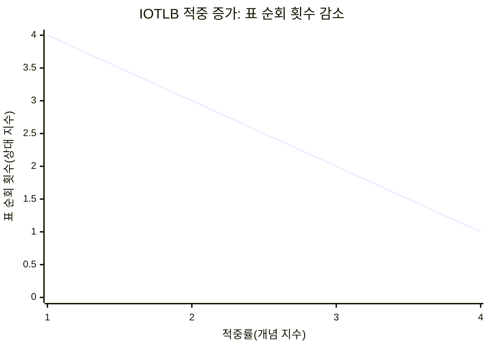
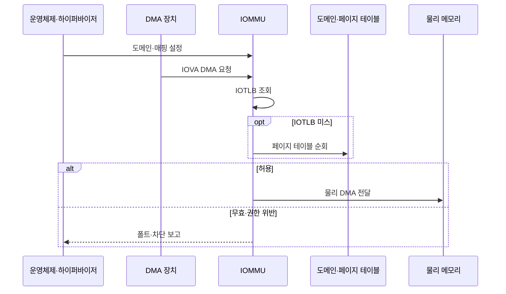

---
sidebar:
  order: 86
  label: "086. 입출력 메모리 관리 장치 (IOMMU)"
  badge:
    text: "기출 · 70%"
    variant: note
title: "입출력 메모리 관리 장치 (IOMMU)"
date: "2026-07-25T00:22:25+09:00"
tags:
  - "notes-hardware"
weight: 86
extra:
  question_no: "086"
  source_status: "기출"
  source_history: "137회"
  priority: 70
  priority_note: "DMA 주소·권한 격리와 IOTLB 비용"
---

## 미리 알고가기

- **입출력 메모리 관리 장치(Input-Output Memory Management Unit, IOMMU)**: DMA 주소 변환·권한 검사 장치
- **직접 메모리 접근(Direct Memory Access, DMA)**: 장치가 처리기 없이 메모리를 읽고 쓰는 방식
- **가상머신(Virtual Machine, VM)**: 격리된 가상 하드웨어에서 실행하는 시스템
- **입출력 가상 주소(Input/Output Virtual Address, IOVA)**: 장치가 DMA 요청에 사용하는 주소
- **IOMMU 도메인(IOMMU Domain)**: 변환표·권한을 공유하는 장치 격리 단위
- **입출력 변환 참조 버퍼(Input/Output Translation Lookaside Buffer, IOTLB)**: 최근 IOVA 변환 캐시
- **IOTLB 적중·미스·무효화(Hit·Miss·Invalidation)**: 적중은 캐시 변환 사용, 미스는 페이지 표 조회, 무효화는 낡은 변환 제거를 뜻함
- **페이지 테이블 순회(Page-table Walk)**: IOTLB 미스 때 메모리의 변환표 계층을 따라 물리 주소와 권한을 찾는 동작
- **IOMMU 폴트(IOMMU Fault)**: 무효·권한 밖 DMA를 차단한 예외
- **단일 루트 입출력 가상화(Single Root I/O Virtualization, SR-IOV)**: 장치를 가상 기능으로 나누는 기술
- **가상 기능(Virtual Function, VF)**: SR-IOV 장치가 VM에 직접 할당하도록 제공하는 경량 PCIe 기능
- **장치 직접 할당(Device Passthrough)**: 물리 장치나 가상 기능을 특정 VM이 하이퍼바이저 중재 없이 사용하게 하는 방식
- **드라이버 버퍼(Driver Buffer)**: 장치와 운영체제 드라이버가 DMA로 데이터를 주고받도록 할당한 메모리 영역

## Ⅰ. 개요

- **정의/개념**: IOVA 변환·권한 검사로 장치 DMA 격리
- **배경/필요성**: 장치 DMA의 임의 주소 접근으로 격리 필요

### 쉽게 이해하기 (학습용)

- 장치가 낸 방 번호를 실제 주소로 바꾸고 허가된 방에만 들이는 경비실이다.

## Ⅱ. 특징

- 장치·VM별 도메인이 DMA 침범을 차단한다.
- IOTLB 미스·무효화는 주소 변환 지연을 높인다.
- SR-IOV 직접 할당도 IOMMU가 DMA를 격리한다.

### 쉽게 이해하기 (학습용)

- 장치마다 출입 구역을 나누되 주소 기록을 자주 못 찾거나 바꾸면 확인이 느려진다.

## Ⅲ. 아키텍처 및 구성요소

| 설계 요소 | 설명 |
|:---|:---|
| 운영체제·하이퍼바이저 도메인 관리자 | 장치·VM별 매핑·권한·폴트 처리 |
| 도메인·페이지 테이블 | IOVA→물리 주소·접근 권한 저장 |
| IOMMU 엔진·IOTLB | 변환 캐시 조회·주소·권한 검사 |
| DMA 장치 | IOVA로 메모리 읽기·쓰기 요청 |

> 요약: 도메인 표와 IOMMU가 장치별 DMA 경계 집행

### 쉽게 이해하기 (학습용)

- 관리자가 장치별 명단을 만들고 경비실이 주소와 권한을 검사한다.

## Ⅳ. 원리 및 절차 흐름도

| 절차 | 설명 |
|:---|:---|
| 도메인·매핑 설정 | 장치별 IOVA 범위·물리 버퍼·권한 구성 |
| IOVA DMA 요청 | 장치가 IOVA·길이·읽기·쓰기 속성 전송 |
| IOTLB 조회 | 캐시된 주소·권한으로 접근 판정 |
| 페이지 테이블 순회 | 미스 시 변환표 조회·IOTLB 채움 |
| 물리 DMA 전달 | 허용 주소·속성만 메모리에 전달 |
| 폴트·차단 보고 | 무효·권한 밖 요청 차단·원인 기록 |

> 요약: IOVA 변환·권한 판정 후 허용 DMA만 전달

### 쉽게 이해하기 (학습용)

- 주소와 열쇠가 모두 맞는 장치 요청만 실제 방으로 보낸다.

## Ⅴ. 종류 및 비교

| 판단 기준 | IOMMU 사용 | IOMMU 미사용 |
|:---|:---|:---|
| 핵심 특징 | IOVA 변환·권한으로 DMA 격리 | 장치 주소로 메모리 직접 접근 |
| 적용 기준 | 장치 직접 할당·외부 확장 포트 | 신뢰된 단일 목적 장치 |
| 주요 위험 | IOTLB 미스·매핑 무효화 지연 | 임의 메모리 침범·데이터 훼손 |

> 요약: 직접 DMA 장치는 IOMMU로 허용 버퍼만 공개

### 쉽게 이해하기 (학습용)

- 외부 장치와 VM에 넘긴 장치에는 필요한 메모리 방의 열쇠만 줘야 한다.

## Ⅵ. 실무 사례

1. SR-IOV 네트워크: 가상 기능별 DMA 도메인 분리
2. 외부 확장 포트: 드라이버 버퍼만 DMA 허용

### 쉽게 이해하기 (학습용)

- 각 가상 네트워크 기능에 자기 메모리 구역만 연다.
- 외부 장치에는 드라이버가 준비한 버퍼만 보여 준다.

## Ⅶ. 결론

- 장치별 DMA 최소 범위 설정·IOTLB 무효화 축소

### 쉽게 이해하기 (학습용)

- 장치마다 필요한 방만 열고 주소 명단을 바꾸는 횟수를 줄인다.
