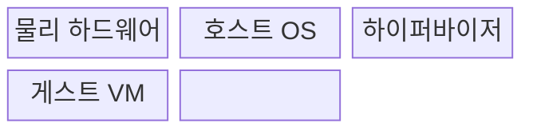
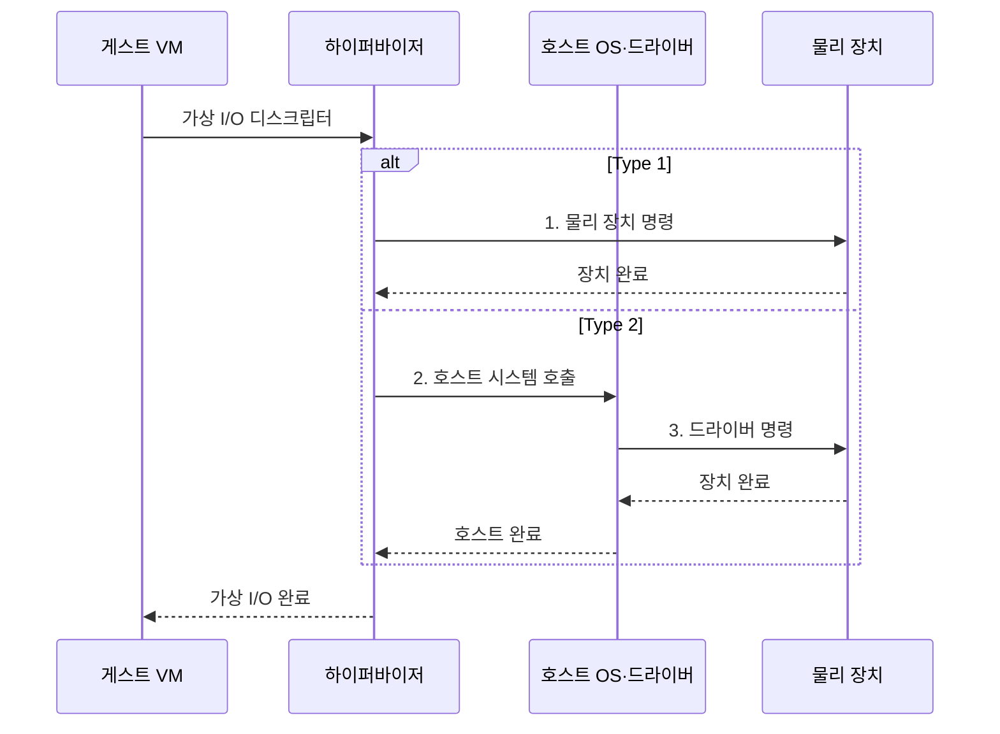

---
sidebar:
  order: 87
  label: "087. 서버 가상화: Type 1·Type 2 하이퍼바이저 (Hypervisor Types)"
  badge:
    text: "기출 · 85%"
    variant: note
title: "서버 가상화: Type 1·Type 2 하이퍼바이저 (Hypervisor Types)"
date: "2026-08-02T11:47:00+09:00"
tags:
  - "notes-hardware"
weight: 87
extra:
  question_no: "087"
  source_status: "기출"
  source_history: "128회, 131회, 132회, 137회"
  priority: 85
  priority_note: "네 회 반복 출제된 서버 가상화 핵심 비교"
---

## Ⅰ. 개요

핵심 용어

- **하이퍼바이저**: 물리 자원을 가상머신별로 배정하고 서로 격리하는 제어 계층이다.
- **장애 경계**: 한 구성요소의 장애가 함께 영향을 미치는 시스템 범위이다.

- 정의/개념: 실행 위치에 따라 직접형·호스트형으로 나눈 **VM 자원 중재 계층**
- 배경/필요성: 상시 운영의 **장애 격리** 와 개발 환경의 **장치 재사용** 구분

#### 한줄 요약

- 건물 기초에 관리실을 두는 Type 1과 기존 사무실 안에 관리자를 두는 Type 2처럼, VM 관리 계층의 실행 위치를 나눈다.

## Ⅱ. 특징

핵심 용어

- **Type 1 하이퍼바이저**: 하드웨어 위에서 직접 실행하며 가상머신 자원을 중재하는 방식이다.
- **Type 2 하이퍼바이저**: 호스트 운영체제의 프로세스로 실행되며 그 드라이버와 도구를 이용하는 방식이다.

- **하이퍼바이저 실행 위치** 가 I/O 경로·장애 범위 결정
- Type 1은 **호스트 OS 없는 직접 자원 중재** 제공
- Type 2는 **호스트 OS 드라이버·도구 재사용** 제공

#### 한줄 요약

- 관리 계층이 아래에 있으면 장치를 직접 다루고 위에 있으면 기존 운영체제의 장치를 빌려 쓴다.

## Ⅲ. 구조 및 구성요소

핵심 용어

- **호스트 운영체제**: Type 2 하이퍼바이저 아래에서 프로세스·메모리·장치 서비스를 제공하는 운영체제이다.
- **가상머신(VM)**: 가상화된 CPU·메모리·장치에서 게스트 운영체제를 실행하는 시스템이다.

| 구성요소 | 책임 |
|:---|:---|
| 물리 하드웨어 | **VM 실행 자원 제공** |
| 호스트 OS | **드라이버·서비스 제공** |
| 하이퍼바이저 | **자원 중재·격리** |
| 게스트 VM | **운영체제·응용 실행** |

#### 한줄 요약

- Type 1은 장치를 직접 중재하고, Type 2는 호스트 OS와 기존 드라이버를 한 번 더 거친다.

## Ⅳ. 흐름도

핵심 용어

- **가상 장치 레지스터·큐**: 게스트가 장치 명령과 버퍼 위치를 기록하는 가상 입출력 인터페이스이다.
- **시스템 호출·드라이버**: 응용의 서비스 요청을 운영체제가 받아 물리 장치 명령으로 이어 주는 계층이다.

**동작 원리**

1. **물리 장치 명령**: Type 1 하이퍼바이저의 장치 경로 직접 제어
2. **호스트 시스템 호출**: Type 2 하이퍼바이저의 호스트 OS 서비스 요청
3. **드라이버 명령**: 호스트 드라이버의 물리 명령 변환

#### 한줄 요약

- Type 1은 장치를 직접 다루고 Type 2는 호스트를 거친다.

## Ⅴ. 종류 및 비교

핵심 용어

- **베어메탈**: 하드웨어에서 직접 실행하는 Type 1 가상화 구조이다.
- **호스티드**: 호스트 운영체제 위에서 실행하는 Type 2 가상화 구조이다.
- **서버 통합**: 여러 서버 작업을 소수 물리 서버의 가상머신으로 모아 자원 사용률을 높이는 방식이다.

| 하이퍼바이저 유형 | Type 1 | Type 2 |
|:---|:---|:---|
| 적용 기준 | 서버 통합·**상시 운영** | 개발·시험·**장치 재사용** |
| 핵심 특징 | 하드웨어에서 **VM 자원 직접 중재** | 호스트 OS 프로세스로 **VM 실행** |
| 한계 | 드라이버 호환·**관리 복잡성** | 호스트 장애·**추가 I/O 경로** |

> 요약: 상시 서버 운영은 **Type 1**, 개발·검증은 **Type 2** 선택

#### 한줄 요약

- 계속 운영할 서버에는 Type 1, 개인 개발·시험에는 Type 2를 선택한다.

## Ⅵ. 실무 고려사항 및 대책

핵심 용어

- **CPU 준비 시간**: vCPU가 실행 가능하지만 물리 CPU 할당을 기다린 시간이다.
- **메모리 회수**: 호스트가 가상머신에 할당한 미사용 메모리를 되찾는 동작이다.
- **스냅숏**: 특정 시점의 가상머신 디스크와 실행 상태를 보존한 복구 기준이다.

| 문제 | 대책 | 효과 |
|:---|:---|:---|
| Type 1 관리 계층 취약점이 모든 VM으로 **장애 전파** | **관리 인터페이스 분리·최소 서비스·신속 패치** | **공격면·장애 경계** 축소 |
| Type 2 호스트 OS 부하·재시작이 **VM 중단** 유발 | **호스트 자원 예약·업데이트 시간 통제** | **시험 VM 가용성** 향상 |
| 자원 초과 할당으로 vCPU·메모리 **경합 증가** | **CPU 준비 시간·메모리 회수 감시** | **VM 응답 지연** 억제 |
| 스냅숏·이미지 난립으로 **복구 시점 불확실** | **스냅숏 수명주기·무결성·복구 시험** | **복구 버전 일관성** 확보 |

#### 한줄 요약

- 건물 전체 관리실인 Type 1은 관리 인터페이스를 좁히고, 사무실 안 관리자인 Type 2는 호스트 재시작과 자원을 통제해야 한다.

## Ⅶ. 결론

핵심 용어

- **공격면**: 공격자가 접근하거나 악용할 수 있는 인터페이스와 기능의 범위이다.
- **상시 운영**: 서비스 중단을 최소화하며 지속적으로 시스템을 제공해야 하는 운영 조건이다.

- 상시 서버는 **Type 1**, 개발·시험은 **Type 2** 선택

#### 한줄 요약

- 서버를 계속 운영하면 Type 1, 기존 컴퓨터에서 시험하면 Type 2를 선택한다.
