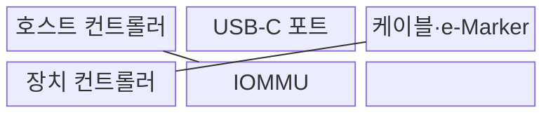
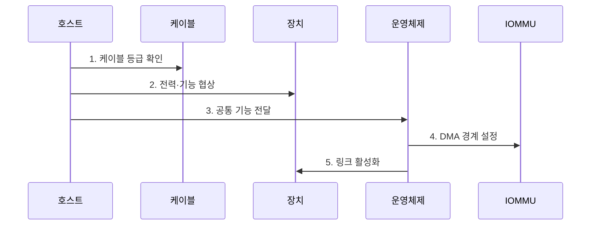

---
sidebar:
  order: 88
  label: "088. 고속 직렬 인터페이스: USB·Thunderbolt (High-Speed Serial Interface)"
  badge:
    text: "미출 · 50%"
    variant: note
title: "고속 직렬 인터페이스: USB·Thunderbolt (High-Speed Serial Interface)"
date: "2026-07-31T10:19:08+09:00"
tags:
  - "notes-hardware"
weight: 88
extra:
  question_no: "088"
  source_status: "미출"
  source_history: ""
  priority: 50
  priority_note: "USB-C 기능 분화·외부 DMA 보호의 실무성"
---

## 미리 알고가기

- **고속 직렬 인터페이스(High-Speed Serial Interface)**: 적은 차동 신호선으로 비트를 순차 고속 전송하는 연결 규격
- **차동 신호(Differential Signaling)**: 두 선의 전압 차이로 비트를 표현해 공통 잡음 영향을 줄이는 전송 방식
- **범용 직렬 버스(Universal Serial Bus, USB)**: 범용 주변장치에 데이터 전송과 전력 공급을 함께 제공하는 직렬 인터페이스
- **Thunderbolt**: PCIe·DisplayPort 패킷을 하나의 직렬 링크로 터널링하는 고속 인터페이스
- **터널링(Tunneling)**: 한 프로토콜의 패킷을 다른 링크의 전송 형식 안에 실어 전달하는 방식
- **USB 타입-C(USB Type-C, USB-C)**: 상하 구분 없는 커넥터 규격으로, 커넥터 형상만으로 지원 전송 속도와 대체 모드를 보장하지는 않음
- **레인(Lane)**: 차동 신호선 쌍을 쓰는 송수신 경로
- **USB 전력 전송(USB Power Delivery, USB PD)**: USB 연결에서 전력 공급 방향·전압·전류를 장치 간 협상하는 규격
- **PCI 익스프레스(PCI Express, PCIe)**: 프로세서와 주변장치를 고속 직렬 점대점 링크로 연결하는 인터커넥트
- **디스플레이포트(DisplayPort)**: 영상·음성 전송 인터페이스
- **직접 메모리 접근(Direct Memory Access, DMA)**: 장치가 프로세서의 데이터 복사 없이 메모리에 직접 접근하는 방식
- **입출력 메모리 관리 장치(Input-Output Memory Management Unit, IOMMU)**: 장치의 DMA 주소를 변환하고 장치별 접근 가능한 메모리 범위를 제한하는 하드웨어
- **기능 탐색(Capability Discovery)**: 호스트·장치·케이블이 지원 속도·전력·영상 모드를 교환해 공통 기능을 찾는 절차
- **도킹 스테이션(Docking Station)**: 노트북의 단일 포트를 전원·화면·네트워크·주변장치 연결로 확장하는 장치
- **전자 표식(Electronic Marker, e-Marker)**: 케이블의 전류·속도 지원 등급을 저장해 포트에 알리는 칩
- **구성 채널(Configuration Channel, CC)**: USB-C 연결 방향·전원 역할·기능 협상에 사용하는 신호선
- **대체 모드(Alternate Mode)**: USB-C 신호선을 DisplayPort 등 다른 프로토콜에 배정하는 동작 모드
- **다운트레이닝(Downtraining)**: 링크가 목표보다 낮은 속도나 레인 수로 설정되는 현상
- **재협상(Renegotiation)**: 연결 중 전력·속도·기능 조건을 다시 합의하는 절차

> **키워드:** 고속 직렬 인터페이스: USB·Thunderbolt (High-Speed Serial Interface)

## Ⅰ. 개요

- 정의/개념: 차동 레인으로 데이터·영상·전력을 전달하는 **고속 직렬 링크**
- 배경/필요성: 같은 USB-C 형상만으로는 **속도·전력·영상 기능 보장 불가**

### 쉽게 이해하기 (학습용)

- 같은 모양의 단자라도 양쪽 기기와 케이블이 맞아야 데이터·영상·충전 기능을 모두 쓸 수 있다.

## Ⅱ. 특징

- **기능 탐색·USB PD**로 공통 속도·전력·대체 모드 결정
- **차동 신호·레인** 기반 고속 직렬 전송
- Thunderbolt **PCIe 터널링**으로 고대역 장치 연결·외부 DMA 공격면 확대

### 쉽게 이해하기 (학습용)

- 양쪽 기기와 케이블이 모두 아는 기능만 켜지고 Thunderbolt 장치에는 허용된 메모리만 열어야 한다.

## Ⅲ. 구조 및 구성요소

| 구성요소 | 책임 |
|:---|:---|
| 호스트 컨트롤러 | **기능 협상·라우팅** |
| USB-C 포트 | **CC 기반 방향·전력 협상** |
| 케이블·e-Marker | **속도·전류 등급 제공** |
| 장치 컨트롤러 | **기능 광고·데이터 처리** |
| IOMMU | **외부 DMA 격리** |

### 쉽게 이해하기 (학습용)

- 역무실·선로·열차처럼 호스트 컨트롤러·USB-C 포트·케이블·장치가 연결되고, IOMMU가 외부 DMA의 출입 구역을 나눈다.

## Ⅳ. 흐름도

**동작 원리**

1. **케이블 등급 확인**: e-Marker에서 속도·전류 한도 판독
2. **전력·기능 협상**: 전력 역할과 지원 모드·터널의 교집합 결정
3. **공통 기능 전달**: 운영체제가 합의된 속도·영상·장치 기능 구성
4. **DMA 경계 설정**: PCIe 터널 장치의 허용 메모리 범위 제한
5. **링크 활성화**: 협상·격리 조건을 만족한 데이터 경로 개통

### 쉽게 이해하기 (학습용)

- 케이블과 양쪽 장치의 공통 기능을 확인한 뒤 연결한다.

## Ⅴ. 종류 및 비교

| 직렬 인터페이스 | USB | Thunderbolt |
|:---|:---|:---|
| 적용 기준 | **범용 장치·충전** | **외장 PCIe·다중 화면** |
| 핵심 특징 | 범용 **데이터·전력 전송** | **PCIe·DisplayPort 터널링** |
| 한계 | **포트·케이블 기능 불일치** | 외부 장치의 **DMA 접근** |

> 요약: 범용 연결은 **USB**, PCIe 터널링은 **Thunderbolt** 선택

### 쉽게 이해하기 (학습용)

- 키보드·충전 같은 범용 연결은 USB, 외장 PCIe·여러 화면 연결은 Thunderbolt를 선택한다.

## Ⅵ. 실무 고려사항 및 대책

| 고려사항 | 대책 | 효과 |
|:---|:---|:---|
| 도킹 스테이션에서 USB-C 형상만 보고 **기능을 오판** | **호스트·장치·케이블 기능과 협상값 확인** | **속도·영상·충전 호환 장애** 감소 |
| 저등급 케이블로 **다운트레이닝·재협상 반복** | **인증 케이블·링크 오류·협상 속도 감시** | **지속 전송률** 확보 |
| Thunderbolt PCIe 터널이 허용 범위 밖 **DMA 접근** | **IOMMU·사용자 승인·잠금 중 연결 제한** | **메모리 침해** 방지 |
| 전력 계약이 케이블·포트 열 한도를 넘어 **과열 발생** | **전력 예산·e-Marker 등급·포트 온도 감시** | **충전 중단·열 손상** 예방 |

### 쉽게 이해하기 (학습용)

- 업무용 도크는 노트북·도크·케이블이 영상과 충전을 모두 지원하는지 확인한다.

## Ⅶ. 결론

- 범용·충전은 **USB**, 외장 PCIe·다중 화면은 **Thunderbolt**

### 쉽게 이해하기 (학습용)

- 양쪽 기기와 케이블의 공통 기능을 확인한 뒤 USB와 Thunderbolt 중 하나를 선택한다.
