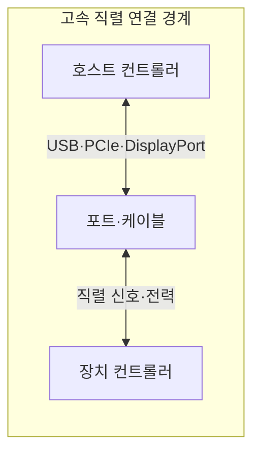
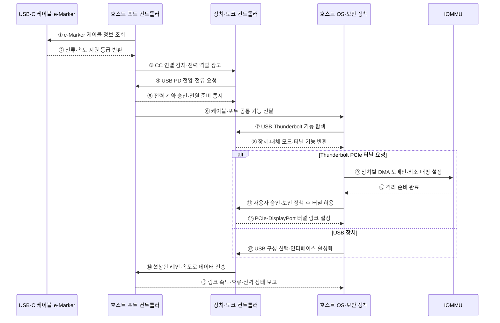

---
sidebar:
  order: 88
  label: "088. 고속 직렬 인터페이스 — USB·Thunderbolt (High-Speed Serial Interface)"
  badge:
    text: "미출 · 50%"
    variant: note
title: "고속 직렬 인터페이스 — USB·Thunderbolt (High-Speed Serial Interface)"
date: "2026-07-25T00:22:25+09:00"
tags:
  - "notes-hardware"
weight: 88
extra:
  question_no: "088"
  source_status: "미출"
  source_history: ""
  priority: 50
  priority_note: "USB-C 기능 분화·외부 DMA 보호의 실무성"
---

## 미리 알고가기

- **고속 직렬 인터페이스(High-Speed Serial Interface)**: 적은 차동 신호선으로 비트를 순차 고속 전송하는 연결 규격
- **차동 신호(Differential Signaling)**: 두 선의 전압 차이로 비트를 표현해 공통 잡음 영향을 줄이는 전송 방식
- **범용 직렬 버스(Universal Serial Bus, USB)**: 범용 주변장치에 데이터 전송과 전력 공급을 함께 제공하는 직렬 인터페이스
- **Thunderbolt**: PCIe·DisplayPort 패킷을 하나의 직렬 링크로 터널링하는 고속 인터페이스
- **터널링(Tunneling)**: 한 프로토콜의 패킷을 다른 링크의 전송 형식 안에 실어 전달하는 방식
- **USB 타입-C(USB Type-C, USB-C)**: 상하 구분 없는 커넥터 규격으로, 커넥터 형상만으로 지원 전송 속도와 대체 모드를 보장하지는 않음
- **레인(Lane)**: 차동 신호선 쌍을 쓰는 송수신 경로
- **USB 전력 전송(USB Power Delivery, USB PD)**: USB 연결에서 전력 공급 방향·전압·전류를 장치 간 협상하는 규격
- **PCI 익스프레스(PCI Express, PCIe)**: 프로세서와 주변장치를 고속 직렬 점대점 링크로 연결하는 인터커넥트
- **디스플레이포트(DisplayPort)**: 영상·음성 전송 인터페이스
- **직접 메모리 접근(Direct Memory Access, DMA)**: 장치가 프로세서의 데이터 복사 없이 메모리에 직접 접근하는 방식
- **입출력 메모리 관리 장치(Input-Output Memory Management Unit, IOMMU)**: 장치의 DMA 주소를 변환하고 장치별 접근 가능한 메모리 범위를 제한하는 하드웨어
- **기능 탐색(Capability Discovery)**: 호스트·장치·케이블이 지원 속도·전력·영상 모드를 교환해 공통 기능을 찾는 절차
- **도킹 스테이션(Docking Station)**: 노트북의 단일 포트를 전원·화면·네트워크·주변장치 연결로 확장하는 장치
- **전자 표식(Electronic Marker, e-Marker)**: 케이블의 전류·속도 지원 등급을 저장해 포트에 알리는 칩
- **구성 채널(Configuration Channel, CC)**: USB-C 연결 방향·전원 역할·기능 협상에 사용하는 신호선
- **대체 모드(Alternate Mode)**: USB-C 신호선을 DisplayPort 등 다른 프로토콜에 배정하는 동작 모드
- **장치 설명자(Device Descriptor)**: USB 장치가 유형·기능·구성을 호스트에 알리는 정보 구조
- **다운트레이닝(Downtraining)**: 링크가 목표보다 낮은 속도나 레인 수로 설정되는 현상
- **재협상(Renegotiation)**: 연결 중 전력·속도·기능 조건을 다시 합의하는 절차

## Ⅰ. 개요

- 정의/개념: 데이터와 선택적 영상·전력을 전달하는 직렬 링크
- 기존 한계: 동일한 USB-C 커넥터를 사용해도 지원 전송 규격·속도·전력·영상 기능이 달라 연결만으로 호환성을 보장할 수 없다.

### 쉽게 이해하기 (학습용)

- 같은 모양의 단자라도 양쪽 기기와 케이블이 맞아야 데이터·영상·충전 기능을 모두 쓸 수 있다.

## Ⅱ. 특징

- 양단·케이블의 공통 기능만 링크에 설정된다.
- Thunderbolt PCIe 터널은 DMA 공격면을 넓힌다.

### 쉽게 이해하기 (학습용)

- 양쪽 기기와 케이블이 모두 아는 기능만 켜지고 Thunderbolt 장치에는 허용된 메모리만 열어야 한다.

## Ⅲ. 아키텍처

**도표안 A — 구조도**

**도표안 B — sequenceDiagram**

| 설계 요소 | 입력·상태 | 역할 |
|:---|:---|:---|
| 호스트 컨트롤러 | 기능 목록·보안 정책 | 공통 기능 선택·프로토콜 라우팅 |
| 포트·케이블 | 방향·레인·전력 등급 | 직렬 신호·전력 전달과 상한 결정 |
| 장치 컨트롤러 | 지원 속도·모드·전력 | 기능 광고·데이터 종단 처리 |

> 요약: 양단과 케이블의 공통 기능으로 링크를 구성한다.

**동작 원리**

- **① 케이블 조회**: 호스트가 e-Marker 정보 요청
- **② 등급 반환**: 케이블의 전류·속도 한도 확인
- **③ 역할 감지**: CC로 연결 방향과 전원 역할 결정
- **④ 전력 요청**: 장치가 필요한 전압·전류 조합 제시
- **⑤ 전력 확정**: 포트·어댑터·케이블 한도 안에서 승인
- **⑥ 공통 기능 입력**: 실제 레인·속도·대체 모드를 OS에 전달
- **⑦ 기능 탐색**: USB·Thunderbolt·DisplayPort 지원 질의
- **⑧ 기능 반환**: 장치·대체 모드·터널 기능 광고
- **⑨ DMA 경계 설정**: PCIe 터널 전에 IOMMU 최소 매핑 구성
- **⑩ 격리 확인**: 장치별 주소·권한 정책 적용 완료
- **⑪ 터널 승인**: 사용자·잠금·조직 정책 통과 후 허용
- **⑫ 복합 링크 설정**: PCIe·DisplayPort 터널 구성
- **⑬ USB 구성**: 일반 USB의 공통 인터페이스 활성화
- **⑭ 데이터 전송**: 협상된 레인·속도·프로토콜 사용
- **⑮ 상태 감시**: 속도·오류·재협상·전력 보고

### 쉽게 이해하기 (학습용)

- 단자를 꽂은 뒤 케이블 능력, 전력 계약, 데이터 기능과 DMA 권한을 차례로 맞춰야 실제 링크가 열린다.

## Ⅳ. 종류 및 비교

| 판단 기준 | USB | Thunderbolt |
|:---|:---|:---|
| 핵심 특징 | 범용 데이터·전력 전송 | PCIe·DisplayPort 터널링 |
| 적용 기준 | 범용 장치·충전 | 외장 PCIe·다중 화면 |
| 주요 위험 | 포트·케이블 기능 불일치 | 외부 장치의 DMA 메모리 접근 |

> 요약: 범용 연결에는 USB, PCIe 터널에는 Thunderbolt를 사용한다.

### 쉽게 이해하기 (학습용)

- 키보드·충전 같은 범용 연결은 USB, 외장 PCIe·여러 화면 연결은 Thunderbolt를 선택한다.

## Ⅴ. 실무 고려사항 및 대책

| 운영 위험 | 대응 | 기대 효과 |
|:---|:---|:---|
| USB-C 형상만 보고 속도·영상·전력을 가정 | 호스트·장치·케이블 기능표와 실제 협상값 확인 | 호환 장애 감소 |
| 불량·저등급 케이블로 링크 다운그레이드 | 인증 케이블과 오류·재협상·속도 감시 | 안정적 전송률 확보 |
| Thunderbolt PCIe 터널의 외부 DMA | IOMMU·사용자 승인·잠금 상태 연결 제한 | 메모리 침해 방지 |
| 전력 협상·열 한도 초과 | 전원 예산·케이블 전류 등급·포트 온도 감시 | 과열·충전 불안정 예방 |

### 적용 사례

- 업무용 도킹은 노트북·도크·케이블의 공통 영상 레인·충전 전력·전송 속도를 검증하고 외부 PCIe 터널에는 IOMMU와 사용자 승인 정책을 적용한다.

### 쉽게 이해하기 (학습용)

- 업무용 도크는 노트북·도크·케이블이 영상과 충전을 모두 지원하는지 확인한다.

## Ⅵ. 결론

- 고속 외부 연결을 안전하게 제공하기 위해 **호스트·장치·케이블 공통 기능·USB PD 전력·레인 구성·터널 요구·외부 DMA 경계**를 검토하고, 범용 연결은 USB, 승인된 PCIe·영상 확장은 Thunderbolt를 선택한다.

### 쉽게 이해하기 (학습용)

- 양쪽 기기와 케이블의 공통 기능을 확인한 뒤 USB와 Thunderbolt 중 하나를 선택한다.
