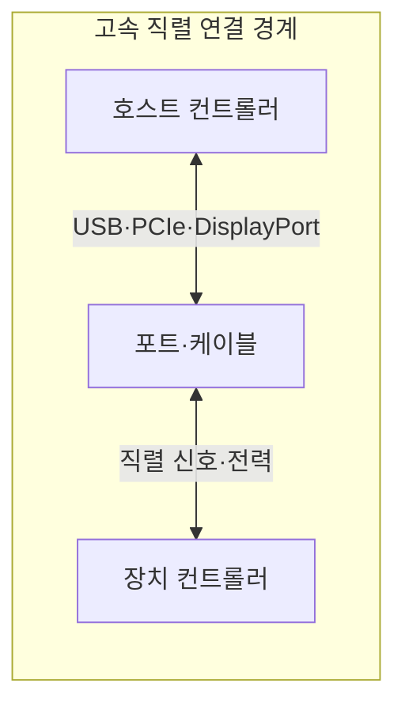
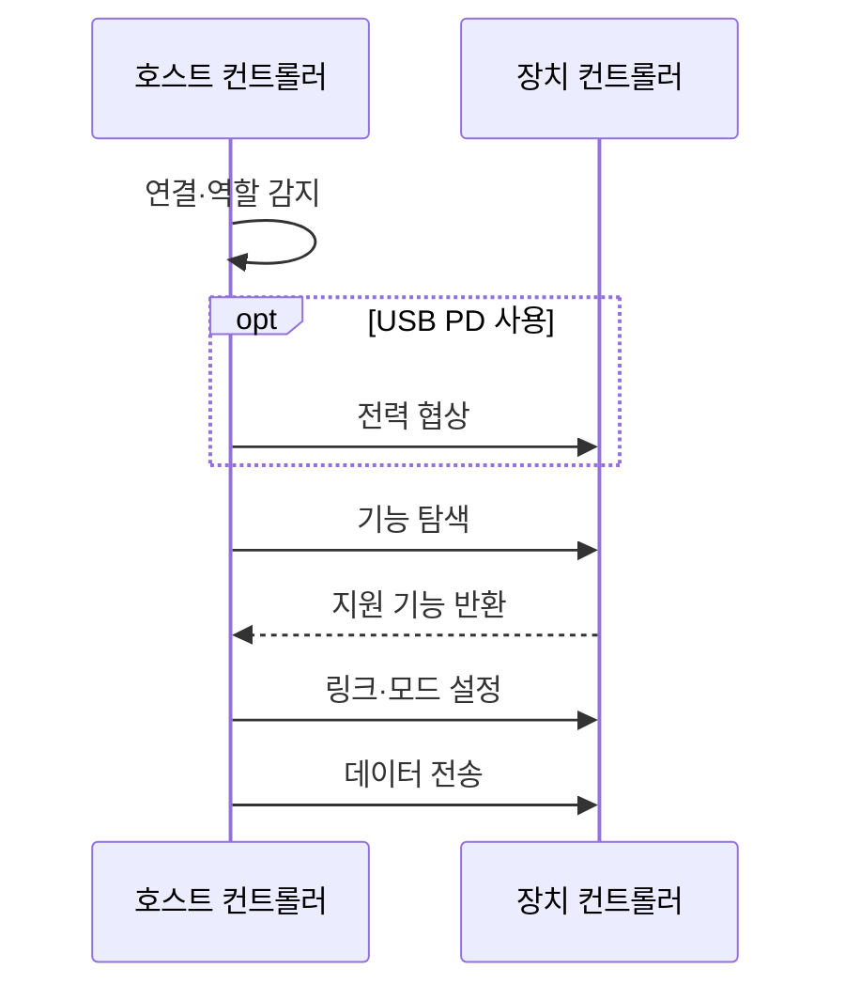

---
sidebar:
  order: 88
  label: "088. 고속 직렬 인터페이스 — USB·Thunderbolt (High-Speed Serial Interface)"
  badge:
    text: "미출제 · 50%"
    variant: note
title: "고속 직렬 인터페이스 — USB·Thunderbolt (High-Speed Serial Interface)"
date: "2026-07-25T00:22:25+09:00"
tags:
  - "notes-hardware"
weight: 88
extra:
  question_no: "088"
  source_status: "미출제"
  source_history: ""
  priority: 50
  priority_note: "USB-C 기능 분화·외부 DMA 보호의 실무성"
---

## 미리 알고가기

- **고속 직렬 인터페이스(High-Speed Serial Interface)**: 적은 차동 신호선으로 비트를 순차 고속 전송하는 연결 규격
- **차동 신호(Differential Signaling)**: 두 선의 전압 차이로 비트를 표현해 공통 잡음 영향을 줄이는 전송 방식
- **범용 직렬 버스(Universal Serial Bus, USB)**: USB는 ‘유에스비’로 읽고 영문 머리글자를 딴 약어이며, 범용 주변장치의 데이터·전력 연결을 제공
- **Thunderbolt**: PCIe·DisplayPort 패킷을 하나의 직렬 링크로 터널링하는 고속 인터페이스
- **터널링(Tunneling)**: 한 프로토콜의 패킷을 다른 링크의 전송 형식 안에 실어 전달하는 방식
- **USB 타입-C(USB Type-C, USB-C)**: USB-C는 ‘유에스비 타입 시’로 읽고 USB 커넥터 형상을 C로 구분한 표기이며, 단자 모양만으로 전송 기능을 보장하지 않음
- **레인(Lane)**: 차동 신호선 쌍을 쓰는 송수신 경로
- **USB 전력 전송(USB Power Delivery, USB PD)**: USB PD는 ‘유에스비 피디’로 읽고 Power Delivery의 머리글자를 붙인 약어이며, 전력 방향·전압·전류를 협상
- **PCI 익스프레스(PCI Express, PCIe)**: PCIe는 ‘피시아이 익스프레스’로 읽고 PCI에 Express를 붙인 규격명이며, 주변장치용 고속 직렬 버스를 제공
- **디스플레이포트(DisplayPort)**: 영상·음성 전송 인터페이스
- **직접 메모리 접근(Direct Memory Access, DMA)**: DMA는 ‘디엠에이’로 읽고 영문 머리글자를 딴 약어이며, 장치가 프로세서를 거치지 않고 메모리에 접근
- **입출력 메모리 관리 장치(Input-Output Memory Management Unit, IOMMU)**: IOMMU는 ‘아이오엠엠유’로 읽고 영문 머리글자를 딴 약어이며, 장치별 DMA 주소 범위를 제한
- **기능 탐색(Capability Discovery)**: 호스트·장치·케이블이 지원 속도·전력·영상 모드를 교환해 공통 기능을 찾는 절차
- **도킹 스테이션(Docking Station)**: 노트북의 단일 포트를 전원·화면·네트워크·주변장치 연결로 확장하는 장치

## Ⅰ. 개요

- 정의/개념: 데이터와 선택적 영상·전력을 전달하는 직렬 링크
- **배경/필요성**: 같은 USB-C도 기능·속도가 달라 사전 협상이 필요함

### 쉽게 이해하기 (학습용)

- 같은 모양의 단자라도 양쪽 기기와 케이블이 맞아야 데이터·영상·충전 기능을 모두 쓸 수 있다.

## Ⅱ. 특징

- 양단·케이블의 공통 기능만 링크에 설정된다.
- Thunderbolt PCIe 터널은 DMA 공격면을 넓힌다.

### 쉽게 이해하기 (학습용)

- 양쪽 기기와 케이블이 모두 아는 기능만 켜지고 Thunderbolt 장치에는 허용된 메모리만 열어야 한다.

## Ⅲ. 아키텍처 및 구성요소

| 설계 요소 | 설명 |
|:---|:---|
| 호스트 컨트롤러 | 공통 기능 선택·프로토콜 라우팅 |
| 포트·케이블 | 차동 레인·전력 경로, 속도·전류 상한 |
| 장치 컨트롤러 | 기능 광고·데이터 종단 처리 |

> 요약: 양단·케이블 공통 기능으로 링크 구성

### 쉽게 이해하기 (학습용)

- 호스트와 장치의 제어기가 케이블 양끝에서 기능·전력을 맞춘 뒤 데이터를 주고받는다.

## Ⅳ. 원리 및 절차 흐름도

| 절차 | 설명 |
|:---|:---|
| 연결·역할 감지 | 방향과 전원·데이터 역할 판정 |
| 전력 협상 | 공급 방향·전압·전류 계약 |
| 기능 탐색 | 장치·케이블 지원 기능 조회 |
| 지원 기능 반환 | 지원 목록 응답으로 공통 기능 확정 |
| 링크·모드 설정 | 공통 속도·레인·프로토콜 설정 |
| 데이터 전송 | 설정된 링크로 데이터·영상 전송 |

> 요약: 공통 기능 협상 후 링크·모드 설정

### 쉽게 이해하기 (학습용)

- 케이블을 꽂으면 전력 역할과 함께 쓸 기능·속도를 맞춘 뒤 전송을 시작한다.

## Ⅴ. 종류 및 비교

| 판단 기준 | USB | Thunderbolt |
|:---|:---|:---|
| 핵심 특징 | 범용 데이터·전력 전송 | PCIe·DisplayPort 터널링 |
| 적용 기준 | 범용 장치·충전 | 외장 PCIe·다중 화면 |
| 주요 위험 | 포트·케이블 기능 불일치 | 외부 장치의 DMA 메모리 접근 |

> 요약: 범용 연결은 USB, PCIe 터널은 Thunderbolt

### 쉽게 이해하기 (학습용)

- 키보드·충전 같은 범용 연결은 USB, 외장 PCIe·여러 화면 연결은 Thunderbolt를 선택한다.

## Ⅵ. 실무 사례

1. 업무용 도킹: 양단·케이블의 영상·전력 지원 확인
2. Thunderbolt 도킹은 IOMMU로 승인 DMA만 허용

### 쉽게 이해하기 (학습용)

- 업무용 도크는 노트북·도크·케이블이 영상과 충전을 모두 지원하는지 확인한다.
- Thunderbolt 장치는 허가한 메모리 구역만 읽고 쓰게 접근 범위를 좁힌다.

## Ⅶ. 결론

- 공통 기능·PCIe 요구로 USB·Thunderbolt 선택

### 쉽게 이해하기 (학습용)

- 양쪽 기기와 케이블의 공통 기능을 확인한 뒤 USB와 Thunderbolt 중 하나를 선택한다.
