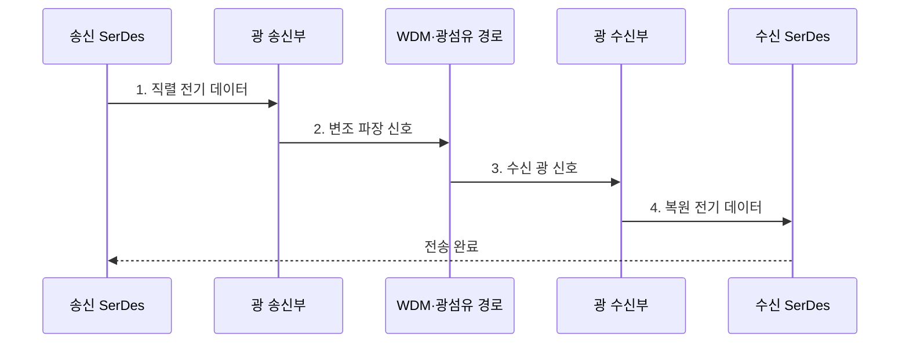

---
sidebar:
  order: 89
  label: "089. 광 인터커넥트 (Optical Interconnect)"
  badge:
    text: "미출 · 70%"
    variant: note
title: "광 인터커넥트 (Optical Interconnect)"
date: "2026-08-02T11:49:00+09:00"
tags:
  - "notes-hardware"
weight: 89
extra:
  question_no: "089"
  source_status: "미출"
  source_history: ""
  priority: 70
  priority_note: "인공지능 클러스터 대역폭·에너지 병목 대응"
---

## Ⅰ. 개요

핵심 용어

- **광 인터커넥트**: 전기 데이터를 빛으로 변환하여 광섬유로 전달하는 연결 기술이다.
- **광전 변환**: 전기 신호를 광 신호로 바꾸고 수신단에서 다시 전기 신호로 복원하는 과정이다.

- 정의/개념: 전기 데이터를 빛으로 전달하는 **광 연결 기술**
- 배경/필요성: 장거리 구리 배선의 **손실·등화 전력** 감소

#### 한줄 요약

- 전기 문장을 빛의 깜빡임으로 바꿔 광섬유를 통과시킨 뒤, 맞은편 수광기가 다시 전기 데이터로 복원한다.

## Ⅱ. 특징

핵심 용어

- **전자기 간섭(EMI) 내성**: 광 신호가 주변 전자기장에 의해 왜곡되지 않는 성질이다.
- **파장 분할 다중화(WDM)**: 서로 다른 파장의 광 채널을 한 광섬유로 동시에 전송하는 기술이다.
- **공동 패키지 광학(CPO)**: ASIC과 광 엔진을 같은 패키지 가까이에 배치해 전기 경로를 줄이는 구조이다.

- **광섬유·EMI 내성**으로 장거리 감쇠·간섭 감소
- **WDM 병렬 채널**로 대역폭 확대
- **CPO**로 ASIC·광 엔진의 전기 경로 단축

광 링크의 수신 전력과 여유는 다음과 같다.

$$
P_{\mathrm{rx}} = P_{\mathrm{tx}}-L_{\mathrm{total}},\qquad
M = P_{\mathrm{rx}}-P_{\mathrm{sens}}
$$

- 송신·수신·최소 감도 전력은 **dBm**, 총 경로 손실·링크 여유는 **dB** 적용
- 동일 파장·전송률에서 노화·오염·온도 손실을 포함한 **링크 버짓** 산정

#### 한줄 요약

- 빛은 멀리 가고 여러 색에 데이터를 나눠 실을 수 있지만 빛으로 바꾸는 장치에 전력·비용이 든다.

## Ⅲ. 구조 및 구성요소

핵심 용어

- **광 송신부**: 전기 데이터를 레이저와 변조기로 광 신호로 바꾸는 구성요소이다.
- **광 수신부**: 들어온 빛을 전기 신호로 검출하고 복원하는 구성요소이다.
- **SerDes**: 병렬 데이터를 고속 직렬 신호로 변환하고 수신 시 다시 병렬 데이터로 복원하는 회로이다.

| 구성요소 | 책임 |
|:---|:---|
| SerDes | **직렬화·역직렬화** |
| 광 송신부 | **E/O 변환·변조** |
| WDM 결합·분리기 | **파장 다중화·분리** |
| 광섬유 경로 | **광 신호 전달** |
| 광 수신부 | **O/E 변환·클록 복원** |

#### 한줄 요약

- 여러 색의 빛에 데이터를 나눠 실은 뒤 한 가닥으로 보내고, 도착지에서 색을 다시 나눠 전기 데이터로 복원한다.

## Ⅳ. 흐름도

핵심 용어

- **링크 버짓**: 송신 광출력에서 경로 손실과 수신 감도를 반영해 계산한 수신 전력 여유이다.
- **파장 드리프트**: 온도 변화 등으로 레이저·변조기의 중심 파장이 이동하는 현상이다.

**동작 원리**

1. **직렬 전기 데이터**: 병렬 데이터를 광 변조용 비트열로 직렬화
2. **변조 파장 신호**: E/O 변환 후 여러 파장을 한 광섬유에 결합
3. **수신 광 신호**: 경로 손실이 반영된 파장별 빛을 수신부에 전달
4. **복원 전기 데이터**: 파장 분리·O/E 변환·클록 복원으로 비트열 재생

#### 한줄 요약

- 데이터를 빛으로 바꿔 보내고 도착지에서 다시 복원한다.

## Ⅴ. 종류 및 비교

핵심 용어

- **광섬유**: 빛을 낮은 손실로 안내하여 장거리 전송하는 매체이다.
- **전기 인터커넥트**: 구리 배선의 전압·전류 신호로 데이터를 직접 전달하는 연결 방식이다.

| 인터커넥트 매체 | 광 인터커넥트 | 전기 인터커넥트 |
|:---|:---|:---|
| 적용 기준 | 전기 채널 한도 초과·**비트당 에너지 이득** | 전기 채널 한도 충족·**광전 변환 이득 없음** |
| 핵심 특징 | **광섬유·WDM** 장거리 전송 | **구리 배선·전압 신호** 직접 연결 |
| 한계 | **광전 변환·정렬·열 제어** | **감쇠·누화·등화 전력** |

> 요약: 전기 채널 한도 초과·종단 에너지 이득 구간만 **광 전환**

#### 한줄 요약

- 전선 손실이 한도를 넘고 광변환 전력까지 빼도 이득일 때만 광케이블로 바꾼다.

## Ⅵ. 실무 고려사항 및 대책

핵심 용어

- **삽입 손실**: 커넥터·결합기·광섬유를 통과하며 광출력이 감소하는 양이다.
- **비트당 에너지**: 한 비트를 종단까지 전달하는 데 소비되는 에너지이다.
- **곡률 반경**: 광섬유가 과도한 굽힘 손실 없이 유지해야 하는 최소 굽힘 크기이다.

| 문제 | 대책 | 효과 |
|:---|:---|:---|
| 오염·굽힘·접속 손실로 **링크 버짓 부족** | **설치 전후 광세기 측정·청소·곡률 관리** | **다운트레이닝·링크 단절** 예방 |
| 온도 변화로 레이저·변조기 **파장 드리프트** | **온도 제어·파장·출력 감시** | **WDM 채널 분리** 유지 |
| 광 모듈 장애로 **고대역 경로 중단** | **이중 경로·교체 절차·예비 모듈** 운영 | **광 링크 복구 시간** 단축 |
| 광전 변환 전력이 거리 절감분을 넘어 **에너지 이득 소멸** | **종단 비트당 에너지·냉각·거리 비교** | **광 전환 거리** 결정 |

#### 한줄 요약

- 수도관의 압력 여유를 재듯 송수신 광세기와 경로 손실을 측정하고, 여유가 부족하면 커넥터·굽힘·온도를 바로잡는다.

## Ⅶ. 결론

핵심 용어

- **광 전환 거리**: 광전 변환 비용보다 전기 채널의 손실·등화 비용 절감이 커지는 거리이다.
- **등화**: 전기 채널의 주파수별 손실을 보상해 수신 신호를 복원하는 처리이다.

- 전기 손실 한도 초과·에너지 이득 시 **광 인터커넥트** 적용

#### 한줄 요약

- 전선 손실이 한도를 넘고 빛으로 바꿨을 때 전력도 절약되는 구간만 광 연결로 바꾼다.
