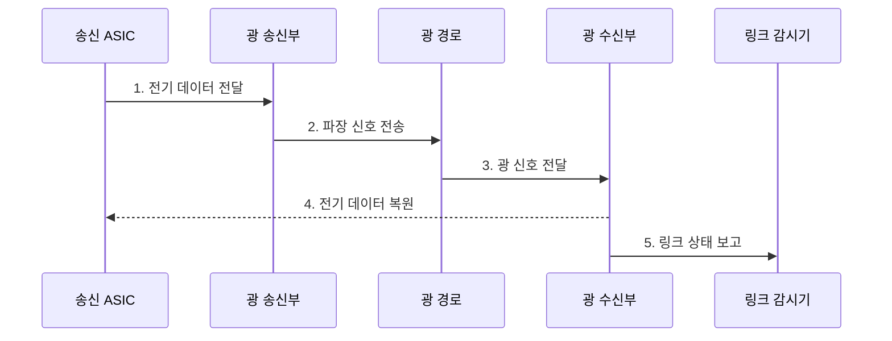

---
sidebar:
  order: 89
  label: "089. 광 인터커넥트 (Optical Interconnect)"
  badge:
    text: "미출 · 70%"
    variant: note
title: "광 인터커넥트 (Optical Interconnect)"
date: "2026-07-30T18:00:00+09:00"
tags:
  - "notes-hardware"
weight: 89
extra:
  question_no: "089"
  source_status: "미출"
  source_history: ""
  priority: 70
  priority_note: "인공지능 클러스터 대역폭·에너지 병목 대응"
---

## 미리 알고가기

- **광 인터커넥트(Optical Interconnect)**: 전기 데이터를 광 신호로 변환·전송·복원
- **전기-광 변환(Electrical-to-Optical Conversion, E/O)**: 송신기의 전기 데이터를 광섬유로 전송할 광 신호로 변환하는 과정
- **광-전기 변환(Optical-to-Electrical Conversion, O/E)**: 수신한 광 신호를 디지털 회로가 처리할 전기 데이터로 복원하는 과정
- **직병렬 변환기(Serializer/Deserializer, SerDes)**: 송신단에서 병렬 데이터를 직렬화하고 수신단에서 다시 병렬 데이터로 복원하는 회로
- **등화기(Equalizer)**: 전기 경로 손실로 흐려진 파형 보정
- **파장 다중화(Wavelength Division Multiplexing, WDM)**: 서로 다른 파장의 광 신호를 하나의 광섬유로 동시에 전송하는 기술
- **공동 패키지 광학(Co-Packaged Optics, CPO)**: 광 엔진을 스위치 ASIC과 같은 패키지에 배치하여 전기 신호 경로를 줄이는 구조
- **링크 버짓(Link Budget)**: 송신 출력·경로 손실·수신 감도 간 여유
- **감쇠·누화(Attenuation·Crosstalk)**: 감쇠는 전송 거리에서 신호 세기가 줄어드는 현상이고 누화는 이웃 채널 신호가 섞이는 간섭
- **전자기 간섭(Electromagnetic Interference, EMI)**: 외부 전자기장이 전기 신호에 잡음을 유도하여 신호 무결성을 저하하는 현상
- **레이저·변조기(Laser·Modulator)**: 레이저는 광 반송파를 만들고 변조기는 전기 데이터에 따라 빛의 세기·위상을 바꿈
- **수광기·증폭기(Photodetector·Amplifier)**: 수광기는 빛을 전류로 바꾸고 증폭기는 약한 전기 신호를 판독 가능한 크기로 키움
- **비트당 에너지(Energy per Bit)**: 데이터 한 비트를 전송·복원하는 데 소비되는 에너지
- **랙(Rack)**: 여러 서버·스위치·전원 장비를 표준 프레임에 장착한 데이터센터 설비 단위
- **데시벨(Decibel, dB)**: 두 전력 비율을 로그 척도로 나타내는 단위
- **dBm**: 1 mW를 기준으로 한 절대 전력을 데시벨로 나타내는 단위
- **삽입 손실(Insertion Loss)**: 커넥터·결합기 등을 경로에 넣어 추가되는 신호 손실
- **분산(Dispersion)**: 광 펄스 성분이 서로 다른 속도로 도착해 파형이 퍼지는 현상
- **클록 복원(Clock Recovery)**: 수신 직렬 신호에서 비트 판정 시점을 재생하는 동작
- **다운트레이닝(Downtraining)**: 링크가 목표보다 낮은 속도로 동작하도록 조정되는 현상

## Ⅰ. 개요

- 정의/개념: 전기 데이터를 빛으로 전달하는 **광 연결 기술**
- 배경/필요성: 장거리 구리 배선의 **손실·등화 전력** 감소

### 쉽게 이해하기 (학습용)

- 전기 신호를 빛으로 바꿔 보내고 도착지에서 데이터로 되돌린다.

## Ⅱ. 특징

- **광섬유 전송**으로 장거리 감쇠·간섭 감소
- **WDM 병렬 채널**로 대역폭 확대
- **링크 버짓**이 거리·오류 한계 결정

### 쉽게 이해하기 (학습용)

- 빛은 멀리 가고 여러 색에 데이터를 나눠 실을 수 있지만 빛으로 바꾸는 장치에 전력·비용이 든다.

## Ⅲ. 구조 및 구성요소

| 구성요소 | 책임 |
|:---|:---|
| SerDes | **직렬화·역직렬화** |
| 광 송신부 | **E/O 변환·변조** |
| WDM 결합·분리기 | **파장 다중화·분리** |
| 광섬유 경로 | **광 신호 전달** |
| 광 수신부 | **O/E 변환·복원** |

광 링크의 수신 전력과 여유는 다음과 같다.

$$
P_{\mathrm{rx}} = P_{\mathrm{tx}}-\sum L_i,\qquad
M = P_{\mathrm{rx}}-P_{\mathrm{sens}}
$$

- \(P_{\mathrm{tx}},P_{\mathrm{rx}},P_{\mathrm{sens}}\): 송신·수신·최소 감도 전력(dBm)
- \(L_i\): 광섬유·커넥터·분기·결합 손실(dB), \(M\): 링크 여유(dB)
- 동일 파장·전송률·목표 오류율을 가정하고 노화·오염·온도 여유를 손실에 포함한다.

### 쉽게 이해하기 (학습용)

- 여러 색의 빛에 데이터를 나눠 실은 뒤 한 가닥으로 보내고, 도착지에서 색을 다시 나눠 전기 데이터로 복원한다.

## Ⅳ. 흐름도

**동작 원리**

- **1. 전기 데이터 전달**: 데이터 직렬화
- **2. 파장 신호 전송**: E/O 변환·결합
- **3. 광 신호 전달**: 광섬유로 전송
- **4. 전기 데이터 복원**: 분리·O/E 변환
- **5. 링크 상태 보고**: 광세기·오류 계측

### 쉽게 이해하기 (학습용)

- 데이터를 빛으로 바꿔 보내고 도착지에서 다시 복원한다.

## Ⅴ. 종류 및 비교

| 구분 | 광 인터커넥트 | 전기 인터커넥트 |
|:---|:---|:---|
| 적용 기준 | 전기 채널 한도 초과·비트당 에너지 이득 | 전기 채널 한도 충족·광전 변환 이득 없음 |
| 핵심 특징 | 광섬유·파장 채널 장거리 전송 | 구리 배선·전압 신호 직접 연결 |
| 한계 | 광전 변환·정렬·열 제어 | 감쇠·누화·등화 전력 |

> 요약: 전기 채널 한도를 넘고 에너지 이득이 있는 구간만 광으로 전환한다.

### 쉽게 이해하기 (학습용)

- 전선 손실이 한도를 넘고 광변환 전력까지 빼도 이득일 때만 광케이블로 바꾼다.

## Ⅵ. 실무 고려사항 및 대책

| 고려사항 | 대책 | 효과 |
|:---|:---|:---|
| 커넥터 오염·굽힘·접속 손실로 링크 버짓 부족 | 설치 전후 광세기 측정과 청소·곡률 관리 | 비트 오류·링크 단절 예방 |
| 레이저·변조기 온도 드리프트 | 온도 제어와 파장·출력 원격 감시 | WDM 채널 안정성 확보 |
| 광 모듈 장애가 고대역 경로 중단 | 이중 경로·교체 절차와 예비 부품 운영 | 복구 시간 단축 |
| 광전 변환 전력이 거리 이득 상쇄 | 종단 비트당 에너지·냉각·거리 공동 비교 | 경제적 전환 지점 결정 |

### 쉽게 이해하기 (학습용)

- 인공지능 서버 랙 사이는 여러 색의 빛을 한 광섬유에 실어 보낸다.

## Ⅶ. 결론

- 거리·비트당 에너지로 **광 인터커넥트**를 적용한다.

### 쉽게 이해하기 (학습용)

- 전선 손실이 한도를 넘고 빛으로 바꿨을 때 전력도 절약되는 구간만 광 연결로 바꾼다.
