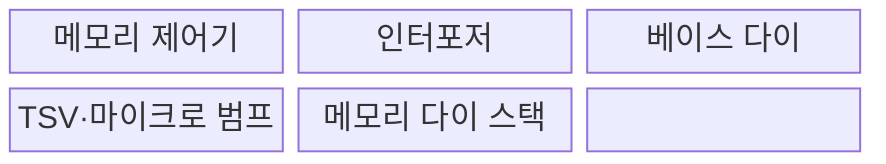
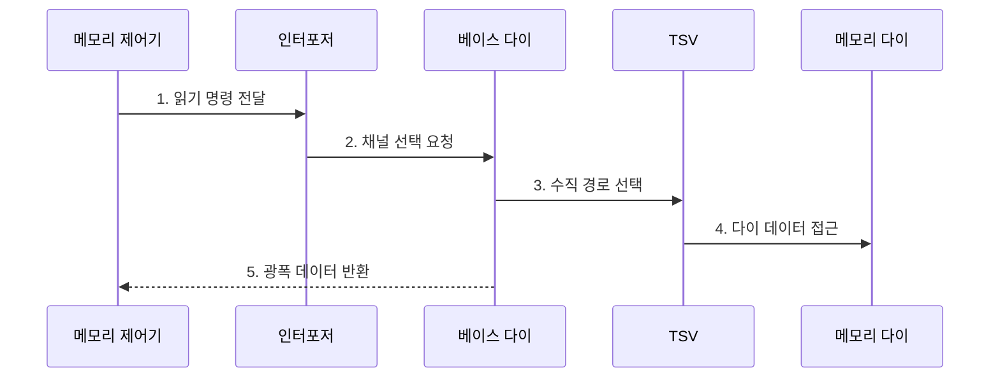

---
sidebar:
  order: 90
  label: "090. 3D 적층 메모리 (3D Stacked Memory)"
  badge:
    text: "기출 · 50%"
    variant: note
title: "3D 적층 메모리 (3D Stacked Memory)"
date: "2026-07-30T18:00:00+09:00"
tags:
  - "notes-hardware"
weight: 90
extra:
  question_no: "090"
  source_status: "기출"
  source_history: "126회"
  priority: 50
  priority_note: "대역폭·면적 이득과 열·수율 절충"
---

## 미리 알고가기

- **3차원(Three-Dimensional, 3D) 적층 메모리**: 여러 메모리 다이를 수직 적층하고 층간 배선으로 연결한 구조
- **다이(Die)**: 웨이퍼에서 잘라낸 개별 반도체 칩
- **웨이퍼(Wafer)**: 여러 반도체 다이를 한꺼번에 제조하는 얇은 원형 실리콘 기판
- **실리콘 관통 전극(Through-Silicon Via, TSV)**: 실리콘 다이를 수직 관통하여 적층 다이 사이의 신호와 전력을 전달하는 배선
- **마이크로 범프 접합(Micro-bump Bonding)**: 위아래 다이 전극을 맞붙이는 연결
- **고대역폭 메모리(High Bandwidth Memory, HBM)**: 적층 DRAM과 광폭 입출력 인터페이스를 결합한 고대역폭 메모리
- **동적 임의 접근 메모리(Dynamic Random Access Memory, DRAM)**: HBM 스택에서 데이터를 저장하는 메모리 다이
- **입출력(Input/Output, I/O)**: 프로세서와 메모리 사이에서 명령·주소·데이터를 전달하는 신호 경로
- **베이스 다이(Base Die)**: 스택 하단에서 외부 I/O와 TSV를 연결
- **인터포저(Interposer)**: 프로세서와 HBM 사이에 넓은 배선을 제공
- **채널(Channel)**: 독립 명령·데이터 전송 경로
- **뱅크(Bank)**: 독립 활성화 가능한 셀 배열 구역
- **적층 수율(Stack Yield)**: 모든 다이·접합이 정상인 스택 비율
- **열 밀도(Thermal Density)**: 단위 면적이나 부피에서 발생하는 열의 양으로 적층 냉각 난도를 좌우하는 값
- **검사 합격 다이(Known Good Die, KGD)**: 적층 조립 전에 전기적 시험으로 정상 동작을 확인한 다이
- **행 활성화·열 선택(Row Activation·Column Selection)**: DRAM 뱅크의 한 행을 감지기에 연 뒤 그중 필요한 열 데이터를 읽는 절차
- **반도체 패키지(Semiconductor Package)**: 다이를 보호하고 전원·신호·냉각 경로를 외부 시스템에 연결하는 구조
- **인공지능(Artificial Intelligence, AI)**: 대규모 텐서 연산으로 HBM의 높은 대역폭을 활용하는 대표 가속기 워크로드
- **열 스로틀링(Thermal Throttling)**: 온도 한도를 지키려고 주파수·요청률을 낮추는 제어
- **전원망(Power Delivery Network, PDN)**: 전원에서 다이의 회로까지 전압·전류를 공급하는 경로
- **디커플링(Decoupling)**: 축전기로 순간 전류를 공급해 전원 전압 흔들림을 줄이는 기법
- **신호 무결성(Signal Integrity)**: 신호가 잡음·왜곡 없이 수신 조건을 만족하는 성질
- **수리 자원(Repair Resource)**: 불량 셀·배선을 대체하는 예비 행·열·경로

## Ⅰ. 개요

- 정의/개념: 메모리 다이를 수직 적층해 **배선을 줄인 구조**
- 배경/필요성: 보드형 메모리의 **핀 수·배선 길이** 한계 해소

### 쉽게 이해하기 (학습용)

- 서랍을 위로 쌓고 짧은 통로를 많이 내어 한 번에 더 많은 데이터를 옮긴다.

## Ⅱ. 특징

- **짧은 층간 배선**으로 비트당 전송 에너지 절감
- **넓은 I/O 병렬 전송**으로 메모리 대역폭 확장
- **수직 다이 적층**으로 패키지 면적당 용량 증가

### 쉽게 이해하기 (학습용)

- 엘리베이터가 많으면 물건은 많이 옮기지만 층이 쌓일수록 열은 갇히고 작은 불량도 전체에 번진다.

## Ⅲ. 구조 및 구성요소

| 구성요소 | 책임 |
|:---|:---|
| 메모리 제어기 | **명령·주소 발행** |
| 인터포저 | **광폭 배선 제공** |
| 베이스 다이 | **외부 I/O 연결** |
| TSV·마이크로 범프 | **수직 신호·전력 전달** |
| 메모리 다이 스택 | **용량·병렬성 제공** |

### 쉽게 이해하기 (학습용)

- 주소가 베이스 다이에서 맞는 층과 서랍으로 올라가고, 읽은 데이터는 여러 수직 통로와 넓은 배선으로 함께 돌아온다.

## Ⅳ. 흐름도

**동작 원리**

- **1. 읽기 명령 전달**: 행·열 주소 발행
- **2. 채널 선택 요청**: 대상 채널 전달
- **3. 수직 경로 선택**: 대상 TSV 선택
- **4. 다이 데이터 접근**: 선택 층·뱅크의 배열 데이터를 TSV로 반환
- **5. 광폭 데이터 반환**: 베이스 다이가 병렬 데이터를 제어기에 복원

### 쉽게 이해하기 (학습용)

- 주소는 맞는 층으로 올라가고 데이터는 넓은 길로 돌아온다.

## Ⅴ. 종류 및 비교

| 구분 | HBM형 3D 적층 | 보드형 메모리 |
|:---|:---|:---|
| 적용 기준 | 대역폭·**면적 밀도 우선** | 용량·교체성·**비용 우선** |
| 핵심 특징 | 수직 적층·**넓은 I/O 고대역폭** | 수평 배선·**모듈형 용량 확장** |
| 한계 | 열 밀도·**적층 수율·패키지 비용** | 핀 수·배선 길이·**전송 전력** |

> 요약: 대역폭·면적은 적층, 용량·비용은 보드형이 유리하다.

### 쉽게 이해하기 (학습용)

- 한 번에 많이 옮기는 게 우선이면 위로 쌓고 값싸게 용량을 늘리려면 보드에 나눠 꽂는다.

## Ⅵ. 실무 고려사항 및 대책

| 고려사항 | 대책 | 효과 |
|:---|:---|:---|
| 적층 내부 열 집중으로 오류·스로틀링 | 층별 온도 감시와 방열·채널 배치·전력 제한 | 지속 대역폭·수명 확보 |
| 다이·TSV·접합 불량이 스택 수율 저하 | 검사 합격 다이·적층 단계별 시험과 수리 자원 | 제조 손실 감소 |
| 넓은 I/O 동시 전환으로 전원 잡음 | 전원망·디커플링·신호 무결성 공동 검증 | 데이터 오류 예방 |
| 용량 요구가 고가 패키지 한도 초과 | HBM·보드형 메모리 계층화와 실제 부하 분석 | 비용 대비 용량·대역폭 균형 |

### 쉽게 이해하기 (학습용)

- 가속기 옆에 여러 층 메모리를 붙여 짧고 넓은 길로 데이터를 보낸다.

## Ⅶ. 결론

- 대역폭·열·수율로 **3D 적층 메모리**를 적용한다.

### 쉽게 이해하기 (학습용)

- 냉각 비용과 불량 손실이 허용 범위일 때만 메모리를 위로 쌓고 넘으면 보드형을 쓴다.
