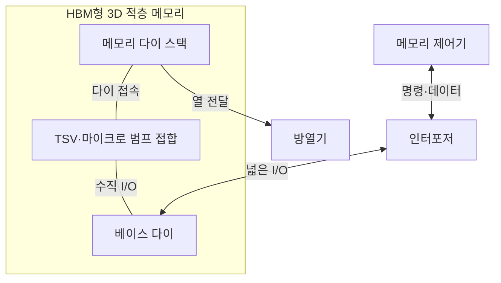
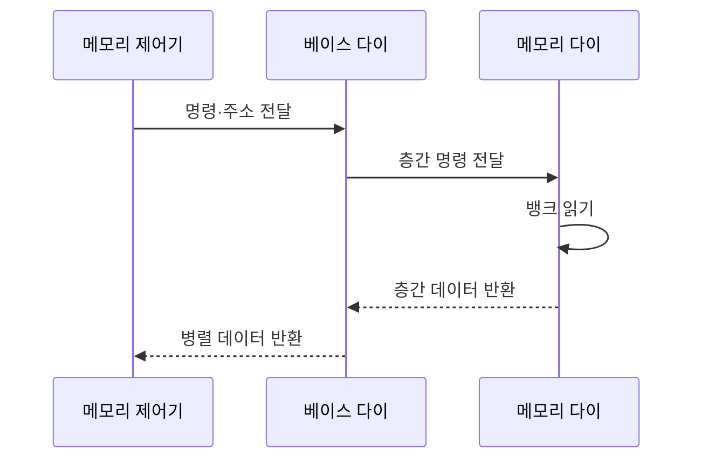

---
sidebar:
  order: 90
  label: "090. 3D 적층 메모리 (3D Stacked Memory)"
  badge:
    text: "기출 · 50%"
    variant: note
title: "3D 적층 메모리 (3D Stacked Memory)"
date: "2026-07-27T23:59:59+09:00"
tags:
  - "notes-hardware"
weight: 90
extra:
  question_no: "090"
  source_status: "기출"
  source_history: "126회"
  priority: 50
  priority_note: "대역폭·면적 이득과 열·수율 절충"
---

## 미리 알고가기

- **3차원(Three-Dimensional, 3D) 적층 메모리**: 3D는 ‘쓰리디’로 읽고 세 공간 차원을 숫자와 머리글자로 줄인 표기이며, 메모리 다이를 수직 연결한 구조
- **다이(Die)**: 웨이퍼에서 잘라낸 개별 반도체 칩
- **웨이퍼(Wafer)**: 여러 반도체 다이를 한꺼번에 제조하는 얇은 원형 실리콘 기판
- **실리콘 관통 전극(Through-Silicon Via, TSV)**: TSV는 ‘티에스브이’로 읽고 영문 머리글자를 딴 약어이며, 실리콘을 관통해 층간 신호·전력을 전달
- **마이크로 범프 접합(Micro-bump Bonding)**: 위아래 다이 전극을 맞붙이는 연결
- **고대역폭 메모리(High Bandwidth Memory, HBM)**: HBM은 ‘에이치비엠’으로 읽고 영문 머리글자를 딴 약어이며, 적층 DRAM과 넓은 I/O를 결합한 메모리
- **동적 임의 접근 메모리(Dynamic Random Access Memory, DRAM)**: DRAM은 ‘디램’으로 읽고 영문 머리글자를 딴 약어이며, HBM 스택의 저장 다이로 사용
- **입출력(Input/Output, I/O)**: I/O는 ‘아이오’로 읽고 입력과 출력 사이를 슬래시로 묶은 표기이며, 명령·주소·데이터가 오가는 신호 경로
- **베이스 다이(Base Die)**: 스택 하단에서 외부 I/O와 TSV를 연결
- **인터포저(Interposer)**: 프로세서와 HBM 사이에 넓은 배선을 제공
- **채널(Channel)**: 독립 명령·데이터 전송 경로
- **뱅크(Bank)**: 독립 활성화 가능한 셀 배열 구역
- **적층 수율(Stack Yield)**: 모든 다이·접합이 정상인 스택 비율
- **열 밀도(Thermal Density)**: 단위 면적이나 부피에서 발생하는 열의 양으로 적층 냉각 난도를 좌우하는 값
- **검사 합격 다이(Known Good Die, KGD)**: KGD는 ‘케이지디’로 읽고 영문 머리글자를 딴 약어이며, 적층 전 전기적 시험에서 정상 동작이 확인된 다이
- **행 활성화·열 선택(Row Activation·Column Selection)**: DRAM 뱅크의 한 행을 감지기에 연 뒤 그중 필요한 열 데이터를 읽는 절차
- **반도체 패키지(Semiconductor Package)**: 다이를 보호하고 전원·신호·냉각 경로를 외부 시스템에 연결하는 구조
- **인공지능(Artificial Intelligence, AI)**: AI는 ‘에이아이’로 읽고 영문 머리글자를 딴 약어이며, HBM 대역폭을 활용하는 가속기 워크로드를 대표

## Ⅰ. 개요

- **정의/개념**: 메모리 다이를 수직 적층해 **짧은 배선·넓은 I/O**를 제공하는 구조
- **기존 한계**: 보드형 메모리는 **핀 수·배선 길이**로 대역폭·전력 제한

### 쉽게 이해하기 (학습용)

- 서랍을 위로 쌓고 짧은 통로를 많이 내어 한 번에 더 많은 데이터를 옮긴다.

## Ⅱ. 특징

- **짧은 층간 배선**으로 비트당 전송 에너지 절감
- **넓은 I/O 병렬 전송**으로 메모리 대역폭 확장
- **수직 다이 적층**으로 패키지 면적당 용량 증가

### 쉽게 이해하기 (학습용)

- 엘리베이터가 많으면 물건은 많이 옮기지만 층이 쌓일수록 열은 갇히고 작은 불량도 전체에 번진다.

## Ⅲ. 아키텍처 및 구성요소

| 설계 요소 | 설명 |
|:---|:---|
| 메모리 다이 스택 | 여러 DRAM 다이에 채널·뱅크 배치 |
| TSV·마이크로 범프 접합 | 다이 사이 신호·전력의 수직 경로 |
| 베이스 다이 | 넓은 I/O와 TSV 채널을 연결 |

> 요약: TSV가 다이 스택과 베이스 다이를 수직 연결

### 쉽게 이해하기 (학습용)

- 아래 안내층이 넓은 길의 신호를 나누고 수직 통로가 여러 저장층을 잇는다.

## Ⅳ. 원리 및 절차 흐름도

| 절차 | 설명 |
|:---|:---|
| 명령·주소 전달 | 읽기 명령·채널·뱅크 주소 발행 |
| 층간 명령 전달 | TSV로 대상 다이에 명령 전달 |
| 뱅크 읽기 | 행 활성화 후 선택 열 데이터 감지 |
| 층간 데이터 반환 | TSV 경로로 읽은 데이터 전송 |
| 병렬 데이터 반환 | 넓은 I/O로 제어기에 병렬 반환 |

> 요약: 주소로 다이·뱅크를 정해 병렬 반환

### 쉽게 이해하기 (학습용)

- 주소가 붙은 주문은 맞는 서랍으로 올라가고 읽은 데이터는 여러 통로로 함께 내려온다.

## Ⅴ. 종류 및 비교

| 메모리 실장 방식 | HBM형 3D 적층 | 보드형 메모리 |
|:---|:---|:---|
| 적용 기준 | 대역폭·**면적 밀도 우선** | 용량·교체성·**비용 우선** |
| 핵심 특징 | 수직 적층·**넓은 I/O 고대역폭** | 수평 배선·**모듈형 용량 확장** |
| 한계 | 열 밀도·**적층 수율·패키지 비용** | 핀 수·배선 길이·**전송 전력** |

> 요약: 대역폭·면적은 적층, 용량·비용은 보드형

### 쉽게 이해하기 (학습용)

- 한 번에 많이 옮기는 게 우선이면 위로 쌓고 값싸게 용량을 늘리려면 보드에 나눠 꽂는다.

## Ⅵ. 실무 사례

1. AI 가속기 패키지는 **HBM 스택을 연산기 인접 배치**
2. HBM 제조는 **검사 합격 다이만 적층**

### 쉽게 이해하기 (학습용)

- 가속기 옆에 여러 층 메모리를 붙여 짧고 넓은 길로 데이터를 보낸다.
- 층을 모두 쌓기 전에 불량 칩을 제외해 스택 전체 폐기를 줄인다.

## Ⅶ. 결론

- **열·수율 한도**에서 고대역폭이 필요하면 3D 적층 선택

### 쉽게 이해하기 (학습용)

- 냉각 비용과 불량 손실이 허용 범위일 때만 메모리를 위로 쌓고 넘으면 보드형을 쓴다.
