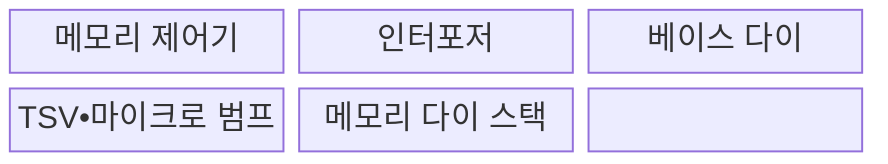
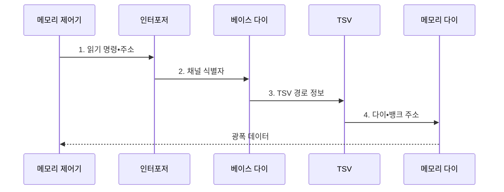

---
sidebar:
  order: 90
  label: "090. 3D 적층 메모리 (3D Stacked Memory)"
  badge:
    text: "기출 • 50%"
    variant: note
title: "3D 적층 메모리 (3D Stacked Memory)"
date: "2026-08-03T08:48:47+09:00"
tags:
  - "notes-hardware"
weight: 90
extra:
  question_no: "090"
  source_status: "기출"
  source_history: "126회"
  priority: 50
  priority_note: "대역폭•면적 이득과 열•수율 절충"
---

## Ⅰ. 개요

핵심 용어

- **3D 적층 메모리**: 여러 메모리 다이를 수직으로 쌓고 층간 배선으로 연결한 구조이다.
- **실리콘 관통 전극(TSV)**: 실리콘 다이를 관통하여 적층 다이 사이의 신호와 전력을 전달하는 배선이다.

- 정의/개념: 메모리 다이를 수직 적층해 **TSV** 로 연결하는 고대역폭 메모리 구조
- 배경/필요성: 보드형 메모리는 핀 수•배선 길이 증가로 **대역폭•전력 확장 제약**

#### 한줄 요약

- 서랍을 위로 쌓고 짧은 통로를 많이 내어 한 번에 더 많은 데이터를 옮긴다.

## Ⅱ. 특징

핵심 용어

- **넓은 I/O**: 많은 신호선을 낮은 속도로 병렬 동작시켜 높은 총대역폭을 얻는 인터페이스이다.
- **열 밀도**: 단위 면적이나 부피에서 발생하는 열의 양으로, 값이 클수록 적층 냉각이 어려워진다.
- **적층 수율**: 모든 다이와 접합이 정상 동작하는 완성 스택의 비율이다.

- **짧은 층간 배선** 으로 비트당 전송 에너지 절감
- **넓은 I/O 병렬 전송** 으로 메모리 대역폭 확장
- **수직 다이 적층** 으로 패키지 면적당 용량 증가

#### 한줄 요약

- 엘리베이터가 많으면 물건은 많이 옮기지만 층이 쌓일수록 열은 갇히고 작은 불량도 전체에 번진다.

## Ⅲ. 구조 및 구성요소

핵심 용어

- **베이스 다이**: 메모리 스택 하단에서 외부 입출력과 TSV를 연결하는 다이이다.
- **인터포저**: 프로세서와 HBM 사이에 짧고 넓은 배선 경로를 제공하는 기판이다.
- **마이크로 범프 접합**: 위아래 다이의 미세 전극을 맞붙여 전기적으로 연결하는 방식이다.

| 구성요소 | 책임 |
|:---|:---|
| 메모리 제어기 | **명령•주소 발행** |
| 인터포저 | **광폭 배선 제공** |
| 베이스 다이 | **외부 I/O 연결** |
| TSV•마이크로 범프 | **수직 신호•전력 전달** |
| 메모리 다이 스택 | **용량•병렬성 제공** |

#### 한줄 요약

- 주소가 베이스 다이에서 맞는 층과 서랍으로 올라가고, 읽은 데이터는 여러 수직 통로와 넓은 배선으로 함께 돌아온다.

## Ⅳ. 흐름도

핵심 용어

- **행 활성화•열 선택**: DRAM 뱅크의 한 행을 감지기에 연 뒤 필요한 열 데이터를 고르는 절차이다.
- **채널**: 독립적인 명령•주소•데이터 전송 경로이다.
- **뱅크**: 다른 구역과 독립적으로 행을 활성화할 수 있는 DRAM 셀 배열 구역이다.

**동작 원리**

1. **읽기 명령•주소**: 대상 주소와 읽기 요청 전달
2. **채널 식별자**: 베이스 다이가 대상 채널 식별
3. **TSV 경로 정보**: 선택한 수직 경로로 명령 전송
4. **다이•뱅크 주소**: 행•열 선택 후 데이터 접근

#### 한줄 요약

- 주소는 맞는 층으로 올라가고 데이터는 넓은 길로 돌아온다.

## Ⅴ. 종류 및 비교

핵심 용어

- **고대역폭 메모리(HBM)**: 적층 DRAM과 광폭 입출력 인터페이스를 결합한 고대역폭 메모리이다.
- **보드형 메모리**: 메모리 칩이나 모듈을 보드에 수평 배치해 용량과 교체성을 확보하는 방식이다.

| 메모리 구조 | HBM형 3D 적층 | 보드형 메모리 |
|:---|:---|:---|
| 적용 기준 | 대역폭•**면적 밀도 우선** | 용량•교체성•**비용 우선** |
| 핵심 특징 | 수직 적층•**넓은 I/O 고대역폭** | 수평 배선•**모듈형 용량 확장** |
| 한계 | 열 밀도•**적층 수율•패키지 비용** | 핀 수•배선 길이•**전송 전력** |

> 요약: 대역폭•면적은 **3D 적층**, 용량•비용은 **보드형** 선택

#### 한줄 요약

- 한 번에 많이 옮기는 게 우선이면 위로 쌓고 값싸게 용량을 늘리려면 보드에 나눠 꽂는다.

## Ⅵ. 실무 고려사항 및 대책

핵심 용어

- **검사 합격 다이(KGD)**: 적층 전에 전기 시험으로 정상 동작을 확인한 다이이다.
- **전원망(PDN)**: 전원에서 각 다이 회로까지 전압과 전류를 공급하는 경로이다.
- **수리 자원**: 불량 셀이나 배선을 대체하도록 마련한 예비 행•열•경로이다.

| 문제 | 대책 | 효과 |
|:---|:---|:---|
| 적층 내부 열 집중으로 **오류•열 스로틀링** 발생 | **층별 온도 감시•방열•채널 배치** | **지속 대역폭•수명** 유지 |
| 다이•TSV•접합 불량 중 하나로 **적층 수율 저하** | **KGD•수리 자원** 적용 | **조립 후 폐기 비용** 감소 |
| 넓은 I/O 동시 전환으로 **전원 잡음•신호 무결성 저하** | **PDN•디커플링•신호 무결성 검증** | **데이터 오류** 예방 |
| 용량 요구가 HBM 패키지 한도를 넘어 **비용 급증** | **HBM•보드형 메모리 계층화** | 대역폭을 지키며 **용량 비용** 절감 |

#### 한줄 요약

- 가속기 옆에 여러 층 메모리를 붙여 짧고 넓은 길로 데이터를 보낸다.

## Ⅶ. 결론

핵심 용어

- **열 스로틀링**: 온도 한도를 지키기 위해 메모리 요청률이나 동작 속도를 낮추는 제어이다.
- **신호 무결성**: 신호가 잡음과 왜곡을 견디며 수신 조건을 만족하는 성질이다.

- 대역폭•면적은 **3D 적층**, 용량•비용은 **보드형** 선택

#### 한줄 요약

- 냉각 비용과 불량 손실이 허용 범위일 때만 메모리를 위로 쌓고 넘으면 보드형을 쓴다.
