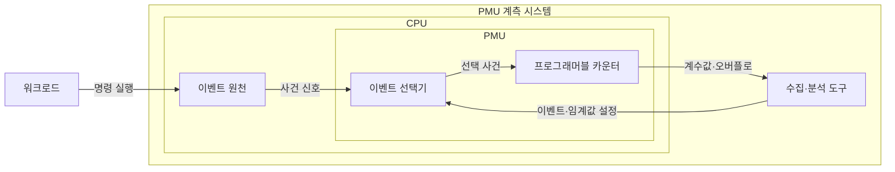

---
sidebar:
  order: 91
  label: "091. 하드웨어 성능 카운터·PMU (Hardware Performance Counter and PMU)"
  badge:
    text: "미출 · 50%"
    variant: note
title: "하드웨어 성능 카운터·PMU (Hardware Performance Counter and PMU)"
date: "2026-07-25T00:22:25+09:00"
tags:
  - "notes-hardware"
weight: 91
extra:
  question_no: "091"
  source_status: "미출"
  source_history: ""
  priority: 50
  priority_note: "CPU 병목 가설을 사건 계수로 검증"
---

## 미리 알고가기

- **하드웨어 성능 카운터(Hardware Performance Counter)·성능 모니터링 장치(Performance Monitoring Unit, PMU)**: 프로세서 내부 사건을 선택하여 하드웨어 카운터로 계수하는 성능 분석 기능
- **중앙처리장치(Central Processing Unit, CPU)**: 명령어를 실행하면서 사이클·명령 은퇴·캐시 미스·분기 오예측 등의 성능 사건을 생성하는 처리장치
- **하드웨어 이벤트(Hardware Event)**: CPU 블록에서 발생해 PMU가 세는 사건
- **명령어 은퇴(Instruction Retirement)**: 명령 실행 결과가 확정된 상태
- **사이클당 명령어 수(Instructions Per Cycle, IPC)**: 클록 사이클당 완료한 명령어 수로 프로세서 파이프라인의 처리 효율을 나타내는 지표
- **카운터 오버플로(Counter Overflow)**: 임계값 도달 시 인터럽트가 발생하는 상태
- **샘플링(Sampling)**: 카운터 오버플로 때 실행 위치 기록
- **카운터 다중화(Multiplexing)**: 이벤트를 시간 분할해 물리 카운터를 공유
- **캐시 미스율(Cache Miss Rate)**: 전체 캐시 접근 중 하위 계층 접근 비율
- **코어 고정(CPU Pinning)**: 측정 스레드를 같은 코어에 유지하는 조치
- **클럭 사이클(Clock Cycle)**: 처리기 동작을 진행시키는 기준 클럭의 한 주기
- **분기 예측 실패(Branch Misprediction)**: 처리기가 예상한 다음 명령 경로가 실제 분기 결과와 달라 파이프라인을 다시 채우는 사건
- **소프트웨어 프로파일링(Software Profiling)**: 실행 위치·호출 경로·시간을 수집해 지연이 집중된 코드를 찾는 분석
- **계측 오버헤드(Instrumentation Overhead)**: 측정 코드와 샘플링이 원래 프로그램의 시간·자원 사용에 더하는 비용
- **이벤트 활성 시간(Event Active Time)**: 다중화 중 특정 이벤트가 실제 물리 카운터에 연결되어 계수된 시간

## Ⅰ. 개요

- 정의/개념: CPU 사건을 선택·계수하고 오버플로를 알리는 내장 계측 장치
- 기존 한계: 전체 실행 시간만으로는 캐시 미스·분기 예측 실패·명령 정체 등 CPU 내부 병목의 원인을 구분하기 어렵다.

### 쉽게 이해하기 (학습용)

- 프로세서 안에서 몇 번 멈추고 헛걸음했는지 세어 느린 원인을 찾는 계기판이다.

## Ⅱ. 특징

- 하드웨어 계수는 실행 간섭과 측정 오차를 줄인다.
- 계수는 총량을, 샘플링은 실행 위치를 제공한다.
- 카운터 제한은 다중화 환산 오차를 만든다.
- 이벤트 정의·가용성은 CPU별 비교를 제한한다.

### 쉽게 이해하기 (학습용)

- 일을 거의 방해하지 않지만 프로세서가 바뀌면 같은 눈금도 뜻이 달라진다.

## Ⅲ. 아키텍처 및 구성요소

| 설계 요소 | 입력·상태 | 역할 |
|:---|:---|:---|
| 이벤트 원천 | 코어·캐시·메모리 사건 | 계수 가능한 하드웨어 신호 생성 |
| 이벤트 선택기 | 사건 코드·권한·조건 | 물리 카운터에 사건 연결 |
| 프로그래머블 카운터 | 사건 펄스·오버플로 임계값 | 사건 수 누적·샘플 통지 |
| 수집·분석 도구 | 계수값·활성 시간·실행 위치 | 비율 보정·병목 상관 분석 |

> 요약: 선택한 사건을 카운터에 연결하고 도구가 계수값을 읽음

### 쉽게 이해하기 (학습용)

- 프로세서 사건을 원하는 계기에 연결하고 숫자와 발생 위치를 분석 도구가 읽는다.

## Ⅳ. 운영 고려사항

| 운영 위험 | 대응 | 기대 효과 |
|:---|:---|:---|
| CPU 세대별 이벤트 의미·단위 차이 | 모델별 공식 이벤트 정의와 원시 코드·단위 기록 | 측정 해석 오류 방지 |
| 물리 카운터 부족으로 다중화 오차 | 핵심 사건 묶음 축소와 활성 시간 보정·반복 측정 | 계수 신뢰도 향상 |
| 스레드 이동·주파수 변화가 비교 왜곡 | 코어 고정·부하·전원 정책 통제와 반복 분포 보고 | 재현 가능한 비교 |
| 샘플링 빈도가 너무 높아 실행 간섭 | 오버헤드 측정 후 표본 주기 조절 | 관측 정확도와 부하 균형 |

### 쉽게 이해하기 (학습용)

- 선택된 사건마다 숫자가 올라가고 정한 수에 닿을 때 실행 위치가 기록된다.

## Ⅴ. 종류 및 비교

| 판단 기준 | PMU 계측 | 소프트웨어 프로파일링 |
|:---|:---|:---|
| 핵심 특징 | CPU 사건을 하드웨어 카운터로 계수 | 코드 위치·호출 경로를 샘플링 |
| 적용 기준 | CPU 내부 병목 가설 검증 | 지연 코드 위치·호출 관계 탐색 |
| 주요 위험 | 카운터 수·모델별 이벤트 차이 | 계측·샘플링 오버헤드 |

> 요약: 코드 위치는 프로파일링, CPU 병목은 PMU로 검증

### 쉽게 이해하기 (학습용)

- 작업 기록은 느린 코드 위치를 찾고 프로세서 계기판은 내부 원인을 확인할 근거를 준다.

## Ⅵ. 실무 사례

1. 요청 처리 서버는 캐시 미스율·IPC로 메모리 병목 검증

### 쉽게 이해하기 (학습용)

- 서버 요청을 반복하며 캐시 실패율과 한 박자당 완료 명령 수로 메모리 정체를 확인한다.

## Ⅶ. 결론

- 프로파일링 후 동일 조건의 PMU 사건 비율로 병목 검증

### 쉽게 이해하기 (학습용)

- 느린 코드 위치를 먼저 좁힌 뒤 프로세서 계기판의 여러 눈금이 같은 원인을 가리키는지 확인한다.
