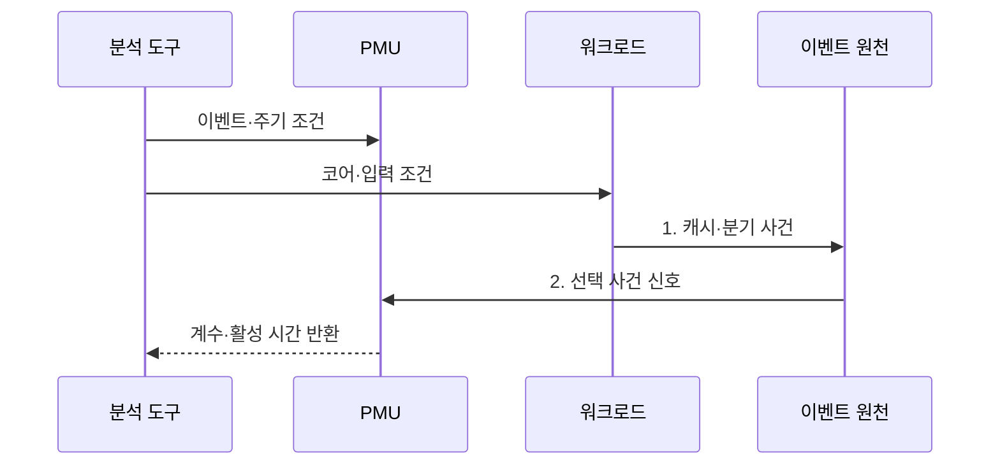

---
sidebar:
  order: 91
  label: "091. 하드웨어 성능 카운터·PMU (Hardware Performance Counter and PMU)"
  badge:
    text: "미출 · 50%"
    variant: note
title: "하드웨어 성능 카운터·PMU (Hardware Performance Counter and PMU)"
date: "2026-07-31T10:22:24+09:00"
tags:
  - "notes-hardware"
weight: 91
extra:
  question_no: "091"
  source_status: "미출"
  source_history: ""
  priority: 50
  priority_note: "CPU 병목 가설을 사건 계수로 검증"
---

## 미리 알고가기

- **하드웨어 성능 카운터(Hardware Performance Counter)·성능 모니터링 장치(Performance Monitoring Unit, PMU)**: 프로세서 내부 사건을 선택하여 하드웨어 카운터로 계수하는 성능 분석 기능
- **중앙처리장치(Central Processing Unit, CPU)**: 명령어를 실행하면서 사이클·명령 은퇴·캐시 미스·분기 오예측 등의 성능 사건을 생성하는 처리장치
- **하드웨어 이벤트(Hardware Event)**: CPU 블록에서 발생해 PMU가 세는 사건
- **명령어 은퇴(Instruction Retirement)**: 명령 실행 결과가 확정된 상태
- **사이클당 명령어 수(Instructions Per Cycle, IPC)**: 클록 사이클당 완료한 명령어 수로 프로세서 파이프라인의 처리 효율을 나타내는 지표
- **카운터 오버플로(Counter Overflow)**: 임계값 도달 시 인터럽트가 발생하는 상태
- **샘플링(Sampling)**: 카운터 오버플로 때 실행 위치 기록
- **카운터 다중화(Multiplexing)**: 이벤트를 시간 분할해 물리 카운터를 공유
- **캐시 미스율(Cache Miss Rate)**: 전체 캐시 접근 중 하위 계층 접근 비율
- **코어 고정(CPU Pinning)**: 측정 스레드를 같은 코어에 유지하는 조치
- **클럭 사이클(Clock Cycle)**: 처리기 동작을 진행시키는 기준 클럭의 한 주기
- **분기 예측 실패(Branch Misprediction)**: 처리기가 예상한 다음 명령 경로가 실제 분기 결과와 달라 파이프라인을 다시 채우는 사건
- **소프트웨어 프로파일링(Software Profiling)**: 실행 위치·호출 경로·시간을 수집해 지연이 집중된 코드를 찾는 분석
- **계측 오버헤드(Instrumentation Overhead)**: 측정 코드와 샘플링이 원래 프로그램의 시간·자원 사용에 더하는 비용
- **이벤트 활성 시간(Event Active Time)**: 다중화 중 특정 이벤트가 실제 물리 카운터에 연결되어 계수된 시간
- **활성·실행 시간(Enabled·Running Time)**: 사건 측정이 요청된 전체 시간과 실제 물리 카운터에 배치된 시간
- **원시 이벤트 코드(Raw Event Code)**: CPU 모델별 하드웨어 사건을 선택하는 숫자 코드
- **메모리 정체(Memory Stall)**: 데이터가 메모리 계층에서 도착하기를 기다려 명령 실행이 멈춘 상태

## Ⅰ. 개요

- 정의/개념: CPU 사건을 선택·계수해 병목을 분석하는 **내장 계측 장치**
- 배경/필요성: 실행 시간만으로는 **CPU 병목 원인 식별 불가**

### 쉽게 이해하기 (학습용)

- 프로세서 안에서 몇 번 멈추고 헛걸음했는지 세어 느린 원인을 찾는 계기판이다.

## Ⅱ. 특징

> 공식 기반 파란 선은 카운터 실제 실행 비율이 100%→10%로 줄면 $T_{enabled}/T_{running}$ 보정 배율이 1→10으로 커져 짧은 관측 구간의 환산 오차가 증폭될 수 있음을 나타낸다.

- **하드웨어 계수·샘플링**으로 낮은 간섭의 총량·위치 제공
- **IPC·캐시 미스율**로 실행·메모리 병목 판별
- **카운터 다중화**는 환산 오차 발생

$$
\mathrm{IPC}=\frac{N_{\mathrm{retired}}}{N_{\mathrm{cycles}}},\qquad
\mathrm{MissRate}=\frac{N_{\mathrm{miss}}}{N_{\mathrm{access}}},\qquad
\hat N=N_{\mathrm{raw}}\frac{T_{\mathrm{enabled}}}{T_{\mathrm{running}}}
$$

- \(N_{\mathrm{retired}},N_{\mathrm{cycles}}\): 은퇴 명령 수와 클록 사이클 수
- \(N_{\mathrm{miss}},N_{\mathrm{access}}\): 캐시 미스 수와 전체 접근 수
- \(\hat N,N_{\mathrm{raw}}\): 보정 추정치와 원시 계수
- \(T_{\mathrm{enabled}},T_{\mathrm{running}}\): 측정 요청 시간과 실제 계수 시간
- 같은 구간·코어와 일정한 비활성 구간 사건 발생률을 가정한 다중화 추정

### 쉽게 이해하기 (학습용)

- 일을 거의 방해하지 않지만 프로세서가 바뀌면 같은 눈금도 뜻이 달라진다.

## Ⅲ. 구조 및 구성요소

| 구성요소 | 책임 |
|:---|:---|
| 이벤트 원천 | **CPU 사건 생성** |
| 이벤트 선택기 | **사건·권한 선택** |
| 성능 카운터 | **사건 누적·오버플로** |
| 수집·분석 도구 | **비율 보정·병목 분석** |

### 쉽게 이해하기 (학습용)

- 이벤트 원천은 사건을 만들고 선택기는 측정 대상을 골라 카운터와 분석 도구에 연결한다.

## Ⅳ. 흐름도

**동작 원리**

1. **캐시·분기 사건**: 워크로드 실행 중 사건 생성
2. **선택 사건 신호**: 누적하고 오버플로 때 실행 위치 기록

### 쉽게 이해하기 (학습용)

- 같은 부하에서 사건의 총량과 발생 위치를 함께 읽는다.

## Ⅴ. 종류 및 비교

| 분석 방식 | PMU 계측 | 소프트웨어 프로파일링 |
|:---|:---|:---|
| 적용 기준 | **CPU 내부 병목** 가설 검증 | **지연 코드 위치·호출 관계** 탐색 |
| 핵심 특징 | CPU 사건을 **하드웨어로 계수** | 코드 위치·호출 경로 **샘플링** |
| 한계 | **카운터 수·모델별 이벤트** 차이 | **계측·샘플링 오버헤드** |

> 요약: 코드 위치는 **프로파일링**, CPU 병목은 **PMU** 검증

### 쉽게 이해하기 (학습용)

- 프로파일링은 느린 코드 위치를 찾고 PMU는 그 위치에서 CPU가 기다린 원인을 센다.

## Ⅵ. 실무 고려사항 및 대책

| 고려사항 | 대책 | 효과 |
|:---|:---|:---|
| CPU 세대별 **이벤트 의미·단위 차이** | 공식 정의와 **원시 이벤트 코드** 기록 | **측정 해석 오류** 방지 |
| 물리 카운터 부족으로 **다중화 오차** 발생 | 핵심 사건 축소와 **활성 시간 보정·반복 측정** | **계수 신뢰도** 향상 |
| 스레드 이동·주파수 변화로 **비교 왜곡** | **코어 고정·부하·전원 정책 통제** | **재현 가능한 비교** |
| 높은 샘플링 빈도로 **실행 간섭** 발생 | 오버헤드 측정 후 **표본 주기 조절** | 관측 정확도를 유지하며 **계측 부하** 감소 |

### 쉽게 이해하기 (학습용)

- 서버 요청을 반복하며 캐시 실패율과 한 박자당 완료 명령 수로 메모리 정체를 확인한다.

## Ⅶ. 결론

- 코드 위치는 **프로파일링**, CPU 병목 원인은 **PMU** 검증

### 쉽게 이해하기 (학습용)

- 느린 코드 위치를 먼저 좁힌 뒤 프로세서 계기판의 여러 눈금이 같은 원인을 가리키는지 확인한다.
